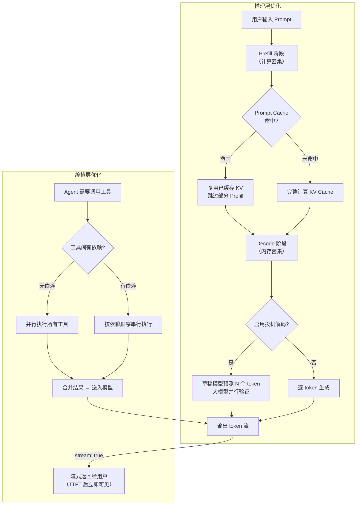

# 延迟优化（Latency Optimization）

## 概念解释

延迟优化是指通过一系列工程手段，缩短用户从发送请求到收到完整响应之间的等待时间。在 LLM 和 Agent 应用中，"延迟"主要由两部分构成：模型推理本身的计算耗时，以及 Agent 调用外部工具、组装结果等编排耗时。

之所以需要专门讨论延迟优化，是因为大语言模型的自回归（Autoregressive）生成机制天然带有瓶颈：每个 token 必须等前一个 token 生成完才能开始计算，导致输出越长、等待越久。再加上 Agent 场景中的多轮工具调用、长上下文处理等环节，延迟问题会被进一步放大。

延迟优化不是单一技术，而是一个从模型推理层到应用编排层的策略组合。核心思路可以归纳为四个字：**减、缓、并、流**——减少不必要的计算、缓存重复内容、并行独立任务、流式输出结果。

## 关键结构

延迟优化可以从两个层面理解：**推理层**（模型生成 token 的速度）和**编排层**（Agent 组织调用的效率）。

| 层面 | 核心策略 | 作用 |
|------|---------|------|
| 推理层 - Prefill 优化 | KV Cache、Prompt Caching、Chunked Prefill | 减少输入处理时间，降低 TTFT |
| 推理层 - Decode 优化 | 投机解码、量化、连续批处理 | 加快 token 逐个生成的速度 |
| 编排层 - 执行优化 | 并行工具调用、流式输出 | 减少等待时间，提升用户感知 |
| 编排层 - 缓存优化 | 结果缓存、语义缓存 | 避免重复计算，直接返回已有答案 |

### 推理层：Prefill 与 Decode 两阶段

LLM 推理分为两个阶段，理解它们是优化延迟的前提：

- **Prefill（预填充）阶段**：模型一次性并行处理所有输入 token，为每一层生成 KV Cache（键值缓存）。这个阶段是**计算密集型**的，GPU 算力被充分利用。Prefill 的耗时直接决定了 TTFT（Time to First Token，首 token 延迟）。
- **Decode（解码）阶段**：模型逐个生成输出 token，每一步都要读取之前所有 token 的 KV Cache。这个阶段是**内存带宽密集型**的，GPU 大部分时间在等数据从显存搬运过来，计算单元反而空闲。

### 编排层：并行与缓存

Agent 系统的延迟不仅来自模型推理，还来自工具调用的组织方式。如果 3 个独立的工具被串行调用，每个 300ms，总耗时就是 900ms；如果并行调用，总耗时只有 300ms。缓存则更直接——对于重复的请求，直接返回历史结果，完全跳过推理。

## 核心原理

### 原理说明

延迟优化的各项技术分别作用于推理和编排的不同环节：

**1. KV Cache 与 Prompt Caching（提示词缓存）**

KV Cache 是 LLM 推理的基础优化：在 Decode 阶段，每生成一个新 token 时，不重新计算之前所有 token 的 Key/Value，而是直接从缓存中读取。Prompt Caching 在此基础上更进一步——如果多次请求共享相同的提示词前缀（如系统提示、few-shot 示例），缓存这部分的 KV 值，后续请求直接复用，跳过 Prefill 中的重复计算。

OpenAI 的 Prompt Caching 对超过 1024 token 的提示词自动生效，以 128 token 为单位匹配前缀。据官方数据，可降低延迟最高 80%、降低输入 token 成本最高 90%。Anthropic Claude 也提供类似机制。

**2. 投机解码（Speculative Decoding）**

常规 Decode 阶段每步只生成 1 个 token，GPU 计算能力严重浪费。投机解码用一个小型"草稿模型"（Draft Model）快速预测接下来的多个 token，然后让大模型一次性并行验证这些预测。被接受的 token 直接保留，被拒绝的从拒绝位置重新生成。整个过程保证输出与只用大模型完全一致——不牺牲质量。

生产环境中，vLLM、TensorRT-LLM、SGLang 均已原生支持投机解码。NVIDIA 报告在 H200 GPU 上可获得 2-3 倍的推理加速。

**3. 流式输出（Streaming）**

设置 `stream: true` 后，模型每生成一个 token 就立即返回，用户在 TTFT（通常 100-300ms）后就能看到第一个字，而不用等全部生成完毕。流式输出不改变总生成时间，但显著改善用户的等待感知。

**4. 并行工具调用**

当 Agent 需要调用多个相互独立的工具时（如同时查天气、查股价、查新闻），并行执行可以把总耗时从"所有工具耗时之和"降到"最慢工具的耗时"。

### Mermaid 图解



图解要点：
- Prefill 和 Decode 是推理层两个阶段，优化目标不同——前者靠缓存，后者靠投机解码。
- 编排层的并行调用和流式输出独立于推理层，可以叠加使用。
- Prompt Cache 命中与否直接影响 TTFT，是长上下文场景的关键优化点。

### 运行示例

```python
# 流式输出 + 并行工具调用的最小示例
# 基于 openai>=1.30 验证（截至 2026-03）
import asyncio
import openai

client = openai.OpenAI()

# 1. 流式输出：用户在 TTFT 后立即看到第一个字
def stream_chat(prompt: str):
    """流式调用 LLM，逐 token 打印"""
    stream = client.chat.completions.create(
        model="gpt-4o-mini",
        messages=[{"role": "user", "content": prompt}],
        stream=True,  # 关键参数
    )
    for chunk in stream:
        token = chunk.choices[0].delta.content or ""
        print(token, end="", flush=True)

# 2. 并行工具调用：独立任务同时执行
async def call_tool(name: str, delay: float) -> dict:
    """模拟一个耗时工具"""
    await asyncio.sleep(delay)
    return {"tool": name, "status": "done"}

async def parallel_tools():
    """3 个独立工具并行执行，总耗时 = max(各工具耗时)"""
    results = await asyncio.gather(
        call_tool("天气查询", 0.3),
        call_tool("股价查询", 0.2),
        call_tool("新闻搜索", 0.4),
    )
    # 串行执行需要 0.3+0.2+0.4=0.9s，并行只需 0.4s
    return results
```

代码包含两个独立部分：`stream_chat` 展示流式输出的基本用法（设置 `stream=True`）；`parallel_tools` 展示通过 `asyncio.gather` 并行调用多个工具。两者可以组合使用——工具并行执行完毕后，将结果送入模型并以流式方式返回。

## 易混概念辨析

| 概念 | 与延迟优化的区别 | 更适合关注的重点 |
|------|-----------------|-----------------|
| 吞吐量优化（Throughput Optimization） | 关注单位时间处理的请求总数，延迟优化关注单个请求的响应速度 | 高并发场景下如何提升系统整体处理能力 |
| 成本优化（Cost Optimization） | 关注每次调用的费用，延迟优化关注每次调用的速度 | 降低 token 单价、减少 API 调用次数 |
| 模型压缩（Model Compression） | 通过量化、剪枝等手段缩小模型体积，是延迟优化的手段之一 | 模型部署时的体积、显存占用与精度权衡 |

核心区别：

- **延迟优化**：核心关注"单个请求从发出到完成要多久"，直接影响用户体验
- **吞吐量优化**：核心关注"系统每秒能处理多少请求"，两者有时互相矛盾（如 batching 提升吞吐但可能增加单请求延迟）
- **成本优化**：与延迟优化经常协同（缓存同时降低延迟和成本），但也可能冲突（用更大 GPU 降低延迟会增加成本）

## 适用边界与局限

### 适用场景

1. **实时交互式应用**：聊天机器人、AI 助手等场景对 TTFT 要求高，流式输出和 Prompt Caching 效果最明显
2. **多工具 Agent 系统**：需要调用多个外部 API 或数据源的 Agent，并行调用可获得 2-4 倍提速
3. **RAG 与知识库问答**：大量请求共享相同的系统提示和检索文档，Prompt Caching 命中率高
4. **长上下文处理**：输入超过数千 token 时，Prefill 耗时占比大，KV Cache 优化收益显著

### 不适合的场景

1. **离线批处理**：不面向用户实时交互的批量任务，延迟不敏感，应优先考虑吞吐量和成本
2. **输入高度随机化的请求**：每次请求的提示词完全不同，缓存命中率极低，投入缓存基础设施反而增加复杂度

### 局限性

1. **流式输出不减少总生成时间**：它只改善用户感知，模型生成完整回答所需的绝对时间不变
2. **投机解码依赖接受率**：如果草稿模型的预测与大模型偏差大，大部分预测被拒绝，加速效果会大打折扣甚至变慢
3. **缓存一致性问题**：底层知识库更新后，缓存中的旧结果可能导致返回过时信息，需要设计 TTL（过期时间）和主动失效机制
4. **并行调用受限于依赖关系**：只有相互独立的工具才能并行，存在数据依赖的调用链必须串行

## 常见误区

| 常见误区 | 正确理解 |
|----------|----------|
| 流式输出能让模型生成得更快 | 流式输出只是把已生成的 token 立即推送给用户，总生成时间（TPOT x token 数）不变，改善的是 TTFT 和用户感知 |
| 减少输入 token 数量能显著降低延迟 | 对于常规长度的提示词，减少 50% 的输入 token 通常只能减少 1-5% 的延迟。只有在处理超长上下文时，输入量才是主要瓶颈 |
| 缓存命中率越高越好 | 需要权衡存储成本和失效风险。实践中 30-50% 的命中率已经能带来显著收益，盲目追求高命中率可能导致缓存污染和一致性问题 |
| 所有工具调用都应该并行化 | 只有无依赖关系的调用才能并行。如果工具 B 需要工具 A 的输出作为输入，强行并行会导致错误结果 |

## 思考题

<details>
<summary>初级：TTFT 和 TPOT 分别对应 LLM 推理的哪个阶段？为什么流式输出只能改善 TTFT 而不能改善 TPOT？</summary>

**参考答案：**

TTFT 主要由 Prefill 阶段决定——模型处理完所有输入 token 并生成第一个输出 token 的时间。TPOT 由 Decode 阶段决定——每生成一个新 token 的平均耗时。流式输出的作用是把 Decode 阶段产生的每个 token 立即推送给用户，而不是攒到最后一次性返回。它不改变 Decode 本身的速度（每个 token 该算多久还是多久），只是让用户更早看到部分结果。

</details>

<details>
<summary>中级：一个 RAG 系统的提示词结构是"系统提示(800 token) + 检索文档(3000 token) + 用户问题(50 token)"。如何设计提示词结构以最大化 Prompt Caching 的效果？</summary>

**参考答案：**

将不变的内容放在提示词最前面：系统提示（800 token）在所有请求中完全相同，放最前；检索文档如果多个用户查询同一批文档，也相对稳定，放中间；用户问题每次不同，放最后。这样前缀匹配可以最大化缓存复用——所有请求至少共享 800 token 的系统提示缓存，查询同一批文档的请求还能共享 3800 token 的缓存。OpenAI 的 Prompt Caching 要求前缀精确匹配且从头开始，因此把变化的部分放在最后是关键设计原则。

</details>

<details>
<summary>中级/进阶：一个 Agent 需要完成以下任务：(1) 查询用户订单状态，(2) 根据订单中的商品 ID 查询库存，(3) 查询当前天气，(4) 生成个性化推荐。哪些步骤可以并行？请画出最优执行时间线。</summary>

**参考答案：**

分析依赖关系：步骤 (2) 依赖步骤 (1) 的输出（需要订单中的商品 ID），必须串行；步骤 (3) 查天气与订单无关，独立；步骤 (4) 可能需要 (1)(2)(3) 的结果作为输入。最优执行方式：第一轮并行执行 (1) 和 (3)；第二轮在 (1) 完成后立即执行 (2)；(1)(2)(3) 全部完成后执行 (4)。如果每步 300ms，串行总耗时 1200ms，优化后：第一轮 300ms（(1)和(3)并行）+ 第二轮 300ms（(2)）+ 第三轮 300ms（(4)）= 900ms。天气查询被"藏"在第一轮并行中，不额外增加耗时。

</details>

## 参考资料

1. OpenAI. "Latency Optimization". [https://platform.openai.com/docs/guides/latency-optimization](https://platform.openai.com/docs/guides/latency-optimization)

2. OpenAI. "Prompt Caching". [https://platform.openai.com/docs/guides/prompt-caching](https://platform.openai.com/docs/guides/prompt-caching)

3. NVIDIA. "Mastering LLM Techniques: Inference Optimization". [https://developer.nvidia.com/blog/mastering-llm-techniques-inference-optimization/](https://developer.nvidia.com/blog/mastering-llm-techniques-inference-optimization/)

4. NVIDIA. "An Introduction to Speculative Decoding for Reducing Latency in AI Inference". [https://developer.nvidia.com/blog/an-introduction-to-speculative-decoding-for-reducing-latency-in-ai-inference/](https://developer.nvidia.com/blog/an-introduction-to-speculative-decoding-for-reducing-latency-in-ai-inference/)

5. Kwon W, Li Z, et al. (2023). "Efficient Memory Management for Large Language Model Serving with PagedAttention". SOSP'23. [https://arxiv.org/abs/2309.06180](https://arxiv.org/abs/2309.06180)

6. Zhong Y, et al. (2024). "DistServe: Disaggregating Prefill and Decoding for Goodput-optimized Large Language Model Serving". OSDI'24. [https://arxiv.org/abs/2401.09670](https://arxiv.org/abs/2401.09670)
