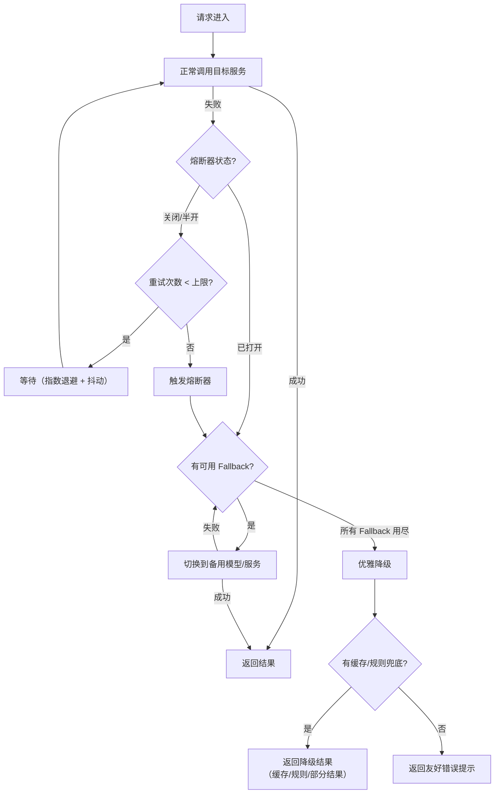

# 可靠性优化（Reliability Optimization）

## 概念解释

可靠性优化是一套让 Agent 应用在外部依赖出现故障时，仍能继续提供服务（或至少返回可用结果）的工程方法。它的核心思路不是"消灭所有错误"，而是"当错误必然发生时，系统该如何自动应对"。

Agent 应用的一次用户请求往往涉及多次 LLM 调用和工具调用的链式操作。链式调用的整体成功率遵循乘法法则：如果每步成功率 98%，10 步下来端到端成功率只有约 81.7%。这意味着不做任何容错处理的 Agent 系统，每 5 次请求就会失败约 1 次。

和传统微服务的可靠性工程相比，Agent 应用还多了一层"软失败"问题：LLM 返回了 HTTP 200，但内容是幻觉、格式不对或语义偏离。因此 Agent 的可靠性优化不仅要处理网络层面的硬故障，还要处理模型层面的质量故障。

## 关键结构

可靠性优化由四层防线组成，从内到外依次启用：

| 防线 | 机制 | 作用 |
|------|------|------|
| 第一层 | 重试（Retry） | 自动恢复偶发性瞬态故障 |
| 第二层 | 熔断器（Circuit Breaker） | 检测持续性故障，快速失败防止资源浪费 |
| 第三层 | 多模型 Fallback | 主模型不可用时自动切换到备用模型 |
| 第四层 | 优雅降级（Graceful Degradation） | 所有方案都失败时，返回最好的可用结果 |

### 第一层：重试（Retry）

操作失败后自动重新执行。重试策略的关键是指数退避（Exponential Backoff）：每次重试的等待时间按倍数增长（如 1s、2s、4s），给故障服务恢复的时间。同时加入随机抖动（Jitter），避免多个客户端在同一时刻同时重试，引发"惊群效应"（Thundering Herd）。

### 第二层：熔断器（Circuit Breaker）

当某个服务连续失败达到阈值时，熔断器会"断开"该服务的所有请求，让后续调用直接快速失败，而不是继续等待一个已经瘫痪的服务。它有三个状态：关闭（正常通行）、打开（直接拒绝）、半开（放行少量探测请求试探恢复情况）。

### 第三层：多模型 Fallback

Agent 通常依赖某个主力 LLM（如 Claude 或 GPT-4），但该模型可能因限流或故障不可用。Fallback 机制会自动切换到预配置的备用模型链（如 Claude -> GPT-4 -> 本地轻量模型），用户几乎无感知，只是回答质量可能略有变化。

### 第四层：优雅降级（Graceful Degradation）

当所有重试和 Fallback 都失败时，系统不是直接报错，而是返回"当前最好的可用结果"——比如缓存的历史答案、基于规则的简单回复、或已完成的部分结果。降级的目标是"给用户最好的可用体验"，而不是"告诉用户系统坏了"。

## 核心原理

### 原理说明

可靠性优化的核心是**分层拦截、逐级降级**。一个请求从进入系统到最终返回结果，会经过多层防护：

1. **首先尝试正常调用**。如果成功，直接返回结果。
2. **瞬态失败触发重试**。网络抖动、临时限流等偶发错误，通过指数退避重试自动恢复。大部分故障在这一层就被消化掉。
3. **持续失败触发熔断**。如果某个服务连续失败，熔断器打开，后续请求不再尝试该服务，避免浪费超时等待时间。
4. **主路径不可用触发 Fallback**。切换到备用模型或备用数据源，尝试用替代方案完成任务。
5. **所有方案失败触发优雅降级**。返回缓存结果、简化回复或部分结果，保证用户拿到有价值的响应。

重试策略的数学基础：设单次调用成功率为 p，共尝试 k 次（首次 + k-1 次重试），至少成功一次的概率为 1 - (1-p)^k。例如单次成功率 99%，尝试 3 次后成功率提升到 99.9999%。但需注意，这个计算假设每次尝试相互独立，在服务级故障时此假设不成立，所以需要熔断器来处理这类场景。

### Mermaid 图解



图中的关键流转：

- 熔断器状态检查在重试之前发生——如果服务已被判定为不可用，直接跳过重试，节省等待时间。
- Fallback 链是有序的，从高质量模型到低质量模型依次尝试，用尽才进入降级。
- 优雅降级是最后的兜底，保证用户永远能拿到某种有意义的响应。

### 运行示例

```python
# 基于 tenacity==8.2.3 验证（截至 2026-03）
import time
import random
from tenacity import retry, stop_after_attempt, wait_exponential

# ====== 第一层：重试 + 指数退避 ======
@retry(stop=stop_after_attempt(3), wait=wait_exponential(multiplier=1, max=10))
def call_llm(prompt: str) -> str:
    """模拟一个可能失败的 LLM 调用"""
    if random.random() < 0.3:  # 30% 概率失败
        raise ConnectionError("模型服务暂时不可用")
    return f"模型回复: {prompt[:15]}..."

# ====== 第二层：熔断器 ======
class CircuitBreaker:
    """三态熔断器：CLOSED -> OPEN -> HALF_OPEN -> CLOSED"""
    def __init__(self, threshold=3, cooldown=30):
        self.failures = 0          # 连续失败次数
        self.threshold = threshold  # 触发熔断的失败阈值
        self.cooldown = cooldown    # 熔断后的冷却时间（秒）
        self.state = "CLOSED"
        self.opened_at = 0

    def allow_request(self) -> bool:
        if self.state == "CLOSED":
            return True
        if self.state == "OPEN":
            if time.time() - self.opened_at > self.cooldown:
                self.state = "HALF_OPEN"
                return True  # 放行一个探测请求
            return False
        return True  # HALF_OPEN 状态允许请求

    def on_success(self):
        self.failures = 0
        self.state = "CLOSED"

    def on_failure(self):
        self.failures += 1
        if self.failures >= self.threshold:
            self.state = "OPEN"
            self.opened_at = time.time()

# ====== 第三层：多模型 Fallback ======
FALLBACK_CHAIN = ["claude-sonnet", "gpt-4o-mini", "local-llama"]

def call_with_fallback(prompt: str) -> dict:
    """依次尝试 Fallback 链中的模型"""
    for model in FALLBACK_CHAIN:
        try:
            # 模拟调用（实际替换为真实 API 调用）
            if random.random() < 0.8:
                return {"model": model, "result": f"{model} 回复成功"}
            raise Exception(f"{model} 不可用")
        except Exception as e:
            print(f"  [{model}] 失败: {e}")
    return {"model": "none", "result": None}

# ====== 第四层：优雅降级 ======
CACHE = {"天气查询": "北京今天晴，25°C（缓存数据）"}

def handle_request(prompt: str) -> str:
    """完整的四层可靠性处理"""
    breaker = CircuitBreaker(threshold=3, cooldown=10)

    # 检查熔断器
    if not breaker.allow_request():
        # 熔断器打开，跳过正常调用，直接 Fallback
        result = call_with_fallback(prompt)
        if result["result"]:
            return result["result"]
        # Fallback 也失败，优雅降级
        return CACHE.get(prompt, "系统繁忙，请稍后再试")

    # 尝试正常调用（带重试）
    try:
        response = call_llm(prompt)
        breaker.on_success()
        return response
    except Exception:
        breaker.on_failure()
        # 正常调用失败，尝试 Fallback
        result = call_with_fallback(prompt)
        if result["result"]:
            return result["result"]
        # 最终降级
        return CACHE.get(prompt, "系统繁忙，请稍后再试")
```

上述代码将四层防线串联起来：`call_llm` 自带重试，`CircuitBreaker` 控制是否允许调用，`call_with_fallback` 在主路径失败后逐个尝试备用模型，`CACHE` 作为最终兜底。实际生产中，每一层的参数（重试次数、熔断阈值、Fallback 顺序）需要根据业务场景调优。

## 易混概念辨析

| 概念 | 与可靠性优化的区别 | 更适合关注的重点 |
|------|---------------------|------------------|
| 高可用（High Availability） | 高可用是目标指标（如 99.95% 在线），可靠性优化是达成高可用的具体手段之一 | 系统整体架构层面的冗余设计（多机房、负载均衡） |
| 容错（Fault Tolerance） | 容错强调系统在部分组件失败时仍能正确运行，是一种设计原则；可靠性优化是容错的具体工程实现 | 组件级别的冗余和一致性保证 |
| 限流（Rate Limiting） | 限流是从"服务端保护"视角控制请求量，可靠性优化是从"客户端恢复"视角处理请求失败 | 保护服务端不被过载压垮 |

核心区别：

- **可靠性优化**：关注"请求失败了怎么办"，是一套客户端侧的故障恢复策略
- **高可用**：关注"如何减少系统不可用时间"，是一个系统级指标
- **限流**：关注"如何防止服务端被打垮"，是一种服务端保护机制

## 适用边界与局限

### 适用场景

1. **多步链式 Agent**：复杂 Agent 任务涉及多次 LLM 调用和工具调用，任何一步失败都会中断整个流程。分层容错可以将端到端成功率从 80%+ 提升到 99%+。
2. **依赖外部 API 的实时场景**：搜索、天气、支付等外部服务经常出现短时故障或限流，重试和 Fallback 可以在用户无感知的情况下自动恢复。
3. **7x24 客服/问答系统**：必须保证持续可用，不能因为某个 LLM 提供商的临时故障导致整个客服系统瘫痪。

### 不适合的场景

1. **对一致性要求极高的场景**：如金融交易确认、医疗诊断，Fallback 到低质量模型可能产生错误结果，此时宁可明确报错也不能返回不可靠的答案。
2. **单次调用、低频使用**：如果只是偶尔用一次 LLM，手动重试比引入完整的可靠性框架更简单经济。

### 局限性

1. **不能解决逻辑错误**：重试和 Fallback 只能处理"调用层面"的故障，如果 prompt 设计有问题导致模型输出错误，重试多少次结果都一样差。
2. **成本与可靠性的权衡**：每次重试都有 API 调用费用，3 次重试意味着最多 3 倍成本。Fallback 到高端备用模型也可能比预期贵。
3. **调试复杂度高**：同一个请求可能走重试路径、Fallback 路径或降级路径，排查问题时需要完善的日志和链路追踪支持。

## 常见误区

| 常见误区 | 正确理解 |
|----------|----------|
| 重试次数越多越可靠 | 过度重试会导致成本翻倍和延迟叠加。通常 2-3 次重试就够了，超过这个次数说明是持续性故障，应该交给熔断器处理 |
| 熔断器打开就是系统崩溃 | 恰恰相反，熔断器打开是一种保护行为——它阻止系统继续向已经故障的服务发送请求，让流量快速切换到 Fallback 路径 |
| Fallback 随便换个模型就行 | Fallback 链需要提前测试每个备用模型对当前任务的兼容性。不同模型的 prompt 格式、输出结构可能不同，直接切换可能导致下游解析失败 |
| 优雅降级就是返回"系统出错了" | 真正的优雅降级是返回有价值的内容：缓存的历史结果、基于规则的简单回答、已完成步骤的部分结果。"系统出错"是最后的最后手段 |

## 思考题

<details>
<summary>初级：熔断器的三个状态分别是什么？从"打开"恢复到"关闭"要经过哪个中间状态？</summary>

**参考答案：**

三个状态是关闭（Closed）、打开（Open）和半开（Half-Open）。从打开恢复到关闭时，先进入半开状态：熔断器在冷却时间结束后放行少量探测请求，如果探测成功则切换为关闭（恢复正常），如果失败则重新打开。这个中间状态避免了一旦恢复就立刻放行全部流量的风险。

</details>

<details>
<summary>中级：一个 Agent 有 5 步链式调用，每步单次成功率 95%。不加任何容错时端到端成功率是多少？如果每步加 2 次重试（共 3 次尝试），端到端成功率提升到多少？</summary>

**参考答案：**

不加容错时：0.95^5 = 77.4%。加 2 次重试后，每步成功率变为 1 - (1-0.95)^3 = 1 - 0.000125 = 99.99%。端到端成功率为 0.9999^5 = 99.94%。从 77.4% 提升到 99.94%，但代价是每步最多 3 倍 API 调用成本。需要注意的是，这个计算假设每次尝试独立成功，当故障原因是服务级宕机时，重试不会生效，此时需要 Fallback 而不是重试。

</details>

<details>
<summary>中级/进阶：你负责一个客服 Agent，使用 Claude 作为主模型，GPT-4o-mini 作为备用。某天 Claude API 出现持续 10 分钟的故障，请描述你的可靠性系统应该如何自动应对这个故障，从故障发生到恢复的完整过程。</summary>

**参考答案：**

（1）故障初期：前几个请求调用 Claude 失败，重试机制自动进行 2-3 次指数退避重试，但因为是持续性故障所以重试也失败；（2）熔断器触发：连续失败达到阈值（如 3-5 次），熔断器打开，后续请求不再尝试调用 Claude，直接跳到 Fallback；（3）Fallback 生效：流量自动切换到 GPT-4o-mini，用户继续获得回复，可能质量略有差异但服务不中断；（4）半开探测：熔断器冷却时间（如 30 秒）到期后进入半开状态，放行少量探测请求到 Claude；（5）恢复：如果 Claude 已恢复，探测成功，熔断器关闭，流量恢复到 Claude；如果探测仍失败，熔断器重新打开，继续使用 GPT-4o-mini。全程用户基本无感知，系统自动完成故障切换和恢复。

</details>

## 参考资料

1. Portkey.ai. "Retries, Fallbacks, and Circuit Breakers in LLM Apps: What to Use When." https://portkey.ai/blog/retries-fallbacks-and-circuit-breakers-in-llm-apps/

2. Maxim AI. "Retries, Fallbacks, and Circuit Breakers in LLM Apps: A Production Guide." https://www.getmaxim.ai/articles/retries-fallbacks-and-circuit-breakers-in-llm-apps-a-production-guide/

3. DEV Community. "Circuit Breaker for LLM Provider Failure." https://dev.to/sandhu93/circuit-breaker-for-llm-provider-failure-53f6

4. Athenic Blog. "AI Agent Retry Strategies: Exponential Backoff and Graceful Degradation." https://getathenic.com/blog/ai-agent-retry-strategies-exponential-backoff

5. Microsoft Learn. "AI Agent Orchestration Patterns." https://learn.microsoft.com/en-us/azure/architecture/ai-ml/guide/ai-agent-design-patterns
