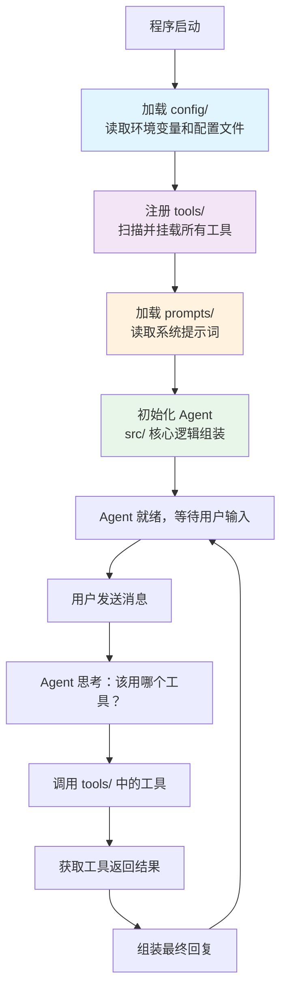

# Agent 项目结构（Agent Project Structure）

## 概念解释

Agent 项目结构，指的是在开发 AI Agent 应用时，如何组织代码文件、配置、工具定义、提示词等资源的目录约定。它不是某种框架或技术，而是一套"文件该放哪里"的工程实践。

传统 Python 项目通常只需要关心源代码和测试代码的分离。但 Agent 应用多了几样特殊的东西：提示词文件（Prompt）、工具定义（Tool/Skill）、模型配置（API Key、温度参数等）、知识库数据。如果这些东西和业务代码混在一起，项目一旦长大就会变成"找不到文件"的噩梦。

Agent 项目结构的核心思路是**关注点分离**（Separation of Concerns）——把不同职责的文件放进不同的目录，让开发者、Prompt 工程师、运维人员各自只需要关注自己负责的那个文件夹。

## 关键结构

一个典型的 Agent 项目包含以下一级目录，每个目录承担一种职责：

| 目录 | 职责 | 谁主要维护 |
|------|------|-----------|
| `src/` | 应用源代码（Agent 核心逻辑、业务代码） | 开发者 |
| `config/` | 配置文件（环境变量、模型参数、运行设置） | 开发者 / 运维 |
| `tools/` | 工具定义（搜索、数据库查询、API 调用等） | 开发者 |
| `prompts/` | 提示词文件（系统提示词、用户模板） | Prompt 工程师 |
| `tests/` | 测试代码（单元测试、集成测试） | 开发者 |
| `data/` | 数据与知识库（RAG 文档、测试数据） | 数据工程师 |
| `scripts/` | 运维脚本（部署、初始化、数据迁移） | 运维 |

### 结构 1：src/ 源代码目录

src/ 是整个项目的心脏，采用 Python 社区推荐的 src layout（源码布局）。这种布局把应用代码放在 `src/包名/` 下，强制开发者通过安装（`pip install -e .`）来使用包，避免了"本地能跑、别人跑不通"的导入路径问题。

src/ 内部通常再分为三个子目录：`core/`（核心框架逻辑）、`agents/`（具体 Agent 定义）、`utils/`（通用工具函数）。

### 结构 2：config/ 配置目录

Agent 应用高度依赖配置——同一份代码，换一套配置就能变成完全不同的 Agent。config/ 目录集中管理所有可配置项，核心原则是**敏感信息（API Key 等）绝不写死在代码里**，而是通过 `.env` 文件或环境变量注入。

典型内容：`.env`（本地环境变量，不提交到 Git）、`.env.example`（模板，告诉队友需要哪些变量）、`settings.yaml`（Agent 行为参数）。

### 结构 3：tools/ 工具目录

工具是 Agent 的"手和脚"。tools/ 目录把每种工具按功能分子目录（如 `search/`、`database/`），并定义统一的基类接口。这样添加新工具只需要"实现接口 + 放到对应目录"，不用动核心代码。

### 结构 4：prompts/ 提示词目录

提示词是 Agent 的"大脑指令"。把 Prompt 从代码字符串中抽出来，集中存放在 prompts/ 目录，按用途分为 `system_prompts/`（系统级）和 `user_prompts/`（用户交互模板）。好处是 Prompt 工程师可以独立修改提示词，不用碰 Python 代码。

## 核心原理

### 原理说明

Agent 项目结构的运作逻辑可以用四个字概括：**各司其职**。

程序启动时，`config/` 先被加载，读取环境变量和配置文件，确定"用哪个模型、什么温度、开启哪些工具"。然后 `tools/` 中的工具通过注册机制挂载到 Agent 上，告诉 Agent "你现在能做哪些事"。接着 `prompts/` 中的提示词被加载，告诉 Agent "你应该怎么思考和行动"。最后 `src/` 中的核心逻辑把这些组装起来，形成一个可以接收用户输入、调用工具、返回结果的完整 Agent。

关键设计决策有三个：

1. **配置外置**：遵循 12-Factor App（十二要素应用）原则，把配置存在环境变量中，而不是硬编码在代码里。这样同一份代码可以在开发、测试、生产三个环境之间无缝切换。

2. **工具接口统一**：所有工具实现同一个基类接口（名称、描述、参数定义、执行方法），Agent 核心代码不需要知道每个工具的具体实现细节。

3. **提示词与代码分离**：Prompt 是 Agent 中变化最频繁的部分，把它独立出来，方便做版本管理和 A/B 测试。

### Mermaid 图解



上半部分是**初始化流程**：配置 -> 工具 -> 提示词 -> Agent 组装，顺序不能乱（工具注册需要知道配置中开启了哪些工具，Agent 初始化需要知道有哪些工具和提示词可用）。

下半部分是**运行时循环**：收到用户消息后，Agent 根据提示词思考策略，调用工具执行，拿到结果后组装回复。这个循环中涉及的工具和提示词全部来自前面加载的目录。

### 运行示例

以下伪代码展示一个最小 Agent 项目的目录结构和初始化过程，不依赖任何第三方框架：

```python
# 项目结构（伪代码展示目录关系）
# my_agent_project/
# ├── src/my_agent/core/agent.py   ← 当前文件
# ├── config/.env                   ← 环境变量
# ├── tools/search/web_search.py    ← 搜索工具
# └── prompts/system_prompts/       ← 系统提示词

import os
from pathlib import Path

class SimpleAgent:
    """最小 Agent 骨架，展示目录结构如何串联"""

    def __init__(self, project_root: str):
        root = Path(project_root)

        # 1. 加载配置（对应 config/ 目录）
        self.model = os.getenv("LLM_MODEL", "gpt-4o")

        # 2. 加载提示词（对应 prompts/ 目录）
        prompt_file = root / "prompts" / "system_prompts" / "base.txt"
        self.system_prompt = prompt_file.read_text(encoding="utf-8")

        # 3. 注册工具（对应 tools/ 目录）
        self.tools = {"web_search": self._search}

    def _search(self, query: str) -> str:
        return f"搜索结果：{query}"

    def run(self, user_input: str) -> str:
        # 核心逻辑：提示词 + 工具 + 用户输入 → 回复
        return f"[{self.model}] 处理：{user_input}"
```

`SimpleAgent` 的三个初始化步骤分别对应 config/、prompts/、tools/ 三个目录。实际项目中每个步骤会更复杂（如配置校验、工具自动发现、Prompt 模板渲染），但基本骨架不变。

## 易混概念辨析

| 概念 | 与 Agent 项目结构的区别 | 更适合关注的重点 |
|------|------------------------|-----------------|
| Python 项目结构 | 通用的 Python 包组织方式，不包含 Agent 特有的 tools/、prompts/ 等目录 | 包管理、import 机制、src layout 规范 |
| 软件架构模式 | 关注的是代码层面的设计（MVC、微服务等），比项目结构更抽象 | 模块间的调用关系和职责划分 |
| AGENTS.md / CLAUDE.md | 写给 AI 编码助手看的项目说明文件，描述项目约定和规范 | 如何让 AI 助手理解你的项目并正确生成代码 |

核心区别：

- **Agent 项目结构**：关注"文件放哪里"，是物理层面的目录组织
- **Python 项目结构**：Agent 项目结构是它的超集，多了 tools/、prompts/、config/ 等 Agent 特有目录
- **软件架构模式**：关注"代码怎么组织"，是逻辑层面的设计决策

## 适用边界与局限

### 适用场景

1. **团队协作的 Agent 项目**：多人开发时，清晰的目录划分让开发者、Prompt 工程师、运维各管各的目录，减少冲突
2. **需要部署到多环境的项目**：通过 config/ 的分层配置，同一份代码可以在开发、测试、生产环境间无缝切换
3. **工具会持续增加的项目**：统一的工具接口和目录结构，让新增工具只需"实现接口 + 放到目录"

### 不适合的场景

1. **一次性脚本或快速原型**：如果只是写个 50 行的实验脚本，完整的目录结构反而是负担，一个 `main.py` 就够了
2. **使用全托管平台的项目**：如果用的是 Dify、Coze 等低代码平台，平台本身已经管理了目录结构，不需要自己规划

### 局限性

1. **初始搭建成本**：需要创建多个目录和配置文件，对新手有一定门槛。可以通过项目模板（如 cookiecutter）自动化解决
2. **目录层级较深**：开发时需要在多个目录间跳转，不过现代 IDE 的快速导航（Ctrl+P）能很好缓解这个问题

## 常见误区

| 常见误区 | 正确理解 |
|----------|----------|
| API Key 直接写在 Python 代码里 | API Key 等敏感信息必须通过 `.env` 文件或环境变量注入，代码中只读取变量名，不存储具体值 |
| Prompt 写成代码里的长字符串 | Prompt 应该独立存放在 prompts/ 目录的文本文件中，方便版本管理、A/B 测试和非开发人员修改 |
| 所有工具函数散落在各处 | 工具应该集中在 tools/ 目录，实现统一的基类接口，通过注册机制让 Agent 自动发现和调用 |
| 简单项目不需要目录结构 | 除了一次性脚本，任何可能成长的项目都值得花 5 分钟搭好目录骨架，后期迁移的成本远高于此 |

## 思考题

<details>
<summary>初级：Agent 项目结构中，为什么要把 prompts/ 单独作为一个顶级目录？</summary>

**参考答案：**

因为提示词是 Agent 中变化最频繁的部分，且维护者往往不是写 Python 代码的开发者。把 Prompt 独立出来，一方面让 Prompt 工程师可以直接修改文本文件而不用碰代码，另一方面便于做版本管理和 A/B 测试。如果 Prompt 写死在代码字符串里，每次修改都需要改代码、跑测试、重新部署，效率很低。

</details>

<details>
<summary>中级：config/ 目录中的 .env 文件和 settings.yaml 文件各自承担什么职责？为什么不合并成一个文件？</summary>

**参考答案：**

`.env` 存储的是**环境相关的敏感信息**（API Key、数据库连接串等），每个环境（开发/生产）不同，且不应该提交到 Git。`settings.yaml` 存储的是**Agent 行为参数**（模型选择、温度、最大重试次数等），所有环境共享，可以安全提交到 Git。分开的原因是安全性和变更频率不同：敏感信息需要严格隔离，而行为参数需要团队共享和版本追踪。

</details>

<details>
<summary>中级/进阶：如果你的 Agent 项目需要同时支持 LangChain 和 CrewAI 两个框架，你会如何调整 src/ 的目录结构？</summary>

**参考答案：**

可以在 src/ 下按框架分出适配层，例如 `src/my_agent/adapters/langchain_adapter.py` 和 `src/my_agent/adapters/crewai_adapter.py`，把框架特有的代码隔离在适配层中。core/ 目录保持框架无关的核心逻辑（Agent 接口定义、工具注册、配置加载），tools/ 和 prompts/ 保持不变（它们本身就是框架无关的）。这样切换框架只需要换一个 adapter，不用重写核心逻辑和工具。

</details>

## 参考资料

1. Python Packaging Authority (PyPA). "src layout vs flat layout". [https://packaging.python.org/en/latest/discussions/src-layout-vs-flat-layout/](https://packaging.python.org/en/latest/discussions/src-layout-vs-flat-layout/)

2. The Twelve-Factor App. "III. Config — Store config in the environment". [https://12factor.net/config](https://12factor.net/config)

3. Kenneth Reitz. "Structuring Your Project". The Hitchhiker's Guide to Python. [https://docs.python-guide.org/writing/structure/](https://docs.python-guide.org/writing/structure/)

4. Satheesh Kumar. "Organizing Files for Agentic AI Systems". Medium. [https://medium.com/@sathee12/organizing-files-for-agentic-ai-systems-my-rough-draft-e413dbe241d7](https://medium.com/@sathee12/organizing-files-for-agentic-ai-systems-my-rough-draft-e413dbe241d7)

5. GitHub Blog. "How to write a great agents.md: Lessons from over 2,500 repositories". [https://github.blog/ai-and-ml/github-copilot/how-to-write-a-great-agents-md-lessons-from-over-2500-repositories/](https://github.blog/ai-and-ml/github-copilot/how-to-write-a-great-agents-md-lessons-from-over-2500-repositories/)
