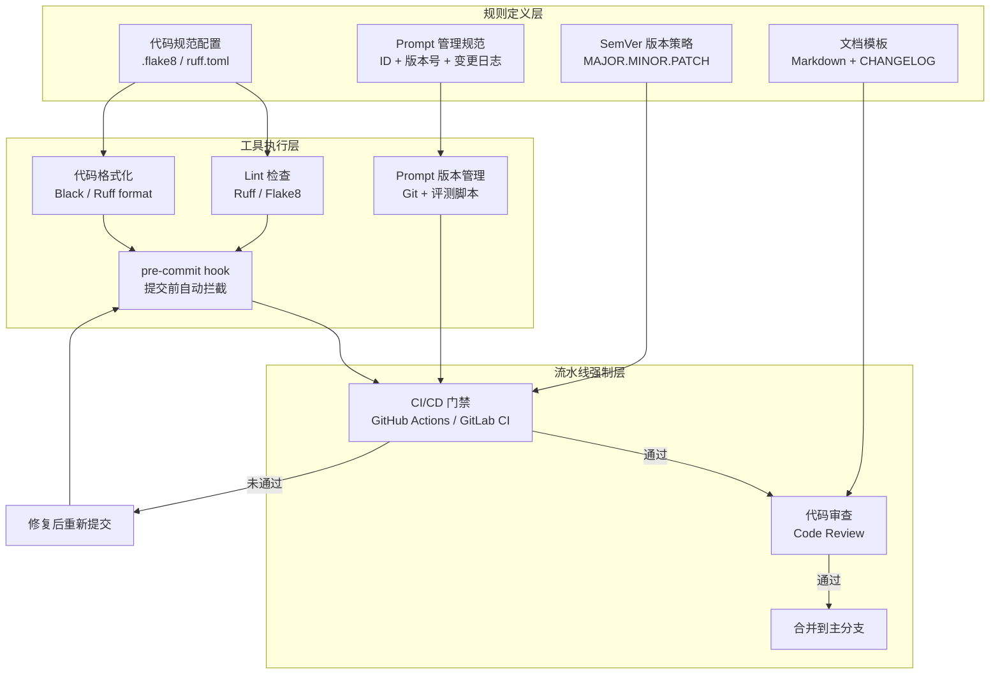

# 开发规范（Development Standards）

## 概念解释

开发规范是一套约束团队成员"怎么写代码、怎么管 Prompt、怎么打版本号、怎么写文档"的标准化规则。它的作用类似于建筑施工图里的"制图标准"：不同工程师画出来的图纸，线型、符号、比例尺都一样，任何人拿到都能看懂。

传统软件开发已经有成熟的代码规范（如 PEP 8、ESLint），但 Agent 应用有一个独特问题：**Prompt 也是"代码"**。一个系统 Prompt 的措辞微调，可能导致 LLM 输出质量大幅波动。如果 Prompt 没有版本控制，出问题后既无法定位原因，也无法回滚。因此，Agent 开发规范比传统开发规范多了一个核心维度——Prompt 管理规范。

开发规范不是"锦上添花"的事情。在 1-2 人的原型阶段，没有规范也能活；但当团队超过 3 人、或者项目进入生产环境后，没有规范的项目会陷入"改一处、崩三处"的维护泥潭。规范的本质是把隐性的个人习惯变成显性的团队契约，让代码审查、自动化工具、新人上手都有据可依。

## 关键结构

Agent 开发规范由四个维度组成，每个维度解决一类一致性问题：

| 维度 | 解决的问题 | 核心产出物 |
|------|-----------|-----------|
| 代码规范 | 不同人写的代码风格不一致 | `.flake8`、`ruff.toml` 等配置文件 |
| Prompt 管理规范 | Prompt 修改没有记录，无法回滚 | Prompt 版本库 + 变更日志 |
| 版本号规范 | 版本号随意命名，无法判断变更程度 | 语义化版本号（SemVer）策略 |
| 文档规范 | 文档格式混乱，过时严重 | 统一的文档模板 + CHANGELOG |

### 维度 1：代码规范

代码规范定义了源代码的书写格式，包括缩进方式、命名约定、行长限制、导入排序等。以 Python 为例，PEP 8 是官方推荐的风格指南，规定了 4 空格缩进、`snake_case` 函数命名、79 字符行长等。

代码规范的执行不靠人工盯，而是靠 Lint 工具（代码检查器）自动化。常见的 Python Lint 工具对比：

- **Ruff**：用 Rust 编写，速度比 Flake8 快 10-100 倍，集成了 Flake8 大部分规则和 isort 功能，是 2025 年后新项目的首选
- **Flake8**：结合 pycodestyle + PyFlakes + mccabe，是 Python 社区最经典的选择
- **Pylint**：功能最全面，支持高度定制化规则，但也最"啰嗦"

Lint 工具通常在三个阶段执行：开发者本地运行、Git pre-commit hook 自动拦截、CI/CD 流水线最终把关。

### 维度 2：Prompt 管理规范

Agent 应用的核心逻辑内化在 Prompt 中。传统软件改一行代码，只影响那行代码的逻辑；而改 Prompt 里的一个词，可能让 LLM 的整个输出行为发生变化。Prompt 管理规范的核心原则：

- **唯一标识**：每个 Prompt 有唯一 ID（如 `agent.classify.system_v2`）
- **版本追踪**：每次修改记录变更内容和原因（What Changed + Why Changed）
- **效果绑定**：每个版本关联评测结果（如准确率、误拒率）
- **回滚能力**：发现新版质量下降时，能一条命令切回旧版

### 维度 3：版本号规范

采用语义化版本（Semantic Versioning，SemVer），格式为 `MAJOR.MINOR.PATCH`：

- **MAJOR**（主版本号）：不兼容的 API 变更。例如 Agent 的输入输出格式改了，调用方必须改代码适配
- **MINOR**（次版本号）：向下兼容的功能新增。例如新增一个工具，不影响已有调用
- **PATCH**（修订号）：向下兼容的 Bug 修复

SemVer 的价值在于版本号本身携带信息。用户看到 `1.2.3 -> 2.0.0`，立刻知道"有不兼容变更，需要检查代码"；看到 `1.2.3 -> 1.2.4`，知道"这是个安全的小修复"。

### 维度 4：文档规范

文档规范的核心是"文档即代码"（Docs as Code）：文档存放在代码仓库中，与代码一起版本控制，确保同步更新。包括：

- **格式统一**：全部使用 Markdown，确保跨平台渲染一致
- **结构标准化**：API 文档必须包含功能说明、参数说明、返回值、异常处理、使用示例
- **CHANGELOG**：遵循 Keep a Changelog 格式，按 Added / Changed / Fixed / Removed 分类记录每个版本的变更

## 核心原理

### 原理说明

开发规范的运作逻辑是"规则定义 -> 工具自动执行 -> 流水线强制拦截"的三层保障机制：

1. **规则定义层**：团队讨论并确定各维度的规范细则，写入配置文件（如 `.flake8`、`ruff.toml`）和规范文档
2. **工具执行层**：Lint 工具、Formatter、版本管理脚本在开发者本地自动检查和修复，pre-commit hook 在提交时拦截不合规代码
3. **流水线强制层**：CI/CD 在 Pull Request 阶段再次运行全量检查，不合规的代码无法合并到主分支

这三层的关系是逐步收紧的：本地工具提供即时反馈（秒级），pre-commit 提供提交前拦截（秒级），CI/CD 提供最终门禁（分钟级）。这样设计的好处是：开发者能在最早的阶段发现问题，而不是等到代码审查时才被打回。

对于 Prompt 规范，工作机制类似但有差异：Prompt 的"Lint"不是检查语法格式，而是检查结构完整性（是否有系统提示、是否有输出格式约束）和效果指标（通过评测集自动跑分）。

### Mermaid 图解



规则定义层的四个维度分别输出配置文件和模板，工具执行层用这些配置在本地进行自动检查，流水线强制层作为最终门禁确保不合规代码无法进入主分支。未通过检查的代码会被打回到工具执行层重新修复，形成闭环。

### 运行示例

以下伪代码展示 Prompt 版本管理的核心机制：每个 Prompt 有唯一 ID，每次修改自动递增版本号，并记录变更原因和评测结果。

```python
# Prompt 版本管理的核心机制示例（伪代码）

class PromptVersion:
    """一个 Prompt 版本的最小结构"""
    def __init__(self, prompt_id: str, version: str, content: str,
                 change_log: str, eval_score: float = None):
        self.prompt_id = prompt_id    # 唯一标识，如 "agent.classify.system"
        self.version = version        # 语义化版本号，如 "v1.2.0"
        self.content = content        # Prompt 文本内容
        self.change_log = change_log  # 变更说明（What + Why）
        self.eval_score = eval_score  # 评测得分（可选）


class PromptRegistry:
    """Prompt 注册中心：管理所有 Prompt 的版本历史"""
    def __init__(self):
        self.history = {}  # {prompt_id: [PromptVersion, ...]}

    def register(self, prompt_id, content, change_log, eval_score=None):
        """注册新版本，自动递增版本号"""
        versions = self.history.setdefault(prompt_id, [])
        patch = len(versions)
        new_version = PromptVersion(
            prompt_id=prompt_id,
            version=f"v1.0.{patch}",
            content=content,
            change_log=change_log,
            eval_score=eval_score,
        )
        versions.append(new_version)
        return new_version

    def rollback(self, prompt_id, target_version):
        """回滚到指定历史版本（创建新版本，内容复制自目标版本）"""
        for v in self.history.get(prompt_id, []):
            if v.version == target_version:
                return self.register(
                    prompt_id, v.content,
                    change_log=f"回滚至 {target_version}"
                )
        return None

    def get_latest(self, prompt_id):
        """获取最新版本"""
        versions = self.history.get(prompt_id, [])
        return versions[-1] if versions else None
```

这段代码对应前面"Prompt 管理规范"的三个核心能力：唯一标识（`prompt_id`）、版本追踪（`register` 方法自动递增）、回滚能力（`rollback` 方法创建新版本但复制旧内容）。实际工程中通常用 Git 管理 Prompt 文件，或使用 LangSmith、Humanloop 等专用平台。

## 易混概念辨析

| 概念 | 与开发规范的区别 | 更适合关注的重点 |
|------|----------------|-----------------|
| 代码审查（Code Review） | 开发规范是"规则本身"，代码审查是"执行规则的活动"。规范定义了检查标准，审查是按标准逐条检查的过程 | 审查的重点是业务逻辑和设计决策，风格问题应由 Lint 工具自动处理 |
| CI/CD | CI/CD 是自动化流水线，开发规范是流水线中检查的"规则集"。CI/CD 是执行者，规范是被执行的对象 | CI/CD 关注的是流水线编排和部署策略，规范关注的是质量标准的定义 |
| 编码规约（Coding Convention） | 编码规约只是开发规范的一个子集，专指代码书写风格。开发规范还包括 Prompt 管理、版本号策略、文档标准 | 编码规约只管"代码长什么样"，开发规范管"整个开发产出物长什么样" |

核心区别：

- **开发规范**：覆盖代码、Prompt、版本号、文档四个维度的完整标准体系
- **代码审查**：按照规范执行检查的活动，是规范的下游消费者
- **CI/CD**：自动执行规范检查的基础设施，是规范的自动化载体

## 适用边界与局限

### 适用场景

1. **多人协作的 Agent 项目**：3 人以上的团队，没有规范会导致代码风格冲突、Prompt 版本混乱、审查效率低下
2. **进入生产环境的 Agent 应用**：线上运行的 Agent 需要 Prompt 版本可追踪、可回滚，否则出问题时无法定位和恢复
3. **开源项目治理**：贡献者来自不同背景，统一规范是维护代码质量和审查效率的前提
4. **长周期迭代项目**：运行超过 6 个月的项目，如果没有规范和变更日志，后续维护者面对的是一团"考古现场"

### 不适合的场景

1. **一次性原型或 Demo**：如果只是验证可行性、写完就扔，花时间建规范的投入产出比不划算
2. **单人独立开发且不打算交接**：规范的核心价值是"降低协作摩擦"，单人开发且无交接需求时，个人习惯即可

### 局限性

1. **初期投入成本不低**：选工具、写配置、统一团队认知需要 1-2 周。快速迭代阶段，这段时间可能被视为"浪费"
2. **规范本身需要持续维护**：技术栈升级（如 Python 3.9 到 3.13）、工具版本更新、团队规模变化都需要同步更新规范。规范不是写一次就永远有效的
3. **Prompt 规范尚无行业标准**：代码规范有 PEP 8、Google Style Guide 等成熟标准，但 Prompt 管理规范目前各团队自行摸索，缺乏统一的最佳实践
4. **多语言/多框架项目管理复杂度翻倍**：同时使用 Python、TypeScript、Go 的项目，每种语言都需要独立的 Lint 配置和规则集

## 常见误区

| 常见误区 | 正确理解 |
|----------|----------|
| "规范只管代码风格，是可有可无的形式主义" | 代码风格只是规范的一个子集。Agent 项目的规范还必须覆盖 Prompt 版本管理、语义化版本号、文档标准。这些直接影响线上稳定性和团队协作效率 |
| "有了 Lint 工具就等于有了规范" | Lint 工具只是规范的自动化执行手段。没有团队讨论确定的规则集、没有 Prompt 管理策略、没有版本号约定，单有 Lint 工具解决不了全局问题 |
| "Prompt 不需要版本控制，改完直接上线就行" | Prompt 是 Agent 的核心逻辑载体，改一个词可能导致输出行为巨变。没有版本控制，出问题时既无法定位是哪个版本引入的 Bug，也无法快速回滚 |
| "版本号就是个标签，叫什么都行" | 语义化版本号（SemVer）让版本号本身携带信息。`1.0.0 -> 2.0.0` 表示有不兼容变更，`1.0.0 -> 1.0.1` 表示安全修复。随意命名的版本号无法传递这些信息 |
| "先跑起来再说，规范以后补" | 项目越大、技术债越多，补规范的成本越高。建议在团队超过 2 人、或项目进入生产环境前就建立基础规范 |

## 思考题

<details>
<summary>初级：Agent 开发规范的四个维度分别是什么？Prompt 管理规范和传统代码规范的核心区别在哪里？</summary>

**参考答案：**

四个维度：代码规范、Prompt 管理规范、版本号规范（SemVer）、文档规范。

核心区别：代码规范检查的是语法格式和命名风格，改动影响范围可预测；Prompt 管理规范关注的是语义内容的版本控制，因为 Prompt 的微小文字调整可能导致 LLM 输出行为的非线性变化，所以需要绑定评测结果、支持灰度发布和快速回滚。

</details>

<details>
<summary>中级：一个 Agent 项目的 Prompt 从 v1.0.0 升级到 v1.1.0，按 SemVer 规范，这次变更属于什么类型？如果升级后发现效果变差，团队应该按什么流程处理？</summary>

**参考答案：**

MINOR 版本号变更（`1.0.0 -> 1.1.0`），表示向下兼容的功能新增，不影响已有调用方。

效果变差的处理流程：(1) 查看 Prompt 变更日志，确认 v1.1.0 修改了什么内容和原因；(2) 对比 v1.0.0 和 v1.1.0 的评测结果，确认效果下降的具体指标；(3) 通过回滚机制切回 v1.0.0（创建 v1.1.1 但内容复制自 v1.0.0）；(4) 分析 v1.1.0 导致效果下降的原因，修复后再发布 v1.2.0。

</details>

<details>
<summary>中级/进阶：你的团队有 5 名开发者，负责 3 个生产环境的 Agent（客服、数据分析、代码审查），每个 Agent 的 Prompt 每周修改约 1 次。目前的痛点是 Prompt 修改没有记录、效果变差时无法定位原因。请设计一个最小可行的 Prompt 管理规范。</summary>

**参考答案：**

最小可行方案包含三个要素：

(1) **Prompt 文件结构**：在代码仓库中建立 `prompts/` 目录，每个 Agent 一个子目录（`prompts/customer_service/`、`prompts/data_analyst/`、`prompts/code_reviewer/`），每个版本一个文件（如 `system_v1.0.0.md`）。

(2) **变更日志**：每个子目录下维护 `CHANGELOG.md`，每次修改必须记录"改了什么"（What）、"为什么改"（Why）、"评测结果"（Score）。

(3) **回滚机制**：CI/CD 中配置 Prompt 部署脚本，支持通过环境变量指定使用哪个版本（如 `PROMPT_VERSION=v1.0.0`），回滚时只需修改环境变量并重新部署。

可选增强：接入 LangSmith 等平台进行 Prompt 的 A/B 测试和灰度发布。

</details>

## 参考资料

1. PEP 8 -- Style Guide for Python Code. https://peps.python.org/pep-0008/
2. Semantic Versioning 2.0.0（语义化版本规范）. https://semver.org/lang/zh-CN/
3. Keep a Changelog（变更日志规范）. https://keepachangelog.com/zh-CN/
4. Ruff -- An extremely fast Python linter and code formatter. https://docs.astral.sh/ruff/
5. Anthropic Prompt Engineering - Version Management. https://docs.anthropic.com/en/docs/build-with-claude/prompt-engineering/version-prompts

---

<!--
=============================================================================
  内容准确性自查清单（发布前逐项检查）
=============================================================================

## 事实准确性
- [x] 概念定义准确，没有复制官方原文
- [x] 核心原理描述正确，没有把相关概念混为一谈
- [x] 核心概念提取合理，没有遗漏关键组成部分
- [x] 适用边界与局限的描述客观准确

## 图表准确性
- [x] Mermaid 图与文字描述一致
- [x] 图中的节点、关系、方向没有逻辑错误
- [x] 图真正帮助理解，而不是装饰性图表

## 代码准确性（如有代码）
- [x] 最小示例确实有助于解释概念
- [x] 代码片段包含必要 import
- [x] 代码逻辑与讲解一致
- [x] 如依赖外部库，版本号和写法与当前文档一致

## 辨析与误区
- [x] 易混概念的边界讲清楚了
- [x] 常见误区确实是高频误解，不是凑数
- [x] "正确理解"部分表达准确、不绝对化

## 引用准确性
- [x] 所有参考资料真实存在且可访问
- [x] 未编造论文、作者、年份或链接
- [x] 参考资料与正文内容真实相关

## 内容完整性
- [x] YAML 头部所有必填字段已填写
- [x] 各章节内容完整，无占位符残留
- [x] 已包含 Mermaid 图
- [x] 卡片整体风格仍然是知识卡片，而不是工具教程
=============================================================================
-->
