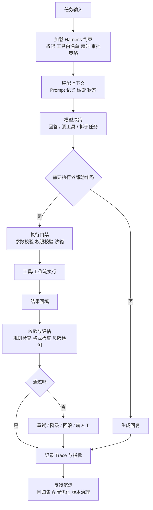

# Harness Engineering（Agent 生产化工程）

## 概念解释

Harness Engineering 是围绕 Agent 构建一整套“能稳定跑起来、能被约束、能被观测、出了问题能恢复”的工程方法。它不是某个框架，也不是单一工具，更不是“把 Prompt 再写好一点”。如果把大模型看成发动机，Harness 更像传动系统、仪表盘、刹车、护栏和检修口：它本身不提供智能，但决定智能能不能可靠地落到生产环境里。

这个概念出现的背景很直接：模型越来越强，Agent 能做的事越来越多，但一旦进入真实业务，问题就不再只是“答得对不对”。工程团队更关心的是：它有没有走错流程、会不会误调用危险工具、失败后能不能回退、上线后怎么排查、多个版本怎么灰度、团队如何协作维护。也就是说，原型阶段比的是“能不能做”，生产阶段比的是“能不能持续、稳定、可控地做”。

Harness Engineering 解决的不是模型本身的推理能力，而是 Agent 在现实系统中的运行可靠性。它通常站在模型之外，负责把 Prompt、工具、工作流、评测、权限、日志、回滚这些散落的部分，整理成一个可治理的运行环境。在 Agent / AI 系统里，它扮演的是“生产运行骨架”的角色。

## 关键结构

Harness Engineering 更适合按“维度型”来理解。它通常不是一个单点模块，而是五个工程维度的组合：

| 维度 | 作用 | 说明 |
|------|------|------|
| 运行约束 | 给 Agent 划边界 | 定义权限、工具白名单、审批点、超时、重试、沙箱等规则 |
| 执行编排 | 让 Agent 能持续完成任务 | 组织模型决策、工具调用、状态流转、人工接管与回退 |
| 上下文管理 | 控制 Agent 看见什么 | 管理系统提示词、任务状态、记忆、检索结果和上下文预算 |
| 观测与评估 | 判断 Agent 是否跑偏 | 记录 trace、日志、指标、失败样本，并持续跑 eval |
| 变更治理 | 支持版本演进与恢复 | 管理 Prompt、工具、模型、配置版本，以及灰度发布和回滚 |

### 结构 1：运行约束

运行约束回答的是“Agent 可以做什么，不可以做什么”。它包括工具调用权限、文件系统范围、网络访问、超时限制、重试次数、幂等策略、人工审批节点等。没有这一层，模型能力越强，失控半径也越大。

### 结构 2：执行编排

执行编排负责把“模型会思考”变成“系统会执行”。它关心的不是某一次回答，而是一条完整任务链路：任务怎么开始、何时调用工具、工具失败后怎么处理、什么时候停止、什么情况转人工。很多 Agent 失败，不是因为模型不会回答，而是因为执行状态机设计得太松散。

### 结构 3：上下文管理

上下文管理回答的是“在当前这一步，Agent 应该知道什么”。生产系统里最贵的不是一次推理，而是上下文窗口。Harness 需要决定哪些文档被检索、哪些历史状态被保留、哪些中间结果该压缩、哪些信息必须进入下一轮推理，否则 Agent 很容易出现记忆污染、上下文膨胀和目标漂移。

### 结构 4：观测与评估

如果没有观测，Agent 系统基本不可运维。Harness 会把每一步输入、输出、工具调用、错误链路、延迟、成本和关键决策记录下来，再配合离线评测、回归集、LLM-as-Judge、规则校验等机制判断质量是否退化。它的目标不是“解释模型为什么这样想”，而是“定位系统在哪一步开始不可信”。

### 结构 5：变更治理

Agent 的行为会同时受到模型版本、Prompt 改动、工具接口、检索数据和配置参数影响。变更治理要求这些东西都能被版本化、对比、灰度和回滚。否则上线后质量下降时，团队往往根本不知道是 Prompt 改坏了、工具 schema 变了，还是上下文源污染了。

## 核心原理

### 原理说明

Harness Engineering 的核心原理，不是替模型思考，而是给模型建立一个“受约束的闭环执行环境”。它通常按下面的链路运作：

1. **接收任务与加载约束**：系统先读取任务目标、用户身份、环境配置、工具权限和安全策略，确定这次任务的可执行边界。
2. **准备上下文**：根据任务类型装配系统提示词、工作记忆、检索结果、历史状态和输出格式要求，控制输入粒度与 token 预算。
3. **模型决策**：模型基于当前上下文决定下一步动作，例如直接回答、调用工具、继续拆解子任务，或请求更多信息。
4. **受控执行**：如果模型选择调用工具，请求不会直接裸奔，而是先经过参数校验、权限检查、超时与幂等控制，必要时进入沙箱或人工审批。
5. **结果回填与校验**：工具结果返回后，会被结构化记录并送回上下文；同时运行规则校验、格式检查、风险扫描或评估器判断。
6. **观测与恢复**：整个过程中持续记录 trace、日志、指标和失败样本；一旦出现异常，可触发重试、降级、回滚、切换模型或转人工。
7. **沉淀反馈**：任务完成后，把关键轨迹、评估结果和失败案例沉淀到回归集与配置治理系统中，供后续迭代使用。

这套机制能解决前面提到的问题，原因在于它把“模型输出”改造成了“系统动作的一部分”。真正可上线的 Agent，不是只会生成内容，而是每一步都处在可观测、可验证、可中断、可恢复的闭环里。

### Mermaid 图解

图里的关键节点不是模型本身，而是模型两侧的系统层：前面是约束与上下文，后面是校验、观测和恢复。很多团队把 Agent 做成“模型 + 工具”就停了，真正的 Harness 关注的是工具调用前后的门禁、审计和反馈闭环。

### 运行示例

Harness Engineering 是工程方法，不一定需要代码才能理解。对它来说，比最小代码更重要的是系统骨架是否完整：有没有权限边界、有没有观测、有没有回滚、有没有评估集、有没有人工接管点。缺任何一个环节，Agent 都可能在 Demo 阶段看起来聪明，在生产阶段却很难维护。

## 易混概念辨析

| 概念 | 与 Harness Engineering 的区别 | 更适合关注的重点 |
|------|-------------------------------|------------------|
| Prompt Engineering | Prompt Engineering 主要优化“怎么对模型说话”；Harness Engineering 关注“模型在系统里怎么被约束、执行、观测和治理” | 指令设计、示例设计、输出约束 |
| Context Engineering | Context Engineering 主要解决“给模型喂什么信息”；Harness Engineering 把上下文管理视为其中一个子系统，还要额外处理执行、评估、权限和回滚 | 检索、记忆、上下文预算、输入裁剪 |
| Agent Framework | Agent Framework 是实现载体，如某个编排框架或 SDK；Harness Engineering 是更高一层的方法论，可以用多个框架实现 | API、运行时、组件组合、开发效率 |
| MLOps / LLMOps | MLOps / LLMOps 覆盖模型生命周期与平台治理，范围更广；Harness Engineering 更聚焦 Agent 运行时的任务执行闭环 | 模型部署、训练、实验管理、平台化 |

核心区别：

- **Harness Engineering**：关注 Agent 在真实生产系统中的“运行控制面”与“治理闭环”。
- **Prompt Engineering**：关注提示词本身的表达质量，不天然覆盖权限、回滚和可观测性。
- **Context Engineering**：关注上下文设计，是 Harness 的重要组成，但不是全部。
- **Agent Framework**：是造 Harness 的工具，不等于 Harness 本身。

## 适用边界与局限

### 适用场景

1. **需要长期运行的 Agent 产品**：例如代码代理、客服代理、企业流程代理。它们不仅要给出答案，还要稳定调用外部系统并留下可审计轨迹。
2. **高风险或高成本任务**：如执行数据库变更、写代码并提交 PR、处理工单、调用付费 API。任务一旦失败，成本或风险很高，必须要有门禁和恢复机制。
3. **多人协作和持续迭代的项目**：当 Prompt、工具、模型、知识库由不同角色维护时，需要统一的版本治理、评测回归和观测标准。
4. **需要灰度发布与回滚的生产系统**：当 Agent 行为变更需要逐步放量、比较新旧效果、快速撤回时，Harness 是基础设施。

### 不适合的场景

1. **一次性 Demo 或探索性原型**：如果只是验证“这个方向能不能做”，先把核心链路跑通更重要，过早搭完整 Harness 会拖慢试错速度。
2. **完全确定性的简单流程**：如果业务本质上是固定规则和静态表单流，传统工作流引擎往往更直接，不一定需要引入 Agent + Harness 的复杂度。

### 局限性

1. **工程投入明显增加**：Harness 不会直接提升模型智力，但会增加日志、评测、权限、回滚、状态管理等系统建设成本。原型期常被认为“太重”。
2. **不能替代模型能力**：如果模型本身理解力不足、工具选择能力差，Harness 只能降低失控概率，不能凭空把弱模型变成强模型。
3. **评估仍然不完美**：很多 Agent 任务具有开放性，评测与线上真实表现之间仍有落差。Harness 能让质量退化更容易被发现，但不能保证完全自动判定所有问题。
4. **容易被误做成“过度编排”**：如果把每一步都堆成重流程，系统会又慢又难维护。好的 Harness 不是把系统变复杂，而是把复杂性放在真正高风险的地方。

## 常见误区

| 常见误区 | 正确理解 |
|----------|----------|
| Harness Engineering 就是某个 Agent 框架 | 它是工程方法，不是单一产品。框架只是实现 Harness 的工具之一 |
| 只要 Prompt 写得足够好，就不需要 Harness | Prompt 解决表达问题，Harness 解决运行控制、观测、恢复和治理问题 |
| Harness 的目标是让 Agent 完全自主 | 真实目标是“在边界内自主”，不是无边界放权 |
| 加了更多工作流节点就等于 Harness 更强 | 好的 Harness 强在关键门禁、反馈闭环和可恢复性，不在于流程图更长 |
| Harness 只适用于编码 Agent | 任何要调工具、跨系统执行、需要评估与治理的 Agent，都可能需要 Harness |

## 思考题

初级：为什么说 Harness Engineering 关注的重点不是“模型有多聪明”，而是“系统能不能稳定运行”？

**参考答案：**

因为生产环境里的核心问题不只是回答质量，还包括权限控制、调用安全、失败恢复、可观测性、版本治理和团队协作。模型再强，如果没有这些系统层能力，也很难长期上线运行。

中级：一个 Agent 已经能正确调用工具，为什么仍然可能需要 Harness？

**参考答案：**

因为“能调用”不等于“能稳定上线”。还需要校验参数是否合法、超时后怎么办、危险操作是否审批、失败是否可回滚、质量下降怎么发现、版本切换怎么灰度。Harness 处理的是这些运行时治理问题。

中级/进阶：如果团队发现新版本 Agent 在线上任务完成率下降，你会优先从 Harness 的哪些环节排查？

**参考答案：**

优先排查变更治理和观测链路：先比对模型、Prompt、工具 schema、检索源和配置是否变化；再看 trace、失败样本、工具错误率、上下文膨胀、规则拦截和评测回归结果。Harness 的价值就在于把这些排查入口标准化。

## 参考资料

1. OpenAI. “Harness engineering: leveraging Codex in an agent-first world”. https://openai.com/index/harness-engineering/
2. Anthropic. “Building effective agents”. https://www.anthropic.com/research/building-effective-agents
3. OpenAI. “Harnessing Codex to work on open source”. https://openai.com/index/harnessing-codex-to-work-on-open-source/
