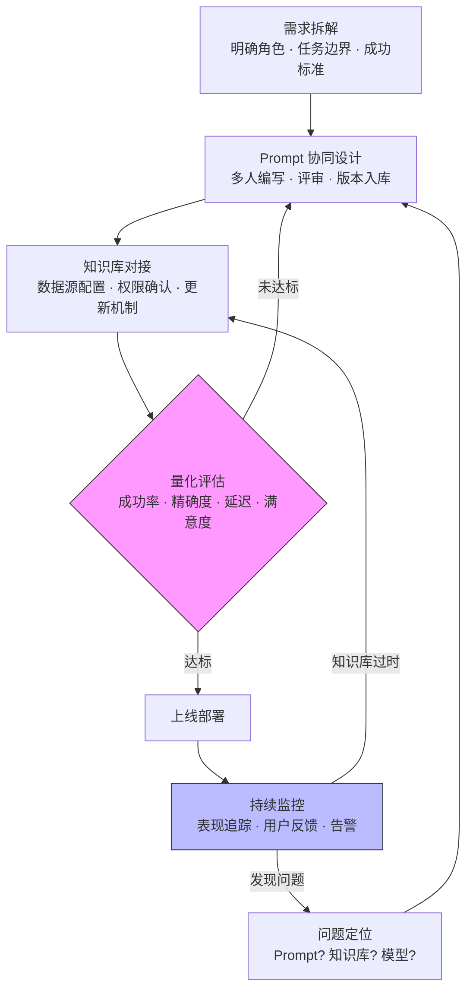

# 团队协作（Team Collaboration）

## 概念解释

Agent 团队协作是一套让多人（或多角色）在 Agent 应用的开发、测试、上线、维护全生命周期中高效分工的方法体系。它的核心不是"写好一份 Prompt"，而是解决"多个人同时写 Prompt、多个 Agent 同时跑、多个知识库同时更新"时不可避免的混乱问题。

传统软件开发有 Git 管版本、有 CI/CD 管发布、有单元测试管质量。Agent 开发也需要一套对等的协作基础设施，但管理对象从"代码"换成了"Prompt + 知识库 + 评估指标"。没有这套基础设施，团队规模一旦超过 2-3 人，就会出现 Prompt 互相覆盖、评估标准不统一、知识库各维护各的等典型问题。

和传统软件工程最大的区别在于：Agent 的行为不是确定性的。同一段 Prompt 在不同上下文、不同模型版本下可能产生完全不同的输出，这使得"版本管理"和"质量评估"比传统代码管理复杂得多，必须依靠系统化的方法才能持续运转。

## 关键结构

Agent 团队协作体系由三根支柱和两条保障线组成：

| 结构 | 作用 | 说明 |
|------|------|------|
| Prompt 版本管理 | 统一存储、追踪、回溯所有 Prompt 的变更 | 对标传统开发中的 Git，是协作的基础 |
| Agent 行为评估 | 用量化指标判断 Agent 输出质量 | 对标传统开发中的测试框架，是决策依据 |
| 知识库共享治理 | 集中管理 Agent 依赖的外部数据源 | 对标传统开发中的数据层管理，是质量底线 |
| 评审与权限机制 | 控制谁能改什么、改动需要谁审批 | 保障线：防止无序修改 |
| 监控与反馈循环 | 上线后持续追踪表现，驱动迭代 | 保障线：防止上线即失控 |

### 结构 1：Prompt 版本管理

Prompt 版本管理解决的核心问题是"谁在什么时候改了什么，改了之后效果变好还是变差"。

一个可用的 Prompt 版本管理系统需要四个能力：

- **唯一标识 + 版本号**：每个 Prompt 有 ID（如 `customer-service`），每次修改递增版本号（如 `v2.3`），支持按 ID 检索所有历史版本
- **变更日志**：记录每次修改的作者、时间、修改原因、具体差异，类似 Git commit message
- **快速对比（diff）**：支持并排查看两个版本的具体文本差异，帮助评审者快速理解改动
- **一键回滚**：如果新版本导致 Agent 表现下降，能立即切回上一个稳定版本

### 结构 2：Agent 行为评估

Agent 行为评估解决的核心问题是"团队对于什么算好没有共识"。

评估框架通常包含以下维度：

| 维度 | 衡量内容 | 典型指标 |
|------|---------|---------|
| 任务完成度 | Agent 是否达成了用户意图 | 成功率（Success Rate） |
| 输出质量 | 回答是否准确、是否遗漏关键信息 | 精确度（Precision）、召回率（Recall） |
| 效率 | 响应速度和资源消耗 | 延迟（Latency）、API 调用成本 |
| 用户体验 | 用户对回答的主观满意程度 | 满意度评分（1-5）、投诉率 |
| 安全合规 | 是否生成有害内容、是否泄露隐私 | 安全分数、合规通过率 |

不同业务场景的指标权重不同：实时客服更看重延迟和满意度，离线分析更看重精确度和成本。

### 结构 3：知识库共享治理

知识库共享治理解决的核心问题是"Agent 用的数据是不是最新的、是不是对的"。

治理机制包含三个层面：

- **分层分类**：按"业务域 - 场景 - 功能"三级目录组织知识库（如：电商 - 售后 - 退货流程），新人能快速定位所需知识
- **变更通知**：知识库更新时自动通知所有依赖它的 Agent，防止 Agent 使用过时数据
- **质量监控**：定期检查覆盖率、准确度、更新频率等指标，发现长期无人维护的"僵尸库"

## 核心原理

### 原理说明

Agent 团队协作的运转逻辑是一个"设计 - 评估 - 迭代"的闭环：

1. **需求拆解**：团队明确 Agent 的角色定位、任务边界、成功标准。如果涉及多 Agent 协作，还需规划分工和交接协议
2. **Prompt 协同设计**：多人共同编写 Prompt，通过评审机制确保质量，所有版本存入共享 Prompt 库
3. **知识库对接**：配置 Agent 使用的外部数据源（向量数据库、API、业务规则库），确认数据源的更新机制和权限
4. **量化评估**：用统一的评估框架对 Agent 输出做定量测试，只有通过标准的版本才能进入下一环节
5. **迭代优化**：根据评估结果调整 Prompt、补充知识库、调参数，循环直到达标
6. **上线监控**：部署后持续追踪 Agent 表现，收集用户反馈，发现问题后触发新一轮迭代

关键机制在于第 4 步和第 6 步形成的两个反馈回路：评估不达标则回到设计阶段（内部迭代），上线后发现问题则重新进入优化阶段（外部迭代）。这保证了 Agent 不会在一个不合格的状态下被推到线上，也不会在上线后失去维护。

### Mermaid 图解



图中有两个关键反馈点：评估节点（菱形）是内部质量门禁，不达标就不放行；监控节点（蓝色）是外部运行保障，问题会被分类后回流到对应环节。

### 运行示例

以下代码演示 Prompt 版本管理和 Agent 评估的最小协作流程。

```python
"""
Prompt 版本管理 + Agent 行为评估的最小协作示例
无外部依赖，纯标准库实现
"""
from datetime import datetime
from typing import Dict, List, Optional

# ============ Prompt 版本管理 ============

class PromptVersion:
    """单个 Prompt 版本的元数据"""
    def __init__(self, prompt_id: str, content: str, version: str,
                 author: str, change_log: str):
        self.prompt_id = prompt_id
        self.content = content
        self.version = version
        self.author = author
        self.change_log = change_log
        self.created_at = datetime.now().isoformat()

class PromptManager:
    """Prompt 版本管理器：存储、更新、回溯"""
    def __init__(self):
        self._store: Dict[str, List[PromptVersion]] = {}

    def create(self, prompt_id: str, content: str,
               author: str, change_log: str = "初始版本") -> str:
        """创建新 Prompt，返回版本号"""
        ver = PromptVersion(prompt_id, content, "v1.0", author, change_log)
        self._store[prompt_id] = [ver]
        return ver.version

    def update(self, prompt_id: str, content: str,
               author: str, change_log: str) -> str:
        """更新 Prompt（追加新版本），返回新版本号"""
        versions = self._store.get(prompt_id)
        if not versions:
            raise KeyError(f"Prompt '{prompt_id}' 不存在")
        last = versions[-1]
        # 小版本号递增：v1.0 → v1.1 → v1.2 ...
        major, minor = last.version.split(".")
        new_ver_str = f"{major}.{int(minor) + 1}"
        new_ver = PromptVersion(prompt_id, content, new_ver_str,
                                author, change_log)
        versions.append(new_ver)
        return new_ver_str

    def get_latest(self, prompt_id: str) -> Optional[PromptVersion]:
        """获取最新版本"""
        versions = self._store.get(prompt_id)
        return versions[-1] if versions else None

    def rollback(self, prompt_id: str) -> str:
        """回滚到上一个版本，返回回滚后的版本号"""
        versions = self._store.get(prompt_id)
        if not versions or len(versions) < 2:
            raise ValueError("没有可回滚的历史版本")
        versions.pop()
        return versions[-1].version

# ============ Agent 行为评估 ============

class AgentEvaluator:
    """Agent 输出质量评估器"""

    @staticmethod
    def evaluate(response: str, expected: str,
                 latency_ms: float, user_score: float) -> Dict:
        """
        评估单次 Agent 响应，返回多维度指标。

        参数:
            response: Agent 实际输出
            expected: 期望输出（标准答案）
            latency_ms: 响应延迟（毫秒）
            user_score: 用户满意度评分（1-5）
        """
        resp_words = set(response.lower().split())
        exp_words = set(expected.lower().split())
        common = resp_words & exp_words

        precision = len(common) / len(resp_words) if resp_words else 0.0
        recall = len(common) / len(exp_words) if exp_words else 0.0
        success = 1.0 if (precision > 0.5 and recall > 0.5) else 0.0

        return {
            "success_rate": success,
            "precision": round(precision, 3),
            "recall": round(recall, 3),
            "latency_ms": latency_ms,
            "user_satisfaction": user_score,
        }

    @staticmethod
    def composite_score(metrics: Dict,
                        weights: Optional[Dict] = None) -> float:
        """加权综合得分（0-1）"""
        w = weights or {
            "success_rate": 0.35, "precision": 0.20,
            "recall": 0.15, "user_satisfaction": 0.15,
            "latency": 0.10, "cost": 0.05,
        }
        latency_score = max(0, 1 - metrics["latency_ms"] / 5000)
        sat_score = metrics["user_satisfaction"] / 5.0
        score = (
            metrics["success_rate"] * w["success_rate"]
            + metrics["precision"] * w["precision"]
            + metrics["recall"] * w["recall"]
            + sat_score * w["user_satisfaction"]
            + latency_score * w["latency"]
            + 0.95 * w["cost"]  # 假设单次成本很低
        )
        return round(score, 3)

# ============ 协作流程演示 ============

if __name__ == "__main__":
    pm = PromptManager()
    ev = AgentEvaluator()

    # 第一步：团队成员 A 创建初始 Prompt
    pm.create("cs-bot", "你是客服助手。回答订单、退货问题。", "张三")
    print(f"当前版本: {pm.get_latest('cs-bot').version}")

    # 第二步：评估 v1.0 效果
    m1 = ev.evaluate(
        response="订单已发货，预计3天到。",
        expected="订单号123已发货，预计3个工作日送达。",
        latency_ms=320, user_score=3.5
    )
    print(f"v1.0 综合得分: {ev.composite_score(m1)}")

    # 第三步：团队评审后，成员 B 优化 Prompt
    pm.update("cs-bot",
              "你是电商客服助手。回答订单、退货、退款问题。"
              "每个回答包含具体步骤。",
              "李四", "添加步骤要求，扩展退款场景")
    print(f"更新后版本: {pm.get_latest('cs-bot').version}")

    # 第四步：评估 v1.1 效果
    m2 = ev.evaluate(
        response="订单号123已发货，预计3个工作日送达。如需退货请按以下步骤操作。",
        expected="订单号123已发货，预计3个工作日送达。",
        latency_ms=280, user_score=4.5
    )
    print(f"v1.1 综合得分: {ev.composite_score(m2)}")

    # 如果新版本出了问题，一键回滚
    # rolled = pm.rollback("cs-bot")
    # print(f"回滚到: {rolled}")
```

代码包含两个核心类：`PromptManager` 负责版本存储和回溯，`AgentEvaluator` 负责多维度评分。两者配合演示了"创建 - 评估 - 优化 - 再评估"的协作闭环。实际生产环境中，`PromptManager` 会对接数据库或 Git 后端，`AgentEvaluator` 的精确度计算会替换为基于 Embedding 相似度或 LLM-as-Judge 的方案。

## 易混概念辨析

| 概念 | 与团队协作的区别 | 更适合关注的重点 |
|------|-----------------|-----------------|
| 多 Agent 协作（Multi-Agent） | 多 Agent 协作是 Agent 之间的自动化分工；团队协作是人与人之间围绕 Agent 开发的分工 | Agent 间的通信协议、任务路由、冲突解决 |
| LLMOps / MLOps | LLMOps 是整个 LLM 应用的运维体系（含模型部署、监控等）；团队协作是其中"开发协同"这一子集 | 模型版本管理、推理服务部署、成本监控 |
| Prompt Engineering | Prompt Engineering 是个人技能（如何写好一条 Prompt）；团队协作是组织能力（如何让多人一起管好一批 Prompt） | 提示词的结构设计、Chain-of-Thought 技巧 |

核心区别：

- **团队协作**：关注"多人如何协同管理 Prompt、评估 Agent、维护知识库"
- **多 Agent 协作**：关注"多个 Agent 如何自动分工、传递信息、协调行动"
- **LLMOps**：关注"LLM 应用从开发到运维的全流程工程化管理"

## 适用边界与局限

### 适用场景

1. **多部门共建的企业级 Agent 系统**：多个部门（销售、客服、技术支持）同时维护各自的 Agent，需要统一的 Prompt 库和评估标准来保证一致性。例如，一家电商平台的 50 人客服团队通过 Prompt 版本管理，让销售客服和售后客服共享通用的情绪安抚话术，同时保持各自的专业 Prompt
2. **跨地域的远程开发团队**：团队成员分布在不同城市甚至不同时区，无法频繁面对面沟通。通过 Prompt 版本管理和评估框架实现异步协作，用数据代替会议做决策
3. **快速迭代的产品 Agent**：产品需要每周甚至每天更新 Prompt。通过评估框架做自动化回归测试，确保每次改动不会引入退化（regression）

### 不适合的场景

1. **1-2 人的个人项目**：建立完整的协作体系（版本管理、评审流程、权限控制）带来的管理成本远超收益，直接用文件夹管理 Prompt 就够了
2. **一次性的 PoC（概念验证）项目**：验证性质的项目生命周期短，不需要长期维护机制。投入时间搭建协作基础设施不如直接跑通原型

### 局限性

1. **初期搭建成本高**：Prompt 管理平台、评估框架、知识库治理工具都需要开发或采购。小团队可能需要 2-4 周才能搭建起最小可用的协作体系
2. **评估框架设计困难**：不同场景的评估指标和权重差异很大，没有通用方案。评估框架设计不当反而会误导决策——比如过度追求成功率而忽略安全性
3. **非确定性输出增加管理难度**：同一版本的 Prompt 在不同模型版本、不同上下文下可能输出不同结果，使得"版本回滚就能恢复效果"不总是成立

## 常见误区

| 常见误区 | 正确理解 |
|----------|----------|
| "Prompt 写得好，Agent 就一定表现好" | Prompt 是重要变量，但不是唯一变量。Agent 表现还取决于知识库质量、模型能力、上下文设计等。优化 Agent 需要多维度协同 |
| "团队协作就是建个共享文件夹放 Prompt" | 共享文件夹只解决了"存储"问题。真正的协作还需要版本追踪、权限控制、变更通知、评审流程和质量评估 |
| "只看任务完成率就能判断 Agent 好不好" | 单一指标会产生误导。完成率高但延迟大、成本高、用户不满意的 Agent 并不是好 Agent。必须用多维度加权评估 |
| "Agent 上线后就稳定了" | Agent 的表现会随知识库过时、用户需求变化、模型版本更新而下降。必须建立持续监控和定期评估机制 |
| "知识库应该由一个团队集中管理" | 集中管理容易形成瓶颈。更合理的做法是各业务部门维护自己的知识库，通过标准化接口和质量指标来保证一致性 |

## 思考题

<details>
<summary>初级：Prompt 版本管理和 Git 代码版本管理有什么相似之处和不同之处？</summary>

**参考答案：**

相似之处：都需要版本号、变更日志、对比（diff）和回滚能力。

不同之处：代码的行为是确定性的（同一段代码在同一环境下总是产生相同结果），因此回滚到旧版本就能恢复行为。但 Prompt 的行为是非确定性的——同一段 Prompt 在不同模型版本、不同上下文下可能输出不同结果，因此 Prompt 版本管理还需要配合评估框架，在回滚后重新验证效果。

</details>

<details>
<summary>中级：一个实时在线客服 Agent 和一个离线数据分析 Agent，在评估指标权重设计上应该有什么区别？</summary>

**参考答案：**

在线客服 Agent 应给延迟和用户满意度更高的权重（用户等不了太久，体验差会直接流失），安全合规权重也应较高（直接面对用户，不能输出有害内容）。离线分析 Agent 应给精确度和召回率更高的权重（分析结果的准确性是核心价值），成本权重也更重要（离线批量处理的 API 调用量大），延迟权重可以降低（用户不在实时等待）。

</details>

<details>
<summary>中级/进阶：线上 Agent 突然出现用户投诉"回答不准确"，你如何系统性地定位是 Prompt 的问题、知识库的问题还是模型的问题？</summary>

**参考答案：**

分三步排查：

（1）先查变更日志——最近 48 小时内 Prompt 是否有更新、知识库是否有变更、模型版本是否有切换。如果某一项有变更，优先检查该项。

（2）如果没有明显变更，做对照实验——用同一组测试用例分别测试：用当前 Prompt + 旧知识库快照 vs 用当前 Prompt + 当前知识库。如果旧知识库下表现正常，说明是知识库数据质量问题（可能被污染或过时）。如果两者表现都差，再用旧版本 Prompt 测试，判断是否是 Prompt 退化。

（3）如果以上都排除，检查模型侧——确认模型服务是否有版本更新或性能波动（通过监控面板查看模型推理延迟、错误率等指标）。

</details>

## 参考资料

1. Microsoft. 2025. "Reimagining how we collaborate with Microsoft Teams and AI agents". https://www.microsoft.com/insidetrack/blog/microsoft-teams-increases-collaboration-in-the-modern-workplace-at-microsoft/
2. Microsoft Azure. 2025. "Agent Factory: Top 5 agent observability best practices for reliable AI". https://azure.microsoft.com/en-us/blog/agent-factory-top-5-agent-observability-best-practices-for-reliable-ai/
3. Machine Learning Mastery. 2024. "Agent Evaluation: How to Test and Measure Agentic AI Performance". https://machinelearningmastery.com/agent-evaluation-how-to-test-and-measure-agentic-ai-performance/
4. Datawhalechina. 2024. "Hello Agents - 第十二章 智能体性能评估". https://github.com/datawhalechina/hello-agents/blob/main/docs/chapter12/
5. PingCode. 2024. "如何搭建一个团队共享的知识库？分享16种主流系统方案". https://docs.pingcode.com/baike/5201697
