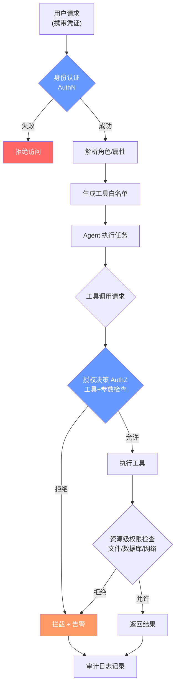

# 访问控制（Access Control）

## 概念解释

访问控制（Access Control）是一套决定"谁能对哪些资源做哪些操作"的安全机制。放到 Agent 应用的语境里，就是限制 Agent 能调用哪些工具、能读写哪些文件、能访问哪些外部服务。

为什么 Agent 场景比传统 Web 应用更需要访问控制？因为传统应用里，用户的操作路径是开发者提前设计好的（点按钮、填表单）；而 Agent 是自主决策的，它会根据 LLM 的推理结果动态选择调用哪个工具、传什么参数。这意味着如果没有访问控制，一个被 Prompt 注入攻击的 Agent 可能会执行 `rm -rf /` 或者把数据库整个导出发到外网。

访问控制在 Agent 系统中的角色可以用一句话概括：**它是 Agent 自主性的围栏**。Agent 越自主，围栏越重要。

## 关键结构

| 结构 | 作用 | 说明 |
|------|------|------|
| 身份认证（AuthN） | 确认"你是谁" | API Key、OAuth Token、JWT 等凭证验证 |
| 授权决策（AuthZ） | 判断"你能做什么" | RBAC/ABAC 策略引擎，输出允许或拒绝 |
| 权限策略 | 定义规则库 | 角色-权限映射表、属性条件表达式 |
| 工具级管控 | 限制 Agent 可用工具集 | 按角色动态生成 Agent 的 tools 列表 |
| 审计日志 | 记录"做了什么" | 所有权限判定结果和操作详情持久化存储 |

### 结构 1：身份认证（Authentication）

身份认证解决的是"证明你是你"的问题。在 Agent 应用中，认证对象不止是人类用户，还包括 Agent 自身（Agent-to-Service 调用）和其他服务（Service-to-Service 调用）。常见方式包括：

- **API Key**：最简单，适合服务间调用，但泄露风险高，必须配合密钥轮换
- **OAuth 2.0 / OIDC**：适合用户授权场景，支持 scope（权限范围）限定
- **JWT（JSON Web Token）**：无状态令牌，可在 payload 中携带角色和权限信息，适合分布式系统

### 结构 2：授权决策（Authorization）

认证通过后，系统需要判断"这个身份能不能做这件事"。两种主流模型：

- **RBAC（Role-Based Access Control，基于角色的访问控制）**：用户绑定角色，角色绑定权限。优点是简单直观，适合角色边界清晰的场景
- **ABAC（Attribute-Based Access Control，基于属性的访问控制）**：根据用户属性、资源属性、环境属性（时间、IP）动态计算权限。灵活性更高，但策略管理复杂

Agent 应用中通常采用 RBAC 为主、ABAC 为辅的混合模式：角色决定基础权限，属性条件做细粒度约束。

### 结构 3：工具级管控

这是 Agent 场景特有的结构。传统应用控制的是 API 端点，Agent 应用控制的是"工具调用"。管控分两层：

- **工具白名单**：根据用户角色，动态决定 Agent 的可用工具列表。比如只读角色的 Agent 根本看不到 `delete_file` 这个工具
- **参数约束**：即使允许使用某个工具，也限制其参数范围。比如允许用 `read_file`，但路径必须在 `/data/reports/` 下

### 结构 4：审计日志

每一次权限判定（无论允许还是拒绝）都必须记录。审计日志不只是事后取证用的，它还是实时告警的数据源。比如某个用户 5 分钟内触发了 20 次权限拒绝，大概率是在试探系统边界，应该立即告警。

## 核心原理

### 原理说明

访问控制的核心逻辑可以抽象为一个决策函数：**给定（主体, 资源, 操作, 上下文），输出允许或拒绝**。

在 Agent 应用中，这个决策发生在五个关键时刻：

1. **请求入口**：用户发起请求时，验证身份凭证，确认用户身份和角色
2. **Agent 初始化**：根据用户角色，生成该次会话中 Agent 可使用的工具列表（工具白名单）
3. **工具调用前**：Agent 每次决定调用工具时，权限引擎检查该工具是否在白名单中，参数是否符合约束
4. **资源访问时**：工具执行过程中访问文件、数据库、网络等资源时，进行资源级别的权限校验
5. **结果返回前**：检查返回内容是否包含该用户无权查看的敏感信息，必要时做数据脱敏

核心设计原则是**最小权限原则（Principle of Least Privilege）**：只授予完成任务所必需的最小权限集合，不多给一点。

### Mermaid 图解



整个流程有三道关卡：身份认证（AuthN）、工具级授权（AuthZ）、资源级校验。每道关卡都有独立的拒绝路径，拒绝时不只是返回错误，还会写入审计日志并可能触发告警。

关键点：工具白名单是在 Agent 初始化时就确定的，而不是每次调用时临时查询。这样做既提升了性能，也防止了 Agent 在运行过程中被注入攻击后"升级"自己的工具列表。

### 运行示例

```python
# 最小示例：RBAC + 工具调用权限检查
# 基于 Python 3.10+ 标准库，无外部依赖

from dataclasses import dataclass, field
from typing import Optional

@dataclass
class Permission:
    """单条权限规则"""
    resource: str          # 资源名，如 "tool:search"、"file:/data/*"
    action: str            # 操作，如 "execute"、"read"、"write"
    constraint: Optional[dict] = None  # 额外约束，如 {"allowed_paths": ["/data/"]}

@dataclass
class Role:
    """角色定义"""
    name: str
    permissions: list[Permission] = field(default_factory=list)

    def is_allowed(self, resource: str, action: str, params: dict) -> bool:
        """判断该角色是否允许对指定资源执行指定操作"""
        for perm in self.permissions:
            if perm.resource == resource and perm.action == action:
                if perm.constraint and "allowed_paths" in perm.constraint:
                    path = params.get("path", "")
                    if any(path.startswith(p) for p in perm.constraint["allowed_paths"]):
                        return True
                elif perm.constraint is None:
                    return True
        return False

# --- 定义角色 ---
viewer = Role("viewer", [
    Permission("tool:search", "execute"),
    Permission("tool:read_file", "execute", {"allowed_paths": ["/data/reports/"]}),
])

analyst = Role("analyst", [
    Permission("tool:search", "execute"),
    Permission("tool:read_file", "execute", {"allowed_paths": ["/data/"]}),
    Permission("tool:query_db", "execute"),
])

# --- 权限检查 ---
print(viewer.is_allowed("tool:search", "execute", {}))
# True -- viewer 可以使用搜索工具

print(viewer.is_allowed("tool:read_file", "execute", {"path": "/data/reports/q1.csv"}))
# True -- 路径在白名单内

print(viewer.is_allowed("tool:read_file", "execute", {"path": "/etc/passwd"}))
# False -- 路径不在白名单内，拒绝

print(viewer.is_allowed("tool:query_db", "execute", {}))
# False -- viewer 角色没有数据库查询权限
```

`Permission` 的 `constraint` 字段实现了参数级约束。上面的示例刻意省略了身份认证和审计日志部分，只展示授权决策的核心逻辑。

## 易混概念辨析

| 概念 | 与访问控制的区别 | 更适合关注的重点 |
|------|------------------|------------------|
| 身份认证（Authentication） | 认证解决"你是谁"，访问控制解决"你能做什么"。认证是访问控制的前置步骤 | Token 签发、凭证管理、多因素认证 |
| 数据加密（Encryption） | 加密保护数据在传输和存储时不被窃取，访问控制保护数据不被未授权的人访问 | 加密算法、密钥管理、TLS 配置 |
| 沙箱隔离（Sandboxing） | 沙箱从运行环境层面做物理隔离，访问控制从逻辑层面做权限判定。二者互补 | 容器隔离、文件系统挂载、网络命名空间 |
| 输入验证（Input Validation） | 输入验证防止非法数据进入系统（如 SQL 注入），访问控制防止合法用户越权操作 | 参数校验、Prompt 注入防御 |

核心区别：

- **访问控制**：关注"已认证的主体能不能做某件事"
- **身份认证**：关注"这个请求来自谁"，是访问控制的前提
- **沙箱隔离**：从物理/运行时层面兜底，即使逻辑层权限被绕过，沙箱也能挡住
- **输入验证**：关注数据本身的合法性，与"谁发的"无关

## 适用边界与局限

### 适用场景

1. **多租户 Agent 平台**：不同企业客户共享同一套 Agent 基础设施，必须通过访问控制实现数据隔离。每个租户的 Agent 只能访问自己的知识库和客户数据
2. **企业内部 AI 助手**：不同部门、不同职级的员工使用同一个 Agent，但能调用的工具和能看到的数据不同。比如财务部可以查询财报数据，普通员工只能查公开信息
3. **合规敏感行业（金融、医疗）**：GDPR、HIPAA、SOC 2 等法规要求对数据访问有严格的权限控制和完整的审计记录
4. **Agent 调用外部工具/API 的场景**：Agent 需要执行文件操作、数据库查询、网络请求等高风险操作时，必须有权限管控防止越权

### 不适合的场景

1. **纯对话型 Agent（无工具调用）**：如果 Agent 只做文本生成、不调用任何外部工具，那么传统的 API 鉴权已经足够，不需要工具级访问控制
2. **个人本地开发/实验阶段**：一个人在本机跑 Agent 做原型验证时，完整的 RBAC 体系是过度设计。等到上生产环境再加不迟

### 局限性

1. **策略维护成本**：随着工具数量和角色种类增长，权限策略的组合数会爆炸式增长。一个有 20 个工具、10 个角色的系统，理论上有 200 条权限规则需要维护
2. **权限蠕变（Privilege Creep）**：随着时间推移，用户权限只增不减，最终偏离最小权限原则。需要定期做权限审查（Access Review）
3. **动态场景的滞后性**：RBAC 的规则是预定义的，当出现新工具或新场景时，需要先更新策略才能使用，灵活性不如 ABAC
4. **性能开销**：每次工具调用前的权限检查会增加延迟。在高频调用场景下需要缓存策略或本地化决策来缓解

## 常见误区

| 常见误区 | 正确理解 |
|----------|----------|
| "入口做一次鉴权就够了" | Agent 的执行链路可能很长，每一次工具调用都需要独立的权限检查。入口鉴权只解决身份认证，不解决工具级授权 |
| "给 Agent 全部权限，反正有审计日志兜底" | 审计日志是事后追溯手段，不是事前防护。等你从日志里发现问题时，数据可能已经泄露了 |
| "用了 RBAC 就安全了" | RBAC 只解决"角色-权限映射"，不解决密钥管理、网络隔离、沙箱防护等问题。访问控制是纵深防御的一环，不是全部 |
| "API Key 放在环境变量里就安全了" | 环境变量只是比硬编码好一点。生产环境应使用专门的密钥管理服务（如 HashiCorp Vault、AWS KMS），配合自动轮换策略 |

## 思考题

<details>
<summary>初级：RBAC 模型中，为什么要"用户-角色-权限"三层映射，而不是直接给用户分配权限？</summary>

**参考答案：**

直接分配权限会导致管理复杂度随用户数线性增长。假设有 100 个用户和 20 个权限项，直接分配需要管理 100 x 20 = 2000 条映射关系。引入角色层后，只需要定义 5-10 个角色，每个角色绑定若干权限，用户只需绑定角色即可。当权限规则变更时，只修改角色定义，所有拥有该角色的用户自动生效。

</details>

<details>
<summary>中级：在 Agent 应用中，"工具白名单"应该在什么时候生成？为什么不在每次工具调用时实时查询？</summary>

**参考答案：**

工具白名单应在 Agent 会话初始化时根据用户角色一次性生成，而不是每次调用时实时查询。原因有二：一是性能考量，避免每次调用都查询权限引擎；二是安全考量，如果 Agent 在运行过程中被 Prompt 注入攻击，攻击者可能通过某种方式影响实时查询的结果，而初始化时生成的白名单是不可变的，更难被篡改。

</details>

<details>
<summary>中级/进阶：你的 Agent 平台有三类角色（管理员、分析师、查看者），新来了一个需求："临时赋予某个查看者 24 小时的数据库查询权限"。纯 RBAC 模型能否满足？如果不能，怎么扩展？</summary>

**参考答案：**

纯 RBAC 无法满足这个需求，因为 RBAC 的权限是角色级别的、静态的，没有时间维度。要支持这种临时授权，需要引入 ABAC 的思路：在权限规则中加入时间条件（如 `valid_until: 2026-03-26T00:00:00Z`），权限引擎在判定时检查当前时间是否在有效期内。这就是"RBAC 为主、ABAC 为辅"的混合模式。另一种做法是实现 JIT（Just-In-Time）访问机制，通过审批流程临时提升权限，到期自动回收。

</details>

## 参考资料

1. Microsoft. "什么是 Azure 基于角色的访问控制 (Azure RBAC)？" Microsoft Learn. https://learn.microsoft.com/zh-cn/azure/role-based-access-control/overview
2. CyberArk. "What's Shaping the AI Agent Security Market in 2026." CyberArk Blog. https://www.cyberark.com/resources/blog/whats-shaping-the-ai-agent-security-market-in-2026
3. Microsoft. "Secure Agent Access with Microsoft Entra." Microsoft Security. https://www.microsoft.com/en-in/security/business/identity-access/microsoft-entra-agent-id
4. eSentire. "Model Context Protocol Security: Critical Vulnerabilities Every CISO Must Address." eSentire Blog. https://www.esentire.com/blog/model-context-protocol-security-critical-vulnerabilities-every-ciso-should-address-in-2025
5. NIST. "Guide to Attribute Based Access Control (ABAC) Definition and Considerations." NIST SP 800-162. https://csrc.nist.gov/publications/detail/sp/800-162/final
