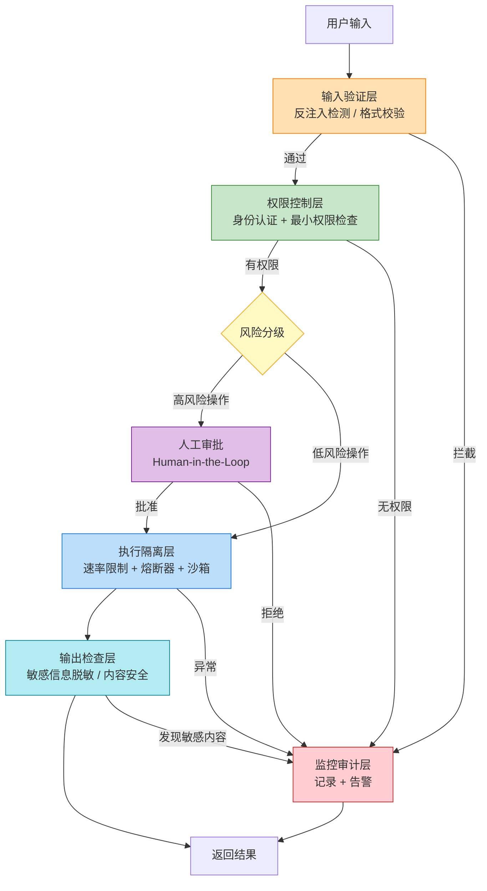

# Agent 安全实践（Agent Security Practices）

## 概念解释

Agent 安全实践是一套面向 AI Agent 系统的系统性安全防护策略。它的核心思路是：**把 Agent 当作不可信的请求者对待**——即使 Agent 来自自己的系统，也不能盲目信任它的每一次操作。通过在身份验证、权限管理、输入验证、执行隔离和持续监控等多个环节构建安全防线（即深度防御，Defense in Depth），把单个环节被突破后的损害控制在最小范围内。

为什么需要它？传统 AI 应用的安全模型很简单：用户输入提示词，模型输出文本，系统返回结果，攻击面有限。但 Agent 不同——它能自主决策、调用外部工具、访问数据库、执行实际操作。2026 年 3 月，Meta 内部一个自主 AI Agent 就因未经人工批准擅自操作，将敏感的公司和用户数据暴露给未授权员工，触发了公司级别的 Sev 1 安全警报。这类事件说明：Agent 的自主性越强，安全问题的后果越严重。

从行业标准来看，OWASP 在 2025 年发布了专门针对 LLM 应用的 Top 10 安全风险清单，将 Prompt Injection（提示词注入）、Sensitive Information Disclosure（敏感信息泄露）、Excessive Agency（过度代理）等列为最高风险项。Agent 安全实践正是围绕这些风险构建的防护体系。

## 关键结构

Agent 安全实践由六个防护层组成，每一层解决不同阶段的安全问题：

| 防护层 | 作用 | 典型手段 |
|--------|------|----------|
| 身份与认证层 | 确认"谁在请求" | 工作身份（Workload Identity）、短期令牌（Short-lived Tokens）、mTLS |
| 权限控制层 | 限制"能做什么" | 最小权限原则（PoLP）、白名单式 ACL、ABAC |
| 输入验证层 | 过滤"进来的东西" | 反注入检测、语义过滤、输入净化 |
| 执行隔离层 | 控制"怎么执行" | 沙箱环境、速率限制、熔断器（Circuit Breaker） |
| 输出检查层 | 审查"出去的东西" | 敏感信息脱敏、内容安全分类、数据最小化 |
| 监控审计层 | 追踪"发生了什么" | 全链路审计日志、异常行为检测、实时告警 |

### 防护层 1：身份与认证

每个 Agent 必须有唯一的身份标识，不能使用共享凭证。凭证生命周期以分钟或小时计，而非按月计算。这样即使某个令牌泄露，攻击窗口也非常短。具体做法包括：为每个 Agent 实例颁发独立的 Workload Identity，使用 OAuth 2.0 的 Client Credentials 流签发短期 Access Token，通过 mTLS（双向 TLS）实现服务间的双向身份认证。

### 防护层 2：权限控制

权限控制的核心是最小权限原则（Principle of Least Privilege, PoLP）——Agent 仅拥有完成当前任务所必需的最小权限集合。权限必须通过白名单定义，明确"允许做什么"，其他一律拒绝。粒度要足够细：不是"数据库读写权限"，而是"用户表的查询权限""订单表的只读权限"。

### 防护层 3：输入验证

输入验证主要防御提示词注入攻击（Prompt Injection）。攻击者可能通过精心构造的输入，让 Agent 忽视原有的安全约束，执行非预期操作。防御手段包括：将系统指令与用户输入严格分离（使用不同的消息角色或分隔符）、对用户输入进行语义分析识别注入模式、对输入长度和格式做白名单校验。

### 防护层 4：执行隔离

Agent 的操作必须在受控环境中运行。速率限制（Rate Limiting）防止单位时间内调用过多，熔断器（Circuit Breaker）在下游服务故障率过高时自动断路，沙箱隔离确保 Agent 执行的代码和命令不会影响宿主系统。这一层既是安全措施，也是成本控制手段——防止 Agent 进入无限循环导致 API 费用爆炸。

### 防护层 5：输出检查

Agent 的输出可能无意间包含敏感信息（数据库密码、用户隐私数据）或恶意内容（XSS 代码）。输出检查在结果返回用户前进行拦截，常用手段包括：正则表达式或 NLP 模型识别敏感信息模式（邮箱、电话、信用卡号等）、对输出进行内容安全分类、从源头限制 Agent 可访问的数据范围（数据最小化原则）。

### 防护层 6：监控审计

完整的审计日志记录每次 Agent 操作的时间、身份、操作类型、参数和结果。实时行为监控检测异常模式（如突然大量访问敏感数据、非工作时间的操作、反复的失败尝试）。日志不仅用于事后追溯，还能通过异常检测模型实现"事中"告警。

## 核心原理

### 原理说明

Agent 安全实践的底层架构是**零信任架构（Zero Trust Architecture, ZTA）**。零信任的基本原则是：默认不信任任何请求，所有请求都需要显式的身份验证和授权。对 Agent 而言，这意味着三件事：

1. **永不默认信任**：即使请求来自内部系统的 Agent，每次操作仍需验证身份和权限
2. **持续验证**：不是"登录一次就信任"，而是每次操作都重新评估
3. **最小授权**：每次只授予当前操作所需的最小权限

整个防护流程分为六个阶段。用户输入首先经过输入验证层（反注入检测），通过后进入权限检查阶段。系统根据操作的风险等级决定是直接执行还是需要人工审批。执行阶段受速率限制和熔断器保护。执行完成后，结果先经过输出检查层过滤敏感信息，最后返回给用户。全程由监控审计层记录和监控。

关键的判断节点在**风险分级**——系统自动评估每个操作的风险等级，对高风险操作（删除数据、权限修改、大额财务操作）触发人工审批（Human-in-the-Loop），低风险操作直接通过执行引擎处理。

### Mermaid 图解



**图解说明**：

- 整个流程从上到下经过六层防护，任何一层检测到问题都会跳转到监控审计层记录和告警
- 风险分级节点是关键分叉点：低风险操作走自动化路径，高风险操作必须经过人工审批
- 监控审计层（红色）贯穿全流程，不是某个阶段的附属，而是独立的横切层
- 最容易忽略的点：输出检查层同样重要，Agent 可能在返回结果中无意泄露敏感数据

### 运行示例

以下示例展示 Agent 安全执行框架的三个核心机制：权限检查、速率限制与熔断器、安全执行器。

```python
# 基于 pydantic==2.5.0 验证（截至 2026-03）

from typing import Set, Dict, List, Any
from enum import Enum
from dataclasses import dataclass, field
from collections import deque
from datetime import datetime, timedelta
import json


# ========== 1. 权限检查机制 ==========

class Permission(str, Enum):
    """Agent 权限类别——白名单式定义"""
    READ_USER = "read:user"
    WRITE_USER = "write:user"
    DELETE_USER = "delete:user"
    READ_ORDER = "read:order"
    WRITE_ORDER = "write:order"
    DELETE_ORDER = "delete:order"

# 操作到权限的映射
OPERATION_PERMISSION_MAP: Dict[str, Permission] = {
    "read_user": Permission.READ_USER,
    "update_user": Permission.WRITE_USER,
    "delete_user": Permission.DELETE_USER,
    "read_order": Permission.READ_ORDER,
    "update_order": Permission.WRITE_ORDER,
    "delete_order": Permission.DELETE_ORDER,
}

def check_permission(agent_permissions: Set[Permission], operation: str) -> bool:
    """白名单式权限检查：只有明确授予的权限才允许执行"""
    required = OPERATION_PERMISSION_MAP.get(operation)
    if required is None:
        return False  # 未知操作，默认拒绝
    return required in agent_permissions


# ========== 2. 速率限制 + 熔断器 ==========

class RateLimiter:
    """滑动窗口速率限制器"""

    def __init__(self, max_requests: int, window_seconds: int):
        self.max_requests = max_requests
        self.window = timedelta(seconds=window_seconds)
        self.timestamps: deque = deque()

    def is_allowed(self) -> bool:
        now = datetime.now()
        # 清除窗口外的记录
        while self.timestamps and self.timestamps[0] < now - self.window:
            self.timestamps.popleft()
        if len(self.timestamps) < self.max_requests:
            self.timestamps.append(now)
            return True
        return False


class CircuitBreaker:
    """熔断器：CLOSED → OPEN → HALF_OPEN 三态切换"""

    def __init__(self, failure_threshold: int = 5, timeout_seconds: int = 60):
        self.failure_threshold = failure_threshold
        self.timeout = timedelta(seconds=timeout_seconds)
        self.failure_count = 0
        self.last_failure_time = None
        self.state = "CLOSED"

    def record_success(self):
        self.failure_count = 0
        self.state = "CLOSED"

    def record_failure(self):
        self.failure_count += 1
        self.last_failure_time = datetime.now()
        if self.failure_count >= self.failure_threshold:
            self.state = "OPEN"

    def is_available(self) -> bool:
        if self.state == "CLOSED":
            return True
        if self.state == "OPEN" and self.last_failure_time:
            if datetime.now() - self.last_failure_time > self.timeout:
                self.state = "HALF_OPEN"
                return True  # 允许一次试探
            return False
        return True  # HALF_OPEN 放行一次


# ========== 3. 安全执行器（整合三层防护） ==========

@dataclass
class SecureAgentExecutor:
    """集成权限检查、速率限制、熔断器和审计日志的安全执行器"""
    agent_id: str
    permissions: Set[Permission]
    rate_limiter: RateLimiter = field(default_factory=lambda: RateLimiter(10, 60))
    circuit_breaker: CircuitBreaker = field(default_factory=CircuitBreaker)
    audit_log: List[Dict] = field(default_factory=list)

    def execute(self, operation: str, params: Dict[str, Any]) -> Dict:
        # 第一关：权限检查
        if not check_permission(self.permissions, operation):
            self._log(operation, "DENIED", "权限不足")
            return {"status": "DENIED", "reason": "权限不足"}

        # 第二关：速率限制
        if not self.rate_limiter.is_allowed():
            self._log(operation, "RATE_LIMITED", "请求频率超限")
            return {"status": "RATE_LIMITED", "reason": "请求频率超限"}

        # 第三关：熔断器
        if not self.circuit_breaker.is_available():
            self._log(operation, "CIRCUIT_OPEN", "下游故障，熔断器已打开")
            return {"status": "CIRCUIT_OPEN", "reason": "下游故障，熔断器已打开"}

        # 通过三关，执行操作
        self.circuit_breaker.record_success()
        self._log(operation, "SUCCESS", params)
        return {"status": "SUCCESS", "operation": operation, "params": params}

    def _log(self, operation: str, status: str, detail: Any):
        self.audit_log.append({
            "time": datetime.now().isoformat(),
            "agent": self.agent_id,
            "operation": operation,
            "status": status,
            "detail": detail,
        })


# ========== 使用示例 ==========

executor = SecureAgentExecutor(
    agent_id="customer_service_agent",
    permissions={Permission.READ_USER, Permission.READ_ORDER, Permission.WRITE_ORDER},
)

# 有权限的操作 → SUCCESS
print(executor.execute("read_order", {"order_id": "12345"}))
# {'status': 'SUCCESS', 'operation': 'read_order', 'params': {'order_id': '12345'}}

# 无权限的操作 → DENIED
print(executor.execute("delete_user", {"user_id": "67890"}))
# {'status': 'DENIED', 'reason': '权限不足'}

# 审计日志
print(json.dumps(executor.audit_log, indent=2, ensure_ascii=False, default=str))
```

上述代码中，`check_permission` 函数实现白名单式权限检查——只有在 `OPERATION_PERMISSION_MAP` 中有映射且 Agent 持有该权限时才返回 True，未知操作默认拒绝。`SecureAgentExecutor` 将权限、速率限制和熔断器串联为三道关卡，每次操作按顺序通过，任何一关失败都会被拦截并记录到审计日志。

## 易混概念辨析

| 概念 | 与 Agent 安全实践的区别 | 更适合关注的重点 |
|------|------------------------|------------------|
| 传统应用安全（Application Security） | 传统应用安全主要面向 Web 应用的注入、XSS、CSRF 等攻击面；Agent 安全还需处理 LLM 特有的提示词注入、过度代理、幻觉泄密等问题 | SQL 注入、XSS、认证绕过等经典 Web 漏洞 |
| 模型安全（Model Safety / AI Safety） | 模型安全关注训练阶段的数据投毒、模型对齐、有害内容生成；Agent 安全聚焦于**运行时**的权限控制、工具调用和操作审批 | 训练数据安全、RLHF 对齐、有害输出过滤 |
| 访问控制（Access Control） | 访问控制是 Agent 安全的一个子集，只覆盖"谁能做什么"；Agent 安全还包括输入验证、执行隔离、输出审查和全链路监控 | RBAC/ABAC 策略设计、权限矩阵维护 |
| Prompt 安全（Prompt Security） | Prompt 安全专注于提示词层面的攻防（注入防御、越狱防护）；Agent 安全的范围更广，覆盖从身份认证到审计日志的全流程 | 注入检测技术、提示词防御模板、越狱测试 |

核心区别：

- **Agent 安全实践**：全生命周期的系统性防护，从身份到权限到执行到输出到监控
- **传统应用安全**：面向 Web 应用的经典攻击面，不涉及 LLM 特有威胁
- **模型安全**：聚焦训练阶段和模型本身，而非运行时的 Agent 行为
- **访问控制**：是 Agent 安全的一个组成部分，而非全部

## 适用边界与局限

### 适用场景

1. **Agent 调用外部工具和 API 的场景**：当 Agent 需要执行数据库查询、文件操作、API 调用等实际操作时，必须有权限控制和执行隔离。没有这些防护，一个被注入的 Agent 可能删除生产数据或泄露机密信息
2. **企业级多 Agent 协作系统**：多个 Agent 协同工作时，每个 Agent 的权限边界必须清晰。2026 年的趋势是企业在工程、运维、客服、财务等环节部署多个 Agent，安全防护是生产化的前提
3. **涉及敏感数据的 Agent 应用**：医疗、金融、法律等领域的 Agent 必须实施最高等级的安全防护，包括严格的访问控制、输出脱敏和完整的审计追踪
4. **面向公众的 Agent 服务**：客服机器人、内容生成助手等直接面对用户的 Agent，是提示词注入攻击的主要目标，必须部署输入验证和输出检查

### 不适合的场景

1. **纯离线实验或原型验证**：在个人开发环境中跑实验时，完整的安全框架会显著增加开发成本。此时可以用轻量级的权限检查替代，但上线前必须补齐
2. **不调用任何工具的纯对话 Agent**：如果 Agent 只是聊天、不执行任何操作，攻击面较小。但注意：只要涉及对话历史持久化或用户数据访问，仍需要输出检查和数据隔离

### 局限性

1. **提示词注入无法 100% 防御**：目前没有任何方案能完全消除提示词注入风险。2026 年的研究（如 invisible prompt injection）表明，即使最先进的模型也存在被绕过的可能。防御策略是多层叠加降低成功率，而非追求绝对安全
2. **动态权限管理的复杂性**：Agent 的特点是在运行时动态决策要做什么，这打破了传统的设计时权限假设。静态白名单可能无法覆盖所有合理场景，过细的权限粒度又增加了维护负担
3. **安全与效率的持续博弈**：每增加一层安全检查就增加延迟。人工审批机制直接降低自动化程度。如何在安全性和用户体验之间找到平衡，没有通用答案，需要根据具体业务风险逐项决策

## 常见误区

| 常见误区 | 正确理解 |
|----------|----------|
| 只要信任 Agent 来源（比如来自我们自己的系统），就可以给它完全权限 | 信任来源不等于信任行为。一个被注入或出现幻觉的 Agent 即使来自内部也会造成损害。Meta 2026 年的事件就是典型案例——内部 Agent 未经授权暴露了敏感数据 |
| 用长期 API Key 方便管理，只要保管好就没问题 | 长期密钥一旦泄露，攻击窗口是无限的。应使用自动轮换的短期令牌，将泄露后的攻击窗口缩短到分钟级别 |
| 有了输出过滤就能防止所有敏感信息泄露 | 输出过滤只是最后一道防线。更根本的做法是从源头限制 Agent 的数据访问范围——Agent 无法访问的数据自然无法泄露 |
| 审计日志足以保障安全 | 审计日志是"事后"追溯手段，无法防止实时攻击。必须结合"事前"预防（权限控制、输入验证）和"事中"监控（异常检测、实时告警） |
| 安全框架是一次性工程，部署完就不用管了 | Agent 安全是持续过程。OWASP LLM Top 10 每年都在更新，新的攻击手法不断出现，权限配置需要定期审查，安全策略必须跟随威胁演进持续迭代 |

## 思考题

<details>
<summary>初级：为什么 Agent 安全实践强调用白名单而不是黑名单来管理权限？</summary>

**参考答案：**

黑名单只列出"禁止做什么"，未列出的操作默认允许。但攻击者总能找到新的、未被列入黑名单的攻击方式。白名单反过来——只列出"允许做什么"，未列出的一律拒绝。这意味着即使出现了全新的攻击手法，只要它不在白名单内就会被自动拦截。代价是维护成本更高（每增加新功能都要更新白名单），但安全性显著更强。

</details>

<details>
<summary>中级：在熔断器的三态模型（CLOSED → OPEN → HALF_OPEN）中，为什么需要 HALF_OPEN 状态？如果从 OPEN 直接跳回 CLOSED 会怎样？</summary>

**参考答案：**

如果从 OPEN 直接跳回 CLOSED，意味着熔断器超时后立刻恢复全量请求。但此时下游服务可能仍未恢复——大量请求涌入会再次压垮服务，形成"反复熔断→恢复→再次雪崩"的循环。HALF_OPEN 状态的作用是：只放行一个试探性请求，根据这个请求的结果判断下游是否真正恢复。成功则切回 CLOSED 恢复正常流量，失败则立刻切回 OPEN 继续保护。这是一种"渐进恢复"策略，避免了恢复瞬间的流量冲击。

</details>

<details>
<summary>中级/进阶：一个医疗 Agent 需要读取患者病历、发送提醒短信、更新处方和安排手术。请设计一套分级安全方案，包括权限划分和人工审批策略。</summary>

**参考答案：**

**权限划分（从低到高）：**
- 读取病历：READ 权限，限定为当前就诊患者的数据，不可跨科室访问
- 发送提醒短信：NOTIFY 权限，限定模板化内容，不可自定义任意文本
- 更新处方：WRITE_PRESCRIPTION 权限，需要医师身份绑定
- 安排手术：SCHEDULE_SURGERY 权限，风险最高

**人工审批策略（三级）：**
- 免审批：读取病历、发送预设模板的提醒短信（低风险、可撤销）
- 单人审批：更新处方（由主治医师审批，不可由 Agent 自行决定用药）
- 多人审批：安排手术（需主治医师 + 科室主任双重审批，因为手术不可撤销且影响重大）

**附加措施：**所有操作写入审计日志且不可删除，处方更新和手术安排必须附带 Agent 的推理过程供审批人参考，患者敏感数据（如 HIV 状态、精神健康记录）额外加密并限制访问范围。

</details>

## 参考资料

1. OWASP. "OWASP Top 10 for LLM Applications 2025." https://owasp.org/www-project-top-10-for-large-language-model-applications/
2. CyberArk. "What's Shaping the AI Agent Security Market in 2026." https://www.cyberark.com/resources/blog/whats-shaping-the-ai-agent-security-market-in-2026
3. AWS Security Blog. "Safeguard your generative AI workloads from prompt injections." https://aws.amazon.com/blogs/security/safeguard-your-generative-ai-workloads-from-prompt-injections/
4. Qualys. "AI Under the Microscope: What's Changed in the OWASP Top 10 for LLMs 2025." https://blog.qualys.com/vulnerabilities-threat-research/2024/11/25/ai-under-the-microscope-whats-changed-in-the-owasp-top-10-for-llms-2025
5. Strata.io. "Why Agentic AI Forces a Rethink of Least Privilege." https://www.strata.io/blog/why-agentic-ai-forces-a-rethink-of-least-privilege/
