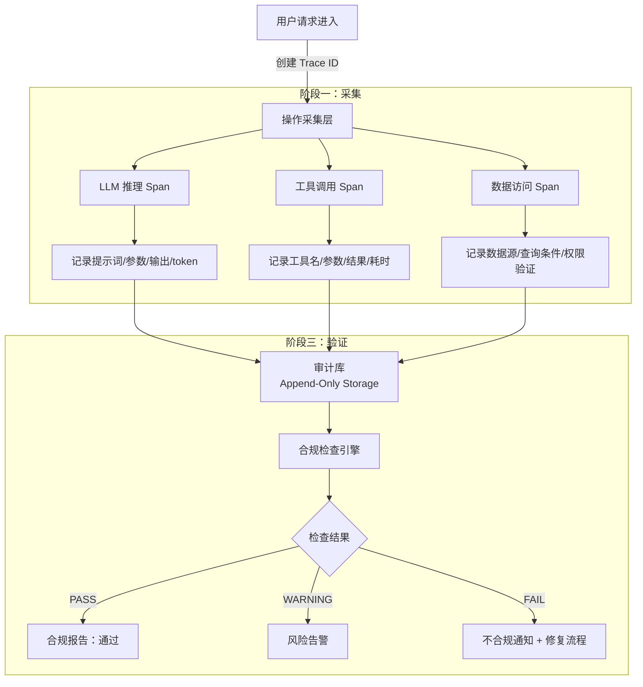
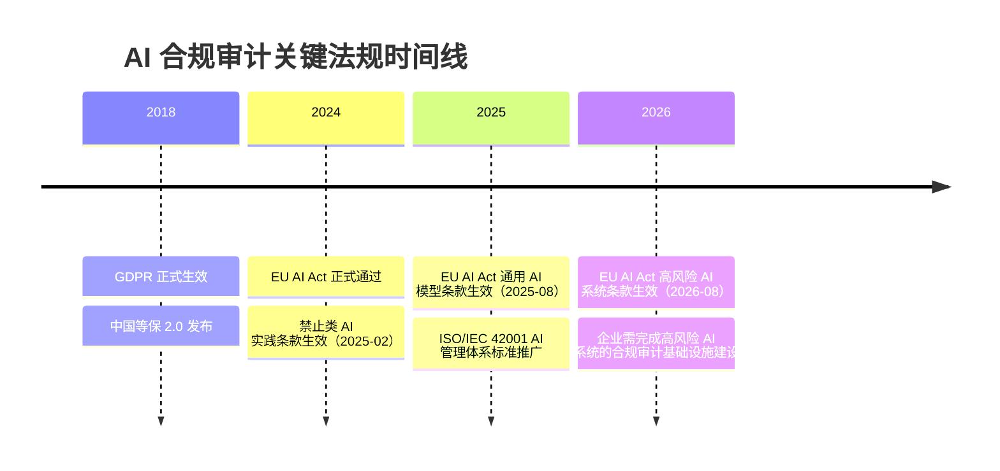

# 合规审计（Compliance Audit）

## 概念解释

合规审计是指对 Agent / AI 系统中的所有关键操作（用户请求、模型推理、工具调用、数据访问、最终输出）进行完整的、可溯源的、不可篡改的记录，并依据特定法规标准定期验证系统行为是否合规的过程。打个比方：它就是给 AI 系统装的"飞机黑匣子"——系统做了什么、为什么做、依据什么信息做，全部记录在案，事后随时可查。

Agent 系统在实验阶段往往只关心"功能跑通没有"。一旦进入生产环境、开始处理真实用户数据或做出影响用户的决策，就会面临三个硬性问题：第一，出了事无法回溯——不知道 Agent 在什么时刻、基于什么信息、做了什么决策；第二，监管机构明确要求对数据处理过程留存可审计记录，违规可被处以高额罚款；第三，当 AI 系统做出有害决策时，无法区分是模型问题、工具问题还是配置问题。

合规审计的核心价值在于：把 Agent 系统从"黑盒决策者"变成"透明、可追溯、可验证的系统"。它不只是满足监管的被动手段，也是问题排查、安全防护和持续改进的主动基础设施。

## 关键结构

合规审计体系由四个关键组成部分协同运作：

| 结构 | 作用 | 说明 |
|------|------|------|
| 操作日志（Operation Logs） | 记录每个关键操作的详细信息 | 审计的原始数据来源，必须不可修改 |
| 分布式追踪（Distributed Tracing） | 关联跨服务的操作链 | 通过 Trace ID / Span ID 串联完整链路 |
| 合规检查引擎（Compliance Checker） | 自动验证操作是否符合法规 | 对照 GDPR、等保 2.0 等标准逐项检查 |
| 审计报告（Audit Report） | 输出可提交给监管机构的证明文件 | 汇总通过/失败统计和关键风险项 |

### 结构 1：操作日志

操作日志是合规审计的基石，记录 Agent 系统中每一个有意义的操作。一条标准的操作日志至少包含以下信息：

- **请求级别**：用户 ID、请求 ID、时间戳、请求内容、来源 IP
- **模型调用**：模型名称与版本、完整提示词、参数配置（temperature 等）、返回结果、token 消耗
- **工具调用**：工具名称、传入参数、返回结果、执行耗时、成功/失败状态
- **数据访问**：访问的数据库或 API、查询条件、返回数据量、权限验证结果

操作日志有三个硬性约束：**完整性**——不能遗漏任何操作，失败的操作比成功的更重要（可能反映越权访问尝试）；**及时性**——必须实时或近实时持久化，不能只存内存；**不可篡改性**——必须存储在 append-only 或 WORM（Write Once, Read Many）介质上，防止事后修改。

### 结构 2：分布式追踪

在 Agent 应用中，一个用户请求往往触发多个服务调用：Agent 推理 -> 搜索工具 -> 数据库查询 -> 通知服务。分布式追踪的作用是把这些散落在不同服务中的日志关联起来，形成一条完整的调用链。

核心机制是两个 ID：

- **Trace ID**：全局唯一标识，代表一次完整的用户请求，从进入到返回的所有操作共享同一个 Trace ID
- **Span ID**：每个操作有自己的 Span ID，通过 Parent Span ID 指向父操作，形成树形结构

标准实现遵循 OpenTelemetry 规范，可对接 Langfuse、Jaeger、Datadog 等可观测性平台。

### 结构 3：合规检查引擎

合规检查引擎是一套自动化规则系统，按照法规要求逐项检查 Agent 系统的行为。典型检查项包括：数据最小化（是否只访问了必要字段）、审计完整性（关键操作是否全部被记录）、数据加密（敏感信息是否加密存储）、访问控制（操作是否在授权范围内）。

这些检查不能只靠人工审计（效率太低，且容易遗漏），必须由软件自动执行并输出可追踪的检查结果。

### 结构 4：审计报告

审计报告是合规审计的最终产出，面向两类受众：内部团队用于发现问题和改进系统，监管机构用于验证企业的合规性。报告通常包含审计周期、检查通过率、关键风险项、修复建议等。

## 核心原理

### 原理说明

合规审计的工作机制可以拆成三个阶段：

**阶段一：采集**。当用户请求进入 Agent 系统时，系统为该请求创建一个唯一的 Trace ID。此后，Agent 的每一步操作（LLM 推理、工具调用、数据访问等）都作为一个 Span 挂在这个 Trace 下，形成完整的调用链。每个 Span 记录操作名称、输入参数、输出结果、起止时间、状态码等关键信息。

**阶段二：存储**。采集到的 Trace 和操作日志被实时写入审计库。审计库的核心设计要求是不可修改——日志一旦写入就不能被删除或篡改。实现方式包括 append-only 数据库表、WORM 存储、或为每条日志附加加密哈希值形成哈希链。

**阶段三：验证**。合规检查引擎定期（或按需）从审计库中读取数据，对照各项法规标准执行自动化检查。检查结果分为 PASS（通过）、WARNING（告警）、FAIL（不合规），汇总后生成审计报告。如果发现 FAIL 项，系统需要立即通知负责人并启动修复流程。

### Mermaid 图解



图中的核心链路：用户请求触发采集层为每个操作创建 Span，所有 Span 写入不可修改的审计库，合规检查引擎从审计库读取数据并执行规则验证。关键点在于审计库的 append-only 特性——它保证了即使系统管理员也无法悄悄删除或修改历史记录。

### 运行示例

以下代码演示了合规审计的核心机制：为 Agent 操作创建追踪、记录日志、执行合规检查。

```python
# 合规审计核心机制演示
# 基于 langfuse==2.x（可选），无 Langfuse 时自动降级为本地日志
import uuid
import json
from datetime import datetime, timezone
from enum import Enum
from typing import Dict, List


# ========== 第一部分：操作日志与追踪 ==========

class AuditLogger:
    """可审计的操作日志记录器"""

    def __init__(self):
        self.logs: List[Dict] = []  # 生产环境应替换为 append-only 存储
        self.trace_id: str = ""

    def start_trace(self, user_id: str, request_content: str) -> str:
        """为一次用户请求创建追踪会话"""
        self.trace_id = str(uuid.uuid4())
        self._append_log(
            operation="user_request",
            input_data={"user_id": user_id, "content": request_content},
            output_data={},
            status="initiated"
        )
        return self.trace_id

    def log_llm_call(self, prompt: str, model: str, response: str,
                     tokens_used: int, duration_ms: int):
        """记录一次 LLM 调用"""
        self._append_log(
            operation="llm_call",
            input_data={"prompt": prompt, "model": model},
            output_data={"response": response, "tokens": tokens_used},
            status="success",
            duration_ms=duration_ms
        )

    def log_tool_call(self, tool_name: str, params: dict,
                      result: dict, status: str, duration_ms: int):
        """记录一次工具调用"""
        self._append_log(
            operation="tool_call",
            input_data={"tool": tool_name, "params": params},
            output_data=result,
            status=status,
            duration_ms=duration_ms
        )

    def log_final_response(self, response: str):
        """记录最终输出"""
        self._append_log(
            operation="final_response",
            input_data={},
            output_data={"response": response},
            status="success"
        )

    def _append_log(self, operation: str, input_data: dict,
                    output_data: dict, status: str, duration_ms: int = 0):
        """写入一条不可修改的日志（生产环境应写入 append-only 存储）"""
        entry = {
            "log_id": str(uuid.uuid4()),
            "trace_id": self.trace_id,
            "operation": operation,
            "input": input_data,
            "output": output_data,
            "status": status,
            "duration_ms": duration_ms,
            "timestamp": datetime.now(timezone.utc).isoformat(),
        }
        self.logs.append(entry)

    def get_trace_logs(self) -> List[Dict]:
        """获取当前 Trace 的所有日志"""
        return [log for log in self.logs if log["trace_id"] == self.trace_id]


# ========== 第二部分：合规检查引擎 ==========

class CheckResult(Enum):
    PASS = "pass"
    WARNING = "warning"
    FAIL = "fail"

class ComplianceChecker:
    """合规检查引擎：对照法规标准逐项验证"""

    def check_audit_completeness(self, logs: List[Dict]) -> Dict:
        """检查审计日志完整性——所有关键操作是否都被记录"""
        required_ops = {"user_request", "llm_call", "tool_call", "final_response"}
        recorded_ops = {log["operation"] for log in logs}
        missing = required_ops - recorded_ops
        if missing:
            return {"check": "audit_completeness", "result": CheckResult.FAIL.value,
                    "detail": f"缺少操作日志: {missing}"}
        return {"check": "audit_completeness", "result": CheckResult.PASS.value,
                "detail": "所有关键操作均已记录"}

    def check_data_minimization(self, accessed: List[str],
                                required: List[str]) -> Dict:
        """检查数据最小化——是否只访问了必要字段"""
        unnecessary = set(accessed) - set(required)
        if unnecessary:
            return {"check": "data_minimization", "result": CheckResult.WARNING.value,
                    "detail": f"访问了不必要的字段: {unnecessary}"}
        return {"check": "data_minimization", "result": CheckResult.PASS.value,
                "detail": "符合数据最小化原则"}

    def check_access_control(self, accessed_resources: List[str],
                             user_permissions: List[str]) -> Dict:
        """检查访问控制——操作是否在授权范围内"""
        unauthorized = set(accessed_resources) - set(user_permissions)
        if unauthorized:
            return {"check": "access_control", "result": CheckResult.FAIL.value,
                    "detail": f"越权访问: {unauthorized}"}
        return {"check": "access_control", "result": CheckResult.PASS.value,
                "detail": "访问权限检查通过"}

    def run_audit(self, logs: List[Dict], context: Dict) -> Dict:
        """执行完整合规审计，返回审计报告"""
        checks = [
            self.check_audit_completeness(logs),
            self.check_data_minimization(
                context.get("accessed_fields", []),
                context.get("required_fields", [])
            ),
            self.check_access_control(
                context.get("accessed_resources", []),
                context.get("user_permissions", [])
            ),
        ]
        results = [c["result"] for c in checks]
        if CheckResult.FAIL.value in results:
            overall = "FAILED"
        elif CheckResult.WARNING.value in results:
            overall = "WARNING"
        else:
            overall = "PASSED"

        return {
            "audit_id": str(uuid.uuid4()),
            "trace_id": logs[0]["trace_id"] if logs else "",
            "timestamp": datetime.now(timezone.utc).isoformat(),
            "checks": checks,
            "overall": overall,
        }


# ========== 使用示例 ==========

# 1. 记录操作
logger = AuditLogger()
trace_id = logger.start_trace("user-001", "查询我的账户余额")
logger.log_llm_call(
    prompt="用户想查余额，判断是否需要调用数据库",
    model="gpt-4o", response="需要调用 query_balance 工具",
    tokens_used=120, duration_ms=350
)
logger.log_tool_call(
    tool_name="query_balance", params={"user_id": "user-001"},
    result={"balance": 5000.0, "currency": "CNY"},
    status="success", duration_ms=80
)
logger.log_final_response("您的账户余额为 5000.00 元")

# 2. 执行合规检查
checker = ComplianceChecker()
report = checker.run_audit(
    logs=logger.get_trace_logs(),
    context={
        "accessed_fields": ["user_id", "balance"],
        "required_fields": ["user_id", "balance"],
        "accessed_resources": ["read_balance"],
        "user_permissions": ["read_balance"],
    }
)
print(json.dumps(report, indent=2, ensure_ascii=False))
# overall: "PASSED" —— 所有检查项通过
```

代码对应的核心机制：`AuditLogger` 负责采集阶段，为每个操作创建带 Trace ID 的日志条目；`ComplianceChecker` 负责验证阶段，对照法规要求逐项检查。生产环境中 `self.logs` 应替换为 append-only 数据库或对接 Langfuse 等可观测性平台。

## 易混概念辨析

| 概念 | 与合规审计的区别 | 更适合关注的重点 |
|------|-----------------|-----------------|
| 可观测性（Observability） | 可观测性关注系统运行状态的实时监控（延迟、错误率、吞吐量），合规审计关注操作记录的合法性与可溯源性 | 系统健康度和性能瓶颈 |
| 日志监控（Log Monitoring） | 日志监控侧重实时告警和异常检测，合规审计侧重事后回溯和法规验证 | 异常检测和实时响应 |
| 安全审计（Security Audit） | 安全审计聚焦漏洞和攻击面评估，合规审计聚焦操作记录是否满足法规要求 | 攻防对抗和漏洞修复 |

核心区别：

- **合规审计**：核心关注点是"操作有据可查、行为符合法规"，面向监管机构和法律合规
- **可观测性**：核心关注点是"系统此刻是否正常运转"，面向开发和运维团队
- **安全审计**：核心关注点是"系统是否能抵御攻击"，面向安全团队

三者在实现上有大量重叠（都依赖日志和追踪），但服务目标和受众不同。

## 适用边界与局限

### 适用场景

1. **受监管行业的 AI 应用**：金融风控、医疗辅助诊断、保险定价等场景，法规明确要求对 AI 决策过程留存审计记录。例如 EU AI Act 将这些归为高风险 AI 系统，2026 年 8 月起要求全面合规
2. **处理个人数据的 Agent 系统**：只要 Agent 访问或处理用户的个人信息，GDPR、等保 2.0 等均要求记录数据处理过程，并在用户行使"数据导出权"或"遗忘权"时能追溯处理链路
3. **企业内部 AI 治理**：大型企业部署内部 Agent 工具时，需要追踪员工如何使用 AI 系统、是否存在数据越权访问，防止内部安全事件
4. **多 Agent 协作系统**：当多个 Agent 协作完成任务时，分布式追踪能清晰还原每个 Agent 的决策和行为，便于责任划分

### 不适合的场景

1. **纯本地实验或原型阶段**：如果系统还未接触真实用户数据，投入完整的合规审计基础设施性价比过低，简单的日志打印即可
2. **对延迟极度敏感的实时系统**：完整的审计记录会引入额外的序列化和 I/O 开销，对毫秒级延迟要求的场景（如高频交易）需要权衡采集粒度

### 局限性

1. **性能开销**：每个操作都要序列化、传输、持久化，高并发场景下审计系统本身可能成为瓶颈。需要通过异步写入、批量提交、采样策略等手段缓解
2. **隐私悖论**：为了证明合规而记录的审计日志本身可能包含敏感数据（如用户的医疗信息、提示词中的个人隐私），日志存储本身也需要合规管理
3. **法规多样性**：GDPR、等保 2.0、HIPAA、EU AI Act 的要求各不相同，甚至可能冲突（如 GDPR 的"遗忘权"与审计日志的"不可删除"之间的矛盾），跨地区运营的企业需要设计差异化的合规策略

## 常见误区

| 常见误区 | 正确理解 |
|----------|----------|
| 只记录成功操作，失败的不用管 | 失败的操作往往更重要——它可能反映越权访问尝试、系统漏洞或数据一致性问题。审计日志必须覆盖所有操作，包括失败和异常 |
| 审计日志存在普通数据库表里就够了 | 普通表可以被 UPDATE/DELETE，恶意行为者可以修改日志掩盖痕迹。审计日志必须存储在 append-only 或 WORM 介质中，或使用哈希链保证完整性 |
| 只记录最终输出，中间推理过程不需要 | Agent 的中间步骤（每一次 LLM 推理、工具调用）才是问题诊断和责任划分的关键。只看最终输出无法定位错误源头 |
| 做一次审计就完事了 | 合规是持续过程。需要定期（每周或每月）自动执行审计检查，而不是等到监管机构来查时才临时应对 |

## 当前法规环境速览



主要法规对 Agent 系统的审计要求汇总：

| 法规 | 适用范围 | 对 Agent 审计的核心要求 | 违规后果 |
|------|---------|----------------------|---------|
| EU AI Act | 在欧盟部署或影响欧盟用户的 AI 系统 | 高风险 AI 系统必须实现自动日志记录、可追溯性、人类监督机制 | 最高 3500 万欧元或全球营收 7% |
| GDPR | 处理欧盟居民个人数据的组织 | 数据处理透明性、用户同意管理、数据导出权、遗忘权 | 最高 2000 万欧元或全球营收 4% |
| 等保 2.0 | 中国境内的信息系统 | 操作日志不可修改、访问控制、数据加密、安全审计 | 行政处罚 + 业务停顿风险 |
| HIPAA | 处理美国患者健康信息的组织 | 审计控制、访问日志、数据加密、最小权限原则 | 最高 200 万美元/年 |
| ISO/IEC 42001 | 自愿采纳的 AI 管理体系标准 | AI 风险管理、AI 系统生命周期文档化、持续监控 | 无强制处罚，但影响商业信任 |

## 思考题

<details>
<summary>初级：合规审计中的 Trace ID 和 Span ID 分别起什么作用？为什么需要两个 ID 而不是一个？</summary>

**参考答案：**

Trace ID 是全局唯一标识符，代表一次完整的用户请求，从进入系统到返回结果的所有操作共享同一个 Trace ID。Span ID 是每个操作的唯一标识，通过 Parent Span ID 指向父操作，形成树形结构。

需要两个 ID 的原因：Trace ID 用于"横向关联"——把属于同一个请求的所有操作串起来；Span ID + Parent Span ID 用于"纵向分层"——还原操作之间的父子和先后关系。只有一个 ID 的话，只能知道哪些操作属于同一请求，但无法还原操作之间的层级结构和因果关系。

</details>

<details>
<summary>中级：GDPR 的"遗忘权"要求企业在用户请求时删除其个人数据，但合规审计要求日志不可删除。这两个要求冲突吗？实际中如何处理？</summary>

**参考答案：**

确实存在表面上的冲突。实际处理方式通常有三种：第一，在审计日志中对个人数据进行匿名化或伪匿名化处理（如将用户 ID 替换为不可逆的哈希值），这样日志本身不包含可识别的个人信息，删除用户数据时无需修改日志；第二，将审计日志中的个人数据与审计元数据分离存储，删除个人数据时只删除可识别部分，保留审计轨迹；第三，依据 GDPR 第 17 条第 3 款的例外条款，当保留数据是为了"公共利益的存档目的"或"法律义务"时，可以合理保留必要的审计记录。最佳实践是从设计阶段就采用匿名化策略，从源头避免冲突。

</details>

<details>
<summary>中级/进阶：你负责一个跨中欧两地运营的 AI 客服系统，需要同时满足 GDPR 和等保 2.0。请设计一个差异化合规检查方案的核心思路。</summary>

**参考答案：**

核心思路是"基线 + 差异化叠加"：首先建立一个满足两者共同要求的基线（操作日志记录、数据加密、访问控制、审计完整性），然后根据用户所在地区叠加差异化规则。具体实现：在请求入口根据用户地区标记合规标签（如 region=EU 或 region=CN），合规检查引擎根据标签加载对应的规则集。对欧盟用户额外检查同意管理、数据导出权、遗忘权相关记录；对中国用户额外检查等保 2.0 要求的安全审计日志格式、网络安全事件报告机制等。当两套规则冲突时（如遗忘权 vs 日志保留），采用匿名化方案从源头化解。审计报告也需按地区分别生成，满足各地监管机构的格式要求。

</details>

## 参考资料

1. European Commission. "Regulation (EU) 2024/1689 - Artificial Intelligence Act." Official Journal of the European Union. https://eur-lex.europa.eu/eli/reg/2024/1689/oj
2. European Commission. "General Data Protection Regulation (GDPR)." https://eur-lex.europa.eu/eli/reg/2016/679/oj
3. 中国公安部. "GB/T 22239-2019 信息安全技术 网络安全等级保护基本要求." https://www.gb688.cn/gbstandards/contentDetail?Id=171309
4. OpenTelemetry. "OpenTelemetry Documentation - Traces." https://opentelemetry.io/docs/concepts/signals/traces/
5. Langfuse. "LLM Observability & Tracing." https://langfuse.com/docs
6. ISO/IEC. "ISO/IEC 42001:2023 - Artificial Intelligence Management System." https://www.iso.org/standard/81230.html
7. NIST. "AI Risk Management Framework (AI RMF 1.0)." https://www.nist.gov/artificial-intelligence/executive-order-safe-secure-and-trustworthy-artificial-intelligence
