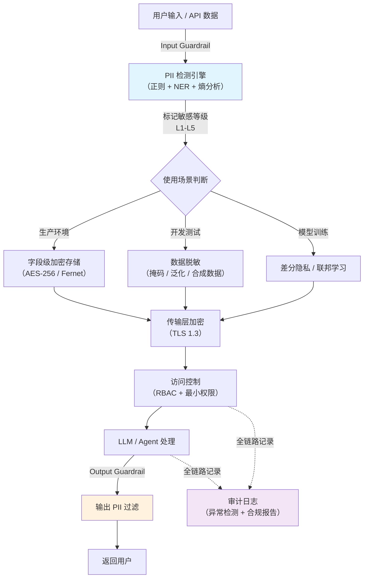

# 数据安全（Data Security）

## 概念解释

数据安全是指在 AI 系统的整个数据生命周期中，对敏感数据进行识别、分类、保护和监控的一套系统性工程实践。在 Agent 应用中，这个概念的覆盖面比传统 Web 应用更大——不仅涉及数据库和网络传输，还涉及 Prompt 输入、模型训练数据、上下文窗口中的 PII（Personally Identifiable Information，个人身份信息）泄露，以及 LLM 输出中的敏感信息残留。

数据安全之所以在 AI 时代变得更加紧迫，原因有两层。第一层是传统风险放大：LLM 需要消费海量数据进行训练和推理，数据暴露面比传统应用大几个数量级。第二层是 AI 特有风险：Prompt 注入（Prompt Injection）可能诱导模型吐出训练数据中的隐私信息，模型本身可能"记住"并在推理时泄露训练集中的 PII，这些是传统数据安全体系没有覆盖的攻击面。

与传统"加个防火墙 + 数据库加密"的做法相比，AI 场景下的数据安全需要在三个新维度上扩展防护：输入侧（用户 Prompt 中的 PII 检测和过滤）、模型侧（训练数据脱敏、差分隐私、联邦学习）、输出侧（LLM 输出内容的敏感信息拦截）。这三个维度加上传统的存储和传输加密，构成了 AI 数据安全的完整防护面。

## 关键结构

AI 系统的数据安全防护可以按"五层纵深防御"来理解：

| 防护层 | 作用 | 说明 |
|--------|------|------|
| 识别层 | 发现敏感数据在哪里 | 自动扫描数据库、文件、Prompt 日志，标记 PII 和敏感字段 |
| 脱敏层 | 在不影响业务的前提下隐藏敏感信息 | 掩码、泛化、差分隐私、合成数据替换 |
| 加密层 | 即使数据被窃取也无法解读 | 字段级加密、传输层 TLS、密钥管理 |
| 访问控制层 | 限制谁能在什么条件下接触数据 | RBAC、最小权限、零信任验证 |
| 审计监控层 | 事后追溯和实时告警 | 操作日志、异常检测、合规报告 |

### 识别层：知道敏感数据在哪里

整个防护体系的起点。如果不知道哪些数据是敏感的，后续所有保护都是盲目的。识别层的工作包括：用正则表达式匹配结构化 PII（身份证号、手机号、银行卡号），用 NER（Named Entity Recognition，命名实体识别）模型检测非结构化文本中的人名、地址、医疗信息，以及用统计学方法（熵分析）发现高熵字段（如密码、密钥）。

在 AI 应用中，识别层还需要覆盖一个传统安全容易忽略的场景：Prompt 日志和模型输入输出中的 PII。用户可能在与 Agent 对话时无意间输入身份证号或病历信息，如果这些内容被原样写入日志或用于模型微调，就构成了隐私泄露。

### 脱敏层：让敏感数据"不可读但可用"

脱敏的核心目标是在保留数据分析价值的前提下，消除个人身份的可识别性。四种主要方法：

| 脱敏方法 | 原始值 | 脱敏后 | 适用场景 |
|----------|--------|--------|----------|
| 掩码（Masking） | `13812345678` | `138****5678` | 展示、客服验证 |
| 泛化（Generalization） | `35岁` | `30-40岁` | 统计分析、报表 |
| 加密脱敏（Tokenization） | `110101199001011234` | `TKN_8f3a2b` | 需要可逆恢复的场景 |
| 差分隐私（Differential Privacy） | 精确统计值 | 加噪后统计值 | 模型训练、聚合查询 |

### 加密层：最后一道物理防线

即使攻击者突破了前两层拿到了数据，加密确保数据无法被解读。加密分三个粒度：全磁盘加密（防设备被盗）、数据库透明加密 TDE（防数据库文件泄露）、字段级加密（只加密敏感字段，性能最优但实现最复杂）。传输层使用 TLS 1.3 加密，它比 TLS 1.2 减少了一次握手往返并移除了已知不安全的加密套件。

### 访问控制层：谁能碰什么数据

基于 RBAC（Role-Based Access Control，基于角色的访问控制）和最小权限原则，确保"只有被授权的人，在被授权的时间，访问被授权的数据"。在 AI 系统中，这一层还需要覆盖 Agent 本身的权限——一个有工具调用（Tool Use）能力的 Agent 不应该有权访问所有数据库表。

### 审计监控层：假设泄露一定会发生

记录所有敏感数据访问操作，建立行为基线，检测异常（如凌晨 3 点批量导出用户表）。完整的审计日志是事件调查和合规证明的基础。

## 核心原理

### 原理说明

AI 系统的数据安全运转遵循一条"数据流过每一站都被检查和处理"的链路：

1. **数据进入系统**：用户输入 Prompt 或数据通过 API 进入，输入侧 Guardrail（护栏）对内容进行 PII 扫描
2. **PII 检测与分类**：识别引擎用正则表达式 + NER 模型扫描数据，将敏感字段标记为不同等级（L1 公开到 L5 绝密）
3. **脱敏或加密决策**：根据数据的使用场景自动选择防护策略——生产环境用加密存储，开发测试用脱敏替换，模型训练用差分隐私
4. **存储和传输保护**：数据落库时字段级加密，跨网络时 TLS 1.3 加密传输
5. **访问控制验证**：每次读取敏感数据都验证调用方身份和权限，Agent 的工具调用也受权限约束
6. **输出侧过滤**：LLM 的输出经过 Output Guardrail 检查，拦截可能包含的 PII 或训练数据泄露
7. **审计记录**：全链路操作写入审计日志，异常行为触发告警

这条链路的关键设计原则是"纵深防御"（Defense in Depth）——任何单一防护层被突破，后续层仍然能提供保护。

### Mermaid 图解



整条链路有三个最容易被忽视的节点：

- **Input Guardrail**（蓝色）：大多数团队只在数据库层面做加密，忘了用户 Prompt 也是敏感数据的入口
- **Output Guardrail**（橙色）：LLM 可能在回答中泄露训练数据中的 PII，必须在输出侧拦截
- **审计日志**（紫色）：不只是"合规需要"，更是安全事件调查时唯一可靠的证据源

### 运行示例

以下代码演示 AI 应用中数据安全的两个核心机制：PII 检测和自动脱敏。

```python
# 基于 Python 3.10+ 标准库，无需额外安装
import re
from dataclasses import dataclass
from enum import Enum
from typing import List, Tuple


class SensitivityLevel(Enum):
    """数据敏感度等级"""
    L1_PUBLIC = "公开"
    L3_SENSITIVE = "敏感"
    L4_HIGHLY_SENSITIVE = "高度敏感"
    L5_TOP_SECRET = "绝密"


@dataclass
class PIIEntity:
    """检测到的 PII 实体"""
    text: str           # 原始文本
    pii_type: str       # PII 类型
    position: Tuple[int, int]  # 起止位置
    level: SensitivityLevel    # 敏感等级


class PIIDetector:
    """PII 检测引擎：正则 + 关键字双层扫描"""

    PATTERNS = {
        "身份证号": (
            r'\b\d{17}[\dX]\b',
            SensitivityLevel.L5_TOP_SECRET
        ),
        "手机号": (
            r'\b1[3-9]\d{9}\b',
            SensitivityLevel.L4_HIGHLY_SENSITIVE
        ),
        "邮箱": (
            r'[a-zA-Z0-9._%+-]+@[a-zA-Z0-9.-]+\.[a-zA-Z]{2,}',
            SensitivityLevel.L3_SENSITIVE
        ),
        "银行卡号": (
            r'\b\d{16,19}\b',
            SensitivityLevel.L5_TOP_SECRET
        ),
    }

    def detect(self, text: str) -> List[PIIEntity]:
        """扫描文本，返回所有检测到的 PII 实体"""
        entities = []
        for pii_type, (pattern, level) in self.PATTERNS.items():
            for match in re.finditer(pattern, text):
                entities.append(PIIEntity(
                    text=match.group(),
                    pii_type=pii_type,
                    position=(match.start(), match.end()),
                    level=level,
                ))
        return entities


class PIIMasker:
    """PII 脱敏器：根据类型自动选择脱敏策略"""

    MASK_RULES = {
        "身份证号": lambda v: f"{v[:6]}********{v[-4:]}",
        "手机号":   lambda v: f"{v[:3]}****{v[-4:]}",
        "邮箱":     lambda v: f"{v[0]}***@{v.split('@')[1]}" if '@' in v else "***",
        "银行卡号": lambda v: f"{v[:4]} **** **** {v[-4:]}",
    }

    def mask_text(self, text: str, entities: List[PIIEntity]) -> str:
        """将检测到的 PII 替换为脱敏值（从后向前替换避免索引偏移）"""
        result = text
        for entity in sorted(entities, key=lambda e: e.position[0], reverse=True):
            rule = self.MASK_RULES.get(entity.pii_type)
            if rule:
                start, end = entity.position
                result = result[:start] + rule(entity.text) + result[end:]
        return result


# --- 模拟 Agent 应用中的 Input Guardrail ---
user_prompt = "帮我查一下张三的信息，身份证号110101199501011234，手机13912345678"

detector = PIIDetector()
masker = PIIMasker()

# 第一步：检测 PII
found = detector.detect(user_prompt)
for e in found:
    print(f"[检测] {e.pii_type}（{e.level.value}）: {e.text}")

# 第二步：脱敏后再送入 LLM
safe_prompt = masker.mask_text(user_prompt, found)
print(f"\n原始输入: {user_prompt}")
print(f"脱敏输入: {safe_prompt}")
# 脱敏后的 safe_prompt 才会被传入 LLM，避免 PII 进入模型上下文
```

代码对应数据安全链路中"Input Guardrail"阶段的核心机制。`PIIDetector` 承担识别层职责，`PIIMasker` 承担脱敏层职责。生产环境中检测引擎通常会扩展为正则 + NER 模型 + LLM-Guard 等多级方案，脱敏策略也会根据敏感等级动态调整（L3 用掩码，L5 用加密令牌化）。

## 易混概念辨析

| 概念 | 与数据安全的区别 | 更适合关注的重点 |
|------|------------------|------------------|
| 信息安全（Information Security） | 信息安全是更大的范畴，包含网络安全、物理安全、人员安全等，数据安全只是其子集 | 组织整体安全治理体系 |
| 隐私保护（Privacy Protection） | 隐私保护关注"个人权利"（用户知情权、删除权），数据安全关注"技术防护手段" | 法律合规、用户权利保障 |
| 访问控制（Access Control） | 访问控制只是数据安全五层防护中的一层，不等于完整的数据安全 | 身份认证、权限管理 |
| AI 安全（AI Safety） | AI 安全的范围更广，包含对齐、幻觉、偏见等问题，数据安全只聚焦数据本身的保护 | 模型行为的安全性和可控性 |

核心区别：

- **数据安全**：聚焦"敏感数据在技术层面如何不被泄露、篡改、滥用"
- **隐私保护**：聚焦"个人数据主体的权利如何被尊重和保障"
- **AI 安全**：聚焦"AI 系统整体行为是否安全可控"

## 适用边界与局限

### 适用场景

1. **处理用户 PII 的 AI 应用**：聊天机器人、客服 Agent、医疗问诊系统等直接接触用户敏感信息的场景，必须在输入输出两端做 PII 过滤
2. **模型训练数据准备**：用真实业务数据训练或微调模型前，必须经过脱敏或差分隐私处理，否则模型可能在推理时"复述"训练数据中的隐私
3. **多租户 SaaS 平台**：不同客户的数据共存于同一基础设施中，必须通过加密和访问控制实现严格的租户隔离
4. **跨境数据传输**：受 GDPR、中国《数据安全法》等法规约束的国际化业务，需要在传输前对数据进行加密和脱敏

### 不适合的场景

1. **纯公开数据的处理**：如果 AI 系统只处理公开可获取的信息（天气数据、公开新闻），投入完整的数据安全体系成本收益比不合理
2. **对延迟极度敏感的实时系统**：在线游戏的毫秒级决策场景中，实时加解密和 PII 扫描带来的延迟可能不可接受

### 局限性

1. **性能开销不可消除**：字段级加密和实时 PII 扫描都会增加 CPU 和 I/O 负担。在大规模数据场景中，加密可能使查询延迟增加 10%-30%，这需要在安全性和性能之间做取舍
2. **脱敏后数据可用性下降**：过度脱敏会导致数据失去分析价值，而脱敏不足则存在"准标识符攻击"风险（多个看似无关的脱敏字段组合后仍可识别个人）
3. **AI 特有风险难以完全消除**：即使做了训练数据脱敏，LLM 仍可能通过上下文推理还原出部分敏感信息，这是当前研究的开放问题
4. **密钥管理是单点风险**：加密的安全性最终依赖密钥的安全。如果密钥泄露，所有加密数据等同于明文。密钥管理需要专用硬件（HSM）支撑，成本高

## 常见误区

| 常见误区 | 正确理解 |
|----------|----------|
| "数据库加了密就安全了" | 加密只是五层防护之一。如果密钥硬编码在源码中，或者应用层存在 SQL 注入漏洞，攻击者可以绕过加密直接读取明文数据。完整防护需要五层协同 |
| "脱敏后的数据可以随意分享" | 脱敏降低了风险但不等于零风险。"30-40岁 + 北京朝阳区 + 某罕见病"这样的准标识符组合仍可能定位到个人。脱敏数据同样需要访问控制 |
| "AI 应用的数据安全和传统应用一样处理就行" | AI 应用有三个新攻击面：Prompt 注入诱导模型泄露数据、训练数据中的 PII 被模型"记住"、Agent 工具调用可能越权访问数据。这些需要 Input/Output Guardrail 和模型层面的防护 |
| "合规 = 安全" | 通过合规审计只能证明满足了最低标准，不代表系统不会被攻破。OWASP LLM Top 10（2025 版）中的"敏感信息泄露"排在第六位，即使合规的系统也可能存在此类风险 |

## 思考题

<details>
<summary>初级：AI 系统中的数据安全为什么不能只靠"数据库加密"来解决？</summary>

**参考答案：**

AI 系统的数据暴露面远大于传统应用。除了数据库存储这一环节，还有至少三个位置存在敏感数据泄露风险：用户输入的 Prompt 可能包含 PII，LLM 的输出可能泄露训练数据中的隐私，Agent 的工具调用日志可能记录了敏感操作参数。数据库加密只保护了"静态数据"，而 AI 系统中的数据在输入、处理、输出的每个环节都需要对应的防护措施（Input Guardrail、差分隐私训练、Output Guardrail 等）。

</details>

<details>
<summary>中级：一家医疗 AI 公司要用真实病历数据微调诊断模型，如何在保护患者隐私的前提下完成训练？</summary>

**参考答案：**

方案分三层：第一层是数据预处理，用 NER 模型识别病历中的患者姓名、身份证号、联系方式等直接标识符并进行脱敏（替换为合成值），同时对年龄、地址等准标识符进行泛化处理。第二层是训练过程保护，采用差分隐私（Differential Privacy）机制，在梯度更新时注入校准噪声，使模型无法"记住"单条训练样本。如果病历数据分散在多家医院，还可以用联邦学习（Federated Learning）方案，模型在各医院本地训练，只传递梯度聚合结果而非原始数据。第三层是训练后验证，用成员推理攻击（Membership Inference Attack）测试模型是否能判断某条病历是否在训练集中，确认隐私保护的有效性。

</details>

<details>
<summary>中级/进阶：某企业的 Agent 应用允许用户通过自然语言查询内部数据库，如何设计数据安全方案防止用户通过 Prompt 注入获取未授权数据？</summary>

**参考答案：**

防护需要在四个层面展开。输入层：部署 Prompt Injection 检测器（如 LLM-Guard 或 NeMo Guardrails），识别并拦截试图绕过权限的恶意 Prompt。Agent 权限层：Agent 的数据库访问权限严格绑定到当前用户的 RBAC 角色，即使 Prompt 注入成功改变了 Agent 的"意图"，底层 SQL 查询仍然受权限约束（参数化查询 + 行级安全策略）。输出层：LLM 的回答在返回用户前经过 Output Guardrail 检查，拦截包含其他用户 PII 或超出授权范围的数据。审计层：所有查询请求和 Agent 生成的 SQL 都写入审计日志，建立基线模型检测异常查询模式（如单用户短时间内查询大量不同用户的数据），触发告警和自动限流。

</details>

## 参考资料

1. OWASP Top 10 for LLM Applications (2025)：[https://owasp.org/www-project-top-10-for-large-language-model-applications/](https://owasp.org/www-project-top-10-for-large-language-model-applications/)
2. LLM Guard - 开源 LLM 安全工具包：[https://github.com/protectai/llm-guard](https://github.com/protectai/llm-guard)
3. NVIDIA NeMo Guardrails - LLM 可编程护栏：[https://github.com/NVIDIA/NeMo-Guardrails](https://github.com/NVIDIA/NeMo-Guardrails)
4. OpenGuardrails 论文（2025）- 统一 LLM 安全平台：[https://arxiv.org/abs/2510.19169](https://arxiv.org/abs/2510.19169)
5. 阿里云动态脱敏功能配置与使用详解：[https://help.aliyun.com/zh/maxcompute/security-and-compliance/dynamic-data-masking](https://help.aliyun.com/zh/maxcompute/security-and-compliance/dynamic-data-masking)
6. Azure Key Vault 托管 HSM 密钥管理：[https://learn.microsoft.com/zh-cn/azure/key-vault/managed-hsm/mhsm-control-data](https://learn.microsoft.com/zh-cn/azure/key-vault/managed-hsm/mhsm-control-data)
