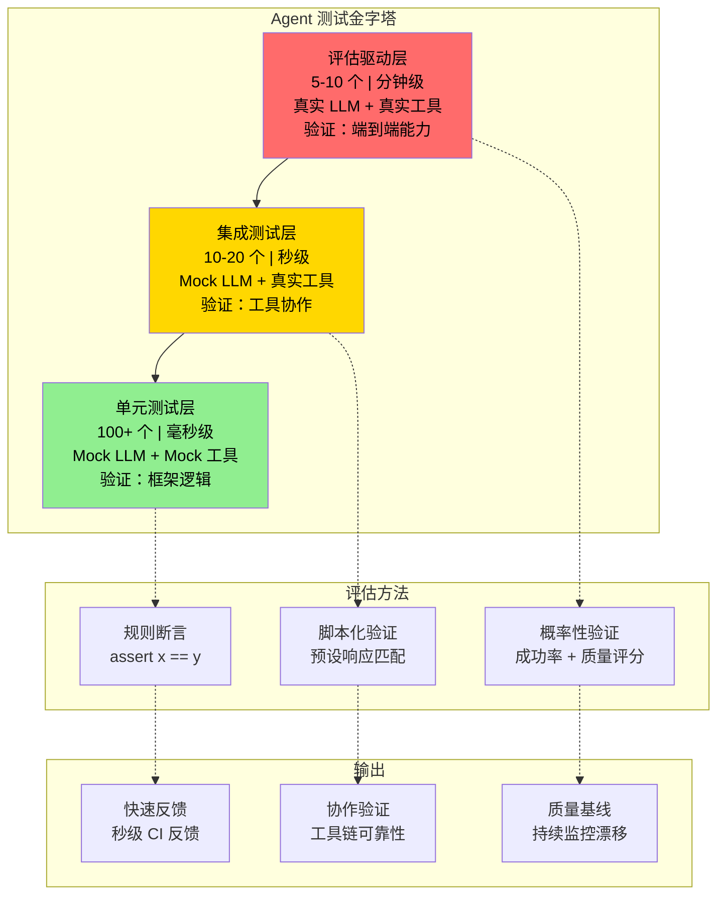
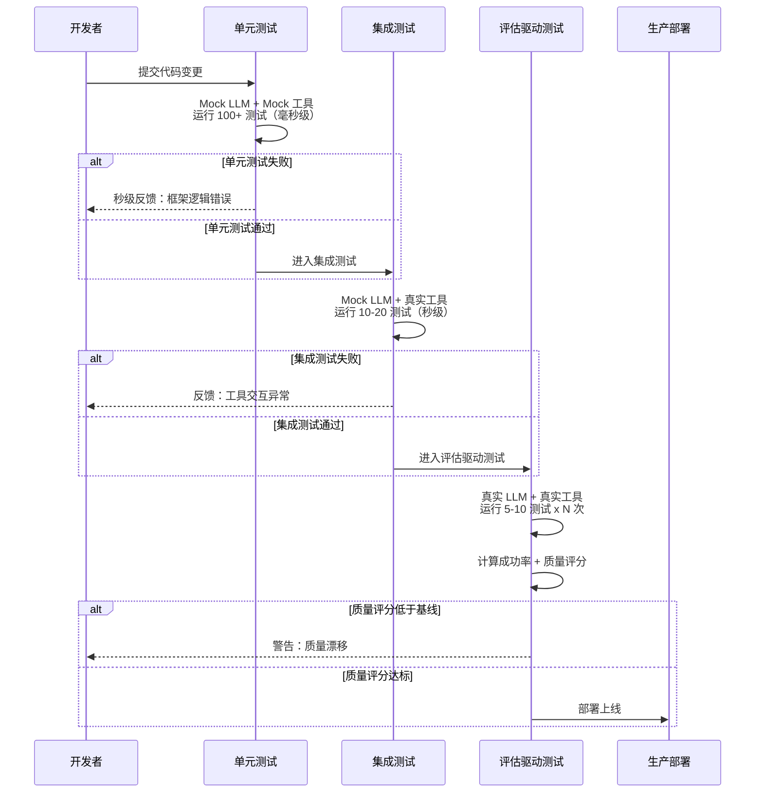

# Agent 测试金字塔（Testing Pyramid for AI Agents）

## 概念解释

Agent 测试金字塔是一种专门为 LLM Agent 设计的分层测试框架。它借鉴了传统软件工程中"测试金字塔"的分层思想——底层多、顶层少、成本从低到高递增——但针对 Agent 的非确定性（Non-deterministic）行为做了根本性的改造：用概率性验证（Probabilistic Validation）替代精确断言，用质量评分替代简单的通过/失败判定。

传统软件测试建立在一个前提上：相同输入必然产生相同输出。但 LLM Agent 天然违反了这个假设。同一个问题问两次，Agent 可能选择不同的工具、走不同的推理路径、甚至给出措辞不同但都正确的答案。如果继续沿用传统的 `assert result == expected` 方式，大量测试会因为"答案正确但格式不同"而误报失败。

Agent 测试金字塔的核心策略是：把 Agent 系统拆成"确定性部分"和"非确定性部分"，对确定性部分（工具调用逻辑、状态管理、错误处理）用传统单元测试覆盖；对非确定性部分（LLM 推理输出、多路径求解），则用多次运行取成功率、用自动评估器打分等方式来衡量质量。

## 关键结构

Agent 测试金字塔由三层组成，从底到顶依次为单元测试层、集成测试层和评估驱动层。三层在数量、成本、验证对象上形成互补关系。

| 层级 | 数量规模 | 运行成本 | 验证对象 | Mock 策略 |
|------|----------|----------|----------|-----------|
| 单元测试层 | 100+ 个 | 毫秒级，零 API 费用 | Agent 框架代码的确定性逻辑 | Mock LLM + Mock 工具 |
| 集成测试层 | 10-20 个 | 秒级，少量工具调用费用 | Agent 与真实工具的协作 | Mock LLM + 真实工具 |
| 评估驱动层 | 5-10 个 | 分钟级，真实 API 费用 | Agent 端到端任务完成能力 | 真实 LLM + 真实工具 |

### 单元测试层（Unit Tests）

金字塔的基座。它只测 Agent 代码本身的确定性逻辑，完全不调用真实 LLM。具体包括：

- **工具调用解析**：Agent 能否正确从 LLM 返回的文本中提取工具名和参数。
- **状态转换**：循环计数器、对话历史指针、内存管理等状态是否正确流转。
- **约束执行**：最大迭代次数限制、Token 上限、工具黑名单等规则是否被严格遵守。
- **错误降级**：工具超时、返回异常数据、网络中断等故障场景下 Agent 是否能优雅处理。

因为用 Mock 对象（如 `MockLanguageModel`）替代了真实 LLM，每个测试的返回值完全可控，运行速度在毫秒级。

### 集成测试层（Integration Tests）

金字塔的中层。LLM 仍然用 Mock（返回预设的脚本化响应），但工具是真实的——真实的数据库查询、真实的 API 调用、真实的文件操作。这层重点验证：

- **工具交互的正确性**：Agent 能否正确调用数据库、解析 JSON 返回值、处理分页数据。
- **多步工作流**：Agent 在多轮工具调用之间能否维持上下文，构建完整的推理链。
- **异常传播**：真实工具返回错误码或不规范数据时，Agent 的处理是否合理。

由于 LLM 行为被脚本化控制，集成测试的行为仍然是确定的、可重复的。

### 评估驱动层（Evaluation-Driven Tests）

金字塔的顶层。这里调用真实的 LLM API、真实的工具，让 Agent 自主完成端到端的任务。由于 LLM 调用成本高且响应带有随机性，这层测试数量最少但价值最大。关键特征：

- **概率性判定**：同一测试运行 N 次（通常 N >= 10），统计成功率，而非依赖单次结果。
- **自动评估器**：用 LLM-as-a-Judge、规则检查、向量相似度等方式自动评分，避免人工逐条审阅。
- **质量基线监控**：建立评分基线后持续运行，一旦分数下降就触发告警，捕捉质量漂移（Quality Drift）。

## 核心原理

### 原理说明

Agent 测试金字塔的核心机制可以从两个维度理解：

**维度一：确定性分离**。把 Agent 系统拆成两部分：确定性部分（代码逻辑）和非确定性部分（LLM 输出）。底层和中层只测确定性部分，成本低、速度快、结果稳定；顶层才碰非确定性部分，用统计方法应对随机性。

**维度二：从精确断言到质量评分**。传统测试的判定是二值的——通过或失败。Agent 测试金字塔在顶层引入了连续的质量评分体系：

- **成功率**：同一测试运行 N 次，统计 `通过次数 / N`。例如成功率 85% 意味着 10 次中有 8-9 次正确。
- **多维质量评分**：定义多个评估维度（准确性、安全性、延迟、成本等），每个维度打分后加权汇总。

这种机制使测试结果从"能不能用"变成"用得有多好"，更符合 Agent 在生产环境中的实际表现模式。

### Mermaid 图解



金字塔从底到顶：绿色的单元测试层数量最多、成本最低，用传统断言；黄色的集成测试层数量中等，用脚本化的预设验证；红色的评估驱动层数量最少但成本最高，用概率性验证和自动评估器。右侧展示了每层对应的评估方法和产出——底层提供秒级 CI 反馈，中层验证工具链可靠性，顶层建立质量基线用于持续监控。



这张时序图展示了一次完整的测试流水线：代码提交后依次通过三层测试，每层失败都会立即反馈给开发者。评估驱动层不是简单的通过/失败，而是计算成功率和质量评分，只有达到基线才允许部署。

### 运行示例

以下用最小代码展示三层测试的核心差异——重点不在 Agent 实现本身，而在于每层测试"测什么"和"怎么判定"的区别。

```python
# 基于 pytest + unittest.mock 演示（截至 2026-03）

from typing import List, Dict, Optional
from dataclasses import dataclass
from unittest.mock import Mock
import json

# ========== Agent 最小实现 ==========
@dataclass
class ToolCall:
    """工具调用结构体"""
    name: str
    arguments: Dict

class SimpleAgent:
    """最小 Agent：解析工具调用 → 执行 → 返回结果"""
    def __init__(self, model, tools: Dict, max_iterations: int = 10):
        self.model = model
        self.tools = tools
        self.max_iterations = max_iterations

    def run(self, question: str) -> str:
        history = [{"role": "user", "content": question}]
        for _ in range(self.max_iterations):
            response = self.model.generate(history)
            tool_call = self._parse_tool_call(response)
            if tool_call is None:
                return response  # 无工具调用，直接返回答案
            if tool_call.name not in self.tools:
                return f"错误：工具 '{tool_call.name}' 不存在"
            result = self.tools[tool_call.name](tool_call.arguments)
            history.append({"role": "assistant", "content": response})
            history.append({"role": "tool", "content": str(result)})
        return "已达最大迭代次数"

    def _parse_tool_call(self, response: str) -> Optional[ToolCall]:
        if "TOOL:" not in response:
            return None
        try:
            parts = response.split("TOOL:")[1].split("ARGS:")
            name = parts[0].strip()
            args = json.loads(parts[1].strip()) if len(parts) > 1 else {}
            return ToolCall(name=name, arguments=args)
        except Exception:
            return None


# ========== 第一层：单元测试 ==========
# 特征：Mock LLM + Mock 工具，验证框架逻辑

class MockLLM:
    """返回预设响应的 Mock 模型"""
    def __init__(self, responses: List[str]):
        self.responses = responses
        self._idx = 0
    def generate(self, history) -> str:
        resp = self.responses[self._idx % len(self.responses)]
        self._idx += 1
        return resp

def test_max_iteration_limit():
    """Agent 必须在达到上限时停止，不能无限循环"""
    model = MockLLM(['TOOL: search ARGS: {"q": "test"}'] * 5)
    tool = Mock(return_value="结果")
    agent = SimpleAgent(model, {"search": tool}, max_iterations=3)
    result = agent.run("测试问题")
    assert result == "已达最大迭代次数"
    assert tool.call_count == 3  # 恰好调用 3 次就停止

def test_unknown_tool_handling():
    """调用不存在的工具时应返回错误信息"""
    model = MockLLM(['TOOL: nonexistent ARGS: {}'])
    agent = SimpleAgent(model, {}, max_iterations=5)
    result = agent.run("测试")
    assert "不存在" in result


# ========== 第二层：集成测试 ==========
# 特征：Mock LLM + 真实工具逻辑，验证工具协作

def real_database_query(args: Dict) -> str:
    """模拟真实数据库查询（实际项目中连接测试数据库）"""
    if "user" in args.get("sql", "").lower():
        return json.dumps({"id": 1, "name": "张三", "email": "zhang@example.com"})
    return json.dumps({})

def test_agent_database_interaction():
    """Agent 调用数据库工具后能正确提取信息"""
    model = MockLLM([
        'TOOL: db ARGS: {"sql": "SELECT * FROM users WHERE id=1"}',
        '用户张三的邮箱是 zhang@example.com'
    ])
    agent = SimpleAgent(model, {"db": real_database_query}, max_iterations=5)
    result = agent.run("查询用户1的信息")
    assert "张三" in result
    assert "zhang@example.com" in result


# ========== 第三层：评估驱动测试（伪代码示意） ==========
# 特征：真实 LLM + 真实工具，概率性判定

def evaluate_with_scoring(agent, test_cases, num_runs=10):
    """
    对每个测试用例运行 N 次，统计成功率和平均质量评分。
    实际项目中 judge_model 调用真实 LLM API。
    """
    results = {}
    for case in test_cases:
        scores = []
        for _ in range(num_runs):
            answer = agent.run(case["question"])
            # 实际中用 LLM-as-a-Judge 或规则检查打分
            score = 1.0 if case["keyword"] in answer else 0.0
            scores.append(score)
        success_rate = sum(s > 0.7 for s in scores) / num_runs
        avg_score = sum(scores) / len(scores)
        results[case["question"]] = {
            "success_rate": success_rate,
            "avg_score": avg_score
        }
    return results

# 评估驱动测试的判定标准：成功率 > 80% 且平均分 > 0.75
# 不是 assert == 某个值，而是 assert >= 某个阈值
```

三层测试的核心差异：单元测试用 `assert result == "已达最大迭代次数"` 这种精确断言；集成测试用 `assert "张三" in result` 验证工具返回数据是否被正确使用；评估驱动测试用 `assert success_rate >= 0.8` 这种概率性阈值判定。

## 易混概念辨析

| 概念 | 与 Agent 测试金字塔的区别 | 更适合关注的重点 |
|------|--------------------------|------------------|
| 传统测试金字塔 | 假设系统是确定性的，用精确断言判定；Agent 测试金字塔接纳非确定性，顶层用概率性验证 | 确定性软件系统的测试分层策略 |
| LLM Evaluation（LLM 评估） | 通常专注于模型本身的能力评估（如基准测试）；Agent 测试金字塔评估的是"Agent 系统整体"，包括框架逻辑和工具交互 | 模型能力的横向评测与基准对比 |
| Agent Evaluation Framework（Agent 评估框架） | 如 Langfuse、Arize 等，侧重可观测性和生产监控；Agent 测试金字塔侧重开发阶段的分层测试策略 | 生产环境中的质量监控与可观测性 |
| CI/CD 中的自动化测试 | CI/CD 是执行机制（在哪里跑测试）；Agent 测试金字塔是分层策略（测什么、怎么测） | 测试的自动化执行和部署流水线 |

核心区别：

- **Agent 测试金字塔**：关注如何为非确定性 Agent 系统设计分层测试策略，解决"测什么"和"怎么判定"的问题。
- **传统测试金字塔**：同样分层，但以精确断言为基础，不处理 LLM 的概率性行为。
- **LLM Evaluation**：关注模型本身的能力评测，不涉及 Agent 框架代码和工具交互。
- **Agent 评估框架**：关注生产环境中的持续监控，而非开发阶段的测试设计。

## 适用边界与局限

### 适用场景

1. **基于 LLM 的 Agent 应用开发**：Agent 包含工具调用、多轮推理、状态管理等组件，需要分层覆盖确定性和非确定性部分。
2. **企业级 Agent 上线前的质量保障**：需要控制测试成本的同时建立质量基线，持续监控生产环境中的质量漂移。
3. **Agent CI/CD 流水线设计**：需要在代码提交后快速获得反馈（底层秒级）同时保证端到端质量（顶层分钟级）。

### 不适合的场景

1. **纯模型评测（Benchmark）**：如果只是评估某个 LLM 在特定任务上的能力，不涉及 Agent 框架和工具交互，直接用模型评估框架更合适。
2. **简单的 Prompt + LLM 调用（无 Agent 逻辑）**：如果应用只是一个 Prompt 模板加 LLM 调用，没有工具使用、状态管理等 Agent 组件，三层架构显得过重。

### 局限性

1. **评估器自身的可靠性问题**：LLM-as-a-Judge 本身也是概率性的，同一个答案可能在不同运行中获得不同评分。评估器的选择、Prompt 设计都会影响评分一致性，需要持续校准。研究显示 GPT-4 级别模型作为评估器可达约 85% 的人类一致性，但在特定任务上可能出现长度偏好、自我偏好等系统性偏差。
2. **覆盖率难以量化**：传统测试有行覆盖率、分支覆盖率等明确指标。Agent 测试由于 LLM 的黑盒性质，无法定义类似的覆盖率指标，测试充分性的评估缺乏统一标准。
3. **初期投入较高**：建立评估指标体系（定义"什么是好的输出"）、设计评估器 Prompt、确定质量阈值都需要领域专家参与，不是拿来即用的。
4. **多路径求解的评估模糊性**：Agent 可能用不同工具序列达到同一目标，"哪条路径算好"没有统一定义，评估层的测试设计带有一定主观性。

## 常见误区

| 常见误区 | 正确理解 |
|----------|----------|
| Agent 的行为太随机了，没法测试 | Agent 系统中有大量确定性代码（工具调用解析、状态管理、错误处理）可以用传统单元测试覆盖。非确定性部分通过多次运行取成功率来验证，不追求 100% 确定性 |
| 测 Agent 就是调真实 LLM 看输出对不对 | 如果所有测试都调真实 LLM，成本会爆炸、速度会极慢。正确做法是底层用 Mock 建立快速反馈，只在顶层用真实 LLM 做抽样评估 |
| 单元测试对 Agent 没用，因为 LLM 是黑盒 | 单元测试的对象是 Agent 框架代码，不是 LLM 本身。工具调用解析错误、迭代上限失效、状态管理 bug 这些问题都能被单元测试捕获 |
| 评估驱动测试就是让人手动审阅输出 | 自动评估（LLM-as-a-Judge、规则检查、关键词匹配、向量相似度）已经能处理 80% 以上的评估任务，人工审阅只需针对边界场景和高风险样本 |
| 测试通过了就不用再管了 | Agent 的质量会随时间漂移（模型更新、数据变化、工具变更）。评估驱动层的测试集需要定期运行，持续监控质量基线 |

## 思考题

<details>
<summary>初级：Agent 测试金字塔的三层分别测什么？为什么不能全部用真实 LLM 跑端到端测试？</summary>

**参考答案：**

三层分别测：单元测试层测 Agent 框架代码的确定性逻辑（工具调用解析、状态转换、错误处理）；集成测试层测 Agent 与真实工具的协作（数据库查询、API 调用）；评估驱动层测 Agent 端到端的任务完成能力。

不能全部用真实 LLM，原因有三：(1) 成本——每次调用真实 LLM API 都要花钱，100+ 个测试全用真实 LLM 成本会爆炸；(2) 速度——真实 LLM 调用是秒级到分钟级，无法提供毫秒级的 CI 反馈；(3) 稳定性——LLM 输出有随机性，框架逻辑的 bug 可能被 LLM 的随机波动掩盖或放大。

</details>

<details>
<summary>中级：为什么 Agent 测试金字塔在评估驱动层用"成功率 >= 80%"而不是"assert 结果 == 预期值"？这种做法有什么代价？</summary>

**参考答案：**

原因：Agent 的 LLM 组件是非确定性的，相同输入可能产生不同但都正确的输出（不同措辞、不同工具序列）。用精确断言会导致大量误报——答案正确但格式不同就判定失败。概率性验证通过多次运行取成功率，接纳输出的多样性，更真实地反映 Agent 的实际质量。

代价：(1) 需要运行多次（通常 N >= 10），时间和 API 成本翻 N 倍；(2) 阈值（如 80%）的设定需要经验和调优，太高导致频繁误报，太低可能放过质量下降；(3) 成功率数据有统计波动，小样本时置信度不足。

</details>

<details>
<summary>中级/进阶：你的团队开发了一个智能客服 Agent，上线后发现准确率从 90% 降到 70%。用 Agent 测试金字塔的思路，你会如何定位问题？</summary>

**参考答案：**

自底向上排查：

(1) 先跑单元测试，检查是否有框架逻辑 bug——最近是否修改了工具调用解析逻辑、对话历史管理、Token 截断规则。如果单元测试全部通过，排除框架代码问题。

(2) 跑集成测试，检查工具交互是否正常——数据库 Schema 是否变更、API 接口是否升级、知识库是否更新了格式。如果集成测试也通过，排除工具协作问题。

(3) 在评估驱动层用生产环境的真实问题集跑评估，对比历史基线。如果评估驱动层分数下降，说明问题出在 LLM 层面——可能是模型版本更新导致行为变化、Prompt 没有同步调整、或者用户提问的分布发生了漂移。具体措施：检查 LLM 提供商是否更新了模型版本，对比新旧模型在同一评估集上的表现，必要时调整 Prompt 或切换模型版本。

</details>

## 参考资料

1. Block Engineering. "Testing Pyramid for AI Agents." https://engineering.block.xyz/blog/testing-pyramid-for-ai-agents
2. LangWatch / Scenario. "The Agent Testing Pyramid." https://langwatch.ai/scenario/best-practices/the-agent-testing-pyramid/
3. EPAM. "From Unit Tests to Integration Testing: Testing Pyramid 2.0 for GenAI Apps." https://www.epam.com/insights/ai/blogs/reimagining-testing-pyramid-for-genai-applications
4. rwilinski.ai. "Agentic Evals Pyramid." https://rwilinski.ai/posts/evals-pyramid/
5. Frontiers in AI (2025). "The Test Pyramid 2.0: AI-assisted Testing Across the Pyramid." https://www.frontiersin.org/journals/artificial-intelligence/articles/10.3389/frai.2025.1695965/full
6. Confident AI. "Why LLM-as-a-Judge is the Best LLM Evaluation Method." https://www.confident-ai.com/blog/why-llm-as-a-judge-is-the-best-llm-evaluation-method
