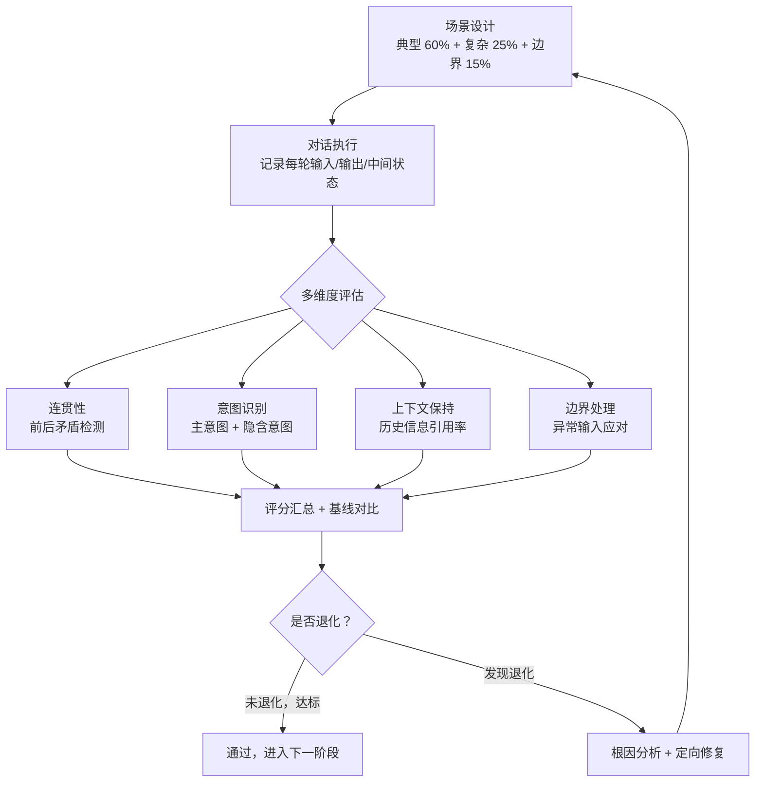

# 对话质量测试（Conversation Quality Testing）

## 概念解释

对话质量测试是一套用来检验 Agent 在多轮对话场景中表现好不好的系统化方法。它不只看单条回复写得怎么样，而是从整个对话流的角度，检查 Agent 能不能记住之前聊过的内容、能不能准确理解用户真正想要什么、回复之间有没有逻辑矛盾。

为什么需要它？因为真实用户和 Agent 的交互不是"一问一答就结束"。用户会追问、会纠正、会突然换话题、会用"那个""它"这种省略说法。如果只测单轮回复的质量，那些只在多轮对话中才暴露的问题（比如前后矛盾、忘了用户说过的话）就会被漏掉，等上线后才被用户投诉发现。

和传统软件测试对比：传统测试是"输入固定，输出可预期"，可以精确断言（assert）。对话质量测试面对的是自然语言的开放性输出，没有唯一正确答案，必须引入语义层面的评估手段——这也是它的核心难点。

## 关键结构

| 结构 | 作用 | 说明 |
|------|------|------|
| 评估维度 | 定义"好"的标准 | 连贯性、意图识别、上下文保持、边界处理四大维度 |
| 测试用例集 | 模拟真实交互 | 覆盖典型场景、复杂场景、边界场景的多轮对话脚本 |
| 评估方法 | 执行质量判定 | 规则检查、LLM-as-Judge、人工评估三种手段 |
| 质量基线 | 提供对比锚点 | 历史版本的评分基线，用于检测性能退化 |

### 结构 1：四大评估维度

对话质量不是一个笼统的分数，而是由四个可独立度量的维度组成：

- **多轮对话连贯性（Coherence）**：前后回复之间有没有逻辑矛盾。比如第 3 轮说"库存不足"，第 5 轮又说"现在有货"，这就是连贯性失败。
- **意图识别准确率（Intent Accuracy）**：Agent 是否正确理解了用户每一轮的真实需求，包括字面意图和隐含意图。
- **上下文保持能力（Context Retention）**：用户说"那个产品多少钱"时，Agent 能不能从对话历史中找到"那个产品"指的是什么。
- **边界情况处理（Edge Case Handling）**：面对自相矛盾的要求、突然换话题、非标准表述等异常输入时，Agent 能不能合理应对。

不同业务场景下，四个维度的权重不同。客服场景更看重意图识别和上下文保持；代码调试助手更看重连贯性和边界处理。

### 结构 2：测试用例集的三层设计

一个合格的测试用例集应该包含三类场景，按比例分配：

- **典型场景（约 60%）**：用户最常用的对话模式，如简单咨询、标准流程。验证 Agent 在日常负载下的基本表现。
- **复杂场景（约 25%）**：多步骤推理、跨领域信息整合、意图逐步细化。检测 Agent 处理复杂任务的能力上限。
- **边界场景（约 15%）**：自相矛盾、恶意输入、话题突变、指代模糊。属于对抗性测试（Adversarial Testing），用来发现系统的薄弱点。

### 结构 3：三种评估方法

| 方法 | 优点 | 缺点 | 适用场景 |
|------|------|------|---------|
| 规则检查 | 速度快、成本低、结果确定 | 只能查硬性规则，无法评估语义质量 | 格式校验、关键词检测、安全合规 |
| LLM-as-Judge | 能理解语义、可大规模执行 | 存在评估偏见，不同 LLM 评分可能不一致 | 连贯性、相关性、自然度等语义维度 |
| 人工评估 | 金标准，能捕捉细微差别 | 成本高、速度慢、评分者间一致性需要校准 | 关键场景抽检、评估方法校准 |

当前行业的主流做法是"LLM-as-Judge 为主 + 人工抽检校准"的组合策略。

## 核心原理

### 原理说明

对话质量测试的核心流程可以分为五个阶段：

1. **场景设计**：从业务需求出发，设计多轮对话测试脚本。每个脚本包含用户输入序列、每轮的期望行为、评估标准。重点是覆盖"典型 + 复杂 + 边界"三层场景。

2. **对话执行**：将测试脚本依次输入被测 Agent，完整记录每轮的输入、输出、Agent 内部状态（如调用了哪些工具、检索了哪些上下文）。这些中间状态对后续问题定位至关重要。

3. **多维度评估**：对执行结果从四个维度分别打分。规则类检查自动完成；语义类评估交给 LLM-as-Judge 或人工评估。每个维度独立出分，不要只给一个笼统的总分。

4. **基线对比**：将当前版本的评分与历史基线（Baseline）对比，检测是否出现性能退化（Regression）。比如新版本的意图识别提高了 3%，但上下文保持下降了 5%，这个退化必须被捕捉到。

5. **问题归因与改进**：对失败用例进行根因分析。是 Prompt 设计问题？是上下文窗口不够长？还是检索召回率低？根据归因结果指导下一轮优化。

### Mermaid 图解



图中的关键路径是从"多维度评估"到"基线对比"这一段。单看某一轮的回复不够——必须把四个维度的评分与历史基线做对比，才能判断新版本是变好了还是变差了。右下角的回路（根因分析 → 场景设计）体现了对话质量测试的持续迭代特性。

### 运行示例

以下代码展示对话质量测试的最小评估结构：如何定义对话数据、如何从多个维度打分、如何生成评估报告。

```python
# 对话质量评估最小示例
# 基于纯 Python，不依赖第三方库

from dataclasses import dataclass, field
from typing import List, Dict

@dataclass
class Turn:
    """单轮对话记录"""
    user: str                        # 用户输入
    agent: str                       # Agent 回复
    expected_intent: str = ""        # 期望识别的意图（用于意图准确率计算）
    needs_context: bool = False      # 这轮回复是否需要引用历史信息
    context_used: bool = False       # Agent 是否实际引用了历史信息

@dataclass
class EvalResult:
    """评估结果"""
    coherence: float = 0.0           # 连贯性得分 0-1
    intent_accuracy: float = 0.0     # 意图识别准确率 0-1
    context_retention: float = 0.0   # 上下文保持率 0-1
    overall: float = 0.0             # 加权总分

def evaluate_conversation(turns: List[Turn]) -> EvalResult:
    """
    对一段多轮对话执行质量评估。
    实际生产中，连贯性和意图识别通常交给 LLM-as-Judge 完成，
    此处用规则简化演示核心评估结构。
    """
    n = len(turns)
    if n == 0:
        return EvalResult()

    # 维度 1：连贯性（简化版：检测前后矛盾的关键词对）
    contradiction_pairs = [("没有库存", "现在有货"), ("不支持", "已经支持"), ("不知道", "答案是")]
    coherent = 0
    for i in range(1, n):
        prev, curr = turns[i-1].agent, turns[i].agent
        has_conflict = any(neg in prev and pos in curr for neg, pos in contradiction_pairs)
        if not has_conflict:
            coherent += 1
    coherence = coherent / (n - 1) if n > 1 else 1.0

    # 维度 2：意图识别准确率（对比期望意图和实际检测结果）
    def detect_intent(text: str) -> str:
        """基于关键词的简单意图分类"""
        if any(w in text for w in ["投诉", "问题", "坏了"]):
            return "complaint"
        if any(w in text for w in ["买", "购买", "下单"]):
            return "purchase"
        if any(w in text for w in ["什么", "怎么", "多少", "哪个"]):
            return "inquiry"
        return "other"

    correct = sum(1 for t in turns if t.expected_intent and detect_intent(t.user) == t.expected_intent)
    labeled = sum(1 for t in turns if t.expected_intent)
    intent_acc = correct / labeled if labeled > 0 else 1.0

    # 维度 3：上下文保持率（需要引用历史信息的轮次中，实际引用的比例）
    needs = [t for t in turns if t.needs_context]
    context_ret = sum(1 for t in needs if t.context_used) / len(needs) if needs else 1.0

    # 加权总分（权重可按业务调整）
    overall = coherence * 0.25 + intent_acc * 0.35 + context_ret * 0.40

    return EvalResult(
        coherence=round(coherence, 3),
        intent_accuracy=round(intent_acc, 3),
        context_retention=round(context_ret, 3),
        overall=round(overall, 3)
    )

# --- 构造测试数据并运行 ---

test_conversation = [
    Turn(user="iPhone 15 多少钱？", agent="iPhone 15 售价 5999 元。",
         expected_intent="inquiry"),
    Turn(user="它的配置呢？", agent="A17 芯片，6.1 英寸屏幕，支持 5G。",
         expected_intent="inquiry", needs_context=True, context_used=True),
    Turn(user="那个有黑色吗？", agent="iPhone 15 有黑色、蓝色、粉色三种配色。",
         expected_intent="inquiry", needs_context=True, context_used=True),
]

result = evaluate_conversation(test_conversation)
print(f"连贯性: {result.coherence}")
print(f"意图准确率: {result.intent_accuracy}")
print(f"上下文保持率: {result.context_retention}")
print(f"加权总分: {result.overall}")
# 输出:
# 连贯性: 1.0
# 意图准确率: 1.0
# 上下文保持率: 1.0
# 加权总分: 1.0
```

代码中 `evaluate_conversation` 函数的三段式结构（连贯性检测 → 意图识别 → 上下文保持率）对应了前文"四大评估维度"中的前三个。边界处理维度在实际系统中通常由专门的对抗性测试集覆盖，此处未展开。`detect_intent` 使用了关键词匹配做简化演示；生产环境中，连贯性和意图识别这两个语义维度通常交给 LLM-as-Judge 完成。

## 易混概念辨析

| 概念 | 与对话质量测试的区别 | 更适合关注的重点 |
|------|---------------------|------------------|
| 单轮回复评估（Response Evaluation） | 只看单条回复的质量，不考虑上下文连贯性 | 回复的事实准确性、流畅性、安全性 |
| LLM 基准测试（Benchmark） | 用标准化数据集衡量模型的通用能力 | MMLU、HumanEval 等通用能力排名 |
| A/B 测试（A/B Testing） | 用真实用户流量对比两个版本的效果 | 用户满意度、转化率等业务指标 |
| 可观测性监控（Observability） | 对线上运行的 Agent 进行实时指标采集 | 延迟、错误率、token 消耗等运行指标 |

核心区别：

- **对话质量测试**：关注"Agent 在多轮交互中的综合表现"，是上线前的主动测试
- **单轮回复评估**：只看一个回合，丢失了多轮上下文这个关键维度
- **LLM 基准测试**：衡量的是模型的通用能力，不针对特定业务场景的对话质量
- **A/B 测试**：在线上做，是被动观察用户反应；对话质量测试在上线前做，是主动检测

## 适用边界与局限

### 适用场景

1. **客服 / 售后机器人**：需要在多轮对话中记住用户身份、订单信息、问题历史，任何一轮的上下文丢失都会导致用户重复描述问题。
2. **代码调试助手**：高度依赖上下文——必须记住报错信息、之前尝试过的方案、代码结构，否则会给出重复或矛盾的建议。
3. **复杂业务流程 Agent**：保险理赔、贷款审批等多步骤流程，用户分多轮提供信息，Agent 需要确保每项信息的完整性和一致性。
4. **教育辅导机器人**：需要跟踪学生的理解进度，根据之前的对话调整讲解深度，不能每轮都从头开始。

### 不适合的场景

1. **纯单轮问答系统**：如果系统设计上就是无状态的单轮交互（如搜索引擎式问答），多轮评估维度没有意义。
2. **高度结构化的表单填写**：如果交互流程完全固定（每步必须填什么字段），用传统的功能测试更高效。

### 局限性

1. **测试用例无法穷举**：自然语言的多样性意味着有限的测试集无法覆盖所有真实场景，未被覆盖的"黑天鹅"场景仍可能在生产中出现。
2. **LLM-as-Judge 的偏见**：用 LLM 评价 LLM，评估器自身的偏好（如偏爱长回复、偏爱特定表述风格）会影响评分客观性。多个评估 LLM 交叉校验可以缓解但无法消除。
3. **评估指标与用户体验的偏差**：量化指标高不代表用户真的满意。用户的主观感受受响应速度、语气、个性化等多种因素影响，部分因素难以用当前维度覆盖。
4. **前期投入成本高**：设计测试用例集、搭建评估框架、建立质量基线需要较大的初始工程投入，对小团队或早期产品可能不划算。

## 常见误区

| 常见误区 | 正确理解 |
|----------|----------|
| "单条回复质量高，整个对话就没问题" | 多轮对话是一个整体。单轮质量高但上下文保持差，用户体验照样崩。必须从对话流的维度评估 |
| "自动化评估 = BLEU / ROUGE 分数" | BLEU 等文本相似度指标只衡量字面重叠，无法捕捉语义正确性。语义评估应使用 LLM-as-Judge 或人工评估 |
| "测试用例越多越好" | 关键是覆盖率和质量。10 个精心设计的边界用例比 1000 个随机用例更能发现问题。优先保证三层场景（典型 + 复杂 + 边界）的覆盖 |
| "没有用户投诉就说明质量好" | 幸存者偏差。大量用户遇到问题后直接离开，不会投诉。主动测试比被动等反馈更可靠 |
| "用一个总分就能衡量对话质量" | 对话质量是多维的。总分相同的两个版本可能一个连贯性强但意图识别差、另一个反过来。必须拆开各维度看 |

## 思考题

<details>
<summary>初级：对话质量测试的四大评估维度分别是什么？为什么不能只用一个总分来衡量？</summary>

**参考答案：**

四大维度是：多轮对话连贯性、意图识别准确率、上下文保持能力、边界情况处理。不能只用总分，是因为总分相同的两个版本可能在各维度上的表现完全不同。比如版本 A 的连贯性 0.9 但意图识别只有 0.6，版本 B 反过来——它们的总分可能一样，但需要修复的问题完全不同。拆开维度看才能指导具体的优化方向。

</details>

<details>
<summary>中级：在"LLM-as-Judge + 人工抽检"的评估策略中，如何处理 LLM 评估器的偏见问题？</summary>

**参考答案：**

主要手段有三个：(1) 多评估器交叉校验——用多个不同的 LLM（如 GPT-4、Claude、Gemini）分别打分，取共识或加权平均，减少单个模型偏见的影响。(2) 人工校准——定期用人工评估结果作为基准，检查 LLM 评分与人工评分的相关性，发现偏差时调整评估 Prompt 或更换评估模型。(3) 评估 Prompt 标准化——精心设计评估 Prompt，给出明确的评分标准和示例，约束 LLM 的评分行为，减少随意性。

</details>

<details>
<summary>中级/进阶：如果你负责一个保险理赔客服 Agent 的对话质量测试，你会如何设计测试用例集的三层场景？每层给出一个具体用例。</summary>

**参考答案：**

**典型场景**：用户正常提交理赔——第 1 轮报案、第 2 轮提供保单号、第 3 轮描述事故经过、第 4 轮确认信息。评估 Agent 能否按流程引导并完整记录信息。

**复杂场景**：用户在第 3 轮提供了两份不同的医疗报告且金额不一致，Agent 需要识别差异并主动要求用户澄清。评估 Agent 的信息冲突检测能力和上下文整合能力。

**边界场景**：用户在第 2 轮说"我要理赔车险"，第 4 轮突然改口说"不对，是寿险"。Agent 需要识别这个修正，清除之前收集的车险相关信息，重新按寿险流程引导。评估 Agent 的错误修正能力——这个场景在实际业务中非常常见但极易出错。

</details>

## 参考资料

1. Ragas 官方文档 - Evaluating Multi-turn Conversations：https://docs.ragas.io/en/stable/howtos/applications/evaluating_multi_turn_conversations/
2. Langfuse 官方指南 - Evaluating Multi-Turn Conversations：https://langfuse.com/guides/cookbook/example_evaluating_multi_turn_conversations
3. Lowe, R. et al. (2017). Towards an Automatic Turing Test: Learning to Evaluate Dialogue Responses. ACL 2017.：https://www.aminer.cn/pub/59ae3c262bbe271c4c71ea58/
4. LMSYS Chatbot Arena - LLM 对话质量众包评估平台：https://chat.lmsys.org/
5. Microsoft PromptFlow - LLM 应用测试与评估工具链：https://github.com/microsoft/promptflow
