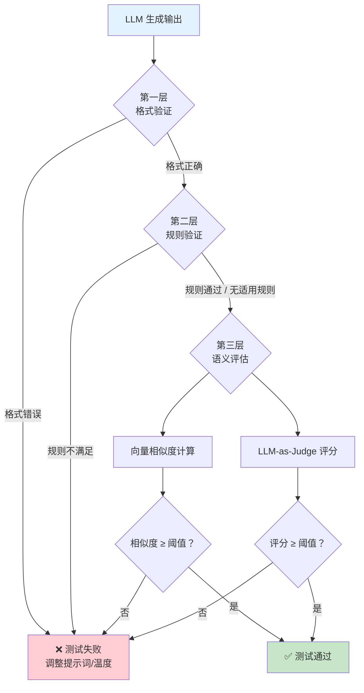
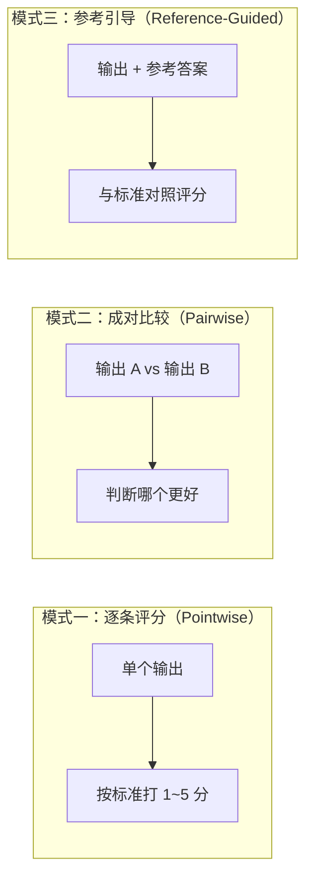

# LLM 输出测试（LLM Output Testing）

## 概念解释

LLM 输出测试是一套专门针对大语言模型生成内容进行质量评估的方法体系。它和传统软件测试最大的不同在于：传统测试比的是"输出和标准答案是否一模一样"，而 LLM 的输出天生带有随机性，同一个问题问两次可能得到措辞完全不同但意思相同的回答，所以不能用"字符串相等"来判断对错。

这套方法体系之所以出现，是因为 LLM 应用越来越多地进入生产环境（客服、代码生成、数据提取等），但"人工一条条看输出"根本跟不上量级。业界需要一种既能自动化运行、又能理解"意思对不对"的测试方式。

LLM 输出测试的核心思路是**分层验证**：能用规则判断的先用规则（快且便宜），规则搞不定的再上语义评估（用向量相似度），最复杂的才请另一个 LLM 当裁判（LLM-as-Judge）。这种分层设计既控制成本，又保证评估质量。

## 关键结构

LLM 输出测试由三个递进的验证层级构成，像漏斗一样逐层过滤：

| 层级 | 验证方式 | 解决什么问题 | 成本 |
|------|----------|-------------|------|
| 第一层：格式验证 | JSON 解析、字段检查、类型校验 | LLM 是否"听了指令"，输出格式对不对 | 极低 |
| 第二层：规则验证 | 正则匹配、逻辑检查、代码编译 | 确定性内容是否符合业务规则 | 低 |
| 第三层：语义评估 | 向量相似度 + LLM-as-Judge | 开放式内容的含义、质量、准确性 | 中~高 |

### 第一层：格式验证（Format Validation）

检查 LLM 输出是否符合预期的结构规范。比如要求输出 JSON，就验证能不能正确解析、必需字段是否齐全、值的类型对不对。这一层是纯程序化的判断，没有任何模糊地带——格式要么对，要么错。格式验证失败通常意味着提示词设计有问题，或者需要降低采样温度。

### 第二层：规则验证（Rule-Based Validation）

针对有明确逻辑标准的任务，用预定义规则做自动检查。例如情感分析中正负分数之和必须等于 100、SQL 生成中只能引用白名单表、代码生成必须通过编译。规则验证是完全确定性的——满足就是满足，不满足就是不满足。

### 第三层：语义评估（Semantic Evaluation）

对于没有唯一正确答案的开放式任务（问答、摘要、创意写作），需要评估"意思对不对"而不是"字面一样不一样"。这一层有两个主要手段：

- **向量相似度**：把参考答案和生成答案都转成向量，算余弦相似度，得分越高说明语义越接近
- **LLM-as-Judge**：让一个更强的 LLM（如 GPT-4）按照明确的评分标准给输出打分，是目前最接近人类判断的自动评估方式

## 核心原理

### 原理说明

LLM 输出测试的核心逻辑可以用一句话概括：**按成本从低到高、按判断从客观到主观，逐层过滤**。

**为什么需要分层？** 因为不同类型的问题需要不同粒度的评估。如果所有输出都用 LLM-as-Judge 来评，成本会爆炸（每次评估多一次 API 调用）；但如果只用规则检查，又抓不住语义层面的问题。分层设计让 80% 的明显错误在前两层就被拦住，只有真正需要"理解含义"的部分才进入第三层。

**非确定性怎么处理？** 即使把 temperature 设为 0，LLM API 的多次调用仍可能因为底层分布式系统、批处理策略或模型版本更新而返回不同结果。处理方法是**多次采样**：同一个问题跑 3~5 次，用统计指标（Pass@k）来衡量系统的可靠性，而不是看单次结果。

**LLM-as-Judge 怎么工作？** 构造一个评估提示词，包含原始问题、参考答案（如有）、待评估输出和评分标准，让评判 LLM 按维度打分。研究表明，精心设计的 LLM-as-Judge 与人类评估者的一致性可达 80%~85%，已经接近人类评估者之间的一致性水平（约 81%）。

### Mermaid 图解



整个流程是一个漏斗结构：格式验证挡住"完全不听指令"的输出，规则验证挡住"格式对但内容逻辑错"的输出，语义评估判断"逻辑没问题但意思对不对"。每一层的成本递增，但需要进入下一层的输出数量递减。

**LLM-as-Judge 的三种评估模式：**



逐条评分适合日常质量监控；成对比较适合 A/B 测试（比如对比两个提示词版本）；参考引导适合有标准答案的场景（如 RAG 场景中检查是否忠于检索到的文档）。

### 运行示例

```python
# 最小示例：展示分层验证的核心逻辑
# 基于 openai==1.x 验证（截至 2026-03）

import json
from dataclasses import dataclass
from typing import Optional

@dataclass
class TestResult:
    """单层验证结果"""
    layer: str        # 验证层级名称
    passed: bool      # 是否通过
    detail: str       # 详细说明

def layer1_format_check(output: str, required_keys: list[str]) -> TestResult:
    """第一层：格式验证——检查是否为有效 JSON 且包含必需字段"""
    try:
        data = json.loads(output)
        missing = [k for k in required_keys if k not in data]
        if missing:
            return TestResult("格式验证", False, f"缺少字段: {missing}")
        return TestResult("格式验证", True, "JSON 格式正确，字段齐全")
    except json.JSONDecodeError as e:
        return TestResult("格式验证", False, f"JSON 解析失败: {e}")

def layer2_rule_check(output: str, rules: dict) -> TestResult:
    """第二层：规则验证——对已解析数据应用业务规则"""
    data = json.loads(output)
    for rule_name, check_fn in rules.items():
        if not check_fn(data):
            return TestResult("规则验证", False, f"规则 '{rule_name}' 未通过")
    return TestResult("规则验证", True, "所有规则通过")

def run_layered_test(output: str, required_keys: list[str], rules: dict) -> list[TestResult]:
    """按层级依次执行验证，前一层失败则不继续"""
    results = []

    # 第一层
    r1 = layer1_format_check(output, required_keys)
    results.append(r1)
    if not r1.passed:
        return results  # 格式都不对，后面不用测了

    # 第二层
    r2 = layer2_rule_check(output, rules)
    results.append(r2)

    # 第三层（语义评估）需要调用嵌入模型或 LLM，此处省略
    # 实际项目中可接入 DeepEval / Promptfoo 等框架
    return results

# --- 模拟测试 ---
llm_output = '{"positive_score": 85, "negative_score": 15, "sentiment": "positive"}'

results = run_layered_test(
    output=llm_output,
    required_keys=["positive_score", "negative_score", "sentiment"],
    rules={
        "分数之和为100": lambda d: abs(d["positive_score"] + d["negative_score"] - 100) < 0.01,
        "情感标签有效": lambda d: d["sentiment"] in ("positive", "neutral", "negative"),
    }
)

for r in results:
    print(f"[{r.layer}] {'通过' if r.passed else '失败'} - {r.detail}")
# 输出：
# [格式验证] 通过 - JSON 格式正确，字段齐全
# [规则验证] 通过 - 所有规则通过
```

代码展示了前两层验证的核心机制。第三层语义评估涉及嵌入模型和 LLM API 调用，实际项目中通常接入 DeepEval（Python 原生，支持 60+ 评估指标）或 Promptfoo（YAML 驱动，适合快速迭代）等专用框架，而非手工实现。

## 易混概念辨析

| 概念 | 与 LLM 输出测试的区别 | 更适合关注的重点 |
|------|----------------------|-----------------|
| LLM 评估（LLM Evaluation） | 评估侧重模型本身的能力基准（MMLU、HumanEval 等），输出测试侧重具体应用场景中的输出质量 | 模型选型阶段，关注通用能力排名 |
| 传统单元测试 | 依赖输入输出的确定性映射（assert a == b），不适用于非确定性输出 | 确定性代码逻辑的正确性验证 |
| Prompt Engineering | 提示词工程是"怎么问才能得到好答案"，输出测试是"怎么验证答案好不好" | 优化输入端的设计 |
| 可观测性（Observability） | 可观测性关注线上运行时的监控（延迟、错误率、调用链追踪），输出测试关注输出内容的质量 | 生产环境的运行状态监控 |

核心区别：

- **LLM 输出测试**：关注"这个 LLM 应用在这个具体场景下，输出的质量够不够好"
- **LLM 评估**：关注"这个模型整体能力怎么样，在行业基准上排第几"
- **传统单元测试**：关注"给定输入 X，是否精确返回输出 Y"
- **可观测性**：关注"系统是否正常运行，性能指标是否达标"

## 适用边界与局限

### 适用场景

1. **结构化输出任务**（JSON 生成、数据提取、SQL 生成）：有明确的格式和逻辑规则可以自动校验，前两层验证就能覆盖大部分情况
2. **RAG 问答系统**：需要验证回答是否忠于检索到的文档（Faithfulness），LLM-as-Judge 的参考引导模式特别适合
3. **提示词版本迭代**：修改提示词后，用同一批测试用例跑多次采样，对比 Pass@k 和平均评分来判断是改好了还是改坏了
4. **CI/CD 中的回归测试**：将关键测试用例集成到持续集成流程中，每次部署前自动跑一轮，防止模型升级或提示词修改引入退化

### 不适合的场景

1. **极端实时性要求**：多次采样会让延迟翻 3~5 倍，不适合对响应时间敏感的场景（如实时聊天中的每条消息都做完整评估）
2. **纯创意生成**：诗歌、小说等高度主观的创作，即使 LLM-as-Judge 也很难给出有意义的客观评分，更适合人工评审

### 局限性

1. **LLM-as-Judge 的成本**：每次评估额外调用一次 LLM API，大规模评估（数十万条）的费用可观。2025 年数据显示相比人工审核有 500x~5000x 的成本优势，但绝对成本仍不可忽略
2. **评判模型自身的偏差**：LLM-as-Judge 存在已知偏差——位置偏差（先出现的选项更容易被选中）、冗长偏差（更长的回答倾向于得更高分）、自我偏好（用同一个模型生成和评判会高估质量）。缓解方法包括交换顺序评估、使用不同模型生成和评判
3. **阈值设定无标准答案**：语义相似度多少算"够好"？LLM-as-Judge 打几分算"通过"？这些需要根据具体业务需求反复调试，没有通用标准
4. **缺乏行业标准化**：不同团队采用的评估方法和指标差异很大，结果难以跨团队比较和复现

## 常见误区

| 常见误区 | 正确理解 |
|----------|----------|
| temperature=0 就能保证每次输出一样 | 即使设为 0，底层分布式系统、批处理策略和模型版本更新仍会导致不同次调用返回不同结果。应该接受非确定性，用多次采样和 Pass@k 来量化可靠性 |
| LLM 输出只能用字符串精确匹配来测试 | 精确匹配只适用于格式校验等极少数场景。绝大多数情况需要语义级评估——向量相似度判断"意思是否接近"，LLM-as-Judge 判断"质量是否达标" |
| 用一个强大的 LLM-as-Judge 就够了 | LLM-as-Judge 成本高且有偏差，应该与规则验证、相似度计算组合使用。先用低成本手段过滤明显错误，只对边界案例调用 Judge，形成"漏斗式"评估策略 |
| 跑一次测试通过就代表系统质量过关 | 单次结果受随机性影响大。至少跑 3~5 次，用通过率（Pass@k）和平均评分来衡量。单次成功可能只是运气好，单次失败也可能只是运气差 |

## 思考题

<details>
<summary>初级：LLM 输出测试为什么不能像传统单元测试那样用 assert output == expected 来判断？</summary>

**参考答案：**

因为 LLM 的输出具有内在的非确定性。即使同一个问题、同样的参数配置，每次调用可能返回措辞不同但含义相同的回答。用字符串精确匹配会导致大量"假失败"（意思对但措辞不同就被判为不通过）。正确做法是用语义相似度或 LLM-as-Judge 来评估"含义是否正确"，而不是"字面是否一致"。

</details>

<details>
<summary>中级：如果你的 LLM 应用同时包含 JSON 结构化输出和自然语言解释两部分，你会如何设计分层测试策略？</summary>

**参考答案：**

对 JSON 部分，用第一层格式验证（检查是否为有效 JSON、字段是否齐全、类型是否正确）和第二层规则验证（检查业务逻辑约束）。对自然语言解释部分，跳过前两层，直接用第三层语义评估（向量相似度检查是否偏离主题，LLM-as-Judge 评估准确性、完整性和清晰度）。两部分独立评分后，可以用加权策略汇总为整体分数。关键是不要把两种性质不同的内容混在一起用同一种方法评估。

</details>

<details>
<summary>中级/进阶：你的 RAG 问答系统升级了检索模型，需要验证新版本没有引入质量退化。请设计一个回归测试方案。</summary>

**参考答案：**

1. 准备一个覆盖典型场景的测试集（50~100 条问题+参考答案），包含简单事实题、多步推理题和边界情况。2. 用旧版本和新版本分别对每个问题跑 3~5 次，记录每次输出。3. 对每个输出做三层评估：格式验证确保结构正确，规则验证确保不引用虚假来源，LLM-as-Judge 按"忠实度（Faithfulness）"和"相关性（Relevancy）"两个维度打分。4. 对比两个版本的 Pass@3 通过率和平均评分。如果新版本在任何一个维度上显著低于旧版本（比如平均分下降超过 0.5 分），需要排查原因后才能上线。5. 将这批测试用例固化到 CI 流程中，每次部署前自动运行。

</details>

## 参考资料

1. Langfuse Blog. (2025). "LLM Evaluation 101: Best Practices and Challenges." https://langfuse.com/blog/2025-03-04-llm-evaluation-101-best-practices-and-challenges
2. Confident AI. (2026). "LLM Testing: Top Methods and Strategies." https://www.confident-ai.com/blog/llm-testing-in-2024-top-methods-and-strategies
3. Evidently AI. (2025). "LLM-as-a-judge: A Complete Guide to Using LLMs for Evaluations." https://www.evidentlyai.com/llm-guide/llm-as-a-judge
4. Monte Carlo Data. (2025). "LLM-As-Judge: 7 Best Practices & Evaluation Templates." https://www.montecarlodata.com/blog-llm-as-judge/
5. Gu et al. (2024). "A Survey on LLM-as-a-Judge." arXiv:2411.15594. https://arxiv.org/abs/2411.15594
6. Nimble Approach. (2025). "Technical Deep Dive: Promptfoo vs DeepEval for Automated AI Evaluation." https://nimbleapproach.com/blog/technical-deep-dive-promptfoo-vs-deepeval-for-automated-ai-evaluation/
