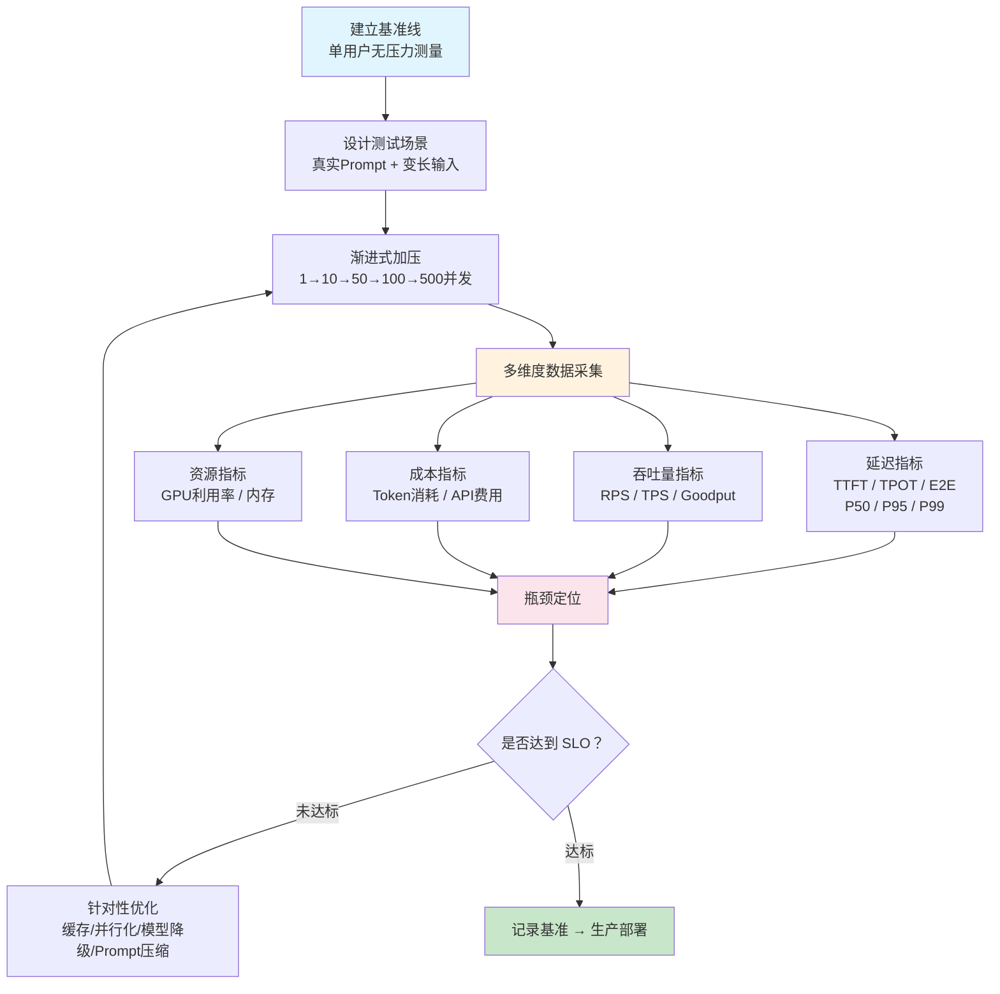

# 性能与压力测试（Performance & Stress Testing）

## 概念解释

性能与压力测试是在 Agent 应用上线前，用模拟的真实流量去"压"系统，看它在多大负载下还能稳定运行、响应够快、成本可控。

传统 Web 应用的性能测试主要关心"一秒能处理几个请求、平均延迟多少"。Agent 应用多了三个新变量：第一，LLM 推理本身就慢（秒级起步），而且每个请求的处理时间差异巨大；第二，Token 是按量计费的，多轮对话会让输入 Token 像滚雪球一样越来越大；第三，Agent 往往要串联调用多个外部工具（搜索、数据库、API），任何一个环节变慢都会拖垮整体。

与传统负载测试还有一个本质区别：Agent 的输出是非确定性的（Non-deterministic），相同的 Prompt 可能产生不同长度、不同内容的回复，这导致响应时间波动很大，用平均值来衡量性能会严重失真。因此 Agent 性能测试必须关注百分位延迟（P95/P99），而不是平均值。

## 关键结构

Agent 性能测试围绕四个核心维度展开，每个维度回答一个关键问题：

| 维度 | 回答的问题 | 核心指标 |
|------|-----------|---------|
| 延迟（Latency） | 用户要等多久？ | TTFT、TPOT、端到端延迟、P95/P99 |
| 吞吐量（Throughput） | 系统能扛多少请求？ | RPS、TPS、Goodput |
| Token 成本（Cost） | 每个请求花多少钱？ | 输入/输出 Token 数、成本/请求 |
| 并发能力（Concurrency） | 多少用户同时用会崩？ | 容量拐点、错误率、降级阈值 |

### 维度 1：延迟指标体系

延迟不是一个数字，而是一组指标：

- **TTFT（Time To First Token，首 Token 延迟）**：用户点击发送后，到屏幕上出现第一个字的等待时间。对交互式应用（聊天、代码助手），这是体验的命脉。业界参考值：聊天场景 < 200ms，复杂推理场景 < 500ms。
- **TPOT（Time Per Output Token，单 Token 生成时间）**：模型每生成一个 Token 需要的时间，也叫 ITL（Inter-Token Latency）。决定了用户看到回复"打字"的流畅感。MLPerf 2025 基准：小模型 < 30ms，大模型（405B）< 175ms。
- **端到端延迟（End-to-End Latency）**：从请求发出到完整回复接收完毕的总时间。公式：E2E = TTFT + (输出 Token 数 x TPOT)。
- **百分位延迟（P50/P95/P99）**：P99 延迟代表最差 1% 用户的体验。一个平均延迟 2 秒但 P99 延迟 30 秒的系统，用户会觉得"经常卡"。

### 维度 2：吞吐量指标

- **RPS（Requests Per Second）**：系统每秒能处理多少个完整请求。
- **TPS（Tokens Per Second）**：系统每秒能生成多少个 Token。注意：并发增加时总 TPS 会上升，但每个用户分到的 TPS 会下降。
- **Goodput**：满足 SLO 约束的有效吞吐量。例如"在 TTFT < 200ms 且 TPOT < 50ms 的约束下，系统每秒能处理多少请求"。高吞吐不等于高 Goodput——如果大量请求超时，吞吐量再高也没用。

### 维度 3：Token 成本分析

每次 LLM 调用的成本公式：

$$Cost_{单次} = N_{input} \times P_{input} + N_{output} \times P_{output}$$

其中输入 Token 通常占总量的 70-80%，主要来源是系统提示词和历史对话记录。多轮对话中，随着轮数增加，输入 Token 近似线性增长，这是成本的头号驱动因素。

### 维度 4：并发能力评估

并发测试的核心是找到系统的**容量拐点（Knee Point）**——在并发数达到多少时，延迟开始急剧上升、错误率开始攀升。在拐点之后，系统性能会快速恶化，可能出现级联失败（一个工具超时导致整个 Agent 链路超时）。

## 核心原理

### 原理说明

Agent 性能测试的工作流程分为五个阶段：

1. **建立基准线（Baseline）**：在无压力状态下（单用户、单轮对话）测量各项指标，作为后续对比的参照点。比如单用户 TTFT = 180ms、端到端延迟 = 2.1s、Token 消耗 = 450。

2. **设计测试场景**：基于真实用户行为构造测试用例。关键原则是必须使用真实 Prompt（不能用随机文本），因为 LLM 的投机解码（Speculative Decoding）依赖真实语言模式，随机 Token 会导致延迟指标严重失真。同时要变化 Prompt 长度，覆盖短查询和长上下文两种情况。

3. **渐进式加压**：从低并发开始逐步加压（比如 1 → 10 → 50 → 100 → 500），而不是一上来就打满。这样可以观察到性能在哪个并发级别出现拐点，而不是只知道"500 并发会崩"。

4. **多维度数据采集**：同时记录延迟指标（TTFT、TPOT、E2E 的 P50/P95/P99）、吞吐量指标（RPS、TPS）、资源指标（GPU 利用率、内存占用）、成本指标（Token 消耗、API 费用）。

5. **瓶颈定位与优化验证**：通过链路追踪（Tracing）将端到端延迟拆解为 LLM 推理时间、工具调用时间、网络传输时间、排队等待时间，精确定位最慢的环节。优化后重新跑同样的测试，对比指标变化。

### Mermaid 图解



图中关键流转：

- 加压阶段采用渐进式而非一步到位，目的是找到拐点而非仅仅验证"能不能扛住"。
- 数据采集是四维并行的，缺少任何一个维度都可能导致误判（比如延迟达标但成本爆炸）。
- 优化后必须重新从加压阶段开始跑完整流程，不能只跑单点验证。

### 运行示例

以下是一个用 Python 编写的最小 Agent 性能测试框架，展示如何采集 TTFT、TPOT、Token 消耗等核心指标：

```python
# 基于 openai==1.30+ 验证（截至 2026-03）
import time
import statistics
from dataclasses import dataclass, field
from openai import OpenAI

@dataclass
class AgentMetrics:
    """单次请求的性能指标"""
    ttft: float = 0.0           # 首Token延迟（秒）
    total_time: float = 0.0     # 端到端延迟（秒）
    input_tokens: int = 0       # 输入Token数
    output_tokens: int = 0      # 输出Token数
    tpot: float = 0.0           # 单Token生成时间（秒）

def measure_single_request(client: OpenAI, prompt: str, model: str = "gpt-4o") -> AgentMetrics:
    """
    测量单次LLM调用的性能指标。
    使用流式响应来精确测量TTFT和TPOT。
    """
    metrics = AgentMetrics()
    start = time.perf_counter()
    first_token_received = False
    token_count = 0

    # 流式调用，逐Token计时
    stream = client.chat.completions.create(
        model=model,
        messages=[{"role": "user", "content": prompt}],
        stream=True,
        stream_options={"include_usage": True},
    )

    for chunk in stream:
        if chunk.choices and chunk.choices[0].delta.content:
            if not first_token_received:
                metrics.ttft = time.perf_counter() - start
                first_token_received = True
            token_count += 1

        # 从最后一个chunk获取usage信息
        if chunk.usage:
            metrics.input_tokens = chunk.usage.prompt_tokens
            metrics.output_tokens = chunk.usage.completion_tokens

    metrics.total_time = time.perf_counter() - start

    # 计算TPOT：(总时间 - TTFT) / 输出Token数
    if token_count > 1:
        metrics.tpot = (metrics.total_time - metrics.ttft) / (token_count - 1)

    return metrics

def run_baseline_test(client: OpenAI, prompts: list[str], model: str = "gpt-4o") -> dict:
    """
    运行基准测试，返回P50/P95/P99等汇总指标。
    prompts: 真实场景的Prompt列表（禁止使用随机文本）。
    """
    all_metrics = [measure_single_request(client, p, model) for p in prompts]

    ttfts = [m.ttft for m in all_metrics]
    totals = [m.total_time for m in all_metrics]
    tokens = [m.input_tokens + m.output_tokens for m in all_metrics]
    costs = [m.input_tokens * 2.50 / 1_000_000 + m.output_tokens * 10.00 / 1_000_000
             for m in all_metrics]  # GPT-4o 价格（美元）

    def percentile(data, p):
        sorted_data = sorted(data)
        idx = int(len(sorted_data) * p / 100)
        return sorted_data[min(idx, len(sorted_data) - 1)]

    return {
        "requests": len(all_metrics),
        "ttft_p50": f"{percentile(ttfts, 50)*1000:.0f}ms",
        "ttft_p95": f"{percentile(ttfts, 95)*1000:.0f}ms",
        "e2e_p50": f"{percentile(totals, 50):.2f}s",
        "e2e_p95": f"{percentile(totals, 95):.2f}s",
        "e2e_p99": f"{percentile(totals, 99):.2f}s",
        "avg_tokens": f"{statistics.mean(tokens):.0f}",
        "avg_cost": f"${statistics.mean(costs):.4f}",
        "total_cost": f"${sum(costs):.4f}",
    }
```

代码核心机制：通过流式响应（`stream=True`）逐 Token 计时，首个 Token 到达的时刻即为 TTFT，后续 Token 的间隔即为 TPOT。`stream_options={"include_usage": True}` 让最后一个 chunk 携带精确的 Token 用量，避免手动估算。

如果要做并发压力测试，推荐使用 Locust 或 LLM Locust 等专用工具，通过渐进式加压（ramp-up）来找到容量拐点：

```python
# 基于 locust==2.31+ 验证（截至 2026-03）
# 文件名: locustfile.py
from locust import HttpUser, task, between
import random

# 真实场景Prompt池（禁止使用随机文本）
PROMPT_POOL = [
    "帮我总结一下这篇文章的要点",           # 短Prompt
    "根据以下需求文档，设计一个API接口方案：" + "x" * 500,  # 长Prompt
    "对比 Redis 和 PostgreSQL 做向量存储的优劣",           # 中等Prompt
]

class AgentLoadUser(HttpUser):
    """模拟Agent用户的负载测试"""
    wait_time = between(1, 5)  # 模拟用户思考间隔

    @task(3)
    def single_turn(self):
        """单轮查询（权重3）"""
        self.client.post("/v1/chat/completions", json={
            "model": "gpt-4o",
            "messages": [{"role": "user", "content": random.choice(PROMPT_POOL)}],
        }, name="single_turn")

    @task(1)
    def multi_turn(self):
        """多轮对话（权重1），测试上下文累积效应"""
        messages = []
        for i in range(3):
            messages.append({"role": "user", "content": f"第{i+1}轮: {random.choice(PROMPT_POOL)}"})
            self.client.post("/v1/chat/completions", json={
                "model": "gpt-4o",
                "messages": messages.copy(),
            }, name=f"multi_turn_round_{i+1}")
            messages.append({"role": "assistant", "content": "模拟回复..."})

# 运行命令（渐进式加压）:
# locust -f locustfile.py --host=http://localhost:8000 \
#   --users 100 --spawn-rate 10 --run-time 10m
# --spawn-rate 10 表示每秒增加10个用户，10秒后达到100并发
```

## 易混概念辨析

| 概念 | 与性能/压力测试的区别 | 更适合关注的重点 |
|------|---------------------|------------------|
| 功能测试（Functional Testing） | 验证"对不对"，不关心"快不快"。功能测试只检查 Agent 是否返回正确结果，不测量延迟和吞吐量 | Agent 输出的正确性、工具调用是否符合预期 |
| 对话质量测试（Conversation Quality Testing） | 评估回复的语义质量（连贯性、准确性、风格），不关心性能指标 | 回复的语义准确度、上下文连贯性、用户满意度 |
| 基准测试（Benchmarking） | 基准测试是性能测试的子集，指在固定条件下测量指标以建立参照值。性能测试还包括加压、瓶颈定位、优化验证等完整流程 | 可复现的标准化测量，用于横向对比不同模型或配置 |
| 可观测性（Observability） | 可观测性是生产环境的持续监控，性能测试是上线前的主动验证。两者互补：测试发现问题，可观测性发现测试覆盖不到的生产异常 | 生产环境的实时监控、告警、根因分析 |

核心区别：

- **性能与压力测试**：上线前主动用模拟流量去"压"，回答"系统能扛多大负载、每个请求多快、多贵"
- **功能/质量测试**：关注"对不对、好不好"，不关心"快不快、能扛多少"
- **可观测性**：上线后被动观察真实流量，发现测试覆盖不到的问题

## 适用边界与局限

### 适用场景

1. **Agent 上线前验收**：产品即将面向用户，需要确认在预期并发量下延迟和成本是否可接受。比如电商客服 Agent 在双十一前必须通过 500 并发的压力测试。
2. **模型/配置变更后的回归验证**：切换了底层模型（比如从 GPT-4 切到 Claude）、修改了系统 Prompt、或调整了工具调用逻辑后，需要重新跑基准测试确认性能没有退化。
3. **容量规划与成本预算**：需要回答"如果日活用户达到 10 万，每月 API 成本是多少"这类问题，必须通过压力测试数据来建立成本模型。
4. **CI/CD 流水线中的自动化门禁**：每次代码提交自动跑一组轻量级性能测试，如果 P95 延迟或成本超标就阻止合入。

### 不适合的场景

1. **评估 Agent 回复的语义质量**：性能测试只告诉你"回复多快"，不告诉你"回复对不对"。评估回复质量需要专门的评测框架（如 LLM-as-Judge）。
2. **复现低概率的生产事故**：生产环境的故障往往是特定数据分布 + 特定时间 + 某个依赖故障的组合，很难在测试环境精确复现。

### 局限性

1. **测试场景的代表性有限**：虚拟用户的 Prompt 分布、思考间隔、对话轮数很难完全模拟真实用户行为，测试结论可能与生产表现存在偏差。
2. **外部依赖引入噪声**：Agent 调用的 LLM API、搜索引擎、数据库等外部服务本身的延迟波动会影响测试结果的可重复性。
3. **大规模测试成本高**：用真实 LLM API 做 1000 并发的压力测试，仅 API 费用就可能达到数百美元。可以用 Mock 降低成本，但 Mock 无法反映真实的 LLM 延迟特征。

## 常见误区

| 常见误区 | 正确理解 |
|----------|----------|
| 只看平均延迟，认为"平均 2 秒挺快的" | P99 延迟比平均值更能反映用户体验。一个平均 2 秒但 P99 = 30 秒的系统，1% 的用户会等半分钟，实际感受是"经常很卡" |
| 用随机文本做压力测试 | LLM 的投机解码（Speculative Decoding）依赖真实语言模式来预测下一个 Token。随机文本会打破预测，导致延迟指标虚高。必须使用真实场景的 Prompt |
| 把"API 返回 200"等同于"任务完成" | Agent 可能返回 HTTP 200 但内容是幻觉、工具调用失败、或答非所问。性能测试中的"成功"应该包含结果正确性校验 |
| 忽视多轮对话的 Token 累积效应 | 第 1 轮输入 500 Token，第 5 轮可能变成 3000 Token（历史消息全部作为输入）。成本和延迟都会随轮数增长，必须单独测试多轮场景 |
| 认为高吞吐量 = 高性能 | Goodput 才是真正有意义的指标。系统可能每秒处理 100 个请求，但其中 60% 超过了延迟 SLO，实际 Goodput 只有 40 RPS |

## 思考题

<details>
<summary>初级：TTFT 和 TPOT 分别影响用户体验的哪个方面？为什么 Agent 性能测试不能只看平均延迟？</summary>

**参考答案：**

TTFT 影响"等待感"——用户点击发送后多久开始看到回复出现；TPOT 影响"流畅感"——回复文字逐字出现的速度是否像打字一样自然。

不能只看平均延迟，因为 LLM 的响应时间波动很大（输出长度不确定、GPU 调度随机），平均值会被大量快速请求拉低，掩盖少数极慢请求的存在。P95/P99 延迟才能反映最差情况下的用户体验。比如平均 2 秒但 P99 = 30 秒，意味着每 100 个用户就有 1 个要等半分钟。

</details>

<details>
<summary>中级：你的 Agent 系统 P95 端到端延迟是 8 秒，SLO 要求 < 5 秒。通过链路追踪发现：LLM 推理 3 秒、工具调用（搜索 API）4 秒、其他 1 秒。你会优先优化哪个环节？给出至少两个具体方案。</summary>

**参考答案：**

优先优化工具调用环节（搜索 API 占 4 秒，是最大瓶颈）。

方案一：**并行化工具调用**——如果 Agent 需要调用多个工具，把串行改为并行，总时间从各工具之和变为最慢那个工具的时间。

方案二：**搜索结果缓存**——对高频查询的搜索结果做 TTL 缓存（比如缓存 5 分钟），相同查询直接命中缓存，工具调用时间从 4 秒降到 < 10ms。

方案三：**流式返回 + 提前生成**——在工具调用完成前就开始流式返回 LLM 的初步回复（如"正在为您搜索..."），降低用户感知的 TTFT。

优化后必须重新跑完整压力测试验证 P95 是否降到 5 秒以内，而不是只测单次请求。

</details>

<details>
<summary>进阶：你需要为一个日活 10 万用户的客服 Agent 做容量规划。已知单用户平均每次对话 4 轮，每轮输入 Token 随轮次线性增长（第 1 轮 500、第 2 轮 1000、第 3 轮 1500、第 4 轮 2000）。假设 GPT-4o 输入价格 $2.50/百万 Token、输出价格 $10.00/百万 Token，平均输出 200 Token/轮，日均每用户发起 2 次对话。请估算每月 API 成本，并提出至少一个降低成本的方案。</summary>

**参考答案：**

计算过程：
- 单次对话 4 轮的输入 Token 总量：500 + 1000 + 1500 + 2000 = 5000 Token
- 单次对话 4 轮的输出 Token 总量：200 x 4 = 800 Token
- 每用户每天：2 次对话 → 输入 10000 Token，输出 1600 Token
- 全量用户每天：10 万用户 → 输入 10 亿 Token，输出 1.6 亿 Token
- 每天成本：10 亿 x $2.50/百万 + 1.6 亿 x $10.00/百万 = $2500 + $1600 = $4100
- 每月成本：$4100 x 30 = **约 $123,000/月**

降低成本方案：
1. **上下文压缩/摘要**：不把完整历史消息传给模型，而是每隔 2 轮对历史做摘要压缩，可将输入 Token 减少 40-60%。
2. **Prompt 缓存**：利用 OpenAI/Anthropic 的 Prompt Caching 功能，系统提示词部分只在首次请求时计费，后续请求命中缓存可节省 50-90% 的系统提示词成本。
3. **模型降级策略**：简单查询（如查订单状态）用 GPT-4o-mini 等小模型处理，只有复杂问题才走 GPT-4o，可降低 60-70% 成本。

</details>

## 参考资料

1. NVIDIA, "LLM Inference Benchmarking: Fundamental Concepts", https://developer.nvidia.com/blog/llm-benchmarking-fundamental-concepts/
2. Anyscale, "Understand LLM Latency and Throughput Metrics", https://docs.anyscale.com/llm/serving/benchmarking/metrics
3. MLCommons, "MLPerf Inference v5.0 — Language Model Capabilities", https://mlcommons.org/2025/04/llm-inference-v5/
4. MLCommons, "MLPerf Inference 5.1 — Small LLMs with Llama3.1-8B", https://mlcommons.org/2025/09/small-llm-inference-5-1/
5. Red Hat, "GuideLLM: Evaluate LLM Deployments for Real-World Inference", https://developers.redhat.com/articles/2025/06/20/guidellm-evaluate-llm-deployments-real-world-inference
6. TrueFoundry, "LLM Locust: Benchmarking LLM Performance at Scale", https://www.truefoundry.com/blog/llm-locust-a-tool-for-benchmarking-llm-performance
7. Locust, "Open Source Load Testing Tool — Documentation", https://docs.locust.io
8. Gatling, "Load Testing an LLM API", https://gatling.io/blog/load-testing-an-llm-api
9. DevOps.com, "AI Agent Performance Testing in the DevOps Pipeline", https://devops.com/ai-agent-performance-testing-in-the-devops-pipeline-orchestrating-load-latency-and-token-level-monitoring/
