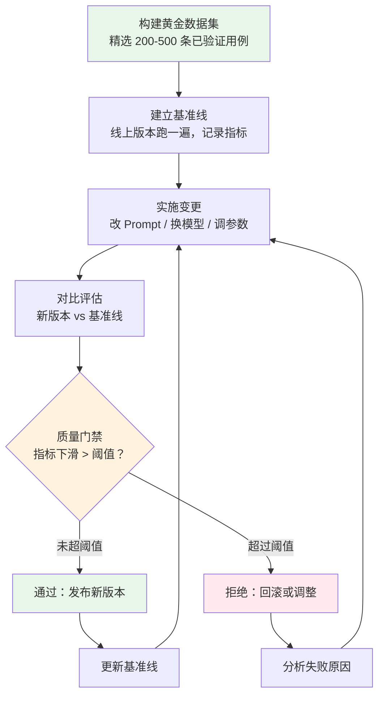
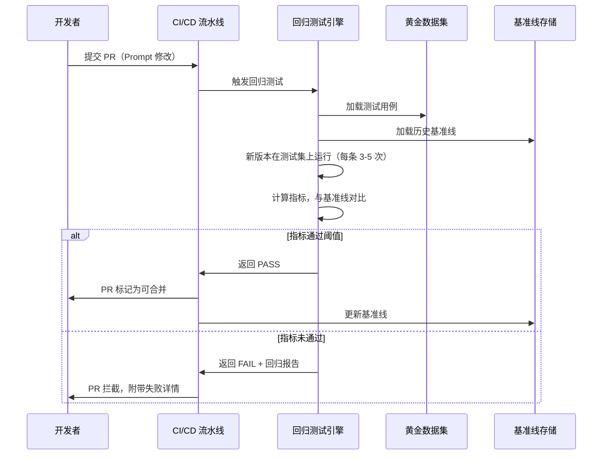

# 回归测试（Regression Testing）

## 概念解释

回归测试（Regression Testing）是一种质量保障手段：每次对 Agent 做了任何改动（改 Prompt、换模型、调参数），都拿出一批之前验证过能正确处理的测试用例重新跑一遍，看看新的改动有没有把原来好用的功能搞坏。

传统软件的回归测试已经很成熟，但 AI Agent 的回归测试面临三个独有的难题。第一，LLM 的输出是非确定性的——同样的输入不会每次给出一模一样的答案。第二，Prompt 的修改会产生隐性副作用——改进了 A 功能的 Prompt 可能悄悄削弱了 B 功能。第三，模型供应商会静默更新 API——你的代码一行没改，但模型行为已经变了。这三个问题叠在一起，导致 Agent 系统特别容易出现"改着改着就坏了"的情况。

回归测试的核心思路是：不要求每次输出完全一样，而是维护一个"黄金数据集"（Golden Dataset），里面存着历史上验证过的、被信任的测试用例。每次变更后，用新版本在这些用例上跑，和旧版本的表现做对比。如果某些指标明显下滑，就拦住，不让发布。

## 关键结构

| 结构 | 作用 | 说明 |
|------|------|------|
| 黄金数据集 | 充当"标准答案库" | 经人工审核的高质量测试用例集合，是回归测试的基石 |
| 基准线 | 充当"对标参考" | 当前线上版本在黄金数据集上的性能指标快照 |
| 评估指标 | 量化"好坏" | 准确率、相关性、忠实度等多维度评分，用于判断是否回归 |
| 质量门禁 | 充当"发布阀门" | 设定阈值，指标下滑超过阈值就拦住，防止问题流入生产 |

### 结构 1：黄金数据集（Golden Dataset）

黄金数据集不是随便采样的测试数据，而是经过人工审核、业务认可、定期维护的"标准答案库"。每条用例包含四个要素：输入（用户问题或指令）、期望行为（参考答案或行为描述）、评判标准（怎么判定 Agent 的输出达标）、元数据（创建时间、版本号、标签）。

一个实用的分层策略：核心功能测试占 60%（Agent 的主要职责场景），边界条件测试占 20%（难题、歧义、特殊输入），回归防护测试占 20%（曾经出过 bug 的场景）。

数据来源包括：用户反馈中的高频问题、客服团队积累的问法集、质量审计中发现的失败案例、新功能发布时的验收测试集。规模上，200-500 条高质量用例足以覆盖大多数场景。

### 结构 2：基准线（Baseline）

基准线是一份性能指标的快照。用当前线上版本在黄金数据集上跑一遍，把各维度的指标（准确率、延迟、成本等）记录下来。这份快照就是后续所有变更的对标参考。

基准线不是一成不变的。当新版本确认表现更优并安全上线后，基准线就会更新为新版本的指标。通过保留历史基准线，可以追踪系统质量的长期趋势。

### 结构 3：评估指标

AI Agent 的回归测试不能用传统的"精确匹配"来判断对错，需要更灵活的评估方式：

- **语义相似度**：用 BERTScore 等指标衡量输出和参考答案在语义上是否一致，即使措辞不同也能正确评分
- **LLM-as-Judge**：用另一个 LLM 来评判输出是否满足预设标准，适合开放式任务
- **契约检查**：不匹配完整输出，只断言关键属性——输出结构是否正确、必需字段是否存在、禁止内容是否出现
- **分片指标**：按主题、任务类型、用户群体分组统计，先发现哪个分片出了问题

### 结构 4：质量门禁（Quality Gate）

质量门禁是发布流程中的一道关卡。它的核心是两类阈值：

- **绝对阈值**：如"准确率必须 >= 90%"
- **相对阈值**：如"准确率相比基准线下降不能超过 5%"

只有同时满足绝对阈值和相对阈值，变更才能通过门禁进入发布。这个机制集成在 CI/CD 流水线中，代码合并或模型更新时自动触发。

## 核心原理

### 原理说明

回归测试的工作机制分为五步：

1. **构建黄金数据集**：从历史成功案例、用户反馈、质量审计中精选测试用例，每条包含输入、期望行为和评判标准
2. **建立基准线**：用当前线上版本在黄金数据集上跑一遍，记录各维度指标作为参考
3. **实施变更**：开发者修改 Prompt、升级模型版本或调整参数
4. **对比评估**：新版本在同一批黄金数据集上运行，采集指标与基准线对比。由于 LLM 输出有随机性，每条用例通常跑 3-5 次取平均值
5. **质量决策**：指标下滑超过阈值则拒绝发布并回滚，通过则发布新版本并更新基准线

这套机制的关键在于"对比"而非"绝对判断"——不是要求每次输出完全正确，而是确保新版本不比旧版本差。

### Mermaid 图解



图中的核心流转点在"质量门禁"节点。它是整条流程的分叉点：通过则进入正向循环（发布 -> 更新基准线 -> 下一轮迭代），不通过则进入修复循环（分析原因 -> 重新调整 -> 再次评估）。这两个循环保证了系统质量只会向上走，不会悄悄退化。

下面这张时序图展示了回归测试在 CI/CD 流水线中的实际触发过程：



### 运行示例

以下是一个最小化的回归测试框架示例，展示核心机制：构建测试集、运行评估、对比基准线。

```python
# 基于 deepeval==2.5.1 验证（截至 2026-03）
from dataclasses import dataclass, field
from typing import List, Dict

@dataclass
class GoldenCase:
    """黄金数据集中的一条测试用例"""
    input: str           # 用户输入
    expected: str        # 期望行为描述
    tags: List[str] = field(default_factory=list)  # 分类标签

@dataclass
class BaselineSnapshot:
    """基准线快照：记录某个版本的性能指标"""
    version: str
    scores: Dict[str, float]  # {"accuracy": 0.85, "relevancy": 0.90, ...}

def run_regression_test(
    golden_dataset: List[GoldenCase],
    baseline: BaselineSnapshot,
    new_scores: Dict[str, float],
    threshold: float = 0.05
) -> Dict:
    """
    回归测试核心逻辑：对比新版本指标与基准线

    参数:
        golden_dataset: 黄金数据集
        baseline: 历史基准线
        new_scores: 新版本在黄金数据集上的评分结果
        threshold: 允许的最大下降幅度（默认 5%）

    返回:
        包含通过/失败判定和详细对比的字典
    """
    regressions = []
    for metric, old_score in baseline.scores.items():
        new_score = new_scores.get(metric, 0)
        drop = old_score - new_score
        if drop > threshold:
            regressions.append({
                "metric": metric,
                "baseline": old_score,
                "current": new_score,
                "drop": round(drop, 4)
            })

    passed = len(regressions) == 0
    return {
        "passed": passed,
        "baseline_version": baseline.version,
        "regressions": regressions,
        "verdict": "PASS - 可以发布" if passed else "FAIL - 存在回归，需要修复"
    }

# --- 使用示例 ---
golden_dataset = [
    GoldenCase("解释什么是 RAG", "应涵盖检索、增强、生成三个环节", ["核心功能"]),
    GoldenCase("RAG 和微调的区别", "应说明各自适用场景和成本差异", ["概念辨析"]),
    GoldenCase("", "应返回友好的错误提示", ["边界场景"]),
]

baseline = BaselineSnapshot(version="v1.2", scores={"accuracy": 0.85, "relevancy": 0.90})
new_scores = {"accuracy": 0.83, "relevancy": 0.91}  # 准确率下降 2%，相关性提升 1%

result = run_regression_test(golden_dataset, baseline, new_scores, threshold=0.05)
print(result)
# {'passed': True, 'baseline_version': 'v1.2', 'regressions': [], 'verdict': 'PASS - 可以发布'}
# 准确率下降 2% < 阈值 5%，所以通过
```

代码展示了回归测试的核心判断逻辑：逐项对比新旧指标，任一指标下滑超过阈值就判定失败。实际生产中，`new_scores` 由评估框架（如 DeepEval、Evidently）在黄金数据集上自动计算得出，每条用例会多次运行取平均以消除随机性。

## 易混概念辨析

| 概念 | 与回归测试的区别 | 更适合关注的重点 |
|------|-----------------|------------------|
| A/B 测试 | A/B 测试是在线上真实流量中对比两个版本的表现；回归测试是在离线的黄金数据集上对比 | 线上流量分配、用户行为指标、业务转化率 |
| 基准评测（Benchmark） | Benchmark 用公开标准数据集评估模型的通用能力；回归测试用业务自有数据集检测变更引入的退化 | 模型间横向对比、通用能力排名 |
| 冒烟测试（Smoke Testing） | 冒烟测试只跑最核心的少量用例，快速判断系统是否"能用"；回归测试跑完整测试集，系统性地检测退化 | 部署后的快速健康检查 |
| 持续监控（Monitoring） | 监控在生产环境中持续追踪指标变化；回归测试在发布前的离线阶段拦截问题 | 线上漂移检测、实时告警 |

核心区别：

- **回归测试**：关注"变更是否引入了退化"，发生在发布前，用历史验证过的用例做离线对比
- **A/B 测试**：关注"哪个版本在真实用户中表现更好"，发生在发布后，用线上流量做在线对比
- **Benchmark**：关注"模型的通用能力水平"，用标准化公开数据集衡量，不针对特定业务场景

## 适用边界与局限

### 适用场景

1. **Prompt 迭代优化**：修改了 Prompt 想提高某项能力时，回归测试能及时发现"改好了 A 却搞坏了 B"的副作用。例如客服 Agent 把"友好风格"改为"严谨风格"，回归测试发现在"安抚用户情绪"的场景上表现下滑
2. **模型版本升级**：从 GPT-4 换到 GPT-4o、从 Claude 3 升到 Claude 4 时，模型行为可能悄悄变化。回归测试作为"体检清单"，逐项检查新模型有没有在某些场景上退步
3. **多 Agent 系统的端到端验证**：当系统由多个子 Agent 协作时，修改其中一个子 Agent 可能级联影响整条链路。端到端回归测试能捕捉这种跨组件的退化
4. **CI/CD 自动质量卡点**：集成到 CI/CD 流水线中，开发者提交 PR 时自动触发，未通过则拦截合并，防止问题流入生产

### 不适合的场景

1. **全新功能的初始开发**：还没有历史基准线和黄金数据集时，回归测试无从对比。此时应先做功能测试和验收测试，积累数据后再建立回归机制
2. **纯创意性任务**：对于写诗、编故事等高度开放的任务，"退化"本身难以定义——换个风格可能就是需求而非 bug

### 局限性

1. **黄金数据集的维护成本高**：需要专人持续审核、标注、更新测试用例。在快速迭代的团队中，这可能成为瓶颈。数据集跟不上业务变化会导致测试覆盖失真
2. **无法覆盖未知场景**：黄金数据集只能覆盖已知的问题类型。用户在生产中遇到的全新问题，回归测试覆盖不到，需要配合线上监控使用
3. **开放式任务的评估困难**：对于没有明确"对错"标准的任务（如文章生成），即使用 LLM-as-Judge 评分也容易出现偏差，阈值设定需要反复调试
4. **统计噪声干扰决策**：LLM 输出的随机性导致两个版本的微小差异可能在统计上不显著，但团队却用这些差异做发布决策，有时会导致误判

## 常见误区

| 常见误区 | 正确理解 |
|----------|----------|
| 黄金数据集越大越好，先堆到几千条 | 质量比数量重要。200-500 条高质量、有代表性的用例比 5000 条质量参差不齐的样本更有价值。每条都要经过人工审核 |
| 通过回归测试就能放心发布 | 回归测试只能检测"已知场景的退化"，是必要条件但不充分。还需要冒烟测试、安全审查、线上灰度验证等环节配合 |
| 回归测试只在发布前跑一次 | 即使已经发布上线，也应定期（如每周）在生产环境跑回归测试，检测模型供应商的静默更新是否引入了漂移 |
| 黄金数据集建好后就不用动了 | 黄金数据集需要持续维护：业务发展带来的新场景要加入，过时的场景要移出，模型能力提升后评分标准也要调整 |
| 用精确文本匹配来判断 LLM 输出的对错 | LLM 的输出天然有措辞差异，应该用语义相似度、LLM-as-Judge、契约检查等灵活的评估方式，而不是逐字匹配 |

## 思考题

<details>
<summary>初级：回归测试和普通的功能测试有什么区别？为什么 Agent 开发中特别需要回归测试？</summary>

**参考答案：**

功能测试验证"某个功能是否能正确工作"，关注的是单个功能点的正确性。回归测试验证"修改之后，之前能正确工作的功能是否还能正确工作"，关注的是变更引入的退化。

Agent 开发特别需要回归测试的原因有三个：一是 LLM 输出非确定性，同一个改动可能在不同场景上产生不同影响；二是 Prompt 修改有隐性副作用，改进一处可能悄悄削弱另一处；三是模型供应商会静默更新 API，即使代码没改，行为也可能变化。这三点导致 Agent 系统比传统软件更容易出现"改着改着就坏了"的情况。

</details>

<details>
<summary>中级：你在用 LLM-as-Judge 做回归评估时，发现某条用例在 10 次运行中得分波动很大（最低 0.3，最高 0.9）。可能的原因是什么？你会怎么处理？</summary>

**参考答案：**

波动大的可能原因：1）测试用例本身定义模糊，"期望行为"不够明确，导致不同输出都可能被认为正确或错误；2）LLM-as-Judge 的评分 Prompt 不够精确，评判标准有歧义；3）被测 Agent 的 temperature 设置过高，输出变化幅度大；4）测试用例恰好处于模型能力的边界区域。

处理方式：首先检查测试用例的评判标准是否足够清晰，不清晰就改写。其次检查 Judge Prompt 是否有歧义，必要时改为更具体的契约检查（如"输出必须包含 X、不能包含 Y"）。还可以将 temperature 降低或固定 seed 以减少随机性。如果用例本身确实处于模型能力边界，考虑将其标记为"不稳定用例"单独追踪，不纳入核心门禁指标。

</details>

<details>
<summary>中级/进阶：团队计划将客服 Agent 的底层模型从 GPT-4 迁移到 Claude 4。请设计一个完整的回归测试方案，包括测试集构建策略、评估维度、阈值设定和发布决策流程。</summary>

**参考答案：**

**测试集构建**：从现有客服对话日志中按场景分层抽样——产品咨询（40%）、投诉处理（20%）、退款流程（20%）、边界场景（10%，如脏话、无关问题）、历史 bug 回归（10%），共 300-500 条。每条标注期望行为和评判标准。

**评估维度**：1）事实准确率——回答是否包含正确的产品/政策信息；2）意图识别准确率——是否正确理解用户诉求；3）安全合规——是否遵守公司话术规范，不承诺超权限内容；4）用户满意度——用 LLM-as-Judge 模拟用户评分；5）响应延迟和成本。

**阈值设定**：事实准确率绝对阈值 >= 92%，相对下降不超过 3%；意图识别准确率下降不超过 2%；安全合规零容忍（不允许任何退化）；满意度下降不超过 5%。

**发布决策流程**：先在全量黄金数据集上跑回归测试。核心指标全部通过后，进入灰度发布（5% 流量切到新模型），线上观察 3 天。灰度期间持续监控指标，无异常则逐步放量至 100%。如果回归测试阶段有指标未通过，分析失败用例，针对性调整 Prompt 后重新测试。

</details>

## 参考资料

1. [Evidently AI - LLM 回归测试教程](https://www.evidentlyai.com/blog/llm-regression-testing-tutorial)
2. [Confident AI - LLM Testing in 2026: Top Methods and Strategies](https://www.confident-ai.com/blog/llm-testing-in-2024-top-methods-and-strategies)
3. [Langfuse - LLM Testing: A Practical Guide](https://langfuse.com/blog/2025-10-21-testing-llm-applications)
4. [Statsig - Prompt Regression Testing: Preventing Quality Decay](https://www.statsig.com/perspectives/slug-prompt-regression-testing)
5. [promptfoo - Prompt/Agent/RAG 测试框架](https://github.com/promptfoo/promptfoo)
6. [Braintrust - AI Agent Evaluation: A Practical Framework](https://www.braintrust.dev/articles/ai-agent-evaluation-framework)
7. [DeepEval - LLM 评估框架官方文档](https://deepeval.com/docs/getting-started)
