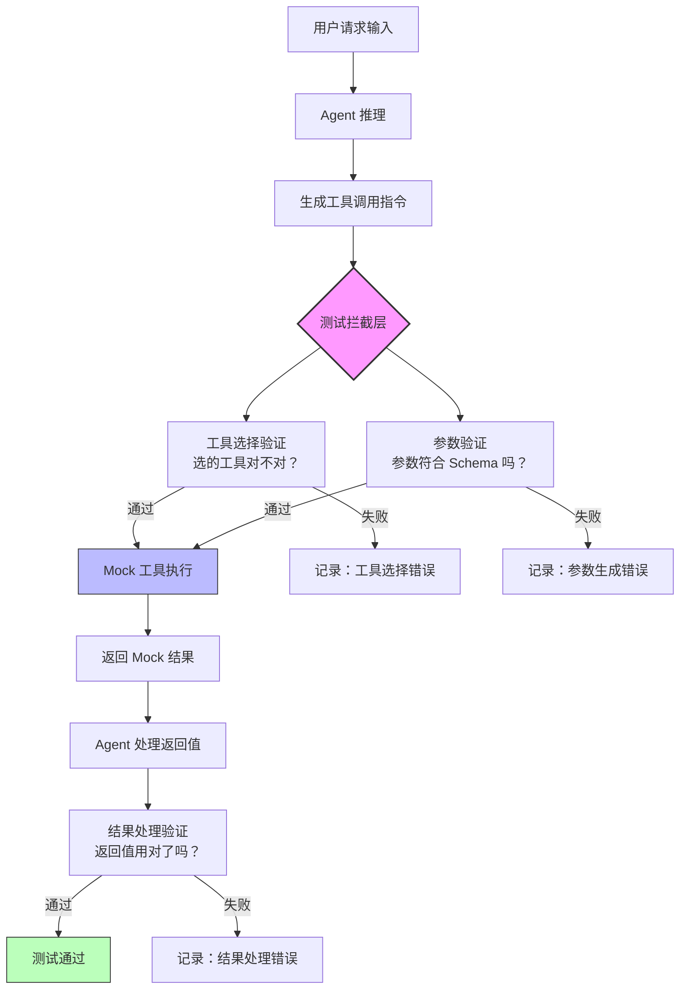
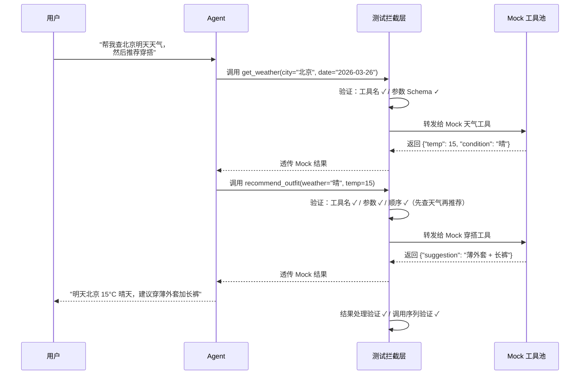

# 工具调用测试（Tool Calling Testing）

## 概念解释

工具调用测试（Tool Calling Testing）是专门针对 Agent 系统中"工具调用"环节的验证方法。它不关心模型能不能写出好文章，只关心一件事：**当 Agent 决定调用外部工具时，它选的工具对不对、传的参数准不准、调用顺序合不合理、拿到结果后处不处理得了**。

为什么需要单独测试这个环节？因为"理解用户意图"和"正确调用工具"是两回事。一个 Agent 完全理解了用户想查北京天气，但调用 `get_weather` 时把城市参数写成了 `"beijing"` 而不是 API 要求的 `"北京"`，或者把日期格式搞错了——这类问题纯靠端到端测试很难定位。工具调用测试把 Agent 的推理能力和工具交互能力拆开，用结构化手段逐一验证，出了问题能精确到"是选错了工具"还是"参数类型不对"还是"调用顺序反了"。

传统做法要么跑完整的集成测试（成本高、反馈慢、问题难定位），要么干脆不测（上线后频繁出 bug）。工具调用测试的核心思路是：**用 Mock 工具替代真实外部服务，用 Schema 验证替代人工检查，用调用轨迹追踪替代黑盒猜测**——在不依赖外部服务的前提下，快速、可重复地验证工具调用链路的正确性。

## 关键结构

工具调用测试围绕四个核心验证维度展开，每个维度对应 Agent 工具调用链路中的一个关键环节：

| 验证维度 | 检查目标 | 典型问题 |
|----------|----------|----------|
| 工具选择验证 | Agent 是否选了正确的工具 | 选了语义相近但功能不同的工具 |
| 参数生成验证 | 生成的参数是否符合工具签名 | 类型错误、格式错误、必填缺失、数值越界 |
| 调用顺序验证 | 多工具调用序列是否满足依赖关系 | 跳步、重复调用、前后依赖颠倒 |
| 结果处理验证 | Agent 是否正确解析和使用了工具返回值 | 忽略错误码、曲解返回数据、未使用关键字段 |

### 维度 1：工具选择验证

Agent 通常面对多个可用工具。工具选择验证的核心是：**在给定的用户意图下，Agent 是否从候选工具中选出了正确的那一个**。

常见失败模式：
- 用户说"帮我订个会议室"，Agent 调用了 `search_meeting_rooms` 而不是 `book_meeting_room`
- 工具描述不够清晰时，Agent 容易在语义相近的工具之间犯错
- Agent 在不需要调用工具时强行调用（Docker 2025 评测中称为 Eager Invocation，即"急切调用"）

### 维度 2：参数生成验证

即使选对了工具，参数可能是错的。参数验证通常基于 JSON Schema 或 Pydantic 模型，检查以下几项：

- **类型检查**：期望整数但收到字符串
- **格式检查**：日期格式、邮箱格式、URL 格式是否符合要求
- **范围检查**：数值是否在允许范围内（如价格不能为负）
- **必填性检查**：所有 required 字段是否都提供了
- **枚举检查**：参数值是否在预定义的可选列表中
- **幻觉检测（Hallucination Detection）**：参数值是否是模型凭空编造的——既不在用户输入中，也不在系统提示中

### 维度 3：调用顺序验证

复杂任务往往需要多次工具调用，且调用之间存在依赖。例如"先查航班→再订酒店→最后生成行程"，如果 Agent 跳过查航班直接订酒店，后续数据就全错了。

但验证顺序时有一个重要原则：**不要过度规范化**。只要调用序列在逻辑上能完成任务、满足数据依赖，就应该接受——Agent 经常能找到人类没预想到但同样有效的执行路径。

### 维度 4：结果处理验证

工具返回结果后，Agent 需要正确解析并基于结果做出下一步决策。这个维度验证的是：
- Agent 是否读懂了返回的数据结构
- 是否正确处理了错误返回（如 `{"error": "timeout"}`）
- 是否把关键信息传递给了用户或下一个工具调用

## 核心原理

### 原理说明

工具调用测试的核心机制可以概括为三步：**拦截 → 验证 → 断言**。

**第一步：拦截工具调用**。在 Agent 运行时，通过中间件或钩子函数拦截所有工具调用请求，记录工具名称、参数 JSON、调用时间戳等信息。Agent 本身不知道自己被"监听"了，它的行为和正常运行时完全一致。

**第二步：用 Mock 工具替代真实服务**。拦截到的调用不会发送给真实的外部 API，而是交给预先准备好的 Mock 工具处理。Mock 工具根据输入参数返回预设的结果——可以是正常数据、错误码、超时异常等，由测试人员控制。

**第三步：多维断言**。对拦截到的调用记录进行结构化验证——工具名称是否正确（工具选择验证）、参数是否符合 Schema（参数验证）、多次调用的顺序是否合理（顺序验证）、Agent 对 Mock 返回值的处理是否正确（结果处理验证）。

这套机制的关键优势在于**隔离性**：测试完全不依赖外部服务，速度快（毫秒级）、可重复（每次结果一致）、成本低（不消耗真实 API 配额）。

测试框架通常提供两种评分模式：

- **Strict 模式**：工具名称、所有参数、返回值处理都必须完全匹配预期，适合金融、医疗等高风险场景
- **Flexible 模式**：只检查工具名称和关键参数，允许辅助参数差异，适合对话类等宽松场景

### Mermaid 图解



图中粉色的"测试拦截层"是整个机制的核心枢纽——它既是工具调用的截获点，也是多维验证的起始点。蓝色的"Mock 工具执行"替代了真实外部服务，使测试完全在本地完成。绿色的"测试通过"表示所有维度都验证成功。

在多工具调用场景下，整个流程会循环多次，测试框架还会额外检查多次调用之间的顺序关系：



### 运行示例

以下用一个最小示例展示工具调用测试的核心机制：定义工具签名、实现参数验证、编写测试断言。

```python
# 基于 pydantic==2.5.0、pytest==7.4.3 验证（截至 2026-03）

from pydantic import BaseModel, Field
from typing import Optional

# ---- 1. 定义工具签名（参数模型） ----

class WeatherParams(BaseModel):
    """天气查询工具的参数定义"""
    city: str = Field(..., description="城市名称")
    date: str = Field(..., pattern=r"^\d{4}-\d{2}-\d{2}$", description="日期，格式 YYYY-MM-DD")
    unit: Optional[str] = Field("celsius", description="温度单位: celsius | fahrenheit")

# ---- 2. 实现 Mock 工具 ----

class MockWeatherTool:
    """返回预设结果的假天气工具"""

    def execute(self, params: WeatherParams) -> dict:
        # 正常情况返回固定数据，用于验证 Agent 对返回值的处理
        return {"city": params.city, "date": params.date, "temp": 15, "condition": "晴"}

# ---- 3. 实现参数验证器 ----

def validate_params(params_dict: dict, model_class) -> tuple[bool, list[str]]:
    """用 Pydantic 模型验证参数字典，返回 (是否通过, 错误列表)"""
    try:
        model_class(**params_dict)
        return True, []
    except Exception as e:
        return False, [str(e)]

# ---- 4. 编写测试用例 ----

def test_correct_params():
    """验证正确参数能通过验证"""
    params = {"city": "北京", "date": "2026-03-26", "unit": "celsius"}
    is_valid, errors = validate_params(params, WeatherParams)
    assert is_valid, f"参数验证失败: {errors}"

    # 执行 Mock 工具，验证返回值结构
    tool = MockWeatherTool()
    result = tool.execute(WeatherParams(**params))
    assert "temp" in result and "condition" in result

def test_invalid_date_format():
    """验证错误的日期格式会被拦截"""
    params = {"city": "北京", "date": "03-26-2026"}  # 格式不对
    is_valid, errors = validate_params(params, WeatherParams)
    assert not is_valid, "应该拦截错误的日期格式"

def test_missing_required_field():
    """验证缺少必填字段会被检测"""
    params = {"date": "2026-03-26"}  # 缺少 city
    is_valid, errors = validate_params(params, WeatherParams)
    assert not is_valid, "应该检测到缺少 city 字段"

def test_call_sequence():
    """验证多工具调用的顺序合理性"""
    # 模拟 Agent 的调用记录
    call_log = [
        {"tool": "get_weather", "params": {"city": "北京", "date": "2026-03-26"}},
        {"tool": "recommend_outfit", "params": {"weather": "晴", "temp": 15}},
    ]
    # 断言：必须先查天气再推荐穿搭（穿搭依赖天气数据）
    tool_names = [c["tool"] for c in call_log]
    assert tool_names.index("get_weather") < tool_names.index("recommend_outfit"), \
        "调用顺序错误：应先查天气再推荐穿搭"
```

上述代码对应三个验证维度：`test_correct_params` 和 `test_invalid_date_format` / `test_missing_required_field` 覆盖参数验证，`test_call_sequence` 覆盖调用顺序验证。Mock 工具返回固定数据，使测试不依赖任何外部服务。

## 易混概念辨析

| 概念 | 与工具调用测试的区别 | 更适合关注的重点 |
|------|---------------------|------------------|
| 端到端测试（E2E Testing） | 跑完整 Agent 流程（从用户输入到最终输出），不拆分中间环节 | 验证整体用户体验和最终结果，成本高但覆盖面广 |
| LLM 输出测试 | 验证模型生成的文本质量（准确性、连贯性、安全性） | 关注模型的文本生成能力，不涉及工具交互 |
| API 单元测试 | 测试工具/API 本身的功能是否正确 | 关注工具实现的正确性，与 Agent 无关 |
| Agent 评估（Agent Evaluation） | 更宏观的评估体系，涵盖推理能力、任务完成率、效率等多维度 | 关注 Agent 整体能力水平，工具调用只是其中一个维度 |

核心区别：

- **工具调用测试**：聚焦于 Agent 和工具之间的"接口层"——选对工具、传对参数、顺序合理、结果处理正确
- **端到端测试**：不拆分中间环节，只看最终结果对不对，出了问题难以定位是哪个环节的错
- **LLM 输出测试**：只关心模型生成的文本内容，不涉及工具调用这条链路
- **Agent 评估**：是一个更大的框架，工具调用测试是其中的一个子集

## 适用边界与局限

### 适用场景

1. **工具密集型 Agent**：Agent 需要频繁调用外部 API（搜索、数据库查询、文件操作等），工具调用的正确性直接决定任务成败
2. **高风险业务场景**：金融交易、医疗查询、权限操作等场景，参数错误可能导致严重后果，必须在上线前逐项验证
3. **多工具编排场景**：任务需要按特定顺序调用多个工具（如 ETL 流程、旅行规划），调用顺序的合理性直接影响结果
4. **CI/CD 快速回归**：使用 Mock 工具后，测试速度快（毫秒级）、不依赖外部服务，适合在每次代码提交时自动运行

### 不适合的场景

1. **纯文本生成任务**：如果 Agent 的核心能力是写文章、总结文档，不涉及工具调用，这套测试方法无用武之地
2. **探索性对话场景**：开放式聊天场景中，Agent 可能不需要调用任何工具，或者调用行为高度不确定，难以预定义期望的调用序列

### 局限性

1. **Mock 与真实服务的差距**：Mock 工具无法完全还原真实 API 的行为（如网络延迟、限流、数据分布），测试通过不等于线上没问题。生产环境仍需补充集成测试
2. **工具签名变更的维护成本**：当工具的参数定义更新时，所有相关的 Mock 定义、验证规则、测试用例都需要同步修改，维护负担随工具数量线性增长
3. **LLM 输出的非确定性**：同一个输入，LLM 每次生成的工具调用参数可能不同，导致测试结果不稳定。通常需要设置 `temperature=0` 或多次运行取通过率来缓解
4. **复杂工具交互难以 Mock**：多个工具之间存在复杂数据传递时（如工具 A 的输出是工具 B 的输入），简单的 Mock 可能无法覆盖所有数据流组合

## 常见误区

| 常见误区 | 正确理解 |
|----------|----------|
| 工具调用成功就等于调用正确 | 一个参数填错的调用也能"成功执行"并返回结果，但结果是错的。必须验证参数的准确性，而非仅仅检查是否抛异常 |
| 调用顺序必须和预期完全一致 | 过度规范化顺序会让测试变得脆弱。只要调用序列在逻辑上满足数据依赖关系、能完成任务，就应该接受。Agent 常能找到更优的执行路径 |
| 用字符串比对来验证参数 | 应该使用 Schema 验证（如 Pydantic、JSON Schema），能捕获类型错误、范围溢出、格式不匹配等深层问题，字符串比对只能发现拼写差异 |
| Mock 工具的返回值要和真实服务完全一样 | Mock 的目的是快速反馈和可重复性，不是完全还原真实服务。用简化的 Mock 数据即可，但要覆盖成功、失败、空结果、超时等关键场景 |
| 测试通过就能上线 | 工具调用测试只覆盖"接口层"。上线前还需要集成测试（验证真实 API 的兼容性）和端到端测试（验证完整用户体验） |

## 思考题

<details>
<summary>初级：工具调用测试主要验证哪四个维度？为什么不能只靠端到端测试来覆盖这些维度？</summary>

**参考答案：**

四个维度是：工具选择验证（选对工具）、参数生成验证（传对参数）、调用顺序验证（顺序合理）、结果处理验证（用对返回值）。

端到端测试只看最终输出对不对，无法区分"是哪个环节出了问题"。例如最终结果错误，可能是选错了工具、也可能是参数格式不对、也可能是调用顺序颠倒——端到端测试只能告诉你"结果错了"，但工具调用测试能精确定位到具体环节。

</details>

<details>
<summary>中级：在设计调用顺序验证时，如何在"确保逻辑正确"和"避免测试脆弱"之间取得平衡？</summary>

**参考答案：**

关键原则是**验证数据依赖关系，而非死板的调用顺序**。具体做法：

1. 只断言有因果依赖的工具之间的先后关系（如"必须先查天气才能推荐穿搭"），不断言无依赖工具之间的顺序
2. 使用偏序（Partial Order）而非全序（Total Order）来定义预期序列——允许无依赖的工具调用以任意顺序执行
3. 如果 Agent 找到了一条不同于预期但同样有效的执行路径，测试应判定通过而非失败

</details>

<details>
<summary>中级/进阶：假设你负责一个金融交易 Agent 的工具调用测试，该 Agent 有"查询余额"、"转账"、"风险评估"三个工具。请设计一套测试策略，说明需要覆盖哪些场景。</summary>

**参考答案：**

金融场景应采用 Strict 模式，测试策略需覆盖：

**工具选择安全性**：验证 Agent 在用户只说"查一下余额"时不会调用"转账"工具；验证 Agent 不会调用未授权的工具。

**参数安全验证**：转账金额不能为负、不能超过余额上限；账户号格式必须符合规范；验证 Agent 不会幻觉编造账户号（Hallucination Detection）。

**强制调用顺序**：转账前必须先调用风险评估；风险评估返回"高风险"时，Agent 必须拒绝转账而非强行执行。

**错误处理**：Mock 转账工具返回"余额不足"时，Agent 应友好提示而非重复尝试；Mock 风险评估超时时，Agent 应拒绝继续操作而非跳过风控。

**审计完整性**：每次工具调用的完整记录（参数、返回值、时间戳）都应可追溯，确保合规审计需求。

</details>

## 参考资料

1. Giskard, 2024. "Function Calling in LLMs: Testing Agent Tool Usage for AI Security." https://www.giskard.ai/knowledge/function-calling-in-llms-testing-agent-tool-usage-for-ai-security

2. Symflower, 2025. "Function Calling in LLM Agents." https://symflower.com/en/company/blog/2025/function-calling-llm-agents/

3. Docker, 2025. "Local LLM Tool Calling: A Practical Evaluation." https://www.docker.com/blog/local-llm-tool-calling-a-practical-evaluation/

4. Databricks, 2025. "Beyond the Leaderboard: Unpacking Function Calling Evaluation." https://www.databricks.com/blog/unpacking-function-calling-eval

5. Berkeley Function Calling Leaderboard (BFCL). https://gorilla.cs.berkeley.edu/leaderboard.html

6. Anthropic, 2025. "Demystifying Evals for AI Agents." https://www.anthropic.com/engineering/demystifying-evals-for-ai-agents

7. AWS, 2025. "Evaluating AI Agents: Real-World Lessons from Building Agentic Systems at Amazon." https://aws.amazon.com/blogs/machine-learning/evaluating-ai-agents-real-world-lessons-from-building-agentic-systems-at-amazon/
