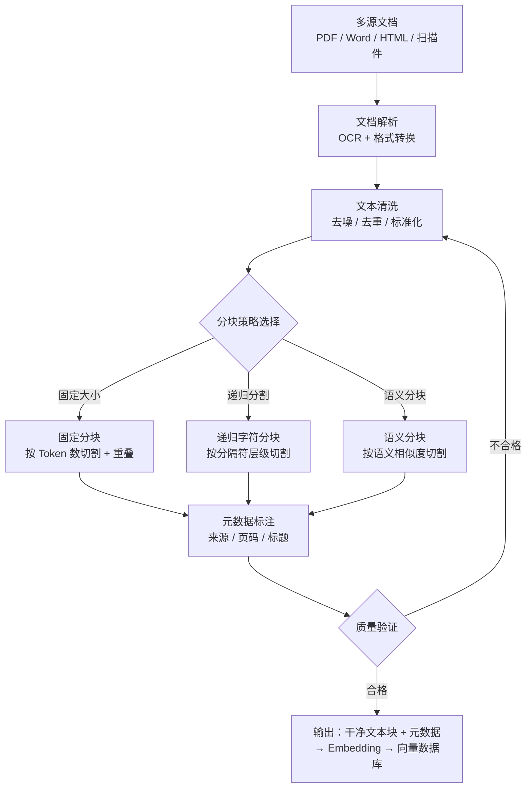
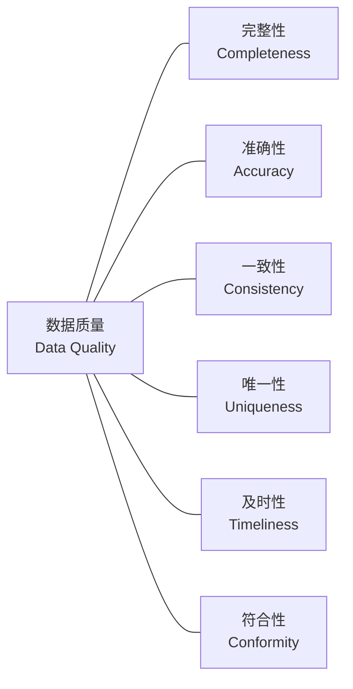

# 数据清洗与预处理（Data Cleaning & Preprocessing）

## 概念解释

数据清洗与预处理是把"脏数据"变成"可用数据"的系统化工程。它的任务是在数据送入模型之前，把缺失值、重复项、格式混乱、噪声文本等问题全部处理掉，让后续的训练、检索、推理都能跑在可靠的数据地基上。

这件事之所以重要，是因为 AI 系统遵循一条铁律：**Garbage In, Garbage Out**（垃圾进，垃圾出）。无论模型本身多强大，如果喂给它的数据里充满错别字、重复记录和乱码，输出质量一定崩塌。根据行业经验，数据准备工作通常占 AI 项目总工作量的 60-80%，deepset 的 RAG 项目实践中，索引管道（数据清洗+分块）约占整个 RAG 项目 50% 的工作量。

在传统机器学习场景中，数据清洗主要针对结构化表格数据（缺失值、异常值、类型转换）。而在当前 LLM 和 RAG 场景中，数据清洗的重心已经明显转移到**非结构化文档处理**——如何从 PDF、Word、网页、扫描件中提取干净文本，如何做智能分块（Chunking），如何保留元数据（Metadata）以提升检索精度。这是当下数据预处理的核心战场。

## 关键结构

数据清洗与预处理可以从四个阶段来理解，每个阶段解决一类核心问题：

| 阶段 | 作用 | 典型操作 |
|------|------|---------|
| 数据清洗（Data Cleaning） | 消除数据中的错误和缺陷 | 缺失值处理、异常值检测、去重、噪声去除 |
| 数据集成（Data Integration） | 把多来源数据合并为统一格式 | 实体匹配、模式冲突解决、跨源去重 |
| 数据转换（Data Transformation） | 把数据转化为模型可用的格式 | 文本分块、编码转换、标准化/归一化、特征构造 |
| 数据规约（Data Reduction） | 在保留信息的前提下减少数据量 | 去冗余特征、采样、聚合 |

### 阶段 1：数据清洗

最基础也最耗时的一步。具体包括：

- **缺失值处理**：对空值、NaN 采用删除、填充（均值/中位数/众数）或标记策略，选择取决于缺失比例和缺失原因
- **异常值检测**：通过统计方法（Z-score、IQR）或模型方法（Isolation Forest）识别离群点，再根据业务判断保留或删除
- **去重**：精确去重（完全相同的行）和近似去重（内容基本相同但有细微差异），文本场景还涉及 MinHash/SimHash 等近似匹配
- **噪声去除**：移除 HTML 标签、特殊字符、页眉页脚、水印文字等无关内容

### 阶段 2：数据集成

把来自多个系统、多种格式的数据统一起来。比如同一个客户在 CRM、工单、订单系统里有三种不同的名字表示，需要做实体匹配和冲突解决，合并成一条统一记录。在 RAG 场景中，这一步对应的是把 PDF、Word、PPT、网页等不同格式的文档统一解析为结构化文本。

### 阶段 3：数据转换

把清洗过的数据转化为下游任务需要的格式。在传统 ML 中主要是数值标准化和编码转换；在 LLM/RAG 场景中，**文本分块（Chunking）** 是这一阶段的核心操作——把长文档切成适合 Embedding 模型和 LLM 上下文窗口的片段，并附加元数据（来源、页码、标题层级等）。

### 阶段 4：数据规约

在保留关键信息的前提下压缩数据规模。包括去除冗余特征、对大数据集做有策略的采样、或将低粒度数据聚合为高粒度数据，目标是降低存储和计算成本。

## 核心原理

### 原理说明

数据清洗与预处理的核心逻辑是一条**流水线（Pipeline）**：原始数据从入口进入，经过多个处理阶段逐步"净化"，最终输出高质量的可用数据。

以当前最典型的 RAG 数据预处理场景为例，整个流程如下：

1. **文档采集**：从多种来源（PDF、Word、网页、数据库）收集原始文档
2. **文档解析**：使用 OCR 或文档解析工具（如 Unstructured.io、Docling）把非结构化文档转换为纯文本或 Markdown
3. **文本清洗**：去除页眉页脚、水印、重复模板内容、特殊字符等噪声
4. **文本分块**：按照选定策略（固定大小、递归字符分割、语义分块等）把长文本切成适合 Embedding 的片段
5. **元数据标注**：为每个分块附加来源信息（文件名、页码、标题层级、创建时间等）
6. **质量验证**：检查分块质量（完整性、去重率、一致性），不合格的数据回流清洗
7. **输出**：干净的文本块 + 元数据，送入 Embedding 模型进行向量化

关键判断发生在**分块策略选择**和**质量验证**两个环节。分块策略直接决定检索质量的上限——分块太大，检索到的上下文噪声多；分块太小，语义碎片化导致丢失关键信息。质量验证则是整个管道的守门人，保证进入向量库的数据质量达标。

### Mermaid 图解

**完整数据预处理管道（RAG 场景）：**



图中核心流转：

- **文档解析**是入口瓶颈——解析质量差，后续所有环节的努力都白费
- **分块策略选择**是质量拐点——策略选对，检索召回率可提升 40% 以上
- **质量验证 → 文本清洗**的回流箭头表示管道是闭环的，不合格数据会被打回重新处理

**数据质量评估六维度：**



六个维度缺一不可：完整性看缺失值比例、准确性看数据是否与真实世界一致、一致性看多来源数据是否冲突、唯一性看重复率、及时性看数据是否过期、符合性看数据是否满足预定义的格式规范。

### 运行示例

以下示例演示 RAG 场景中最核心的两个操作：文本清洗和分块策略对比。

```python
import re

# ========== 第一部分：文本清洗 ==========

def clean_document_text(text: str) -> str:
    """
    对文档解析后的原始文本进行清洗。
    适用于从 PDF/HTML 提取的文本，去除常见噪声。
    """
    # 移除 HTML 标签
    text = re.sub(r'<[^>]+>', '', text)
    # 移除 URL
    text = re.sub(r'http\S+|www\.\S+', '', text)
    # 移除多余空白（多个空格/换行合并为单个）
    text = re.sub(r'\s+', ' ', text)
    # 移除页眉页脚常见模式（如"第X页"、"Page X of Y"）
    text = re.sub(r'(第\s*\d+\s*页|Page\s+\d+\s*(of\s+\d+)?)', '', text, flags=re.IGNORECASE)
    return text.strip()

# 模拟从 PDF 提取的脏文本
raw_text = """
<html>第 1 页</html>
  RAG（Retrieval-Augmented   Generation）是一种结合检索与生成的技术范式。

它通过从外部知识库检索相关文档片段，   将其注入 LLM 的上下文窗口，
从而让模型基于真实数据生成回答，减少幻觉问题。
参考链接：https://example.com/rag-intro    Page 2 of 10
"""

cleaned = clean_document_text(raw_text)
print("清洗前:", repr(raw_text[:80]))
print("清洗后:", cleaned)
# 输出: RAG（Retrieval-Augmented Generation）是一种结合检索与生成的技术范式。
#        它通过从外部知识库检索相关文档片段， 将其注入 LLM 的上下文窗口，
#        从而让模型基于真实数据生成回答，减少幻觉问题。 参考链接：

# ========== 第二部分：分块策略对比 ==========

def fixed_size_chunk(text: str, chunk_size: int = 100, overlap: int = 20) -> list[str]:
    """
    固定大小分块：按字符数切割，带重叠窗口。
    chunk_size: 每块最大字符数
    overlap: 相邻块重叠的字符数
    """
    chunks = []
    start = 0
    while start < len(text):
        end = start + chunk_size
        chunks.append(text[start:end])
        start = end - overlap  # 重叠部分
    return chunks

def recursive_split(text: str, chunk_size: int = 100, separators: list[str] = None) -> list[str]:
    """
    递归字符分块：按分隔符层级切割，优先在段落/句子边界处断开。
    分隔符优先级：双换行 > 单换行 > 句号 > 空格
    """
    if separators is None:
        separators = ['\n\n', '\n', '。', '．', '. ', ' ']
    if len(text) <= chunk_size:
        return [text] if text.strip() else []
    for sep in separators:
        if sep in text:
            parts = text.split(sep)
            chunks = []
            current = ''
            for part in parts:
                candidate = current + sep + part if current else part
                if len(candidate) <= chunk_size:
                    current = candidate
                else:
                    if current:
                        chunks.append(current.strip())
                    current = part
            if current:
                chunks.append(current.strip())
            return [c for c in chunks if c]
    # 所有分隔符都找不到，强制按字符数切割
    return fixed_size_chunk(text, chunk_size, overlap=0)

sample = "RAG 是检索增强生成技术。它从外部知识库检索文档片段。然后将片段注入 LLM 上下文窗口。模型基于真实数据生成回答。这样可以减少幻觉问题。"

print("\n--- 固定大小分块（chunk_size=40）---")
for i, c in enumerate(fixed_size_chunk(sample, chunk_size=40, overlap=10)):
    print(f"  块{i}: [{len(c)}字符] {c}")

print("\n--- 递归字符分块（chunk_size=60）---")
for i, c in enumerate(recursive_split(sample, chunk_size=60)):
    print(f"  块{i}: [{len(c)}字符] {c}")
```

上述代码展示了两件事：`clean_document_text` 对应管道中的"文本清洗"环节；`fixed_size_chunk` 和 `recursive_split` 对应"分块策略选择"环节。固定分块简单但容易切断语义，递归分块尽量在自然边界处断开，保留更完整的语义。实际 RAG 项目中，递归字符分块（512 token，15% 重叠）是目前综合表现最好的基线策略。

## 易混概念辨析

| 概念 | 与数据清洗与预处理的区别 | 更适合关注的重点 |
|------|------------------------|------------------|
| 特征工程（Feature Engineering） | 数据清洗在前、特征工程在后；清洗解决"数据干不干净"，特征工程解决"哪些信息对模型有用" | 如何从干净数据中构造有区分力的特征 |
| ETL（Extract-Transform-Load） | ETL 是数据仓库领域的概念，覆盖提取-转换-加载全流程；数据清洗是 ETL 中 Transform 阶段的一个子环节 | 端到端的数据管道编排与调度 |
| 数据标注（Data Labeling） | 数据清洗处理数据质量问题，数据标注是给数据加上标签（分类、实体、情感等）以供监督学习使用 | 如何高效、高质量地给数据打标签 |
| 文本分块（Chunking） | Chunking 是数据预处理管道中的一个具体步骤，专注于把长文档切成适合检索的片段；数据清洗与预处理是更大的概念，包含 Chunking 在内 | 分块策略选择与检索质量优化 |

核心区别：

- **数据清洗与预处理**：关注"让数据从不可用变为可用"，是整个数据管道的基础工程
- **特征工程**：关注"从可用数据中提取有价值的信号"，是清洗之后的下一步
- **ETL**：关注"数据如何在系统间流动和转换"，是更大范围的管道架构
- **文本分块**：关注"长文本如何切割成检索友好的片段"，是预处理管道中的一个关键步骤

## 适用边界与局限

### 适用场景

1. **RAG 系统的数据准备**：将企业文档（PDF、Word、网页）转化为干净的文本块送入向量数据库，是当前最高频的应用场景。RAG 项目中数据预处理约占 50% 的工作量，做好这一步直接决定检索质量
2. **LLM 微调的训练数据清洗**：去重、去噪、PII 脱敏（个人身份信息去除）是微调前的必要步骤，数据质量直接影响微调效果
3. **结构化数据的模型训练准备**：传统 ML 场景中处理表格数据的缺失值、异常值、格式不一致等问题

### 不适合的场景

1. **数据量极小的快速原型验证**：如果只有几十条数据做 POC，花大量时间搭建清洗管道不如手工检查直接有效
2. **实时流式数据的即时推理**：清洗管道有处理延迟，对于毫秒级响应要求的实时推理场景，需要另行设计轻量级的在线清洗策略

### 局限性

1. **强依赖领域知识**：什么算"异常值"、哪些字段该填充哪些该删除，离开具体业务上下文无法判断。通用清洗规则在特定行业中可能适得其反
2. **自动化边界有限**：虽然 Unstructured.io、Great Expectations 等工具能覆盖大部分场景，但复杂表格、扫描件中的手写体、多语言混排等情况仍需人工干预
3. **清洗规则会过时**：随着新数据的加入和业务规则变化，之前有效的清洗逻辑可能不再适用，需要定期回顾和更新管道配置
4. **信息损失不可逆**：去除异常值或去重时可能误删有价值的数据，而且一旦删除很难恢复。需要在清洗前做好数据备份和审计日志

## 常见误区

| 常见误区 | 正确理解 |
|----------|----------|
| 删除所有缺失值是最安全的做法 | 盲目删除会丢失有价值的样本。应先分析缺失原因和比例——随机缺失且比例低于 5% 可以考虑删除，系统性缺失则需要根据业务逻辑填充或标记 |
| 异常值都是坏数据，应该全部去掉 | 异常值可能是真实的极端情况（如欺诈交易、产品缺陷），在风控、质检等场景中恰恰是最有价值的数据。先查原因，再决定处理策略 |
| 数据清洗做一次就够了 | 数据清洗是持续过程。生产环境中数据源会不断变化，必须建立自动化的质量监测和告警机制，定期验证清洗规则是否仍然有效 |
| RAG 只要文档能解析出文字就行，不需要清洗 | 文档解析出的原始文本通常包含大量噪声（页眉页脚、水印、重复模板、表格乱码），不清洗直接入库会严重污染检索结果。deepset 的实践表明，去除页眉页脚等无关内容可以将检索相关性提升约 40% |

## 思考题

<details>
<summary>初级：数据清洗与预处理的四个阶段分别是什么？在 RAG 场景中，哪个阶段最关键？</summary>

**参考答案：**

四个阶段：数据清洗（去噪去重）、数据集成（多源合并）、数据转换（格式/分块）、数据规约（压缩规模）。在 RAG 场景中，数据转换阶段最关键，因为文本分块（Chunking）的策略直接决定了检索质量的上限——块太大导致噪声多、块太小导致语义碎片化。

</details>

<details>
<summary>中级：固定大小分块和递归字符分块各有什么优缺点？在什么场景下应该选择哪种？</summary>

**参考答案：**

固定大小分块实现简单、行为可预测，但会在任意位置截断语义。递归字符分块按分隔符层级（段落 > 句子 > 空格）优先在自然边界处切割，语义保留更好，但实现稍复杂且分块大小不均匀。

选择建议：格式规整、段落结构清晰的文档（如技术手册）适合递归分块；格式混乱或纯流式文本适合固定分块作为兜底策略。2025 年的基准测试表明，递归 512-token 分块在综合准确率上排第一（69%），是当前推荐的默认基线。

</details>

<details>
<summary>中级/进阶：你接手一个企业 RAG 项目，知识库包含 5000 份 PDF 文档（含扫描件），用户反馈检索结果经常不相关。请设计一套数据预处理改进方案。</summary>

**参考答案：**

分三步排查和改进：

1. **文档解析层**：检查扫描件的 OCR 质量，如果当前用的是简单 OCR，换成 Docling 或 Unstructured.io 等支持版面分析的工具，确保表格、多栏排版不会被解析为乱序文本
2. **清洗层**：添加去除页眉页脚、目录页、版权声明、重复模板内容的规则；对高度重复的文档做跨文档去重（MinHash）
3. **分块层**：从固定分块切换为递归字符分块（512 token，15% 重叠），为每个分块附加元数据（文件名、章节标题、页码），并在检索时利用元数据做过滤

改进效果的验证方式：用 nDCG 评估检索质量、用 RAGAS 框架评估端到端 RAG 表现，对比改进前后的指标。

</details>

## 参考资料

1. [Four Data Cleaning Techniques to Improve LLM Performance - Intel](https://medium.com/intel-tech/four-data-cleaning-techniques-to-improve-large-language-model-llm-performance-77bee9003625)
2. [The Role of Data Preprocessing in RAG - deepset](https://www.deepset.ai/blog/preprocessing-rag)
3. [Chunking Strategies to Improve LLM RAG Pipeline Performance - Weaviate](https://weaviate.io/blog/chunking-strategies-for-rag)
4. [Finding the Best Chunking Strategy for Accurate AI Responses - NVIDIA](https://developer.nvidia.com/blog/finding-the-best-chunking-strategy-for-accurate-ai-responses/)
5. [What Matters for LLM Data Ingestion and Preprocessing - Unstructured.io](https://unstructured.io/blog/understanding-what-matters-for-llm-ingestion-and-preprocessing)
6. [Mastering Data Cleaning for Fine-Tuning LLMs and RAG - AI Alliance](https://thealliance.ai/blog/mastering-data-cleaning-for-fine-tuning-llms-and-r)
7. [Document Chunking for RAG: 9 Strategies Tested - LLM Practical Experience Hub](https://langcopilot.com/posts/2025-10-11-document-chunking-for-rag-practical-guide)

---
