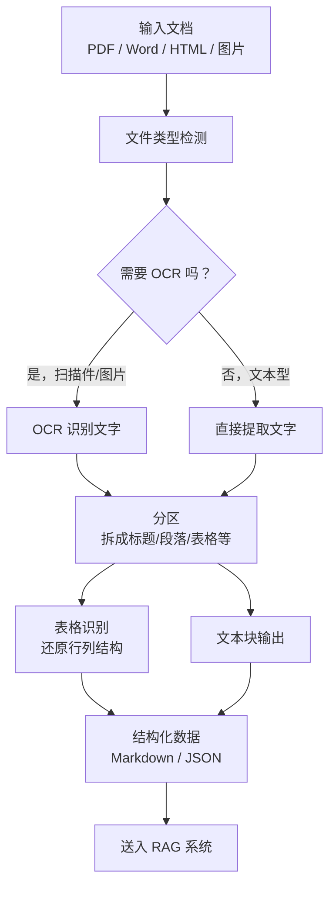

# 文档解析工具（Document Parsing Tools）

## 基础概念

文档解析工具的核心任务只有一句话：**把人看的文件（PDF、Word、PPT……）变成机器能用的结构化数据**。

为什么需要它？因为 RAG（检索增强生成）系统的第一步就是把知识库里的文档"读进去"。PDF 里的文字、表格、图片对人来说一目了然，但对程序来说只是一堆字节流——没有标题层级，没有段落边界，表格也只是一串坐标数字。文档解析工具就是帮你把这些"乱七八糟的字节"整理成干净的文本块、表格、标题等结构化单元，供后续的向量化和检索使用。

### 核心要素

| 要素 | 作用 |
|------|------|
| **分区（Partitioning）** | 把一整份文档拆成最小的语义单元：标题、段落、表格、图片各自独立 |
| **表格识别（Table Detection）** | 自动识别表格的行列结构，输出为 HTML 或 Markdown，而非一堆乱序文字 |
| **OCR（光学字符识别）** | 处理扫描件和图片型 PDF——先"看"图片里有什么字，再提取出来 |

### 分区（Partitioning）

分区是整个流程的起点。一份 PDF 在底层其实没有"段落""标题"的概念，只有一个个字符和它们的坐标。分区的工作就是根据字体大小、位置关系、空白间隔等线索，自动判断哪些字符属于标题、哪些属于正文、哪些是表格内容，然后把它们切成独立的语义单元。

打个比方：分区就像把一锅大杂烩分拣成"肉归肉、菜归菜、汤归汤"。

### 表格识别（Table Detection）

表格是文档解析中最难的部分。简单的文本提取会把表格内容按行拼成一串文字，完全丧失行列结构。表格识别通过计算机视觉技术检测单元格边界，还原完整的行列关系，输出为 HTML `<table>` 或 Markdown 表格格式。

### OCR（光学字符识别）

有两类 PDF：一类是"可选中文字的"（文本层 PDF），可以直接提取文字；另一类是"扫描件"（图片型 PDF），本质上是一张张图片，必须先用 OCR 把图片里的文字"认"出来。现代工具通常内置 OCR 能力，能自动判断是否需要 OCR。

### 要素关系图



文件进来后，先判断类型和是否需要 OCR；然后统一做分区，把内容拆成语义单元；表格部分单独做结构识别；最终输出干净的结构化数据。

## 基础用法

安装依赖（三个主流工具任选其一）：

```bash
# 方案一：Unstructured（通用多格式解析，功能最全）
pip install "unstructured[all-docs]"

# 方案二：Docling（IBM 出品，表格识别精度高，速度快）
pip install docling

# 方案三：LlamaParse（LlamaIndex 生态，云端解析，速度最快）
pip install llama-parse
```

- **Unstructured**：开源免费，本地运行，不需要 API Key
- **Docling**：开源免费，本地运行，不需要 API Key，需要 Python >= 3.10
- **LlamaParse**：云端服务，需要在 https://cloud.llamaindex.ai 注册获取免费 API Key（每天 1000 页免费额度）

---

**最小可运行示例 1：Unstructured**（基于 unstructured==0.21.5 验证，截至 2026-03）

```python
from unstructured.partition.auto import partition
from unstructured.chunking.basic import chunk_elements
import tempfile
import os

# 创建一个示例文本文件（实际使用时替换为 PDF/Word 路径）
sample_text = """人工智能基础概念

第一章 什么是 Agent
Agent 是能够感知环境并采取行动的智能体。
它可以使用工具、调用 API、与用户对话。

第二章 什么是 RAG
RAG 是检索增强生成的缩写。
它先从知识库中检索相关文档，再让 LLM 基于这些文档生成回答。
"""

# 写入临时文件
tmp = tempfile.NamedTemporaryFile(
    mode='w', suffix='.txt', delete=False, encoding='utf-8'
)
tmp.write(sample_text)
tmp.close()

# 第一步：分区——把文档拆成语义单元
elements = partition(tmp.name)
print(f"分区完成，识别出 {len(elements)} 个语义单元：")
for el in elements:
    print(f"  [{type(el).__name__}] {el.text[:50]}")

# 第二步：分块——把语义单元组合成适合 RAG 的块
chunks = chunk_elements(elements, max_characters=200, overlap=30)
print(f"\n分块完成，生成 {len(chunks)} 个语义块：")
for i, chunk in enumerate(chunks):
    print(f"  块 {i+1}（{len(chunk.text)} 字符）: {chunk.text[:60]}...")

os.unlink(tmp.name)
```

预期输出：

```text
分区完成，识别出 6 个语义单元：
  [Title] 人工智能基础概念
  [Title] 第一章 什么是 Agent
  [NarrativeText] Agent 是能够感知环境并采取行动的智能体。
  [NarrativeText] 它可以使用工具、调用 API、与用户对话。
  [Title] 第二章 什么是 RAG
  [NarrativeText] RAG 是检索增强生成的缩写。它先从知识库中检索相关文档...

分块完成，生成 2 个语义块：
  块 1（148 字符）: 人工智能基础概念 第一章 什么是 Agent Agent 是能够感知环境并采取行动的智能体...
  块 2（132 字符）: 第二章 什么是 RAG RAG 是检索增强生成的缩写。它先从知识库中检索相关文档...
```

---

**最小可运行示例 2：Docling**（基于 docling==2.81.0 验证，截至 2026-03）

```python
from docling.document_converter import DocumentConverter
import tempfile
import os

# 创建示例文件
sample_text = """# Agent 开发入门

Agent 是能够自主决策并执行任务的 AI 程序。
核心组件包括：LLM、工具调用、记忆系统。
"""
tmp = tempfile.NamedTemporaryFile(
    mode='w', suffix='.md', delete=False, encoding='utf-8'
)
tmp.write(sample_text)
tmp.close()

# 一行代码完成解析
converter = DocumentConverter()
result = converter.convert(tmp.name)

# 导出为 Markdown
md_output = result.document.export_to_markdown()
print("解析结果（Markdown）：")
print(md_output)

os.unlink(tmp.name)
```

预期输出：

```text
解析结果（Markdown）：
# Agent 开发入门

Agent 是能够自主决策并执行任务的 AI 程序。
核心组件包括：LLM、工具调用、记忆系统。
```

Docling 的 API 极其简洁：`DocumentConverter().convert(路径)` 一行搞定，支持本地路径和 URL。

## 同类工具对比

| 维度 | Unstructured | Docling | LlamaParse |
|------|-------------|---------|------------|
| 核心定位 | 通用多格式解析 + 语义分块 | 高精度文档理解 + 结构还原 | 云端快速解析，LlamaIndex 原生集成 |
| 运行方式 | 本地（开源）/ 云端 API | 本地（开源） | 云端 API |
| 支持格式 | 20+ 种（PDF、Word、PPT、HTML 等） | PDF、DOCX、PPTX、HTML、图片等 | PDF、DOCX、PPTX 等 |
| 表格识别精度 | 中等，复杂表格偶有列偏移 | 高（评测 97.9% 准确率） | 中等，简单表格准确 |
| 解析速度 | 较慢（50 页约 141 秒） | 快 | 最快（约 6 秒，各页数一致） |
| 是否需要 API Key | 本地不需要，云端需要 | 不需要 | 需要（免费额度 1000 页/天） |
| 语义分块 | 内置支持 | 需额外处理 | 需额外处理 |

核心区别：

- **Unstructured**：格式支持最广，内置分区 + 分块一条龙，适合需要处理多种文件格式的 RAG 管道
- **Docling**：IBM 出品，表格识别精度最高，API 最简洁，适合对解析质量要求高的场景
- **LlamaParse**：云端运行速度最快，与 LlamaIndex 无缝集成，适合已用 LlamaIndex 且追求开发效率的团队

## 常见误区

| 误区 | 准确理解 |
|------|----------|
| 所有 PDF 都能直接提取文字 | 扫描件和图片型 PDF 没有文本层，必须先用 OCR 识别文字后才能提取 |
| 解析完直接喂给 LLM 就行 | 解析后还需要做语义分块（Chunking），控制每块大小和重叠度，RAG 检索质量才会好 |
| 工具越贵/越复杂效果越好 | 纯文本 PDF 用 PyPDF 就够了；只有复杂表格、扫描件才需要重型工具 |

## 优劣势分析

| 优势 | 劣势 |
|------|------|
| 自动化程度高，几行代码完成从原始文档到结构化数据的转换 | 复杂布局（多栏、嵌套表格）仍是行业难题，没有工具能 100% 搞定 |
| 主流工具均开源或提供免费额度，入门门槛低 | 高精度解析（hi_res / OCR）对硬件要求高，处理速度慢 |
| 与 RAG 生态深度集成（LangChain、LlamaIndex 均有官方适配） | 中文文档的解析质量普遍不如英文，需额外调优 |

## 思考题

<details>
<summary>初级：为什么 RAG 系统要先"分区"再"分块"，而不是直接按固定长度切割文档？</summary>

**参考答案：**

直接按固定长度切割会破坏语义完整性——可能把一个表格从中间切开，或者把标题和它下面的段落分到不同块里。先分区把文档拆成标题、段落、表格等独立语义单元，再在此基础上按大小组合成块，能保证每个块内的内容是语义完整的，生成的向量嵌入质量更高，RAG 检索准确率也更好。

</details>

<details>
<summary>中级：什么情况下该用 Unstructured 的 hi_res 策略，什么情况下用 fast 策略？</summary>

**参考答案：**

- **fast 策略**：直接从 PDF 的文本层提取文字，速度快、资源占用低。适合纯文本型 PDF（比如程序生成的报告、论文）。
- **hi_res 策略**：调用计算机视觉模型分析页面布局，能识别表格结构、处理扫描件。适合包含表格、图表、多栏排版、或扫描件的复杂文档。

判断标准：如果文档里有表格或扫描页，用 hi_res；如果只是纯文字，用 fast 就够了。

</details>

<details>
<summary>中级：Docling、Unstructured、LlamaParse 三者怎么选？如果你的项目同时有 PDF 和 Word 文件，且包含大量表格，你会选哪个？</summary>

**参考答案：**

三者各有侧重：Unstructured 格式支持最广且内置分块能力，Docling 表格精度最高，LlamaParse 速度最快但依赖云端。

对于"多格式 + 大量表格"的场景，首选 Docling——它的表格识别准确率在评测中达到 97.9%，且本地运行不依赖网络。如果还需要内置的语义分块能力，可以用 Docling 做解析、再用 Unstructured 或 LangChain 的分块工具做后处理。

</details>

## 参考资料

1. [Unstructured 官方文档](https://docs.unstructured.io/)
2. [Unstructured GitHub 仓库](https://github.com/Unstructured-IO/unstructured)
3. [Docling 官方文档](https://docling-project.github.io/docling/)
4. [Docling GitHub 仓库](https://github.com/docling-project/docling)
5. [LlamaParse 使用指南 - LlamaIndex 官方博客](https://www.llamaindex.ai/blog/pdf-parsing-llamaparse)
6. [PDF Data Extraction Benchmark 2025: Comparing Docling, Unstructured, and LlamaParse](https://procycons.com/en/blogs/pdf-data-extraction-benchmark/)
7. [A Comparative Study of PDF Parsing Tools Across Diverse Document Categories](https://arxiv.org/abs/2410.09871)
