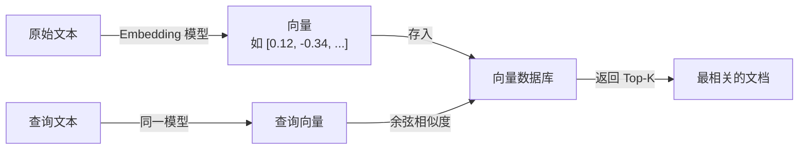

# Embedding 模型（嵌入模型）

## 基础概念

Embedding 模型（嵌入模型）是一种**把文本转换成数字向量**的工具。转换后的向量保留了文本的语义信息——意思相近的文本，向量之间的距离也近。

这有什么用？想象你有一万篇文档，用户问了一个问题。你不可能逐篇读完再找答案。但如果所有文档和用户问题都变成了向量，只需算一下向量之间的「距离」，几毫秒内就能找到最相关的那几篇。这就是语义搜索和 RAG（Retrieval-Augmented Generation，检索增强生成）系统的核心原理。

### 核心要素

| 要素 | 作用 |
|------|------|
| **向量化（Encoding）** | 把一段文本变成一组固定长度的数字（向量），保留语义信息 |
| **向量维度（Dimension）** | 输出向量的长度，常见 384、768、1024、3072 维，维度越高表达能力越强但存储成本越大 |
| **相似度计算（Similarity）** | 用余弦相似度等方法计算两个向量的「距离」，距离越近说明文本语义越接近 |

### 向量化（Encoding）

向量化是 Embedding 模型的核心能力。模型内部使用 Transformer（变换器）架构对文本进行编码，经过多层注意力计算后，将整段文本压缩成一个固定长度的向量。

类比：就像把一整本书浓缩成一个「指纹」，虽然丢失了一些细节，但这个指纹足以代表书的主要内容，用来快速比较两本书是否讲类似的话题。

### 向量维度（Dimension）

不同模型输出的向量长度不同：

- **384 维**：轻量级模型（如 all-MiniLM-L6-v2），速度快，适合资源有限的场景
- **768 维**：中等模型（如 BGE-base），性能和成本均衡
- **1024 维**：较大模型（如 BGE-M3），精度更高
- **3072 维**：大型模型（如 OpenAI text-embedding-3-large），表达能力最强但存储成本最高

OpenAI 的 text-embedding-3 系列支持**动态降维**：3072 维的模型可以直接截断到 256 维使用，官方训练时做了优化，截断后性能损失很小。

### 相似度计算（Similarity）

最常用的是**余弦相似度（Cosine Similarity）**，衡量两个向量的夹角：

- 值为 1：两个向量方向完全一致，文本语义非常接近
- 值为 0：两个向量正交，文本语义无关
- 值为 -1：方向完全相反（实践中很少出现）

### 核心要素关系图



查询和文档必须用同一个 Embedding 模型编码。不同模型学到的向量空间不同，混用会导致相似度计算失效。

## 基础用法

安装依赖：

```bash
pip install sentence-transformers==3.4.1 numpy==1.26.4
```

如需使用 OpenAI Embedding API：

```bash
pip install openai==1.66.3
```

- OpenAI API Key：在 https://platform.openai.com/api-keys 获取
- 开源模型（sentence-transformers）：无需 API Key，模型从 Hugging Face 自动下载

最小可运行示例（本地开源模型，无需 API Key）：

```python
# 基于 sentence-transformers==3.4.1 验证（截至 2026-03）

from sentence_transformers import SentenceTransformer
import numpy as np

# 1. 加载模型（首次运行会自动下载，约 80MB）
model = SentenceTransformer("BAAI/bge-small-zh-v1.5")

# 2. 准备文本
documents = [
    "Python 是一种简洁易读的编程语言",
    "深度学习通过神经网络提取特征",
    "今天天气真不错，适合出去散步",
]
query = "什么是深度学习？"

# 3. 向量化
doc_vectors = model.encode(documents)
query_vector = model.encode([query])

print(f"文档向量形状: {doc_vectors.shape}")  # (3, 512)
print(f"查询向量形状: {query_vector.shape}")  # (1, 512)

# 4. 计算余弦相似度
def cosine_similarity(a, b):
    """计算余弦相似度"""
    a_norm = a / np.linalg.norm(a, axis=1, keepdims=True)
    b_norm = b / np.linalg.norm(b, axis=1, keepdims=True)
    return a_norm @ b_norm.T

similarities = cosine_similarity(query_vector, doc_vectors)[0]

# 5. 按相似度排序，输出检索结果
for idx in np.argsort(similarities)[::-1]:
    print(f"相似度: {similarities[idx]:.4f} | {documents[idx]}")
```

预期输出：

```text
文档向量形状: (3, 512)
查询向量形状: (1, 512)
相似度: 0.8634 | 深度学习通过神经网络提取特征
相似度: 0.5821 | Python 是一种简洁易读的编程语言
相似度: 0.1247 | 今天天气真不错，适合出去散步
```

语义相关的文本（深度学习）排在最前面，无关文本（天气）排在最后。这就是 Embedding 模型的核心价值：**理解语义，而不是简单匹配关键词**。

使用 OpenAI API 的示例：

```python
# 基于 openai==1.66.3 验证（截至 2026-03）

import os
from openai import OpenAI

client = OpenAI(api_key=os.getenv("OPENAI_API_KEY"))

texts = ["人工智能改变了世界", "AI is transforming the world"]

response = client.embeddings.create(
    input=texts,
    model="text-embedding-3-small"  # 1536 维，$0.02/百万 Token
)

for i, item in enumerate(response.data):
    print(f"文本: {texts[i]}")
    print(f"向量维度: {len(item.embedding)}, 前 5 个值: {item.embedding[:5]}")
```

## 同类工具对比

| 维度 | sentence-transformers + BGE | OpenAI Embedding | Qwen3-Embedding |
|------|---------------------------|------------------|-----------------|
| 核心定位 | 开源框架 + 开源模型，完全可控 | 闭源 API 服务，开箱即用 | 阿里开源，最新一代多语言模型 |
| 代表模型 | BGE-M3（1024 维） | text-embedding-3-large（3072 维） | Qwen3-Embedding-8B（多维度） |
| 成本 | 免费（自部署，需 GPU/CPU） | $0.02~0.13 / 百万 Token | 免费（自部署） |
| 中文性能 | BGE 系列专为中文优化，表现优秀 | 优秀，多语言覆盖广 | MTEB 多语言榜单第一（2025.06） |
| 部署方式 | 本地部署，数据不出境 | 云端 API，数据需上传 | 本地部署，数据不出境 |
| 适合人群 | 需要数据隐私、成本敏感的团队 | 快速上手、不想管基础设施 | 追求最新性能、有 GPU 资源 |

核心区别：

- **sentence-transformers + BGE**：开源生态的标准选择，BGE-M3 支持稠密+稀疏+多向量三种检索模式，部署灵活
- **OpenAI Embedding**：商用 API，无需管理模型和基础设施，适合快速原型和中小规模应用
- **Qwen3-Embedding**：2025 年最新开源模型，8B 版本在 MTEB 多语言榜单排名第一，支持 100+ 语言

## 常见误区

| 误区 | 准确理解 |
|------|----------|
| 向量维度越高效果越好 | 维度高意味着存储和计算成本都高。384 维的轻量模型在很多任务上已经够用，盲目追求高维度是浪费资源 |
| OpenAI Embedding 一定比开源模型好 | 不一定。BGE-M3 在中文任务上不逊色，Qwen3-Embedding 在 MTEB 多语言榜单上已超越 OpenAI。选型应基于实际评测而非品牌 |
| 用一个 Embedding 模型处理所有场景 | 不同领域（医疗、法律、代码）的专业术语差异大，通用模型未必是最优解。建议在自己的数据上做评测再决定 |

## 优劣势分析

| 优势 | 劣势 |
|------|------|
| 语义理解能力强，能识别同义词和近义表达 | 对专业领域术语可能理解不准确，需要微调 |
| 检索速度极快，毫秒级返回结果 | 向量化过程本身需要计算资源（GPU 可加速） |
| 开源模型选择丰富，可完全离线部署 | 模型选型需要评测，没有「万能」的模型 |
| 多语言支持好，跨语言检索开箱即用 | 长文本需要分割处理，单次输入有 Token 上限 |

## 思考题

<details>
<summary>初级：为什么查询和文档必须用同一个 Embedding 模型？</summary>

**参考答案：**

不同的 Embedding 模型训练方式和数据不同，学到的向量空间完全不同。模型 A 输出的 [0.5, 0.3] 和模型 B 输出的 [0.5, 0.3] 代表的语义毫无关系。用不同模型分别编码查询和文档，余弦相似度算出来的值没有意义，检索结果会完全混乱。

</details>

<details>
<summary>中级：BGE-M3 的「三个 M」分别是什么？相比只支持稠密检索的模型有什么优势？</summary>

**参考答案：**

三个 M 指 Multi-Functionality（多功能）、Multi-Linguality（多语言）、Multi-Granularity（多粒度）。

多功能指同时支持稠密检索、稀疏检索和多向量检索三种方式。稠密检索擅长语义匹配，稀疏检索擅长关键词匹配，两者结合（混合检索）能显著提升召回率。实际应用中，先用稀疏检索快速过滤候选集，再用稠密检索精排，兼顾速度和精度。

</details>

<details>
<summary>中级：如果你的 RAG 系统检索效果不好，应该从哪些方向排查 Embedding 相关的问题？</summary>

**参考答案：**

三个主要方向：

1. **模型选择**：当前模型是否适合你的数据？用自己的查询-文档对在几个候选模型上跑评测（计算 Recall@K），选表现最好的。
2. **文本分割策略**：文档是否切得太长或太短？太长会稀释语义，太短会丢失上下文。通常 256-512 Token 一段，段与段之间保留适当重叠。
3. **查询与文档的表述差异**：用户的查询方式和文档的写作风格差异大时，可以对查询做改写（Query Rewriting），或对 Embedding 模型做领域微调。

</details>

## 参考资料

1. sentence-transformers 官方文档：https://www.sbert.net/
2. BGE-M3 Hugging Face 模型页：https://huggingface.co/BAAI/bge-m3
3. OpenAI Embedding API 文档：https://platform.openai.com/docs/guides/embeddings
4. MTEB 排行榜（Massive Text Embedding Benchmark）：https://huggingface.co/spaces/mteb/leaderboard
5. Qwen3-Embedding 模型页：https://huggingface.co/Qwen/Qwen3-Embedding-8B
6. FlagEmbedding GitHub 仓库：https://github.com/FlagOpen/FlagEmbedding
