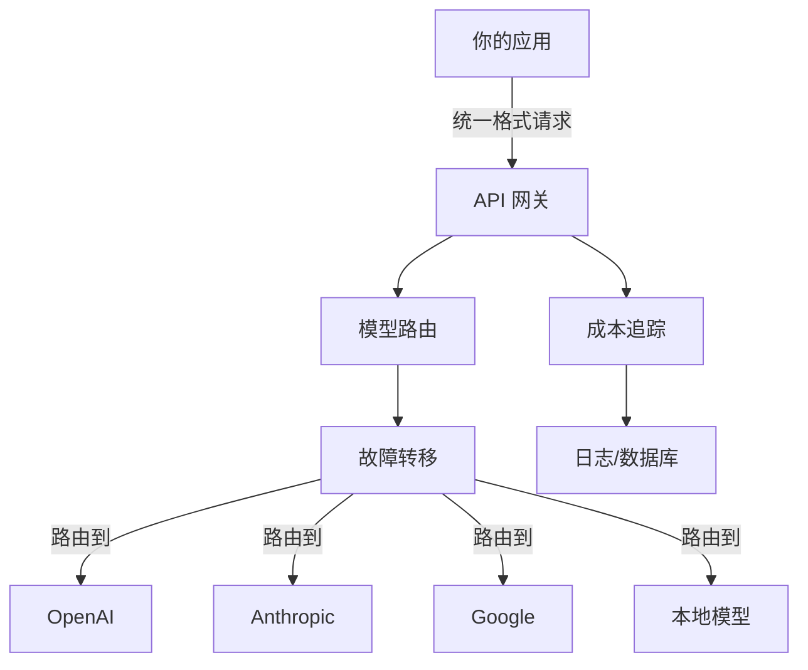

# API 网关与代理（API Gateway & Proxy）

## 基础概念

API 网关（API Gateway）是架在你的应用和各家 LLM 提供商（OpenAI、Anthropic、Google 等）之间的**中间层**。它把各家风格迥异的 API 翻译成一套统一格式（通常兼容 OpenAI 的接口规范），让你只学一种调用方式就能访问上百个模型。

除了"翻译"功能，网关还负责几件关键的事：某个提供商挂了自动切到备用的（故障转移）、统计每次调用花了多少钱（成本追踪）、把流量分散到多个提供商避免被限流（负载均衡）。对于生产环境中需要调用多个模型的 Agent 应用，API 网关不是锦上添花，而是基本需求。

### 核心要素

| 要素 | 作用 |
|------|------|
| **统一接口（Unified API）** | 把不同提供商的 API 格式差异屏蔽掉，应用层只写一套代码 |
| **模型路由（Model Routing）** | 根据成本、延迟、可用性等条件，自动选择最合适的模型和提供商 |
| **故障转移（Failover）** | 主提供商不可用时，自动切换到备选方案，用户无感知 |
| **成本追踪（Cost Tracking）** | 实时统计每个请求花了多少 token、多少钱，支持按用户/项目分账 |

### 统一接口（Unified API）

不同 LLM 提供商的 API 差异很大：认证方式不同、请求格式不同、返回结构也不同。统一接口层的作用是把这些差异全部抹平——你的代码只需要按 OpenAI 的格式写，网关自动帮你转换成各家的原生格式。

换模型只改一个字符串（模型名），其余代码一行不动。

### 模型路由（Model Routing）

路由引擎是网关的"大脑"。不同模型在成本、速度、质量上差异巨大——GPT-4 质量高但贵且慢，GPT-3.5-turbo 便宜但能力弱。路由引擎根据你设定的策略自动做选择：

- **成本优先**：简单问题用便宜模型，省钱
- **质量优先**：复杂问题用高端模型，保效果
- **延迟优先**：对响应速度敏感的场景，选最快的
- **可用性优先**：哪个没被限流就用哪个

### 故障转移（Failover）

任何云服务都有挂的时候。故障转移机制让你提前配好一个备选模型列表，主模型调用失败时自动尝试下一个，直到成功或全部失败。用户端完全感知不到切换过程。

### 成本追踪（Cost Tracking）

LLM 调用按 token 收费，成本会随用量快速增长。成本追踪模块记录每个请求的 input/output token 数和对应费用，支持按用户、按模型、按时间段汇总，便于做预算控制和异常检测。

### 核心要素关系图



四者的关系：统一接口决定「怎么调」，模型路由决定「调谁」，故障转移保证「调得通」，成本追踪记录「花多少」。

## 基础用法

安装依赖：

```bash
pip install litellm
```

需要的 API Key（按需配置，至少配一个）：
- OpenAI：https://platform.openai.com/api-keys
- Anthropic：https://console.anthropic.com/

最小可运行示例（基于 litellm==1.65.0 验证，截至 2026-03）：

```python
import os
from litellm import completion

# 配置至少一个提供商的 API Key
os.environ["OPENAI_API_KEY"] = "sk-..."  # 替换为你的真实 Key

# 调用 OpenAI 模型
response = completion(
    model="gpt-3.5-turbo",
    messages=[{"role": "user", "content": "用一句话解释什么是 API 网关"}],
    max_tokens=100,
)
print(response.choices[0].message.content)

# 只改模型名，就能切到 Anthropic（需配置 ANTHROPIC_API_KEY）
# response = completion(
#     model="claude-3-haiku-20240307",
#     messages=[{"role": "user", "content": "用一句话解释什么是 API 网关"}],
# )
```

预期输出：

```text
API 网关是应用程序与多个后端服务之间的统一入口，负责请求路由、认证和流量管理。
```

故障转移示例——主模型失败时自动切换备选：

```python
import os
from litellm import completion

os.environ["OPENAI_API_KEY"] = "sk-..."

fallback_models = ["gpt-4", "gpt-3.5-turbo"]

for model in fallback_models:
    try:
        response = completion(
            model=model,
            messages=[{"role": "user", "content": "你好"}],
            timeout=5,
        )
        print(f"[成功] 使用 {model}: {response.choices[0].message.content}")
        break
    except Exception as e:
        print(f"[失败] {model}: {str(e)[:80]}")
        continue
```

## 同类工具对比

| 维度 | LiteLLM | OpenRouter | Portkey |
|------|---------|------------|---------|
| 核心定位 | 开源 Python SDK + 自托管代理服务器 | 托管型统一 API 网关（SaaS） | 企业级 AI 网关（SaaS + 自托管） |
| 部署方式 | 本地部署，完全自主可控 | 云端托管，注册即用 | 云端托管或自部署 |
| 支持模型 | 100+ 提供商 | 500+ 模型，60+ 提供商 | 250+ 模型 |
| 成本控制 | 精细到用户/项目级的预算管理 | 按充值金额 + 5% 手续费 | 企业级成本分析仪表盘 |
| 适合场景 | 需要深度定制和成本优化的团队 | 快速上手、不想运维基础设施 | 企业级安全合规需求 |

核心区别：

- **LiteLLM**：开源自托管，适合需要完全控制权和深度定制的团队，GitHub 27k+ stars
- **OpenRouter**：托管服务，注册拿 Key 就能用，适合快速验证和小团队，Sequoia/a16z 投资
- **Portkey**：偏企业市场，强调安全合规和可观测性，适合有严格合规要求的组织

## 常见误区

| 误区 | 准确理解 |
|------|----------|
| API 网关只是做 API 格式转换 | 格式转换只是基础功能，路由、故障转移、成本控制、缓存等才是生产环境的核心价值 |
| 加了网关会明显增加延迟 | 主流网关的额外延迟通常在 25-40ms，相比 LLM 本身数秒的响应时间可以忽略不计 |
| 小项目不需要 API 网关 | 即使只用一个提供商，网关的成本追踪和故障转移能力也很有价值，越早接入改造成本越低 |

## 优劣势分析

| 优势 | 劣势 |
|------|------|
| 一套代码调用所有模型，切换提供商零成本 | 自托管方案（如 LiteLLM）需要运维投入 |
| 故障转移 + 负载均衡，提升系统可用性 | 托管方案（如 OpenRouter）引入第三方依赖和额外费用 |
| 实时成本追踪，防止账单失控 | 模型能力差异大，路由策略的效果依赖调优经验 |
| 统一日志便于调试和性能分析 | 部分高级功能（缓存、A/B 测试）需要额外配置 |

## 思考题

<details>
<summary>初级：LiteLLM 和 OpenRouter 最大的区别是什么？各适合什么场景？</summary>

**参考答案：**

最大区别是部署方式：LiteLLM 是开源软件，你自己部署和运维；OpenRouter 是托管服务，注册即用。

LiteLLM 适合对成本敏感、需要深度定制、有运维能力的团队。OpenRouter 适合快速验证原型、不想管基础设施、团队规模较小的场景。

</details>

<details>
<summary>中级：如何设计一个故障转移策略，兼顾可用性和成本？</summary>

**参考答案：**

按优先级排列备选模型列表，排序依据是「性价比」而非单纯的模型能力。例如：主选 GPT-3.5-turbo（便宜快速），备选 Claude 3 Haiku（同级别替代），兜底 GPT-4（贵但稳定）。

关键设计点：为每个模型设置独立的超时时间（快速模型 5s，慢速模型 15s）；记录每次故障转移的原因和目标模型，用于后续优化排序；对频繁失败的提供商做短时熔断，避免反复尝试浪费时间。

</details>

<details>
<summary>中级：在什么情况下不应该使用 API 网关？</summary>

**参考答案：**

三种情况可以不用：(1) 只用单一提供商的单一模型，且没有成本追踪需求；(2) 对延迟极度敏感（如实时语音），连 25ms 的额外开销都不能接受；(3) 提供商有专属功能（如 OpenAI 的 Assistants API）不走标准接口，网关的统一接口反而会限制能力。

但即使这些场景，随着项目演进，引入网关的收益通常也会逐渐大于成本。

</details>

## 参考资料

1. LiteLLM 官方文档：https://docs.litellm.ai/
2. LiteLLM GitHub 仓库：https://github.com/BerriAI/litellm
3. OpenRouter 官网：https://openrouter.ai/
4. Top LLM Gateways 2025（Agenta）：https://agenta.ai/blog/top-llm-gateways
5. Top 5 LLM Gateways 2025（Helicone）：https://www.helicone.ai/blog/top-llm-gateways-comparison-2025
