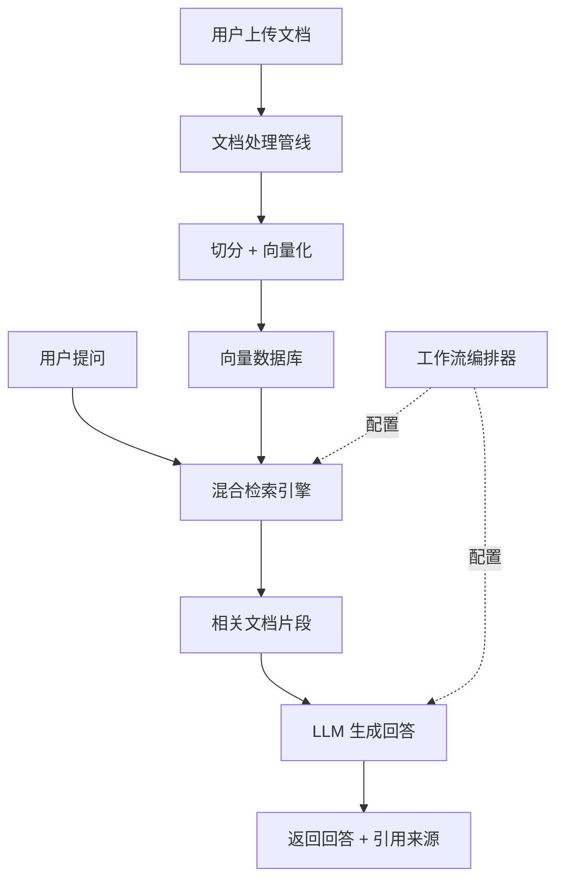

# 知识库工具（Knowledge Base Tools）

## 基础概念

知识库工具是一类**集文档管理、向量化、检索和问答于一体**的低代码平台。通俗讲：你把公司文档（PDF、Word、网页等）丢进去，它自动帮你切块、转向量、存好；用户提问时，它先从文档里找到最相关的片段，再喂给大语言模型（LLM, Large Language Model）生成回答。这个过程就是 RAG（Retrieval-Augmented Generation，检索增强生成）。

与直接用 LangChain 等框架手写 RAG 管道不同，知识库工具的核心卖点是**可视化 + 低代码**：拖拖拽拽就能配好检索策略、选好模型、发布成聊天机器人，开发门槛从「会写 Python」降到「会用浏览器」。

### 核心要素

| 要素 | 作用 |
|------|------|
| **文档处理管线** | 把上传的各种格式文件（PDF、Word、Markdown 等）自动切分成小块（Chunk），清洗、去重后转换为向量存储 |
| **混合检索引擎** | 同时使用关键词匹配（BM25）和向量语义搜索，两者加权融合，兼顾精确匹配和模糊理解 |
| **工作流编排器** | 图形化拖拽界面，把知识检索、LLM 调用、条件判断等串成完整流程，无需写代码 |

### 文档处理管线

用户上传一份 50 页的 PDF，知识库工具在后台做这些事：

1. **格式解析**：提取文字内容（支持 PDF、Word、Excel、Markdown、HTML 等）
2. **文本切分**：按段落或固定长度切成 200-500 字的小块（Chunk），块与块之间保留一定重叠（Overlap），防止信息被截断
3. **向量化**：用嵌入模型（Embedding Model）把每个文本块转成一串数字（向量），语义相近的文本，向量也相近
4. **存储入库**：向量存入向量数据库（如 Milvus、pgvector），原文也保留用于最终展示

### 混合检索引擎

单用向量检索容易被语义偏差误导（比如搜「API 限流」可能返回「接口性能」的内容）；单用关键词检索又搜不到近义词。混合检索把两者结合：

- **BM25 关键词检索**：精确匹配特定术语，如「429 错误码」
- **向量语义检索**：理解意思相近的问法，如「请求太多被拒绝了」也能匹配到限流文档
- **加权融合**：两个结果按权重合并排序，通常向量权重 0.6-0.7，关键词权重 0.3-0.4

### 工作流编排器

现代知识库工具都提供图形化的工作流编辑器，用拖拽的方式定义 AI 应用流程。一个典型的客服机器人工作流：

```
用户提问 → 知识库检索 → LLM 生成回答 → 置信度判断 → 高于阈值直接回复 / 低于阈值转人工
```

这个流程在 Dify 或 Coze 的界面上，就是几个方块用线连起来，每个方块点开可以配置参数（选哪个知识库、用哪个模型、阈值设多少）。

### 核心要素关系图



## 基础用法

知识库工具主要通过 Web 界面操作，编程接入时使用各平台提供的 API。以 Dify（目前最流行的开源知识库平台）为例。

安装 Dify 官方 Python SDK：

```bash
pip install dify-client
```

- Dify API Key：在 Dify 控制台 → 应用 → API 访问 中获取。自部署用户需先用 Docker 部署 Dify（参考 [Dify 官方部署文档](https://docs.dify.ai/getting-started/install-self-hosted)）

最小可运行示例（基于 dify-client==2.5.0 验证，截至 2026-03）：

```python
# 通过 Dify API 调用已配置好知识库的聊天应用
# 前提：在 Dify 界面上已创建应用并关联知识库
import os
from dify_client import ChatClient

# 初始化客户端
# API Key 从 Dify 控制台获取（应用 → API 访问 → API 密钥）
api_key = os.getenv("DIFY_API_KEY", "app-your-api-key-here")
base_url = os.getenv("DIFY_BASE_URL", "https://api.dify.ai/v1")
client = ChatClient(api_key)
client.base_url = base_url

# 发送问题（blocking 模式，等待完整回答）
response = client.create_chat_message(
    inputs={},                          # 应用变量（如有）
    query="RAG 和微调有什么区别？",       # 用户问题
    user="test-user-001",               # 用户唯一标识
    response_mode="blocking"            # blocking=等完整回答，streaming=流式
)

# 解析返回
result = response.json()
print(f"回答：{result['answer']}")

# 如果应用配置了知识库，回答中会包含引用来源
if "metadata" in result and "retriever_resources" in result["metadata"]:
    print("\n引用来源：")
    for ref in result["metadata"]["retriever_resources"]:
        print(f"  - {ref['document_name']}（相似度：{ref['score']:.2f}）")
```

预期输出：

```text
回答：RAG（检索增强生成）和微调（Fine-tuning）的核心区别在于：RAG 是在推理时从外部知识库检索相关信息作为上下文，模型本身不变；微调是修改模型参数，让模型"记住"特定知识。RAG 成本低、知识可实时更新；微调成本高但对特定任务表现更稳定。

引用来源：
  - 公司技术文档.pdf（相似度：0.92）
  - RAG技术指南.md（相似度：0.87）
```

上述代码调用的是已在 Dify 界面上配好知识库的聊天应用。知识库的创建、文档上传、检索策略配置等操作通常在 Web 界面完成，不需要写代码。

## 同类工具对比

| 维度 | Dify | FastGPT | Coze | MaxKB |
|------|------|---------|------|-------|
| 核心定位 | 全能型 AI 应用开发平台，工作流 + RAG + Agent | 专业知识库 Q&A 系统，深度优化 RAG 检索 | 零代码 AI Bot 构建器，多平台一键发布 | 轻量级企业知识库问答引擎 |
| 开源情况 | 开源（GitHub 95k+ stars） | 开源（GitHub 25k+ stars） | 2025 年 7 月核心开源 | 开源（GitHub 12k+ stars） |
| 学习曲线 | 中等（功能多但文档全） | 中等（聚焦 RAG，上手快） | 低（拖拽式，零代码友好） | 低（专注问答，界面简洁） |
| 工作流编排 | 强（条件分支、循环、人工审核） | 基础工作流 | 强（插件生态丰富） | 基础流程 |
| 知识库能力 | 混合检索 + Knowledge Pipeline | 专业级多路检索策略 | 标准 RAG | 标准 RAG + 权限管理 |
| 适合场景 | 复杂 AI 应用、企业级部署 | RAG 重度场景、私有化部署 | 快速搭建聊天 Bot | 中小企业内部问答 |

核心区别：

- **Dify**：功能最全的「AI 应用开发平台」，工作流 + RAG + Agent + 模型管理一站式搞定，适合需要复杂流程的团队
- **FastGPT**：RAG 检索能力最深的「知识库专家」，适合对检索精度要求高、需要私有化部署的场景
- **Coze**：上手门槛最低的「Bot 工厂」，字节跳动出品，适合快速做个聊天机器人发布到各平台
- **MaxKB**：最轻量的「问答引擎」，1Panel 团队出品，一条命令部署，适合内部知识库场景

## 常见误区

| 误区 | 准确理解 |
|------|----------|
| 上传文档就万事大吉，LLM 不会再产生幻觉 | RAG 降低了幻觉风险但无法完全消除。检索质量差、文档过时、Chunk 切分不当都可能导致错误回答。需要持续优化检索策略并配合人工审核 |
| Chunk 越大越好，信息更完整 | Chunk 过大会混入无关内容，拉低检索精度且浪费 Token。通常 200-500 字为宜，技术文档可适当放大到 800-1000 字 |
| 知识库工具可以替代 LangChain 等编程框架 | 两者定位不同。知识库工具面向低代码用户，覆盖 80% 的常见场景；深度定制、复杂 Agent 逻辑、自定义检索算法等仍需编程框架 |

## 优劣势分析

| 优势 | 劣势 |
|------|------|
| 低代码/零代码，非技术人员也能搭建 AI 问答系统 | 深度定制能力有限，复杂逻辑仍需写代码 |
| 开箱即用的 RAG 管道，省去手动搭建向量数据库和检索链 | 对文档质量敏感，垃圾文档进去 = 垃圾回答出来 |
| 可视化工作流编排，流程一目了然 | 自部署需要一定运维能力（Docker、数据库等） |
| 多模型支持，切换 LLM 不用改代码 | 平台间迁移成本高，工作流和配置不互通 |

## 思考题

<details>
<summary>初级：知识库工具和直接让 LLM 回答问题有什么区别？为什么需要 RAG？</summary>

**参考答案：**

直接让 LLM 回答，它只能依赖训练时记住的知识，容易过时且无法访问企业内部数据。知识库工具通过 RAG 机制，先从文档库检索相关片段，再把片段作为上下文喂给 LLM，让回答有据可依。核心价值：知识可实时更新、回答可溯源、不需要重新训练模型。

</details>

<details>
<summary>中级：混合检索为什么比单纯的向量检索效果更好？什么时候反而不需要混合检索？</summary>

**参考答案：**

向量检索擅长理解语义（「请求太多被拒绝」能匹配「限流」），但对精确术语不敏感（搜「HTTP 429」可能匹配不到）。BM25 关键词检索则相反。混合检索取两者之长，通过加权融合提高整体召回率和精度。

不需要混合检索的场景：术语体系非常统一且封闭的领域（如医学编码库），此时纯关键词检索反而更精准；或文档全是口语化内容无专业术语，此时纯向量检索足够。

</details>

<details>
<summary>中级：Dify 和 FastGPT 都支持 RAG，选型时应该重点考虑哪些因素？</summary>

**参考答案：**

核心考虑三点：（1）**应用复杂度**——只需知识问答选 FastGPT，需要工作流编排 + Agent 能力选 Dify；（2）**检索精度要求**——FastGPT 在 RAG 检索策略上更深入，支持多路召回和细粒度调优；（3）**团队技术能力**——Dify 功能多但学习成本也更高，小团队快速上线建议 FastGPT 或 MaxKB。其他因素包括社区活跃度、文档完善度和二次开发灵活度。

</details>

## 参考资料

1. Dify 官方文档：https://docs.dify.ai/
2. Dify GitHub 仓库：https://github.com/langgenius/dify
3. FastGPT GitHub 仓库：https://github.com/labring/fastgpt
4. Coze 官方文档：https://www.coze.com/open/docs/guides/knowledge_overview
5. MaxKB GitHub 仓库：https://github.com/1Panel-dev/MaxKB
6. Dify Python SDK：https://github.com/langgenius/dify-python-sdk
