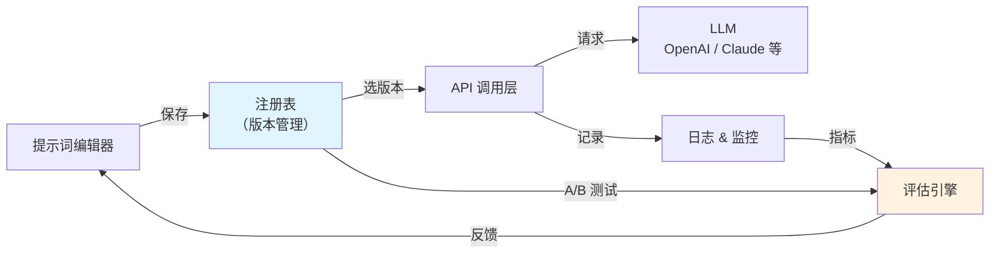

# 提示词管理工具（Prompt Management Tools）

## 基础概念

提示词管理工具是专门用来**集中存储、版本控制和评估 LLM 提示词**的平台。

打个比方：写代码有 Git 做版本管理，提示词管理工具就是**给提示词用的 Git**。你改了一句提示词，系统自动记录谁改的、什么时候改的、改了哪里；发现新版本效果变差了，一键回滚到上个版本。

为什么需要专门的工具？因为在生产环境里，提示词不再是随手写的一句话，而是**影响 AI 输出质量的核心资产**。团队里产品经理想调提示词、开发想测提示词、运维想监控提示词——这些需求光靠在代码里硬编码字符串是搞不定的。

### 核心要素

| 要素 | 作用 |
|------|------|
| **提示词注册表（Prompt Registry）** | 中央仓库，把提示词从代码里独立出来，统一存储和管理 |
| **版本控制（Versioning）** | 每次修改自动创建版本快照，支持对比和回滚 |
| **评估与 A/B 测试** | 并行测试多个版本，用数据说话选最优版本 |
| **多环境隔离** | 开发 / 测试 / 生产三套环境独立管理，互不干扰 |

### 提示词注册表（Prompt Registry）

提示词注册表的核心思路是**把提示词从代码中抽离**，放到一个统一的平台上管理。改提示词不用改代码、不用重新部署——产品经理在平台界面上直接改，改完发布，线上立刻生效。

这种解耦带来两个好处：
1. 非技术人员（产品经理、领域专家）可以直接优化提示词，不用等工程师排期
2. 提示词的变更审核和代码发布可以分开走，降低风险

### 版本控制（Versioning）

和 Git 管理代码一样，每次修改提示词时系统自动创建一个新版本，记录修改者、时间、内容差异。不同版本可以并排对比，不满意就回滚。

主流工具的版本控制方式有区别：
- **LangSmith**：采用 commit（提交）+ tag（标签）模式，和 Git 的思路一样
- **PromptLayer**：采用注册表 + 发布标签模式，更适合非技术人员操作
- **Portkey**：版本号 + 标签，配合其 AI 网关做多模型路由

### 评估与 A/B 测试

手动看几条输出就判断提示词好不好，不靠谱。评估管道的做法是：准备一批测试用例，让新旧版本分别跑一遍，自动算准确率、延迟、成本等指标，用数据来决定发不发布。

### 要素关系图



流程：在编辑器里写提示词 → 保存到注册表（自动产生版本）→ 应用通过 API 拉取指定版本 → 调用 LLM → 日志和评估引擎自动记录和分析。

## 基础用法

安装依赖：

```bash
# PromptLayer SDK
pip install promptlayer==1.2.1

# 同时需要 OpenAI SDK（PromptLayer 默认包装 OpenAI 调用）
pip install openai==1.82.0
```

- PromptLayer API Key：在 https://www.promptlayer.com/ 注册后获取
- OpenAI API Key：在 https://platform.openai.com/api-keys 获取

最小可运行示例（基于 promptlayer==1.2.1、openai==1.82.0 验证，截至 2026-03）：

```python
"""
最小示例：用 PromptLayer 包装 OpenAI 调用，自动记录提示词版本和调用日志
"""
import promptlayer
import os

# 1. 配置 API Key
os.environ["PROMPTLAYER_API_KEY"] = "your-promptlayer-api-key"
os.environ["OPENAI_API_KEY"] = "your-openai-api-key"

# 2. 用 PromptLayer 包装 OpenAI 客户端
# 包装后的客户端用法和原生 OpenAI 完全一样，但所有调用会自动记录到 PromptLayer
OpenAI = promptlayer.openai.OpenAI
client = OpenAI()

# 3. 正常调用——PromptLayer 在后台自动记录提示词、模型、参数、输出
response = client.chat.completions.create(
    model="gpt-4o-mini",
    messages=[
        {"role": "system", "content": "你是一个友好的助手，用简洁的中文回答问题。"},
        {"role": "user", "content": "什么是提示词管理？"}
    ],
    max_tokens=200
)

print(response.choices[0].message.content)
# 调用完成后，登录 PromptLayer 控制台即可看到这条记录：
# 包含提示词内容、模型参数、输出文本、延迟、token 用量等
```

预期输出：

```text
提示词管理是指系统化地存储、版本控制和评估大语言模型（LLM）的提示词...
（具体内容因模型而异，关键是调用成功且 PromptLayer 控制台能看到记录）
```

如果没有 API Key，可以用以下纯本地代码理解提示词版本管理的核心逻辑：

```python
"""
纯本地示例：模拟提示词注册表和版本管理（无需任何 API Key）
基于 Python 3.10+ 验证（截至 2026-03）
"""
from datetime import datetime

# 模拟提示词注册表
class PromptRegistry:
    """简易提示词注册表：存储、版本控制、环境隔离"""

    def __init__(self):
        self.prompts = {}  # {名称: {版本号: {内容, 元数据}}}
        self.environments = {"dev": {}, "staging": {}, "prod": {}}

    def save(self, name: str, content: str, author: str) -> str:
        """保存提示词，自动生成版本号"""
        if name not in self.prompts:
            self.prompts[name] = {}

        version = f"v{len(self.prompts[name]) + 1}"
        self.prompts[name][version] = {
            "content": content,
            "author": author,
            "created_at": datetime.now().isoformat(),
        }
        return version

    def get(self, name: str, version: str) -> str:
        """获取指定版本的提示词"""
        return self.prompts[name][version]["content"]

    def deploy(self, name: str, version: str, env: str):
        """将指定版本部署到目标环境"""
        self.environments[env][name] = version

    def history(self, name: str) -> list:
        """查看版本历史"""
        return list(self.prompts[name].keys())


# --- 使用示例 ---
registry = PromptRegistry()

# 保存多个版本
v1 = registry.save("客服助手", "你是客服，请礼貌回答用户问题。", "产品经理A")
v2 = registry.save("客服助手", "你是专业客服。规则：1.先确认问题 2.给出方案 3.询问是否解决", "产品经理A")
v3 = registry.save("客服助手", "你是专业客服。规则：1.先确认问题 2.给出方案 3.询问是否解决 4.无法解决时转人工", "工程师B")

# 查看版本历史
print("版本历史:", registry.history("客服助手"))

# 多环境部署
registry.deploy("客服助手", "v3", "dev")      # 开发环境用最新版
registry.deploy("客服助手", "v2", "prod")      # 生产环境用稳定版

# 获取各环境当前使用的提示词
for env in ["dev", "prod"]:
    ver = registry.environments[env]["客服助手"]
    content = registry.get("客服助手", ver)
    print(f"\n[{env}] 使用 {ver}：{content[:30]}...")
```

预期输出：

```text
版本历史: ['v1', 'v2', 'v3']

[dev] 使用 v3：你是专业客服。规则：1.先确认问题 2.给出方案 3....
[prod] 使用 v2：你是专业客服。规则：1.先确认问题 2.给出方案 3....
```

## 同类工具对比

| 维度 | PromptLayer | LangSmith | Portkey |
|------|------------|-----------|---------|
| 核心定位 | 提示词注册表 + A/B 测试 | LangChain 原生追踪 + 评估 | AI 网关 + 多模型路由 + 提示词管理 |
| 版本控制方式 | 注册表 + 发布标签 | commit + tag（类 Git） | 版本号 + 标签 |
| 非技术人员友好度 | 高（可视化编辑器，无需写代码） | 中（偏开发者） | 中（侧重运维和工程） |
| 最擅长 | 快速迭代、协作编辑、A/B 测试 | LangChain 生态一站式监控 | 多 LLM 提供商统一管理 + 成本优化 |
| 免费额度 | 5,000 请求/月 | 有免费计划 | 有免费计划 |
| 适合人群 | 小团队、产品经理参与提示词优化 | LangChain 用户、注重可观测性 | 需要对接多家 LLM、关注成本 |

核心区别：

- **PromptLayer**：专注提示词本身的管理，强调让非技术人员也能参与编辑和测试
- **LangSmith**：从 LLM 调用追踪出发，提示词管理是其可观测性体系的一部分
- **Portkey**：从 AI 网关出发，提示词管理和多模型路由、成本优化打包在一起

## 常见误区

| 误区 | 准确理解 |
|------|----------|
| "提示词写好一版就够了，不需要版本管理" | 模型会更新、用户需求会变、业务规则会调整，提示词必须持续迭代。没有版本控制就无法追踪是哪次修改导致效果变差 |
| "直接在代码里改提示词字符串就行" | 硬编码提示词意味着每次修改都要走代码发布流程。用注册表解耦后，产品经理可以自己改提示词，不用等开发排期 |
| "提示词越长越详细效果越好" | 过长的提示词增加成本和延迟，还可能引入矛盾指令。通过 A/B 测试对比精简版和详细版，往往能找到更好的平衡点 |

## 优劣势分析

| 优势 | 劣势 |
|------|------|
| 提示词与代码解耦，非技术人员可直接参与优化 | 引入额外的平台依赖，增加系统复杂度 |
| 版本控制 + 回滚，变更风险可控 | 大部分平台按用量收费，规模大时成本不低 |
| A/B 测试和评估管道，用数据驱动提示词优化 | 需要团队建立新的协作流程，有一定推广成本 |
| 多环境隔离，开发实验不影响生产 | 对于只有几条提示词的小项目，杀鸡用牛刀 |

## 思考题

<details>
<summary>初级：为什么要把提示词从代码中分离出来？直接硬编码有什么问题？</summary>

**参考答案：**

硬编码提示词有三个问题：1）每次修改提示词都要改代码、走发布流程，迭代慢；2）非技术人员（产品经理、领域专家）无法直接参与优化；3）没有版本历史，无法追踪哪次修改导致效果变差。分离后，提示词可以独立迭代、独立回滚，和代码发布互不干扰。

</details>

<details>
<summary>中级：A/B 测试在提示词优化中怎么用？和直接人工对比有什么区别？</summary>

**参考答案：**

A/B 测试的做法是：准备一批固定的测试用例，让新旧两个版本的提示词分别跑一遍，自动计算准确率、延迟、成本等量化指标。和人工对比的区别在于：1）样本量大，不是看几条就下结论；2）指标客观，不受主观印象影响；3）可重复执行，每次提示词更新都自动跑一遍，保证质量不退化。

</details>

<details>
<summary>中级：PromptLayer、LangSmith、Portkey 三者定位有什么不同？什么情况选哪个？</summary>

**参考答案：**

三者出发点不同：PromptLayer 从提示词管理出发，强调协作编辑和 A/B 测试，适合需要非技术人员参与的小团队；LangSmith 从 LLM 调用追踪出发，提示词管理是可观测性的一部分，适合已使用 LangChain 的团队；Portkey 从 AI 网关出发，强项是多模型路由和成本优化，适合需要对接多家 LLM 提供商的场景。

</details>

## 参考资料

1. PromptLayer 官方文档：https://docs.promptlayer.com/
2. LangSmith 官方文档：https://docs.smith.langchain.com/
3. Portkey 官方文档：https://docs.portkey.ai/
4. Braintrust - Best Prompt Versioning Tools in 2025：https://www.braintrust.dev/articles/best-prompt-versioning-tools-2025
5. Top 5 Prompt Management Platforms in 2025：https://www.getmaxim.ai/articles/top-5-prompt-management-platforms-in-2025/
