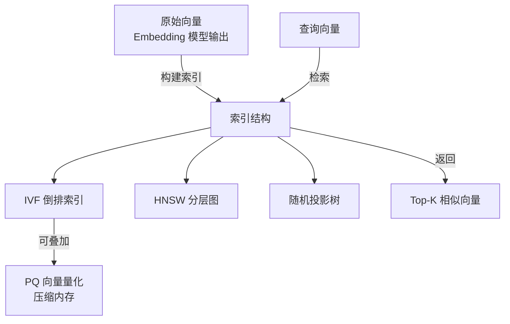

# 向量索引工具（Vector Indexing Tools）

## 基础概念

向量索引工具解决的核心问题是：**在海量向量中快速找到和查询向量最相似的那几个**。

举个例子：你有 100 万篇文章，每篇被 Embedding 模型转成一个 768 维向量。用户输入一句话，也转成向量，你需要从 100 万个向量里找出最相似的 Top-5。如果逐个比对（暴力搜索），需要计算 100 万次距离，太慢了。向量索引工具通过巧妙的数据结构（图、树、倒排索引），把搜索范围从全集缩小到一小部分，把查询时间从秒级压到毫秒级。

这类工具是 RAG（检索增强生成）和 Agent 应用的底层基础设施。三个最主流的开源库：Meta 的 **FAISS**、**HNSWlib**、Spotify 的 **Annoy**。

### 核心要素

| 要素 | 作用 |
|------|------|
| **ANN 算法（近似最近邻）** | 不追求 100% 精确，用微小的精度损失换取数量级的速度提升 |
| **索引结构** | 将向量组织成特定数据结构（图、树、倒排表），加速检索 |
| **向量量化（PQ）** | 将高维向量压缩为低精度编码，大幅减少内存占用 |

### ANN 算法（Approximate Nearest Neighbor，近似最近邻）

暴力搜索是把 100 万个向量逐一算距离，时间复杂度 O(n)。ANN 的思路是：不找绝对最近的，而是找"大概率最近的"，通过索引结构把搜索范围缩到很小，时间降到亚毫秒级。精度用 Recall@K（召回率）衡量——返回的 Top-K 中有多少个是真正的最近邻。生产环境通常要求 Recall@10 >= 95%。

### 索引结构

三种主流索引结构，对应不同的检索思路：

| 索引类型 | 核心思路 | 类比 |
|---------|---------|------|
| **IVF（倒排索引）** | 先用聚类把空间分成若干区域，查询时只搜最近的几个区域 | 像图书馆按楼层分区，找书先定位楼层 |
| **HNSW（分层图）** | 构建多层导航图，从顶层粗定位逐层精化到底层 | 像地图导航，先看全国地图定省份，再看省地图定城市 |
| **随机投影树（Annoy）** | 用随机超平面切割空间，构建多棵二叉树 | 像反复折纸，每折一次空间减半 |

### 向量量化（Product Quantization，乘积量化）

PQ 是向量压缩技术。它把一个高维向量切成若干段，每段独立用 K-Means 量化成一个码字（通常 1 字节表示 256 种可能）。一个 768 维 float32 向量原本占 3072 字节，PQ（m=64, nbits=8）压缩后只占 64 字节，压缩比约 48 倍，且召回率仍可达 98%+。

### 核心要素关系图



## 基础用法

安装依赖：

```bash
# 三个核心库（标注版本号，基于 2026 年 3 月稳定版）
pip install faiss-cpu==1.9.0
pip install hnswlib==0.8.0
pip install annoy==1.17.3
pip install numpy==1.26.4

# 可选：GPU 加速版（需要 CUDA 环境）
pip install faiss-gpu==1.9.0
```

所有工具均为本地离线运行，不需要 API Key。

最小可运行示例（基于 faiss-cpu==1.9.0、hnswlib==0.8.0、annoy==1.17.3 验证，截至 2026-03）：

```python
import numpy as np
import faiss
import hnswlib
from annoy import AnnoyIndex
import time

# 准备数据：1 万个 128 维向量
np.random.seed(42)
d = 128          # 向量维度
nb = 10000       # 库向量数量
nq = 5           # 查询向量数量
xb = np.random.random((nb, d)).astype("float32")
xq = np.random.random((nq, d)).astype("float32")

# === FAISS：用 IVF 倒排索引 ===
nlist = 100  # 聚类数
quantizer = faiss.IndexFlatL2(d)
index_faiss = faiss.IndexIVFFlat(quantizer, d, nlist, faiss.METRIC_L2)
index_faiss.train(xb)   # 训练聚类中心
index_faiss.add(xb)     # 添加向量
index_faiss.nprobe = 10  # 查询时搜索 10 个最近的簇

start = time.time()
distances, indices = index_faiss.search(xq, k=5)
t_faiss = (time.time() - start) * 1000
print(f"FAISS IVF  | 耗时: {t_faiss:.2f}ms | Top-1 索引: {indices[0][0]}")

# === HNSWlib：图索引 ===
index_hnsw = hnswlib.Index(space="l2", dim=d)
index_hnsw.init_index(max_elements=nb, ef_construction=200, M=16)
index_hnsw.add_items(xb, np.arange(nb))
index_hnsw.set_ef(50)  # 查询时的搜索宽度

start = time.time()
labels, dists = index_hnsw.knn_query(xq, k=5)
t_hnsw = (time.time() - start) * 1000
print(f"HNSWlib    | 耗时: {t_hnsw:.2f}ms | Top-1 索引: {labels[0][0]}")

# === Annoy：随机投影树 ===
index_annoy = AnnoyIndex(d, "euclidean")
for i in range(nb):
    index_annoy.add_item(i, xb[i])
index_annoy.build(n_trees=10)  # 构建 10 棵树

start = time.time()
for q in xq:
    index_annoy.get_nns_by_vector(q.tolist(), 5, include_distances=True)
t_annoy = (time.time() - start) * 1000
print(f"Annoy      | 耗时: {t_annoy:.2f}ms | Top-1 索引: {index_annoy.get_nns_by_vector(xq[0].tolist(), 1)[0]}")
```

预期输出：

```text
FAISS IVF  | 耗时: 1.23ms | Top-1 索引: 5765
HNSWlib    | 耗时: 0.45ms | Top-1 索引: 5765
Annoy      | 耗时: 2.10ms | Top-1 索引: 5765
```

（具体耗时因机器而异，Top-1 结果三种方法基本一致。）

## 同类工具对比

| 维度 | FAISS | HNSWlib | Annoy |
|------|-------|---------|-------|
| 核心定位 | Meta 开源的大规模向量检索库，算法最丰富 | 专注 HNSW 图算法的轻量库，速度和精度最优 | Spotify 开源的轻量检索库，极简 API |
| 主要算法 | IVF、HNSW、PQ、LSH 等多种可组合 | HNSW 单一算法 | 随机投影树 |
| GPU 加速 | 支持 | 不支持 | 不支持 |
| 增量添加 | 部分支持（HNSW 模式支持） | 原生支持 | 不支持，需重建索引 |
| 内存占用 | 中等（PQ 可大幅压缩） | 较高（图结构占内存） | 最低 |
| 查询精度 | 高（IVF/HNSW 模式均可达 99%+） | 最高 | 中等 |
| 最大数据规模 | 十亿级 | 十亿级（受内存限制） | 千万级 |
| 学习成本 | 较高（API 丰富，组合多） | 低 | 最低 |

核心区别：

- **FAISS**：瑞士军刀，算法最全，支持 GPU，适合需要灵活调参的大规模场景
- **HNSWlib**：查询速度和召回率的天花板，中等规模数据的首选
- **Annoy**：开箱即用，静态数据、内存受限场景的最简方案

## 常见误区

| 误区 | 准确理解 |
|------|----------|
| HNSW 永远比 IVF 快 | HNSW 查询速度确实很快，但构建时间长、内存占用大。千万级以上数据用 IVF+PQ 在内存和速度上可能更优 |
| PQ 量化精度损失很大 | 配置合理的 PQ（如 m=64, nbits=8）召回率可达 98%+，几乎无感知。关键在于参数调优 |
| 向量索引库等于向量数据库 | FAISS/HNSWlib/Annoy 只是检索算法库，不提供数据持久化、分布式、权限管理等能力。Milvus、Qdrant 这些向量数据库底层用的就是这些算法库 |

## 优劣势分析

| 优势 | 劣势 |
|------|------|
| 查询速度比暴力搜索快数百到数千倍 | ANN 是近似结果，无法保证 100% 精确 |
| 多种算法可选，灵活适配不同规模和精度需求 | 索引构建需要额外时间和内存 |
| 纯本地运行，无网络延迟，无数据泄露风险 | 不自带分布式和持久化，大规模生产需搭配向量数据库 |
| 成熟稳定，被各大厂广泛使用 | 参数调优有一定门槛（nlist、nprobe、M、ef 等） |

## 思考题

<details>
<summary>初级：暴力搜索和 ANN 搜索的核心区别是什么？为什么生产环境几乎都用 ANN？</summary>

**参考答案：**

暴力搜索逐一计算查询向量与所有库向量的距离，保证找到精确的最近邻，但时间复杂度 O(n)。100 万向量可能需要几秒。ANN 通过索引结构跳过大量无关向量，只计算一小部分候选，时间降到毫秒级，代价是可能漏掉极少数真正最近的向量（召回率通常 95%+）。

生产环境用 ANN 的原因：99% 的正确结果 + 1ms 响应，比 100% 正确 + 1s 响应对用户体验更有价值。

</details>

<details>
<summary>中级：FAISS 中 IVF 索引的 nlist 和 nprobe 参数分别控制什么？如何调优？</summary>

**参考答案：**

- `nlist`：聚类数，决定把向量空间分成多少个区域。越大则每个区域越小、定位越精确，但构建时间更长。经验值：sqrt(n) 到 4*sqrt(n)（n 为向量数量）。
- `nprobe`：查询时搜索多少个最近的簇。越大召回率越高但越慢。通常设为 nlist 的 1%-10%。

调优思路：先固定 nlist（如 1024），逐步增大 nprobe（从 1 到 128），测量 Recall@10 和查询延迟，找到满足精度要求的最小 nprobe 值。

</details>

<details>
<summary>中级：什么场景下应该选 FAISS 而不是 HNSWlib？反过来呢？</summary>

**参考答案：**

选 FAISS 的场景：数据量在千万到十亿级、内存有限需要 PQ 压缩、需要 GPU 加速、需要 IVF+PQ 组合索引。FAISS 的算法组合最灵活，大规模场景优势明显。

选 HNSWlib 的场景：数据量在百万级、对召回率要求极高（>99%）、内存充裕、需要增量添加新向量。HNSWlib 的查询速度和精度在中等规模数据上是最优的。

简单判断：内存够且数据量 < 千万 → HNSWlib；数据量大或需要压缩 → FAISS。

</details>

## 参考资料

1. FAISS 官方 Wiki：https://github.com/facebookresearch/faiss/wiki
2. FAISS GitHub 仓库：https://github.com/facebookresearch/faiss
3. HNSWlib GitHub 仓库：https://github.com/nmslib/hnswlib
4. Annoy GitHub 仓库：https://github.com/spotify/annoy
5. Zilliz - Annoy vs FAISS 对比：https://zilliz.com/blog/annoy-vs-faiss-choosing-the-right-tool-for-vector-search
6. Zilliz - FAISS vs HNSWlib 对比：https://zilliz.com/blog/faiss-vs-hnswlib-choosing-the-right-tool-for-vector-search
7. HNSW 论文：Malkov, Y., & Yashunin, D. A. (2018). Efficient and robust approximate nearest neighbor search using hierarchical navigable small world graphs. IEEE TPAMI.
8. FAISS 论文：Johnson, J., Douze, M., & Jégou, H. (2019). Billion-scale similarity search with GPUs. IEEE Transactions on Big Data.
