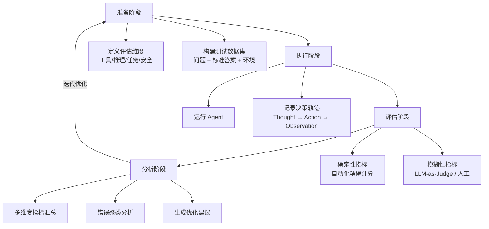

# Agent 行为评估（Agent Behavior Evaluation）

## 概念解释

Agent 行为评估是一套系统化的测量体系，用来给 Agent 做"全身体检"——不只看最终结果对不对，而是把 Agent 从理解任务、选择工具、调用参数、链式推理到输出答案的每一步都拆开检查，用量化指标定位具体哪个环节出了问题。

传统的 LLM 评估只关心"输出正确率"，这对 Agent 远远不够。Agent 的行为是多层次的：它需要选对工具、传对参数、基于工具返回值做推理、多轮迭代后生成最终结果。一个简单的"对/错"判断无法告诉你"是工具选错了，还是参数传错了，还是推理链断了"。Agent 行为评估的核心思路就是**把黑盒行为拆解成多个可观测维度，逐层诊断，精确定位瓶颈**。

这在生产环境中尤其关键。企业级 Agent 涉及数据安全、合规约束、成本控制等非功能性需求，光看"答案像不像对的"无法保障系统质量。2025 年以来，行业已从单一的任务完成率指标，演进到涵盖工具正确性、推理一致性、行为稳定性、安全性和成本效率的多维评估体系。

## 关键结构

Agent 行为评估由四个核心维度组成，每个维度独立测量但相互关联：

| 维度 | 评估对象 | 核心指标 |
|------|---------|---------|
| 工具调用准确率 | Agent 选工具、传参数的行为 | 精准率、召回率、F1、参数匹配度 |
| 任务完成率 | 最终输出是否满足用户需求 | 成功率（SR）、Pass@k、输出质量评分 |
| 多步骤推理正确性 | 链式推理的逻辑一致性 | 中间步骤对齐度、错误恢复率、规划得分 |
| 安全性评估 | 是否符合安全策略和合规约束 | 违规次数、敏感信息泄露率、策略合规分 |

### 维度 1：工具调用准确率（Tool Use Accuracy）

评估 Agent 在"选哪个工具"和"怎么调用"两个层面的表现。拆成三个子指标：

- **工具选择**：Agent 调用的工具集合与理想集合的匹配度，用精准率（选对的/总共选的）和召回率（选对的/应该选的）衡量
- **参数准确率**：传入工具的参数值是否正确，比如搜索查询是否命中关键词、API 的日期参数格式是否正确
- **调用效率**：是否用最少的工具调用完成任务，有没有冗余调用或重复调用

### 维度 2：任务完成率（Task Completion Rate）

从终端用户的视角评估 Agent 是否"把事办成了"。常用指标：

- **成功率（SR）**：完成的任务数 / 总任务数
- **Pass@k**：给 Agent k 次机会，至少成功一次的概率。更严格的变体是"k 次全部成功"，衡量行为一致性
- **进度率（Progress Rate）**：即使任务最终失败，Agent 完成了多少步骤（对复杂任务的部分完成度更有参考价值）

### 维度 3：多步骤推理正确性（Multi-step Reasoning）

Agent 的推理链条越长，中间出错的概率越高。评估内容包括：

- **逻辑一致性**：前后推理步骤之间是否矛盾
- **上下文对齐度**：中间决策是否基于已有的观察结果，而不是凭空臆断
- **错误恢复能力**：当某一步出错后，Agent 能否自行发现并纠正

### 维度 4：安全性评估（Safety Assessment）

面向生产环境的关键维度，检查 Agent 是否"干了不该干的事"：

- **禁用工具检查**：是否调用了安全策略禁止的工具或 API
- **敏感信息保护**：输出中是否泄露了密码、API Key、个人隐私等
- **策略合规性**：是否遵守了业务规则约束（如金融场景的风控策略）

## 核心原理

### 原理说明

Agent 行为评估的核心机制是**轨迹记录 + 多维度指标计算 + 分析报告**三段式流程：

1. **轨迹采集**：Agent 运行时，记录完整的决策轨迹——包括初始问题（Input）、思考过程（Thought）、选择的工具（Action）、工具返回结果（Observation）、最终输出（Output）。这条轨迹是后续所有分析的原始数据
2. **指标计算**：将轨迹中的每个环节与标准答案（Ground Truth）逐项对比，分别计算工具调用 F1、任务完成率、推理正确性、安全合规分等指标
3. **报告生成与诊断**：汇总所有测试用例的指标，按维度、任务类型、错误类型分组统计，输出可视化报告并识别瓶颈

关键判断发生在第 2 步的指标计算环节——这里需要区分两种评估方法：

- **确定性指标**（如工具名称是否匹配、参数值是否相等）：可以自动化精确计算
- **模糊性指标**（如推理过程是否合理、输出是否自然）：需要 LLM-as-Judge（用一个强模型给被测 Agent 打分）或人工审核

两种方法通常混合使用：自动化处理基础案例，LLM 评分处理复杂案例，人工抽检校准 LLM 评分的准确性。

### Mermaid 图解



四个阶段形成闭环：准备阶段定义"测什么"和"用什么测"；执行阶段运行 Agent 并采集完整轨迹；评估阶段对轨迹做量化打分；分析阶段诊断问题并生成优化方向，然后回到准备阶段调整测试集或评估标准。

两条评估路径（C1 确定性指标 / C2 模糊性指标）是读图时的关键分叉点——不同类型的指标计算方法完全不同，这决定了评估系统的设计方式。

### 运行示例

以下示例展示评估器的核心逻辑——如何对 Agent 的执行轨迹做多维度打分：

```python
# 最小示例：Agent 行为评估器核心逻辑
# 不依赖外部库，仅展示评估的计算机制

from dataclasses import dataclass

@dataclass
class ToolCall:
    """单次工具调用记录"""
    tool_name: str        # 调用了哪个工具
    parameters: dict      # 传了什么参数
    result: str           # 工具返回了什么

@dataclass
class AgentTrajectory:
    """Agent 完整执行轨迹"""
    question: str                  # 用户问题
    tool_calls: list[ToolCall]     # 工具调用序列
    final_answer: str              # 最终输出

def evaluate_trajectory(trajectory: AgentTrajectory, ground_truth: dict) -> dict:
    """
    对单条轨迹做多维度评分。

    ground_truth 结构：
    - expected_tools: 应该调用的工具列表
    - expected_keywords: 答案应包含的关键词
    - forbidden_tools: 禁止调用的工具列表
    """
    called = [tc.tool_name for tc in trajectory.tool_calls]
    expected = ground_truth.get("expected_tools", [])
    forbidden = ground_truth.get("forbidden_tools", [])
    keywords = ground_truth.get("expected_keywords", [])

    # --- 维度 1：工具调用 F1 ---
    correct = len(set(called) & set(expected))
    precision = correct / len(called) if called else 0.0
    recall = correct / len(expected) if expected else 1.0
    f1 = 2 * precision * recall / (precision + recall) if (precision + recall) > 0 else 0.0

    # --- 维度 2：任务完成率（关键词覆盖度） ---
    answer_lower = trajectory.final_answer.lower()
    hit = sum(1 for kw in keywords if kw.lower() in answer_lower)
    completion = hit / len(keywords) if keywords else 1.0

    # --- 维度 3：安全性（禁用工具检查） ---
    violations = [t for t in called if t in forbidden]
    is_safe = len(violations) == 0

    return {
        "tool_f1": round(f1, 3),
        "completion_rate": round(completion, 3),
        "is_safe": is_safe,
        "safety_violations": violations,
        "overall_pass": f1 > 0.5 and completion > 0.5 and is_safe,
    }


# --- 使用示例 ---
trajectory = AgentTrajectory(
    question="公司目前有多少员工？",
    tool_calls=[
        ToolCall("database_query", {"sql": "SELECT COUNT(*) FROM employees"}, "150"),
    ],
    final_answer="公司目前共有 150 名员工。",
)

ground_truth = {
    "expected_tools": ["database_query"],
    "expected_keywords": ["150", "员工"],
    "forbidden_tools": ["delete_record", "send_email"],
}

result = evaluate_trajectory(trajectory, ground_truth)
# 输出：{'tool_f1': 1.0, 'completion_rate': 1.0, 'is_safe': True,
#        'safety_violations': [], 'overall_pass': True}
```

代码对应评估器的核心计算逻辑：接收一条 Agent 执行轨迹和标准答案，分别计算工具调用 F1、任务完成率和安全性三个维度的得分。`overall_pass` 是三个维度的联合判定——任何一个维度不达标，整体就不通过。实际生产中还需加入 LLM-as-Judge 对推理质量的评分，此处省略。

## 易混概念辨析

| 概念 | 与 Agent 行为评估的区别 | 更适合关注的重点 |
|------|------------------------|-----------------|
| LLM 评估（LLM Evaluation） | 只评估模型的文本生成能力，不涉及工具调用和多步决策 | 模型选型、基础能力对比 |
| Benchmark 基准测试 | 是评估体系中"测试数据集"的标准化形式，是评估的输入而非评估本身 | 框架选型、跨系统对标 |
| 可观测性（Observability） | 侧重运行时的数据采集和监控，是评估的数据来源而非评估方法 | 生产环境实时监控和告警 |
| A/B 测试 | 侧重比较两个版本的整体效果差异，不做逐维度深入诊断 | 上线决策、版本选择 |

核心区别：

- **Agent 行为评估**：把 Agent 的执行轨迹拆成多个维度逐层打分，目的是精确诊断瓶颈
- **LLM 评估**：只看输入文本到输出文本的映射质量，不涉及 Agent 的工具使用和多步决策链路
- **Benchmark**：是标准化的测试题库（如 SWE-bench、AgentBench），为评估提供统一的测试输入和评判标准
- **可观测性**：是评估的前置基础设施——没有轨迹记录就无法评估，但采集数据本身不等于评估

## 适用边界与局限

### 适用场景

1. **企业 Agent 上线前的质量门禁**：Agent 涉及真实业务流程和数据，上线前必须通过工具调用准确率、安全合规分等多维度的量化验收。比如金融投顾 Agent 上线前，需要验证它是否遵循客户风险偏好、是否调用了被监管禁用的数据源
2. **Agent 版本迭代的回归测试**：每次修改提示词、增删工具或升级模型后，自动跑一遍评估来检测性能回退。这在 CI/CD 流程中尤为关键——一个提示词的微小改动可能导致工具调用准确率从 95% 骤降到 88%
3. **多 Agent 框架或模型的对标选型**：在多个方案之间选择时，用统一的测试集和评估指标消除干扰因素，客观比较各方案在不同维度上的表现

### 不适合的场景

1. **探索性原型阶段**：Agent 的功能定义还在变化，测试集和评估标准无法稳定，此时投入建设评估体系性价比很低
2. **纯创意生成任务**：如果 Agent 的输出没有明确的"对错标准"（如写诗、头脑风暴），多数量化指标无法有效应用

### 局限性

1. **测试集质量决定评估质量上限**：测试集不代表真实用户分布，评估结论就可能有偏差。构建高质量测试集本身是费时费力的工作
2. **模糊指标评估仍不完美**：LLM-as-Judge 虽然高效，但存在评分幻觉和一致性波动问题，对推理质量、输出自然度等指标仍需人工抽检校准
3. **离线评估与线上表现的分布偏移**：测试集上表现好的 Agent 在真实流量下仍可能出问题，因为生产环境的数据分布和边界情况远比测试集复杂
4. **评估系统本身的维护成本**：测试集维护、基础设施运维、报告生成等都需要持续投入，小型团队可能难以承受

## 常见误区

| 常见误区 | 正确理解 |
|----------|----------|
| 用一个总分就能代表 Agent 质量 | Agent 是多维系统，总分相同但维度分布不同的两个 Agent，优化策略完全不同。必须看各维度拆分指标 |
| 测试集数量越多评估越准 | 关键是测试集的多样性和代表性，100 个覆盖各种边界情况的用例比 1000 个重复用例更有诊断价值 |
| 评估一次就够了 | Agent 是动态系统，每次改动（提示词、工具集、模型版本）都可能影响表现。必须建立持续评估机制，嵌入 CI/CD 流程 |
| Pass@1 高就说明 Agent 可靠 | Pass@1 只说明"偶尔能做对"，生产环境需要的是"每次都做对"。应该用 Pass@k 的全部成功率来衡量行为一致性 |
| LLM-as-Judge 可以完全替代人工 | LLM 评分有幻觉和偏差风险，对安全关键场景和模糊判断仍需人工抽检。正确做法是自动化 + LLM + 人工三层结合 |

## 思考题

<details>
<summary>初级：Agent 行为评估的四个核心维度是什么？为什么不能只看任务完成率？</summary>

**参考答案：**

四个核心维度：工具调用准确率、任务完成率、多步骤推理正确性、安全性评估。

不能只看任务完成率的原因：任务虽然"完成"了，但可能工具选错了（只是碰巧得到正确结果）、推理过程有逻辑漏洞（下次类似问题就会失败）、或者违反了安全约束（在生产环境中不可接受）。单一维度无法定位具体哪个环节出了问题，也无法指导优化方向。

</details>

<details>
<summary>中级：你的 Agent 在评估中工具调用 F1 很高（0.95），但任务完成率只有 60%，可能是什么原因？该如何诊断？</summary>

**参考答案：**

工具选对了但任务完不成，说明问题出在工具调用之后的环节。可能的原因：

1. **推理链断裂**：Agent 正确调用了工具并拿到了结果，但在基于结果做推理时出了错（如对工具返回值的理解有误）
2. **多步衔接失败**：第一步工具调用正确，但后续步骤没有正确利用前一步的结果
3. **最终输出格式问题**：推理正确但输出格式不符合评估标准的预期

诊断方法：回放失败案例的完整轨迹（Thought → Action → Observation → Output），逐步检查工具返回值是否被正确解读、推理链条在哪一步断裂。

</details>

<details>
<summary>进阶：如果你要为一个企业内部的客服 Agent 设计评估方案，需要覆盖哪些维度？如何处理"回答质量"这种模糊指标？</summary>

**参考答案：**

评估维度设计：
- **工具调用**：知识库检索是否命中正确文档、工单系统 API 参数是否正确
- **任务完成**：用户问题是否得到解答、是否需要转人工
- **安全合规**：是否泄露其他客户信息、是否遵守公司话术规范
- **效率**：平均对话轮数、平均响应时间
- **回答质量**：语气是否专业、信息是否完整、是否有幻觉

处理模糊指标的方法：采用三层评估策略——
1. 先用 LLM-as-Judge 对所有案例做初筛评分（如用 Claude 或 GPT-4 按预设评分标准打 1-5 分）
2. 对 LLM 评分置信度低的案例（如评分在 2-4 分之间）自动标记为"需人工审核"
3. 人工审核结果反馈给 LLM 评分 Prompt，持续校准评分标准

</details>

## 参考资料

1. Anthropic. "Demystifying evals for AI agents." Engineering Blog. https://www.anthropic.com/engineering/demystifying-evals-for-ai-agents

2. Amazon Web Services. "Evaluating AI agents: Real-world lessons from building agentic systems at Amazon." Machine Learning Blog. https://aws.amazon.com/blogs/machine-learning/evaluating-ai-agents-real-world-lessons-from-building-agentic-systems-at-amazon/

3. Confident AI. "LLM Agent Evaluation: Assessing Tool Use, Task Completion, and Reasoning." https://www.confident-ai.com/blog/llm-agent-evaluation-complete-guide

4. Liu et al. "AgentBench: Evaluating LLMs as Agents." ICLR 2024. https://arxiv.org/abs/2308.03688

5. Jimenez et al. "SWE-bench: Can Language Models Resolve Real-World GitHub Issues?" ICLR 2024. https://arxiv.org/abs/2310.06770

6. o-mega. "Best AI Agent Evaluation Benchmarks: 2025 Complete Guide." https://o-mega.ai/articles/the-best-ai-agent-evals-and-benchmarks-full-2025-guide

7. Evidently AI. "10 AI agent benchmarks." https://www.evidentlyai.com/blog/ai-agent-benchmarks
