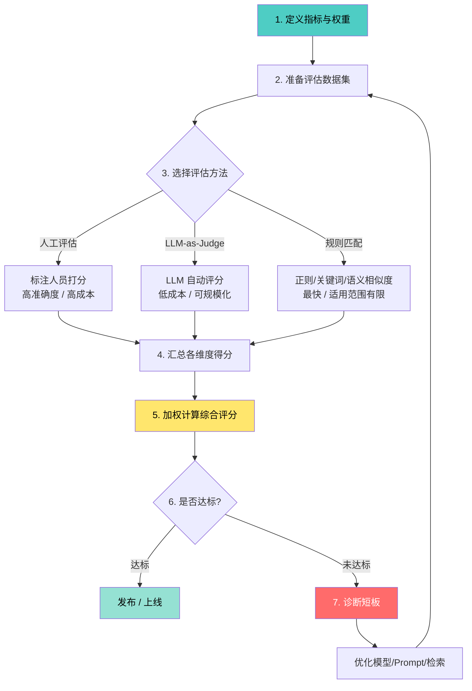
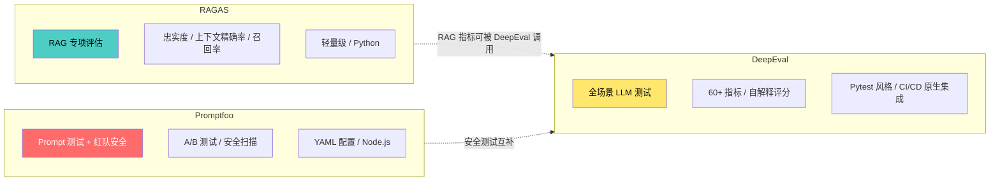

# 评估框架（Evaluation Framework）

## 概念解释

评估框架（Evaluation Framework）是一套系统化的指标体系 + 评估工具 + 工作流程，用来量化回答"你的 LLM/Agent 系统到底好不好用"这个问题。它不只看最终答案对不对，还关注中间推理过程是否合理、工具调用是否恰当、响应速度和成本是否可接受。

传统软件测试有明确的"对错"标准——函数输入 2+3 应该返回 5。但 LLM 系统的输出是自然语言，同一个问题可以有多种正确表述，也可能出现"看起来像回答但完全编造"的幻觉。更麻烦的是，Agent 系统还涉及多步骤推理和工具调用，每一步都可能偏离正轨。评估框架就是为了解决"LLM 输出没有唯一正确答案，怎么系统地判断质量"这个根本难题而诞生的。

与传统的 BLEU/ROUGE 等文本匹配指标不同，现代评估框架引入了 LLM-as-Judge（用一个 LLM 评判另一个 LLM 的输出）、多维度指标体系（准确性、忠实度、相关性等并行评估）、以及自动化评估管道（集成到 CI/CD 持续监控）。这使得评估从"上线前人工抽查"进化到"全生命周期自动化质量保障"。

## 关键结构

| 结构 | 作用 | 说明 |
|------|------|------|
| 评估指标集 | 定义"好"的标准 | 确定要衡量哪些维度，如准确性、忠实度、相关性、延迟、成本 |
| 评估数据集 | 提供评测基准 | 包含查询、参考答案、上下文的标准化测试集 |
| 评估方法 | 决定"怎么打分" | 人工评估、LLM-as-Judge、规则匹配、或混合模式 |
| 评估工具链 | 执行评估计算 | RAGAS、DeepEval、Promptfoo 等开源框架 |
| 评估管道 | 持续监控质量 | 集成到 CI/CD，自动检测性能回退（regression） |

### 结构 1：评估指标集

评估指标集是整个框架的核心，它定义了"好"的具体含义。不同场景需要关注不同维度：

- **准确性（Accuracy）**：Agent 输出的答案是否正确。对于事实类问题可以直接比对；对于开放性问题需要人工或 LLM 判分
- **忠实度（Faithfulness）**：特别重要于 RAG 系统——Agent 的回答是否严格基于检索到的上下文，而非凭空编造（幻觉）
- **相关性（Relevance）**：输出与用户查询的匹配程度。分为"答案相关性"和"上下文相关性"两个子维度
- **延迟（Latency）**：端到端响应时间，以及各步骤（检索、推理、生成）的分段耗时
- **成本（Cost）**：每次查询消耗的 token 数、API 调用次数、总费用

### 结构 2：评估数据集

评估数据集是评测的"考卷"。一个高质量的评估数据集需要包含：

- **查询（Query）**：用户的原始问题或指令
- **参考答案（Reference Answer）**：已知正确的标准答案（部分场景可选）
- **上下文（Context）**：RAG 系统检索到的文档片段
- **元数据**：难度等级、问题分类、来源标注等

样本量建议：快速验证 50-100 条，正式基准测试 200-500 条，生产级评估 1000+ 条。

### 结构 3：评估方法

三种主流评估方法各有适用场景：

**人工评估**：邀请标注人员对 Agent 输出打分。准确度最高，但成本贵、速度慢，适合构建基准数据集和关键场景验收。

**自动评估（LLM-as-Judge）**：用一个强 LLM（如 GPT-4、Claude）评判另一个 LLM 的输出。成本低、速度快，适合日常迭代和持续监控。但要注意 LLM 评委自身的偏见（如偏好冗长回答、位置偏见等）。

**混合评估**：先用自动评估大规模筛查，再对高风险或低分样本做人工复审。这是生产环境中最推荐的做法，研究表明混合方法比纯自动方法的整体质量提升约 40%。

## 核心原理

### 原理说明

评估框架的运作逻辑可以拆成三层：

**第一层：定义评估维度与权重。** 根据业务场景确定哪些指标最重要。例如搜索类 Agent 侧重准确性和延迟，知识库问答侧重忠实度和相关性。每个指标赋予权重，综合评分公式为：

$$Score = \sum_{i=1}^{n} w_i \cdot m_i$$

其中 $w_i$ 是第 $i$ 个指标的权重（所有权重之和为 1），$m_i$ 是该指标的归一化得分（0-1）。

**第二层：执行评估。** 将 Agent 的输出（或完整推理轨迹）送入评估器。评估器根据选定的方法（规则匹配、LLM-as-Judge、语义相似度等）计算每个维度的得分。关键区别在于评估粒度：

- **最终结果评估（Black-Box）**：只看最终答案，不关心中间过程
- **轨迹评估（Glass-Box）**：评估 Agent 的完整推理和工具调用链路
- **单步评估（White-Box）**：逐步检查每个推理步骤和决策点

**第三层：分析与反馈。** 汇总评估结果，生成诊断报告，精确定位短板。例如"忠实度 0.6 但准确性 0.9"说明 Agent 能回答对但存在幻觉风险，需要优化 RAG 检索环节。

### Mermaid 图解



图中展示了评估框架的完整闭环流程。核心转折点在节点 6（是否达标）——这里形成了"评估-诊断-优化-再评估"的持续改进循环。三种评估方法在节点 3 分叉，实际项目中通常组合使用而非单选。

### 主流评估工具对比

当前最流行的三个开源评估框架各有侧重：



| 维度 | RAGAS | DeepEval | Promptfoo |
|------|-------|----------|-----------|
| **核心定位** | RAG 管道专项评估 | 全场景 LLM 测试（RAG + Agent + 对话） | Prompt 工程 + 红队安全测试 |
| **指标数量** | 5 个核心 RAG 指标 | 60+ 指标（RAG、安全、Agent 等） | 基础 RAG + 安全指标 |
| **评分可解释性** | 只返回分数，不解释原因 | 自解释（Self-Explaining）：告诉你为什么扣分 | 只返回分数 |
| **技术栈** | Python | Python / Pytest | Node.js / YAML |
| **CI/CD 集成** | 需手动配置 | 原生 Pytest 集成，开箱即用 | CLI 驱动，适合脚本化 |
| **合成数据生成** | 内置 QA 对生成 | 支持 | 不支持 |
| **红队安全测试** | 不支持 | 支持 | 强项（注入检测、越狱扫描） |
| **选型建议** | 只需评估 RAG 管道 | 需要全面的 LLM 测试体系 | 侧重 Prompt 迭代和安全合规 |

### 运行示例

```python
# 基于 ragas==0.2.x 验证（截至 2026-03）
# 最小示例：使用非 LLM 指标做离线评估，不依赖 OpenAI API Key

from ragas.dataset_schema import SingleTurnSample
from ragas.metrics._string import NonLLMStringSimilarity
from ragas.metrics import StringPresence

# 构造一个最小评估样本：response 对应模型输出，reference 对应参考答案或关键短语
sample = SingleTurnSample(
    response="RAG 是检索增强生成，通过先检索再生成来减少幻觉。",
    reference="检索增强生成",
)

# 指标 1：判断回答里是否包含关键短语（无需 LLM / API Key）
keyword_metric = StringPresence()
keyword_score = keyword_metric.single_turn_score(sample)

# 指标 2：计算回答与参考文本的字符串相似度（无需 LLM / API Key）
similarity_metric = NonLLMStringSimilarity()
similarity_score = similarity_metric.single_turn_score(sample)

print({
    "string_presence": keyword_score,
    "non_llm_string_similarity": similarity_score,
})
# 输出示例：{'string_presence': 1.0, 'non_llm_string_similarity': 0.4}
```

上述代码展示了 RAGAS 的另一种安全用法：在本地先使用 `StringPresence` 和 `NonLLMStringSimilarity` 这类非 LLM 指标做离线验证。这样可以先检查回答是否包含关键概念、以及与参考答案在字面层面的接近程度，不需要额外配置 OpenAI API Key。需要更强的语义评估时，再切换到 `faithfulness`、`answer_relevancy`、`context_precision` 等依赖评审模型的指标。

## 易混概念辨析

| 概念 | 与评估框架的区别 | 更适合关注的重点 |
|------|-----------------|-----------------|
| 基准测试（Benchmark） | Benchmark 是固定的"考试题库"（如 MMLU、HumanEval），评估框架是"考试制度"——包含出题、阅卷、分析全流程 | 关注标准化数据集和排行榜 |
| 可观测性（Observability） | 可观测性是"监控仪表盘"，记录系统运行时的 trace、日志、指标；评估框架是"质量审计"，主动测量输出好不好 | 关注实时监控、问题定位 |
| A/B 测试 | A/B 测试比较两个版本在真实用户上的表现差异；评估框架在离线数据集上全面度量系统质量 | 关注线上版本选择 |

核心区别：

- **评估框架**：系统化地度量"Agent 输出好不好"，覆盖离线测试 + 持续监控
- **基准测试**：提供标准化"考卷"，是评估框架的输入之一，但不包含评估方法和工具
- **可观测性**：记录"系统运行时发生了什么"，是评估框架的数据来源之一，但不做质量判断

## 适用边界与局限

### 适用场景

1. **RAG 系统质量把关**：上线前用忠实度、上下文精确率等指标系统检测幻觉和检索质量，避免"看起来流畅但内容错误"的输出到达用户
2. **Agent 系统持续迭代**：每次修改 Prompt、切换模型或更新知识库后，自动运行评估管道检测性能回退，防止"改了一处坏了十处"
3. **多模型选型决策**：用相同的评估数据集和指标对比不同模型（如 GPT-4o vs Claude 3.5 vs Llama 3），为模型选型提供量化依据
4. **合规与安全审计**：在金融、医疗等强监管场景，用评估框架定期审计 Agent 输出的准确性和安全性，满足合规要求

### 不适合的场景

1. **创意型生成任务**：写诗、写小说等高度主观的创作场景，难以定义"正确答案"，量化指标的参考价值有限
2. **实时用户满意度评估**：评估框架主要在离线环境运行，无法替代用户反馈系统来衡量真实满意度

### 局限性

1. **评估数据集质量瓶颈**：框架的有效性严重依赖评估数据集的代表性。数据集覆盖不全面时，评估结果会产生盲区
2. **LLM-as-Judge 的固有偏见**：LLM 评委倾向于偏好冗长回答、偏好自己风格的输出，以及存在位置偏见（评判多个选项时倾向选第一个）。关键场景仍需人工复审
3. **指标间的固有冲突**：提升准确性可能需要更多工具调用，这会增加延迟和成本。权重分配需要反复实验调整，没有万能公式
4. **缺乏通用 Agent 基准**：不同领域、不同任务的评估标准差异大，目前还没有类似 ImageNet 的通用 Agent 评估基准，跨领域对标困难

## 常见误区

| 常见误区 | 正确理解 |
|----------|----------|
| "准确率高就说明系统好" | 准确率只是一个维度。系统可能准确率 95% 但响应时间 10 秒、每次查询花费 0.5 美元——综合质量未必合格。必须多维度评估 |
| "LLM-as-Judge 可以完全取代人工" | LLM-as-Judge 适合大规模初筛，但在医疗、法律等高风险场景，以及构建基准数据集时，人工评估仍不可替代。混合方法效果最佳 |
| "一次评估通过就万事大吉" | 模型更新、知识库变动、用户行为变化都会导致性能漂移（drift）。评估必须集成到 CI/CD 持续运行，而非一次性工作 |
| "用同一套指标评估所有 Agent" | 搜索 Agent 看准确性和延迟，知识问答看忠实度和相关性，代码生成看功能正确性和安全性。指标权重必须按场景定制 |

## 思考题

<details>
<summary>初级：为什么 Agent 系统不能只用"准确率"来评估，而需要多维度指标体系？</summary>

**参考答案：**

Agent 系统与传统分类任务不同，它涉及多步推理、工具调用和自然语言生成。只看准确率会忽略几个关键问题：（1）回答正确但完全编造理由（忠实度低，存在幻觉风险）；（2）回答正确但耗时 30 秒（延迟不可接受）；（3）回答正确但调用了 20 次 API（成本过高）；（4）回答正确但与用户问的不是同一个角度（相关性低）。多维度指标体系能分别定位这些不同类型的问题，指导有针对性的优化。

</details>

<details>
<summary>中级：你负责一个法律文档问答 Agent，需要选择评估框架。RAGAS、DeepEval、Promptfoo 中你会选哪个？为什么？</summary>

**参考答案：**

建议以 DeepEval 为主 + RAGAS 为辅的组合方案。理由：（1）法律场景对准确性和忠实度要求极高，需要 RAGAS 的 RAG 专项指标（faithfulness、context_precision）精确检测幻觉；（2）法律场景同时需要安全性评估（防止泄露敏感信息）、合规性检查、多轮对话评估等，DeepEval 的 60+ 指标覆盖更全面；（3）DeepEval 的自解释评分能帮助法务团队理解"为什么这条回答被判为不合格"，便于审计追溯；（4）DeepEval 原生 Pytest 集成方便嵌入 CI/CD 持续监控。Promptfoo 侧重 prompt 迭代和安全红队，可以作为补充在安全测试环节使用。

</details>

<details>
<summary>中级/进阶：某团队发现他们的 RAG Agent 评估得分一直很高（忠实度 0.95+），但用户投诉不断。可能的原因是什么？如何改进？</summary>

**参考答案：**

高评估分 + 高用户投诉的矛盾通常指向以下问题：（1）**评估数据集不具代表性**——测试集覆盖的问题类型与真实用户提问差距大，存在分布偏移。改进方案：从生产日志中提取失败 trace，加入评估数据集；（2）**关键维度缺失**——只评估了忠实度，没评估用户真正关心的维度（如回答是否通俗易懂、是否完整、格式是否友好）。改进方案：增加"有用性""完整性""可读性"等指标；（3）**LLM-as-Judge 与人类判断标准不一致**——LLM 评委可能认为"基于上下文、语法正确"就算忠实，但用户期望更深层的理解。改进方案：用人工标注数据校准 LLM-as-Judge 的评分标准；（4）**评估粒度不够**——只做了最终答案评估（Black-Box），没检查推理轨迹。用户可能遇到"答案最终对了但中间经历了多次错误重试导致极慢"的问题。改进方案：增加轨迹评估（Glass-Box）和延迟分段监控。

</details>

## 参考资料

1. Es, S., James, J., Cohan, A., Goyal, N., & Gurevych, I. (2023). "RAGAS: Automated Evaluation of Retrieval Augmented Generation." arXiv preprint. https://arxiv.org/abs/2309.15217
2. Zheng, L., Chiang, W. L., Sheng, Y., et al. (2023). "Judging LLM-as-a-Judge with MT-Bench and Chatbot Arena." arXiv preprint. https://arxiv.org/abs/2306.05685
3. DeepEval 官方文档 - AI Agent Evaluation Guide. https://deepeval.com/guides/guides-ai-agent-evaluation
4. Langfuse - Agent Evaluation: How to Evaluate LLM Agents. https://langfuse.com/guides/cookbook/example_pydantic_ai_mcp_agent_evaluation
5. AWS Blog - Evaluating AI Agents: Real-World Lessons from Building Agentic Systems at Amazon. https://aws.amazon.com/blogs/machine-learning/evaluating-ai-agents-real-world-lessons-from-building-agentic-systems-at-amazon/
