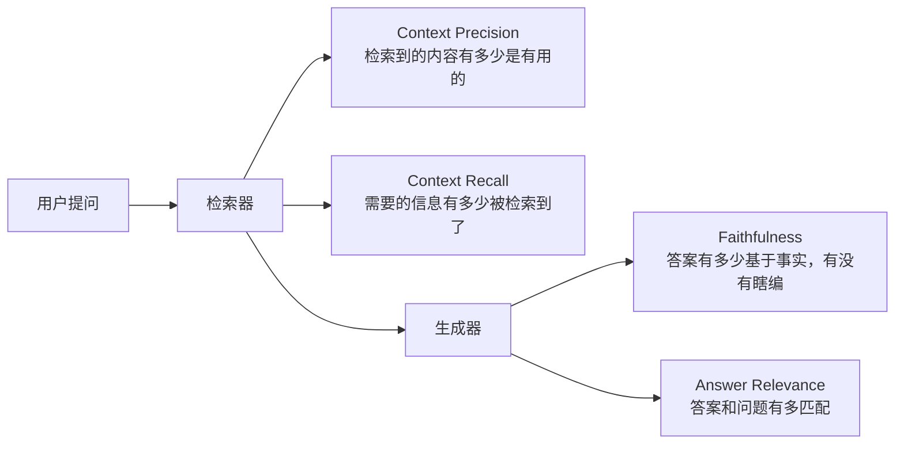
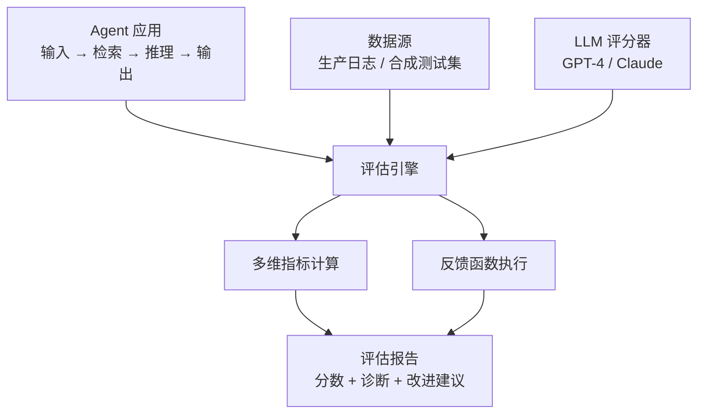

# Agent 评估工具（Evaluation Tools）

## 基础概念

你辛辛苦苦搭了一个 Agent 应用，它能检索、能推理、能调工具——但它到底好不好用？回答准不准？有没有在瞎编（幻觉）？这些问题光靠人工测几轮是不够的。

评估工具就是帮你**用量化指标自动打分**的框架。核心思路是"让 LLM 给 LLM 打分"（LLM-as-a-Judge），再配合多维度指标（检索准不准、答案忠不忠实、有没有跑题），把 Agent 系统的质量从"感觉还行"变成"数据说了算"。

### 核心要素

| 要素 | 作用 |
|------|------|
| **LLM-as-a-Judge（LLM 评分器）** | 用一个强 LLM（如 GPT-4）对目标 LLM 的输出打分，替代人工标注 |
| **多维评估指标** | 从检索精度、答案忠实度、相关性等多个角度量化评估，不依赖单一分数 |
| **反馈函数（Feedback Function）** | 可编程的评估逻辑，对 Agent 的输入、输出、中间步骤分别打分 |

### LLM-as-a-Judge（LLM 评分器）

传统做法是找人标注"黄金答案"，然后对比——贵、慢、不可扩展。LLM-as-a-Judge 的思路是：**用一个更强的模型去判断目标模型的输出质量**。比如用 GPT-4 给 GPT-3.5 的回答打 1-5 分。多项研究表明，这种方法与人工评估的一致性可达 85% 以上，而成本只有人工的 1/10。

局限：评分器自身也可能犯错（比如被花言巧语骗过），所以关键业务场景仍需人工抽检。

### 多维评估指标

一个 RAG 系统的质量不能用一个分数概括。以 RAGAS 框架定义的四个核心维度为例：



四个指标哪个低，就知道哪个环节出了问题：
- **Context Precision 低** → 检索返回了太多无关内容 → 优化排序
- **Context Recall 低** → 漏掉了关键信息 → 扩大检索范围
- **Faithfulness 低** → 模型在编造内容（幻觉）→ 换更强的模型或改提示词
- **Answer Relevance 低** → 答案跑题了 → 优化生成指令

### 反馈函数（Feedback Function）

反馈函数是 TruLens 等框架的核心设计。把评估逻辑封装成函数，接收 Agent 的某个中间结果（比如检索到的上下文），返回一个 0-1 的评分。多个反馈函数组合起来，就能对 Agent 做全面体检。

### 要素关系图



三者的关系：LLM-as-a-Judge 是「谁来打分」，多维指标是「从哪些角度打分」，反馈函数是「怎么把打分逻辑编程化」。

## 基础用法

安装依赖（五大工具按需选装）：

```bash
# RAGAS —— RAG 评估专家
pip install ragas

# DeepEval —— 通用 LLM 评估框架
pip install deepeval

# Promptfoo —— 声明式测试 + 红队安全（Node.js CLI）
npm install -g promptfoo

# 配置 LLM 评分器的 API Key（以 OpenAI 为例）
# 获取地址：https://platform.openai.com/api-keys
export OPENAI_API_KEY="your-api-key"
```

最小可运行示例（基于 deepeval==3.9.2 验证，截至 2026-03）：

```python
"""
最小评估示例：用 DeepEval 评估一个 RAG 系统的单条输出
"""
# pip install deepeval==3.9.2
# 需要设置环境变量 OPENAI_API_KEY

from deepeval import evaluate
from deepeval.test_case import LLMTestCase
from deepeval.metrics import (
    AnswerRelevancyMetric,
    FaithfulnessMetric,
)

# 1. 准备一条评估数据：问题、检索到的上下文、Agent 生成的答案
test_case = LLMTestCase(
    input="Python 中 GIL 是什么？",
    actual_output="GIL 是全局解释器锁，限制了多线程并发执行 Python 字节码。",
    retrieval_context=[
        "全局解释器锁（GIL）是 CPython 的内部机制，"
        "在任何时刻只允许一个线程执行 Python 字节码，"
        "这限制了多线程在 CPU 密集型任务上的性能。"
    ],
)

# 2. 定义评估指标
answer_relevancy = AnswerRelevancyMetric(threshold=0.7)  # 答案相关性，阈值 0.7
faithfulness = FaithfulnessMetric(threshold=0.7)          # 答案忠实度，阈值 0.7

# 3. 执行评估（会调用 OpenAI API 进行 LLM-as-a-Judge 打分）
results = evaluate(
    test_cases=[test_case],
    metrics=[answer_relevancy, faithfulness],
)

# 4. 查看结果
for result in results.test_results:
    print(f"输入：{result.input}")
    for metric_result in result.metrics_data:
        print(f"  {metric_result.name}: {metric_result.score:.2f} "
              f"(通过: {metric_result.success})")
        if metric_result.reason:
            print(f"    原因：{metric_result.reason}")
```

预期输出：

```text
输入：Python 中 GIL 是什么？
  Answer Relevancy: 0.85 (通过: True)
    原因：答案准确解释了 GIL 的含义和影响，与问题高度相关
  Faithfulness: 0.92 (通过: True)
    原因：答案内容完全基于检索到的上下文，未产生幻觉
```

DeepEval 的特点是指标自带解释（"为什么给这个分"），方便定位问题。

用 RAGAS 评估的最小示例（基于 ragas==0.4.3 验证，截至 2026-03）：

```python
"""
RAGAS 最小评估示例
"""
# pip install ragas==0.4.3
# 需要设置环境变量 OPENAI_API_KEY

from ragas import evaluate
from ragas.metrics import (
    context_precision,
    context_recall,
    faithfulness,
    answer_relevancy,
)
from datasets import Dataset

# 准备评估数据（Hugging Face Dataset 格式）
eval_data = Dataset.from_dict({
    "question": ["Python 中 GIL 是什么？"],
    "contexts": [[
        "全局解释器锁（GIL）是 CPython 的内部机制，"
        "在任何时刻只允许一个线程执行 Python 字节码。"
    ]],
    "answer": ["GIL 是全局解释器锁，限制了多线程并发执行。"],
    "ground_truth": ["GIL 在同一时刻只允许一个线程执行 Python 代码。"],
})

# 执行评估（调用 OpenAI API）
results = evaluate(dataset=eval_data, metrics=[
    context_precision, context_recall, faithfulness, answer_relevancy
])

print(f"上下文精准度：{results['context_precision']:.3f}")
print(f"上下文召回率：{results['context_recall']:.3f}")
print(f"答案忠实度：{results['faithfulness']:.3f}")
print(f"答案相关性：{results['answer_relevancy']:.3f}")
```

## 同类工具对比

| 维度 | RAGAS | DeepEval | TruLens | Promptfoo |
|------|-------|----------|---------|-----------|
| 核心定位 | RAG 评估专家 | 通用 LLM 评估框架 | 评估 + 可观测性追踪 | 声明式测试 + 红队安全 |
| 内置指标数 | 5 个核心指标 | 14+ 指标（RAG/安全/对话） | RAG Triad + 自定义反馈 | 自定义断言 + LLM 评分 |
| 指标可解释性 | 一般（不自带解释） | 好（自动解释扣分原因） | 一般 | 好（断言结果明确） |
| 可观测性 | 无 | 基础追踪 | 完整执行轨迹追踪 | 执行结果记录 |
| 安全测试 | 无 | 40+ 漏洞攻击测试 | 无 | 内置红队测试 |
| 语言 | Python | Python | Python | Node.js + Python |
| GitHub Stars | 7.9k+ | 5.5k+ | 2.5k+ | 5.3k+ |
| 许可证 | Apache 2.0 | Apache 2.0 | MIT | MIT |

核心区别：

- **RAGAS**：只做 RAG 评估，四个指标覆盖检索到生成全链路，简洁专注
- **DeepEval**：覆盖面最广（RAG + Agent + 安全 + 对话），像写 Pytest 一样写评估，适合快速迭代
- **TruLens**：强在追踪 Agent 执行轨迹（每一步工具调用、推理过程），适合调试复杂 Agent
- **Promptfoo**：声明式配置（YAML 定义测试用例），内置红队安全测试，已被 OpenAI 收购（2026 年 3 月）

选型建议：只做 RAG 优化选 RAGAS；需要全面评估 + 快速迭代选 DeepEval；需要调试多步骤 Agent 选 TruLens；需要安全测试和 CI/CD 集成选 Promptfoo。实际项目中可以组合使用。

## 常见误区

| 误区 | 准确理解 |
|------|----------|
| 用了 LLM-as-a-Judge 就不需要人工标注了 | LLM 评分器和人工评价的一致性约 85-90%，关键场景仍需人工抽检。建议首次评估时人工检查 20-30 个样本来校准评分标准 |
| 评估指标越多越好 | 过多指标增加 API 成本和计算时间，且容易互相矛盾。选 4-6 个核心指标就够了，RAGAS 的 4 个指标已覆盖大多数 RAG 场景 |
| 评估一次就行 | Agent 在线上运行时会遇到分布变化（用户问的问题会变）。应建立定期评估机制（如每周一次），及时发现指标下降 |

## 优劣势分析

| 优势 | 劣势 |
|------|------|
| LLM-as-a-Judge 大幅降低评估成本，无需大量人工标注 | 依赖外部 LLM API，评估本身有调用费用（GPT-4 约 $0.03/千 token） |
| 多维指标能精准定位问题环节（检索 vs 生成） | 评估结果受评分器模型能力影响，弱模型评分不稳定 |
| 支持 CI/CD 集成，可自动化回归测试 | 不同工具的指标定义和计算方式不统一，跨工具对比有偏差 |
| 开源生态活跃，工具迭代快 | Agent 的多步骤、多轮对话评估仍是开放性难题，没有银弹 |

## 思考题

<details>
<summary>初级：RAGAS 的四个指标分别评估什么？如果 Faithfulness 分数很低，说明哪个环节出了问题？</summary>

**参考答案：**

四个指标：Context Precision（检索内容有多少有用）、Context Recall（需要的信息有多少被检索到）、Faithfulness（答案有多少基于上下文事实）、Answer Relevance（答案和问题有多匹配）。

Faithfulness 低说明生成器在"编造内容"（幻觉），答案没有基于检索到的上下文。解决方向：换更强的 LLM、优化提示词让模型更严格地基于上下文回答、或者检索更多相关内容让模型"有料可用"。

</details>

<details>
<summary>中级：RAGAS、DeepEval、TruLens 分别适合什么场景？如果你要评估一个多轮对话的客服 Agent，选哪个？</summary>

**参考答案：**

- RAGAS：专注 RAG 评估，适合优化"检索 + 生成"管道
- DeepEval：覆盖面广，适合需要快速迭代的团队，支持 RAG、Agent、安全等多种场景
- TruLens：强在执行轨迹追踪，适合调试复杂 Agent 的中间步骤

多轮对话客服 Agent 的评估需要追踪每轮对话的上下文传递和工具调用，TruLens 的执行轨迹追踪能力最匹配。但如果同时需要评估答案质量指标，可以 TruLens（追踪）+ DeepEval（指标打分）组合使用。

</details>

<details>
<summary>中级：如何把评估工具集成到 CI/CD 流程中，确保每次代码提交不会让 Agent 质量下降？</summary>

**参考答案：**

核心思路是"评估即测试"，每次 PR 自动跑评估，低于阈值则阻止合并。

具体步骤：
1. 准备一个固定的评估数据集（50-100 条核心场景）
2. 在 CI 流水线中加一步：运行评估脚本，计算各项指标
3. 设置通过阈值（如 Faithfulness >= 0.8），低于阈值则 CI 失败
4. 记录基准分数，每次 PR 对比当前分数和基准，下降超过 5% 则告警
5. 用增量评估优化速度：只评估受改动影响的部分，避免每次全量跑

Promptfoo 和 DeepEval 都原生支持 CI/CD 集成，Promptfoo 还有官方 GitHub Action。

</details>

## 参考资料

1. 官方文档：[RAGAS - Evaluation Framework for RAG](https://docs.ragas.io/)
2. 官方文档：[DeepEval - The LLM Evaluation Framework](https://deepeval.com/docs/getting-started)
3. 官方文档：[TruLens - Evals and Tracing for Agents](https://www.trulens.org/)
4. 官方文档：[Promptfoo - Test your prompts, agents, and RAGs](https://www.promptfoo.dev/docs/intro/)
5. GitHub 仓库：[RAGAS](https://github.com/explodinggradients/ragas)（7.9k stars，Apache 2.0）
6. GitHub 仓库：[DeepEval](https://github.com/confident-ai/deepeval)（5.5k stars，Apache 2.0）
7. GitHub 仓库：[Promptfoo](https://github.com/promptfoo/promptfoo)（5.3k stars，MIT）
8. 论文：[RAGAS: Automated Evaluation of Retrieval Augmented Generation](https://arxiv.org/abs/2309.15217)
9. 对比评测：[RAG Evaluation Tools: W&B vs Ragas vs DeepEval vs TruLens](https://research.aimultiple.com/rag-evaluation-tools/)
