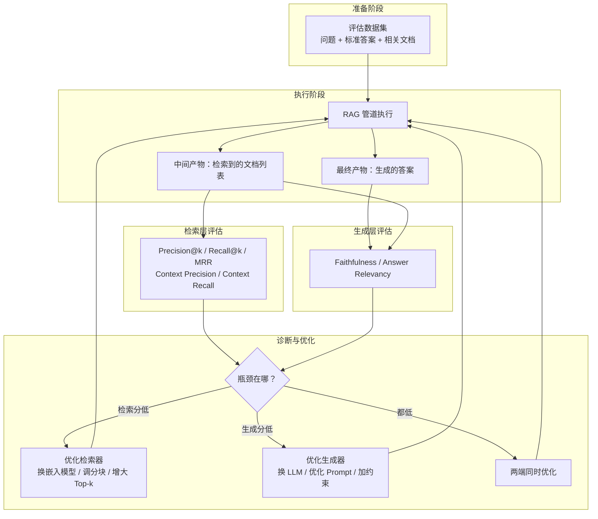

# RAG 评估

## 概念解释

RAG 评估是一套用于量化 RAG（Retrieval-Augmented Generation，检索增强生成）系统各环节表现的方法论。它把"最终答案好不好"这个笼统的问题，拆成检索层和生成层两组独立指标，让你能精确定位瓶颈出在"找文档"还是"写答案"上。

为什么需要单独的评估体系？因为 RAG 系统由检索器和生成器串联组成，如果只看最终答案的准确率，你无法判断"答错了"是因为检索器没找到相关文档，还是 LLM 拿到了好文档却没用对。传统 NLP 评估指标（BLEU、ROUGE 等）只评价文本相似度，无法衡量"答案是否有据可查"或"检索排序是否合理"这类 RAG 特有的问题。

RAG 评估在 Agent 开发中扮演的角色类似于软件测试中的单元测试 + 集成测试：单元测试对应检索指标和生成指标的分别评估，集成测试对应端到端的整体效果评估。没有评估体系的 RAG 系统就像没有测试的代码——你不知道下一次改动会不会引入回退。

## 关键结构

RAG 评估的核心框架可以从三个层面理解：

| 评估层面 | 评估对象 | 核心问题 | 代表指标 |
|----------|----------|----------|----------|
| 检索层 | 检索器返回的文档集合 | 找到的文档相关吗？排序合理吗？ | Precision@k、Recall@k、MRR、Context Precision |
| 生成层 | LLM 根据文档生成的答案 | 答案有据可查吗？回答了用户的问题吗？ | Faithfulness、Answer Relevancy |
| 端到端 | 从问题输入到最终答案的整条链路 | 整体效果是否满足业务要求？ | Answer Correctness、用户满意度 |

### 检索层评估

检索层评估回答的核心问题是"检索器返回的文档够不够好"。这里"好"有两个维度：一是返回的文档中有多少是相关的（精确率），二是所有相关文档中有多少被找回来了（召回率）。

**Precision@k（精确率）**：在 Top-k 个返回结果中，相关文档占多少比例。公式为：

$$P@k = \frac{\text{Top-k 中相关文档数}}{k}$$

**Recall@k（召回率）**：所有相关文档中，有多少出现在了 Top-k 返回结果中。公式为：

$$R@k = \frac{\text{Top-k 中相关文档数}}{\text{数据库中全部相关文档数}}$$

**MRR（Mean Reciprocal Rank，平均倒数排名）**：衡量第一个相关文档排在第几位。公式为：

$$\text{MRR} = \frac{1}{|Q|} \sum_{i=1}^{|Q|} \frac{1}{r_i}$$

其中 $r_i$ 是第 $i$ 个问题中第一个相关文档的排名。如果排第 1 位得分为 1，排第 3 位得分为 1/3。MRR 适合"用户只看第一条结果"的场景。

### 生成层评估

生成层评估回答的核心问题是"LLM 是否正确利用了检索到的文档"。这里有两个关键指标：

**Faithfulness（忠实度）**：答案中的每个陈述是否都能从检索到的文档中找到依据。计算方式是先把答案拆成若干独立陈述句，再逐一判断每句是否有文档支撑，最后取"有支撑的陈述数 / 总陈述数"。忠实度低意味着 LLM 在"编造"文档中没有的内容，即产生了幻觉。

**Answer Relevancy（答案相关性）**：答案是否真正回答了用户的问题。一个答案可能完全忠实于文档，但如果文档本身跟问题无关，答案也会答非所问。答案相关性通过计算"从答案反推出的问题"与原始问题的语义相似度来衡量。

### 端到端评估

端到端评估关注最终输出是否满足用户需求。即使检索指标和生成指标分别都不错，也可能出现"答案正确但不够全面"或"答案太冗长"等问题。端到端指标通常包括 Answer Correctness（答案正确性，对比标准答案）和实际的用户满意度评分。

## 核心原理

### 原理说明

RAG 评估的核心机制是**分层诊断**：把一条完整的 RAG 管道拆成检索和生成两个独立环节，分别用专门的指标衡量，然后综合判断整体效果。

具体执行流程：

1. **准备评估数据集**：构建一组"问题 - 标准答案 - 相关文档"三元组。问题的类型和数量决定了评估的覆盖面。通常需要 100-500 个测试用例才有统计意义。
2. **执行 RAG 管道**：对每个问题，让 RAG 系统完成检索和生成，记录中间产物（检索到的文档列表）和最终产物（生成的答案）。
3. **分别计算指标**：用检索到的文档与标注的相关文档对比，算出 Precision、Recall 等检索指标；用生成的答案与检索到的文档对比，算出 Faithfulness、Answer Relevancy 等生成指标。
4. **瓶颈定位**：对比两组分数。检索分高 + 生成分低 = 瓶颈在 LLM（换更强模型或优化 Prompt）；检索分低 + 生成分高 = 瓶颈在检索器（优化嵌入模型、调整分块策略或增大 Top-k）。
5. **迭代优化**：针对性修复后重新评估，形成闭环。

关键转换点在第 4 步——分层诊断是 RAG 评估区别于传统 NLP 评估的核心价值。如果只看端到端的 Accuracy，你会陷入"不知道该改哪里"的困境。

### Mermaid 图解



图中展示了 RAG 评估的完整闭环。注意生成层评估（Faithfulness）同时依赖"检索到的文档"和"生成的答案"——它衡量的是答案与文档之间的一致性，而不是答案与标准答案的一致性。这是一个容易忽略的点：Faithfulness 高只说明答案没有编造，不代表答案一定正确（如果检索到的文档本身就是错的，答案也会忠实地"转述"错误信息）。

### 运行示例

```python
# 基于 ragas==0.2.x 验证（截至 2026-03）
# 手动实现核心指标的计算逻辑，不依赖 API Key

from typing import List

def precision_at_k(retrieved: List[str], relevant: List[str], k: int) -> float:
    """计算 Precision@k：Top-k 结果中相关文档的比例"""
    top_k = retrieved[:k]
    relevant_set = set(relevant)
    hits = sum(1 for doc in top_k if doc in relevant_set)
    return hits / k if k > 0 else 0.0

def recall_at_k(retrieved: List[str], relevant: List[str], k: int) -> float:
    """计算 Recall@k：相关文档中被检索到的比例"""
    top_k = retrieved[:k]
    relevant_set = set(relevant)
    hits = sum(1 for doc in top_k if doc in relevant_set)
    return hits / len(relevant_set) if relevant_set else 0.0

def mrr(retrieved_lists: List[List[str]], relevant_lists: List[List[str]]) -> float:
    """计算 MRR：每个问题中第一个相关文档排名的倒数的平均值"""
    reciprocal_ranks = []
    for retrieved, relevant in zip(retrieved_lists, relevant_lists):
        relevant_set = set(relevant)
        rr = 0.0
        for rank, doc in enumerate(retrieved, 1):
            if doc in relevant_set:
                rr = 1.0 / rank
                break
        reciprocal_ranks.append(rr)
    return sum(reciprocal_ranks) / len(reciprocal_ranks) if reciprocal_ranks else 0.0

# --- 模拟评估 ---
# 假设检索了 5 篇文档，其中标记为 "relevant" 的是真正相关的
retrieved_docs = ["doc_A", "doc_B", "doc_C", "doc_D", "doc_E"]
relevant_docs = ["doc_A", "doc_C", "doc_F"]  # doc_F 在数据库中但未被检索到

p_at_3 = precision_at_k(retrieved_docs, relevant_docs, k=3)
r_at_3 = recall_at_k(retrieved_docs, relevant_docs, k=3)
# Precision@3 = 2/3 ≈ 0.67（Top-3 中有 doc_A 和 doc_C 两篇相关）
# Recall@3 = 2/3 ≈ 0.67（3 篇相关文档中找到了 2 篇，doc_F 被遗漏）
```

代码展示了 Precision@k、Recall@k、MRR 三个检索层指标的纯计算逻辑。Faithfulness 和 Answer Relevancy 的计算需要 LLM 参与判断（即 LLM-as-Judge），无法用简单函数实现，因此未包含在此示例中。

## 易混概念辨析

| 概念 | 与 RAG 评估的区别 | 更适合关注的重点 |
|------|-------------------|------------------|
| LLM 评估（LLM Evaluation） | LLM 评估关注模型本身的能力（推理、知识、安全性），RAG 评估关注检索 + 生成的协同效果 | 模型基础能力的基准测试 |
| Agent 评估（Agent Evaluation） | Agent 评估关注工具调用、目标达成、多步推理等 Agent 特有行为，RAG 评估只关注"检索 → 生成"这条链路 | 工具调用准确性、任务完成度 |
| 信息检索评估（IR Evaluation） | 传统 IR 评估只关注检索结果的排序质量，RAG 评估还额外评估生成层的忠实度和相关性 | 纯搜索引擎的排序效果 |
| NLG 评估（BLEU / ROUGE） | BLEU、ROUGE 只比较文本表面相似度，无法判断答案是否有据可查（Faithfulness）| 机器翻译、文本摘要的表面质量 |

核心区别：

- **RAG 评估**：同时覆盖检索层和生成层，核心价值是分层诊断瓶颈
- **LLM 评估 / Agent 评估**：关注模型或 Agent 的独立能力，不涉及检索组件
- **IR 评估**：只评价检索半边，不管生成
- **NLG 评估**：只看文本表面，不关心"有没有文档依据"

## 适用边界与局限

### 适用场景

1. **生产 RAG 系统的持续监控**：将评估集成到 CI/CD 管道，每次更新嵌入模型、分块策略或 Prompt 后自动跑评估，及时发现性能回退。一个医疗知识库 RAG 系统如果忠实度从 95% 下降到 85%，说明新增文献可能引入了矛盾信息。
2. **技术选型对比**：在 BM25、Dense Retrieval、Hybrid Search 之间做选择时，用 Recall@5 和 Precision@5 客观比较；在 GPT-4o、Claude、Llama 之间做选择时，用 Faithfulness 和 Answer Relevancy 对标生成质量。
3. **优化方向决策**：当整体效果不理想时，通过检索分 vs. 生成分的对比快速定位瓶颈，避免"凭感觉优化"。

### 不适合的场景

1. **开放式创意生成**：如写诗、写故事等场景，没有"正确答案"的概念，Faithfulness 和 Correctness 等指标不适用。
2. **无检索组件的纯 LLM 应用**：如果系统不包含检索环节，检索层指标无意义，应使用 LLM 评估体系而非 RAG 评估。

### 局限性

1. **LLM-as-Judge 本身不完美**：用 LLM 给 LLM 打分存在已知偏差——冗长偏好（更长的答案倾向于得高分）、自我偏好（GPT-4 倾向于给 GPT-4 的答案打更高分）、位置效应。2025 年的研究表明，需要通过多评估器投票和定期人工校准来缓解。
2. **评估数据集质量是天花板**：如果测试问题不够多样化或标注质量差，评估结果无法代表真实场景。构建高质量评估集仍需领域专家参与。
3. **离线评估与线上体验存在 gap**：离线指标高不等于用户满意。答案可能指标全绿但格式不友好、表述不自然，这些需要线上 A/B 测试和用户反馈来补充。
4. **成本与速度的权衡**：使用 GPT-4o 做 Judge，每个测试用例（5 个指标）大约花费 $0.001-0.003。200 条评估集跑一轮不到 $1，但如果需要频繁评估数千条用例，成本会累积。

## 常见误区

| 常见误区 | 正确理解 |
|----------|----------|
| RAG 评估就是看最终答案的准确率 | RAG 评估的核心价值是分层诊断——把检索质量和生成质量拆开评估。只看端到端准确率无法定位问题出在检索器还是生成器 |
| Faithfulness 高就代表答案正确 | Faithfulness 衡量的是"答案是否有文档依据"，不是"答案是否正确"。如果检索到的文档本身有错误，答案会忠实地转述错误信息，Faithfulness 照样得高分 |
| 自动化评估（RAGAS）可以完全替代人工评估 | 自动化评估适合大规模快速筛查，但关键决策（如上线新版本）仍需人工抽检验证。LLM-as-Judge 存在已知偏差，不能盲信 |
| Precision 和 Recall 越高越好，不需要权衡 | 两者存在天然的跷跷板关系。医疗场景优先保 Recall（不能漏掉关键诊断依据），搜索场景优先保 Precision@k（用户只看前几条结果）。盲目追求两个都高会导致成本和延迟飙升 |

## 思考题

<details>
<summary>初级：Faithfulness 和 Answer Relevancy 分别衡量什么？一个答案能否 Faithfulness 高但 Answer Relevancy 低？</summary>

**参考答案：**

Faithfulness 衡量答案中的陈述是否都能从检索到的文档中找到依据（有没有编造）。Answer Relevancy 衡量答案是否回答了用户的原始问题。

完全可以出现 Faithfulness 高但 Answer Relevancy 低的情况。例如用户问"Python 怎么排序列表"，检索器错误地返回了"Python 字符串操作"的文档，LLM 忠实地基于这些文档生成了关于字符串的答案。此时答案确实有据可查（Faithfulness 高），但没有回答排序问题（Answer Relevancy 低）。这说明瓶颈在检索器。

</details>

<details>
<summary>中级：一个企业知识库 RAG 系统的评估结果为 Precision@5 = 0.90、Recall@5 = 0.40、Faithfulness = 0.85。瓶颈在哪里？应该怎么优化？</summary>

**参考答案：**

瓶颈在检索器的召回能力。Precision@5 高说明返回的文档大部分相关，Faithfulness 高说明 LLM 没有编造，但 Recall@5 只有 0.40 意味着超过一半的相关文档没有被检索到。

优化方向：(1) 增大 Top-k（从 5 调到 10 或 15），让更多文档进入候选集；(2) 优化分块策略，可能当前 chunk 太小导致答案跨多个 chunk 被拆散；(3) 增加 chunk overlap，减少信息丢失；(4) 尝试 Hybrid Search（BM25 + Dense Retrieval），用关键词匹配补充语义检索的盲区。

</details>

<details>
<summary>中级/进阶：你负责一个法律咨询 RAG 系统，需要设计评估方案。请说明你会选哪些指标、设什么阈值、如何处理 LLM-as-Judge 的偏差问题。</summary>

**参考答案：**

指标选择：(1) Recall@10 作为最高优先级指标，法律场景不能遗漏关键条款，阈值设为 >= 0.85；(2) Faithfulness 阈值设为 >= 0.90，法律回答必须严格有据可查，幻觉后果严重；(3) Context Precision 阈值 >= 0.60，避免无关文档干扰 LLM 判断；(4) Answer Relevancy 阈值 >= 0.75。

LLM-as-Judge 偏差处理：(1) 使用两个不同厂商的模型（如 GPT-4o + Claude）分别打分，取一致结果；(2) 每月从评估集中随机抽取 50 条由法律专家人工复核，计算 LLM 评分与人工评分的对齐率；(3) 如果对齐率低于 80%，重新校准 Judge 的 Prompt 或更换评估模型。

</details>

## 参考资料

1. Es, S., James, J., et al. (2023). "RAGAS: Automated Evaluation of Retrieval Augmented Generation." EACL 2024. [https://arxiv.org/abs/2309.15217](https://arxiv.org/abs/2309.15217)
2. RAGAS 官方文档（含 v0.2+ 指标定义与 API）：[https://docs.ragas.io/](https://docs.ragas.io/)
3. Confident AI. "RAG Evaluation Metrics: Assessing Answer Relevancy, Faithfulness, Contextual Relevancy, And More." [https://www.confident-ai.com/blog/rag-evaluation-metrics-answer-relevancy-faithfulness-and-more](https://www.confident-ai.com/blog/rag-evaluation-metrics-answer-relevancy-faithfulness-and-more)
4. Qdrant. "Best Practices in RAG Evaluation: A Comprehensive Guide." [https://qdrant.tech/blog/rag-evaluation-guide/](https://qdrant.tech/blog/rag-evaluation-guide/)
5. PremAI. "RAG Evaluation: Metrics, Frameworks & Testing (2026)." [https://blog.premai.io/rag-evaluation-metrics-frameworks-testing-2026/](https://blog.premai.io/rag-evaluation-metrics-frameworks-testing-2026/)
