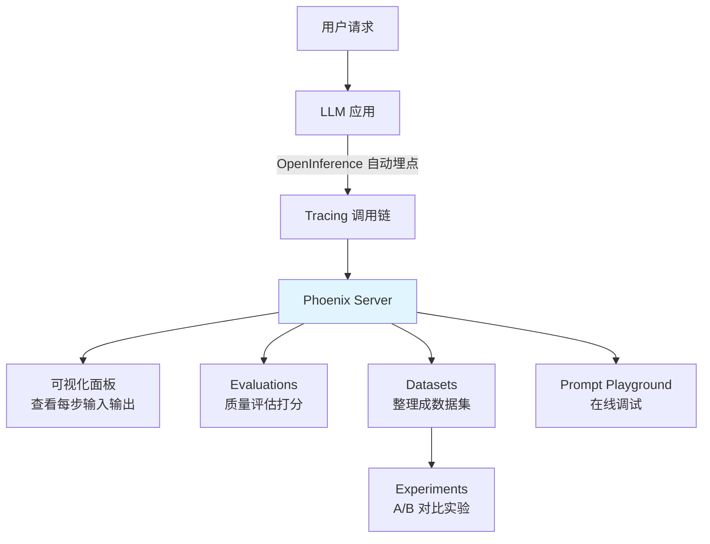

# Arize AI（AI 可观测性平台）

## 基础概念

Arize AI 旗下有两个产品线：**Arize AX**（商业 SaaS 平台，侧重传统 ML 模型监控）和 **Phoenix**（开源 AI 可观测性平台，侧重 LLM/Agent 应用）。当前 LLM 应用开发中，Phoenix 是更常用的那个，本卡片以 Phoenix 为主。

Phoenix 解决的核心问题是：你的 LLM 应用上线后，某次回答质量突然变差，你怎么排查？是 Prompt 写得有问题、检索召回了错误文档、还是模型本身幻觉了？Phoenix 通过 **Tracing（调用链追踪）** 把每一步都记录下来，让你像看 X 光片一样，清楚地看到每次请求经历了哪些步骤、每一步的输入输出是什么、耗时多少、花了多少钱。

### 核心要素

| 要素 | 作用 |
|------|------|
| **Tracing（调用链追踪）** | 记录 LLM 应用每次请求的完整调用链：模型调用、工具使用、检索操作等，逐步还原执行过程 |
| **Evaluations（评估）** | 对 Trace 中的输出质量打分，支持 LLM 自动评估、代码规则评估、人工标注三种方式 |
| **Datasets & Experiments（数据集与实验）** | 把历史 Trace 整理成数据集，对比不同版本应用的表现差异 |
| **Prompt Playground（提示词实验场）** | 在线调试 Prompt，对比不同模型和参数的效果，支持回放历史 Trace 中的 LLM 调用 |

### Tracing（调用链追踪）

Tracing 是 Phoenix 的核心能力。一次用户请求在 Agent 应用中可能经历"理解意图 → 检索文档 → 调用工具 → 生成回答"等多个步骤，Tracing 把这整个过程记录为一棵树状结构：

- **Trace**：一次完整请求的全部记录
- **Span**：Trace 中的一个步骤（比如一次 LLM 调用、一次检索）

每个 Span 记录了：输入/输出内容、耗时、Token 消耗量、模型名称等信息。Phoenix 基于 **OpenTelemetry**（业界标准的可观测性协议）构建，通过 **OpenInference**（Arize 定义的 AI 语义扩展）为 LLM 调用添加专属字段。

### Evaluations（评估）

评估解决的问题是：Trace 记录了"发生了什么"，但"好不好"需要额外判断。Phoenix 支持三种评估方式：

- **LLM 评估**：用另一个 LLM 给输出打分（如判断回答是否有幻觉）
- **代码评估**：用规则/函数自动判断（如检查输出格式是否正确）
- **人工标注**：人工审查并标记质量

### Datasets & Experiments（数据集与实验）

当你修改了 Prompt 或切换了模型后，怎么知道新版本比旧版本好？Phoenix 的做法是：把一批历史请求整理成数据集，分别跑新旧两个版本，然后对比评估分数。这就是 Experiment（实验）功能。

### 核心要素关系图



## 基础用法

安装依赖：

```bash
# 安装 Phoenix 服务端（含 UI 面板）
pip install arize-phoenix

# 安装 OTel 集成包（用于发送 Trace）
pip install arize-phoenix-otel

# 安装 OpenAI 自动埋点（按需选择框架）
pip install openinference-instrumentation-openai openai
```

Phoenix 采用模块化设计，各包职责如下：
- `arize-phoenix`：服务端 + Web UI（本地启动后访问 `http://localhost:6006`）
- `arize-phoenix-otel`：轻量 OTel 配置包，简化 Trace 发送设置
- `arize-phoenix-client`：REST API 客户端（上传数据集、查询 Trace 等）
- `arize-phoenix-evals`：评估工具包
- `openinference-instrumentation-*`：各框架的自动埋点插件

最小可运行示例（基于 arize-phoenix==13.10.0 验证，截至 2026-03）：

```python
# 步骤 1：启动 Phoenix 服务端（在终端执行）
# python -m phoenix.server.main serve

# 步骤 2：运行以下代码，Trace 会自动发送到 Phoenix
from phoenix.otel import register
from openinference.instrumentation.openai import OpenAIInstrumentor
import openai
import os

# 注册 Trace 发送（默认发送到 localhost:6006）
tracer_provider = register(project_name="my-first-project")

# 自动埋点 OpenAI 调用
OpenAIInstrumentor().instrument(tracer_provider=tracer_provider)

# 正常调用 OpenAI，Trace 自动记录
client = openai.OpenAI(api_key=os.environ.get("OPENAI_API_KEY"))
response = client.chat.completions.create(
    model="gpt-4o-mini",
    messages=[{"role": "user", "content": "用一句话解释什么是 RAG"}],
)

print(response.choices[0].message.content)
print("[OK] Trace 已发送，访问 http://localhost:6006 查看调用详情")
```

- OpenAI API Key 获取地址：https://platform.openai.com/api-keys
- 如不想依赖外部 API，也可以用 Ollama 等本地模型配合 `openinference-instrumentation-openai` 使用（OpenAI 兼容接口）

预期输出：

```text
RAG（检索增强生成）是一种先从外部知识库检索相关信息，再将其作为上下文输入给大语言模型生成回答的技术。
[OK] Trace 已发送，访问 http://localhost:6006 查看调用详情
```

打开浏览器访问 `http://localhost:6006`，可以在 Traces 页面看到刚才那次 OpenAI 调用的完整记录：输入的 Prompt、输出的回答、Token 消耗量、响应延迟等。

不依赖外部 API 的纯本地示例（仅验证 Phoenix 服务端启动和手动 Span 记录）：

```python
# 步骤 1：先在终端启动 Phoenix 服务端
# phoenix serve
# 或 python -m phoenix.server.main serve

from phoenix.otel import register
import opentelemetry.trace as trace

# 注册 tracer，显式指定本地 Phoenix OTLP 地址
tracer_provider = register(
    project_name="local-test",
    endpoint="http://localhost:6006/v1/traces",
    auto_instrument=False,
)
tracer = trace.get_tracer("demo")

# 手动创建一个 Span（不依赖任何外部 API）
with tracer.start_as_current_span("my-test-span") as span:
    span.set_attribute("input.value", "这是一条测试输入")
    span.set_attribute("output.value", "这是一条测试输出")

print("[OK] Trace 已发送，访问 http://localhost:6006 查看 Trace")
```

## 同类工具对比

| 维度 | Phoenix (Arize) | LangSmith (LangChain) | Langfuse |
|------|-----------------|----------------------|----------|
| 核心定位 | 开源 AI 可观测性 + 评估平台 | LangChain 生态的调试与监控平台 | 开源 LLM 工程平台 |
| 开源程度 | 完全开源（ELv2），可自托管 | 商业产品，有免费额度 | 开源（MIT），可自托管 |
| 技术基础 | OpenTelemetry + OpenInference | 自有协议 | 自有协议 + OpenTelemetry 兼容 |
| 框架绑定 | 框架无关，支持 OpenAI/LangChain/LlamaIndex 等 | 深度绑定 LangChain 生态 | 框架无关 |
| 评估能力 | 内置 LLM 评估 + 代码评估 + 人工标注 | 内置评估 + 数据集管理 | 内置评分 + 用户反馈 |
| Prompt 管理 | 内置版本控制 + Playground | 内置 Prompt Hub | 内置 Prompt 管理 |

核心区别：

- **Phoenix**：框架无关、完全开源可自托管，适合不想被绑定在某个生态中的团队
- **LangSmith**：与 LangChain 深度集成，如果你全套用 LangChain 生态，体验最顺滑
- **Langfuse**：MIT 开源，功能全面，社区活跃，是 Phoenix 最直接的竞品

## 常见误区

| 误区 | 准确理解 |
|------|----------|
| Arize 和 Phoenix 是同一个东西 | Arize AX 是商业 SaaS 平台（传统 ML 监控），Phoenix 是独立的开源项目（LLM 可观测性）。两者由同一家公司开发，但定位不同 |
| Phoenix 只能配合 LangChain 使用 | Phoenix 基于 OpenTelemetry，框架无关。OpenAI SDK、LlamaIndex、CrewAI、Claude Agent SDK 等都有官方 Instrumentor 支持 |
| 安装 arize-phoenix 后还要装 arize 包 | `arize-phoenix` 和 `arize`（传统 ML SDK）是两个独立的包。LLM 可观测性只需要 `arize-phoenix` 系列，不需要 `arize` |
| 必须用 Arize 云服务才能用 Phoenix | Phoenix 完全可以本地运行，`python -m phoenix.server.main serve` 即可启动，无需注册任何云服务 |

## 优劣势分析

| 优势 | 劣势 |
|------|------|
| 完全开源可自托管，无功能限制，无供应商锁定 | 相比 LangSmith，社区生态和教程资源较少 |
| 基于 OpenTelemetry 标准，可与已有可观测性基础设施集成 | 自托管需要自行维护服务端和存储 |
| 自动埋点覆盖主流框架，接入成本低（通常只需 3 行代码） | UI 交互体验和细节打磨不如商业产品成熟 |
| 内置评估 + 实验对比 + Prompt Playground，功能一站式 | Python >= 3.10，对旧版本 Python 不兼容 |

## 思考题

<details>
<summary>初级：Trace 和 Span 的关系是什么？为什么 LLM 应用需要 Tracing？</summary>

**参考答案：**

一个 Trace 代表一次完整的用户请求处理过程，包含多个 Span。每个 Span 代表其中的一个步骤（如一次 LLM 调用、一次向量检索、一次工具调用）。Span 之间有父子关系，形成树状结构。

LLM 应用需要 Tracing 的原因：一次请求可能经历多个步骤（理解意图 → 检索 → 推理 → 生成），当输出质量出问题时，不看调用链根本不知道是哪一步出了错。Tracing 把每一步的输入输出都记下来，让排查问题有据可循。

</details>

<details>
<summary>中级：Phoenix 基于 OpenTelemetry 构建有什么好处？OpenInference 在其中扮演什么角色？</summary>

**参考答案：**

OpenTelemetry（OTel）是可观测性领域的行业标准协议，好处有两个：(1) 如果团队已有 OTel 基础设施（如 Jaeger、Grafana），Phoenix 的 Trace 数据可以直接对接，不用重建；(2) 不绑定 Phoenix 一家，后续可以切换到任何兼容 OTel 的后端。

OpenInference 是 Arize 在 OTel 之上定义的 AI 语义扩展。OTel 原生的 Span 属性是面向通用服务调用的（HTTP 状态码、RPC 方法等），缺少 LLM 专属字段。OpenInference 补充了 `input.value`、`output.value`、`llm.token_count` 等 AI 特有的语义约定，让 Phoenix 能够解析和展示 LLM 调用的详细信息。

</details>

<details>
<summary>中级：如果你的 RAG 应用回答质量下降，如何用 Phoenix 排查问题？</summary>

**参考答案：**

排查步骤：

1. **看 Trace 列表**：在 Phoenix UI 中按时间筛选近期 Trace，观察是否有集中的错误或延迟飙升
2. **查看单条 Trace 详情**：展开有问题的 Trace，查看每个 Span 的输入输出。重点关注检索 Span（召回的文档是否相关）和 LLM Span（Prompt 是否合理、回答是否有幻觉）
3. **跑评估**：对近期 Trace 批量运行 LLM 评估（如幻觉检测、相关性打分），量化质量下降的程度和模式
4. **对比实验**：如果怀疑是 Prompt 变更导致的，把问题 Trace 整理成数据集，分别用新旧 Prompt 跑实验，对比评估分数

关键原则：先看 Trace 定位"哪一步出了问题"，再用评估量化"问题有多严重"，最后用实验验证"改了是否变好"。

</details>

## 参考资料

1. Phoenix 官方文档：https://arize.com/docs/phoenix
2. GitHub 仓库：https://github.com/Arize-ai/phoenix（9k+ stars，ELv2 许可证）
3. OpenInference 仓库：https://github.com/Arize-ai/openinference
4. PyPI 包页面：https://pypi.org/project/arize-phoenix/
5. Phoenix 云端版：https://app.phoenix.arize.com
