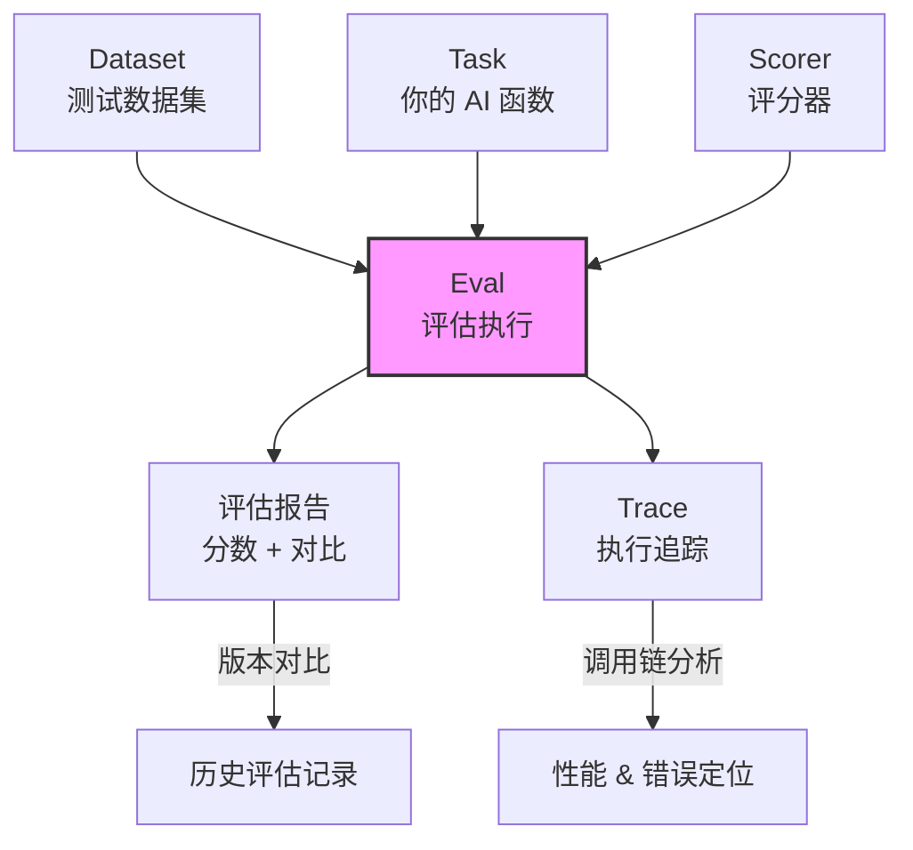

# Braintrust（AI 产品评估平台）

## 基础概念

Braintrust 是一个**以评估（Eval）为核心**的 AI 应用质量管理平台。通俗讲：你开发了一个 LLM 应用（比如问答机器人、RAG 系统），怎么知道它的回答质量好不好？靠人肉一条条看，既慢又主观。Braintrust 帮你把「测一测、打个分、对比两个版本谁更好」这件事自动化了。

它解决的核心问题：**AI 应用的输出质量不可控**。模型换了一版，Prompt 改了一句，效果是变好还是变差？没有评估体系就只能靠猜。Braintrust 把评估变成了可量化、可追踪、可对比的工程化流程。

Notion、Stripe、Vercel、Airtable、Zapier 等公司在生产环境使用 Braintrust 管理 AI 应用质量。

### 核心要素

| 要素 | 作用 |
|------|------|
| **Eval（评估）** | 定义「怎么打分」——对 AI 输出跑一组测试用例，自动评分，生成报告 |
| **Dataset（数据集）** | 定义「拿什么测」——管理测试用例集合，支持版本控制 |
| **Scorer（评分器）** | 定义「分怎么算」——内置或自定义的评分函数，量化输出质量 |
| **Trace（追踪）** | 记录「怎么跑的」——捕获完整调用链，定位性能瓶颈和错误 |

### Eval（评估）

Eval 是 Braintrust 的核心操作。一次 Eval 的流程：准备一组测试数据 → 对每条数据调用你的 AI 函数 → 用评分器自动打分 → 生成评估报告。每次评估的结果都会保存下来，可以和历史版本对比。

`Eval()` 函数接收三个关键参数：`data`（测试数据）、`task`（你的 AI 函数）、`scores`（评分器列表）。执行时，框架会自动遍历每条数据、调用 task、用 scores 打分。

### Dataset（数据集）

Dataset 是测试用例的集合，每条用例通常包含 `input`（输入）和 `expected`（期望输出）。数据集支持版本控制——更新测试用例后，旧版本不会丢失，可以随时回溯。在 Web 界面上还能一键把生产环境的真实请求转为测试用例。

### Scorer（评分器）

Scorer 决定如何给 AI 的输出打分。Braintrust 提供了 `autoevals` 库，内置多种评分器：

- **Levenshtein**：编辑距离，衡量输出和期望值的文本相似度
- **Factuality**：事实性检查，用 LLM 判断输出是否与参考答案一致
- **Relevance**：相关性评分，判断输出是否回答了用户的问题
- **Moderation**：内容安全审核，检测是否包含有害内容

也可以写自定义评分函数，返回 0-1 之间的分数即可。

### Trace（追踪）

Trace 记录 AI 应用的完整执行过程。用 `@braintrust.traced` 装饰器标记函数，自动捕获输入、输出和耗时。对多步骤流程（如 RAG：检索 → 拼接 → 生成）特别有用，能看到每一步花了多久、输入输出是什么。

### 核心要素关系图



流转关系：Dataset 提供测试数据，Task 处理每条数据生成输出，Scorer 对输出打分，Eval 把三者串起来生成报告。Trace 在整个过程中记录执行细节。

## 基础用法

安装依赖：

```bash
pip install braintrust autoevals
```

- **Braintrust API Key**：在 [braintrust.dev](https://www.braintrust.dev) 注册账户，从 Settings 页面获取
- **OpenAI API Key**（可选，仅使用 LLM 评分器时需要）：从 [platform.openai.com](https://platform.openai.com/api-keys) 获取

```bash
export BRAINTRUST_API_KEY="your-braintrust-api-key"
export OPENAI_API_KEY="your-openai-api-key"  # 可选，用于 LLM 评分器
```

最小可运行示例（基于 braintrust==0.0.164、autoevals==0.0.94 验证，截至 2026-03）：

```python
from autoevals import LevenshteinScorer
from braintrust import Eval

# 一个极简的 AI 函数：给名字加前缀
def my_ai_function(input: str) -> str:
    return "Hi " + input

# 运行评估：3 条测试数据 + 编辑距离评分器
Eval(
    "Say-Hi-Bot",                          # 项目名称
    data=lambda: [                          # 测试数据集
        {"input": "Alice", "expected": "Hi Alice"},
        {"input": "Bob",   "expected": "Hi Bob"},
        {"input": "World", "expected": "Hello World"},  # 故意不匹配
    ],
    task=lambda input: my_ai_function(input),  # 你的 AI 函数
    scores=[LevenshteinScorer],                # 评分器列表
)
```

运行方式：

```bash
braintrust eval my_eval.py
```

预期输出：

```text
Experiment Say-Hi-Bot-xxxx is running...
Say-Hi-Bot [experiment_id] (data): 3 examples
  Alice: score=1.0000
  Bob:   score=1.0000
  World: score=0.5556   ← "Hi World" vs "Hello World"，编辑距离不完全匹配

3 examples, avg score: 0.8519
```

前两条输入完全匹配，得分 1.0；第三条 `"Hi World"` 和 `"Hello World"` 不完全匹配，编辑距离评分低于 1.0。评估结果会自动上传到 Braintrust 平台，可在 Web 界面查看详情和历史对比。

使用 LLM 评分器（Factuality）的示例：

```python
from autoevals.llm import Factuality

# 事实性评分器：用 LLM 判断输出是否与参考答案一致
evaluator = Factuality()

result = evaluator(
    output="中国是世界上人口最多的国家",         # AI 的输出
    expected="中国（含特别行政区）人口约 14 亿",  # 参考答案
    input="哪个国家人口最多？"                   # 原始问题
)

print(f"事实性评分: {result.score}")       # 0.0-1.0
print(f"评分理由: {result.metadata['rationale']}")
```

## 同类工具对比

| 维度 | Braintrust | LangSmith | Langfuse |
|------|-----------|-----------|----------|
| 核心定位 | 以评估为核心的 AI 质量管理平台 | LangChain 生态的端到端 LLM 开发平台 | 开源的 LLM 可观测性平台 |
| 最擅长 | 自动化评估、A/B 测试、Prompt 对比优化 | Agent 调试、与 LangChain 深度集成 | 低成本追踪、自托管部署 |
| 评分器生态 | autoevals 库，内置事实性/安全/相关性等评分器 | 基础评分器，依赖自定义 | 基础评分器，依赖自定义 |
| 部署方式 | SaaS + 混合部署（SOC2 Type II 认证） | 纯 SaaS | 开源自托管 + SaaS |
| 适合人群 | 需要系统化评估体系的团队 | LangChain 用户、快速原型阶段 | 预算敏感、需要完全掌控数据 |

核心区别：

- **Braintrust**：评估优先——先定义「什么算好」，再用数据驱动 Prompt 和模型的迭代
- **LangSmith**：开发优先——在 LangChain 生态中快速搭建、调试、上线 Agent 应用
- **Langfuse**：可观测优先——开源可自托管，适合对数据安全和成本有严格要求的团队

## 常见误区

| 误区 | 准确理解 |
|------|----------|
| Braintrust 只能评估 LLM 的文本输出 | 支持任意 AI 任务的评估，包括 RAG 检索质量、Agent 决策路径、代码生成等，评分器可完全自定义 |
| 必须用 LLM 当评分器 | autoevals 提供多种非 LLM 评分器（编辑距离、精确匹配、JSON 校验等），简单场景不需要消耗 LLM token |
| Trace 追踪和 Eval 评估是同一回事 | Trace 记录执行过程（调用链、耗时），Eval 评判输出质量（打分、对比）。前者用于调试，后者用于质量管理 |
| 接入 Braintrust 需要大改现有代码 | `Eval()` 函数只需要你提供 data + task + scores 三个参数，不侵入业务逻辑；Trace 装饰器也是非侵入式的 |

## 优劣势分析

| 优势 | 劣势 |
|------|------|
| autoevals 评分器库开箱即用，覆盖事实性/安全/相关性等常见维度 | 免费套餐有限（5 用户、每月 1M spans），超出后按量计费 |
| 评估结果自动版本化，支持 A/B 对比和回归检测 | 多 Agent 复杂工作流的评估支持不如单轮评估成熟 |
| CI/CD 原生集成，GitHub Action 自动在 PR 上展示评估结果 | 学习成本：需要理解评估体系设计（数据集、评分器、实验组织） |
| SOC2 Type II 认证，支持混合部署，满足企业安全合规要求 | 社区活跃度不如 LangSmith（背靠 LangChain 生态） |

## 思考题

<details>
<summary>初级：Eval 的三个核心参数 data、task、scores 分别负责什么？</summary>

**参考答案：**

- `data`：提供测试数据集，每条数据包含 input（输入）和 expected（期望输出）
- `task`：你的 AI 函数，接收 input，返回实际输出
- `scores`：评分器列表，对比 task 的输出和 expected，返回 0-1 的分数

三者的关系：data 提供「考题和标准答案」，task 是「考生」，scores 是「阅卷老师」。

</details>

<details>
<summary>中级：如何用 Braintrust 对比两个 Prompt 版本的效果优劣？</summary>

**参考答案：**

1. 创建一个固定的 Dataset，包含足够多的测试用例
2. 用 Prompt A 实现一个 task 函数，运行 Eval 得到一组评分
3. 用 Prompt B 实现另一个 task 函数，在同一个 Dataset 上运行 Eval
4. 在 Braintrust Web 界面上选中两次实验进行对比，平台自动计算各评分维度的差异

关键点：必须使用相同的数据集和评分器，变量只有 Prompt，才能公平对比。Braintrust 会自动高亮评分变化的样本，帮你定位 Prompt 改动的具体影响。

</details>

<details>
<summary>中级：autoevals 的 LevenshteinScorer 和 Factuality 评分器分别适合什么场景？混用时要注意什么？</summary>

**参考答案：**

- **LevenshteinScorer**：基于编辑距离计算文本相似度，适合输出格式固定、期望精确匹配的场景（如分类标签、短答案提取）。优点是不消耗 LLM token，速度快。
- **Factuality**：用 LLM 判断语义层面的事实一致性，适合开放式回答、不要求字面匹配的场景（如问答、摘要）。缺点是需要调用 LLM，有额外成本和延迟。

混用注意：同一个 Eval 可以传入多个评分器。建议先用低成本评分器（Levenshtein）快速筛选，再对不确定的样本用高成本评分器（Factuality）精细判断。不同评分器的分数尺度可能不同，对比时要看单个评分器的纵向变化，而非横向比较不同评分器的绝对值。

</details>

## 参考资料

1. 官方网站：https://www.braintrust.dev/
2. Python SDK 文档：https://www.braintrust.dev/docs/reference/sdks/python
3. AutoEvals 文档：https://www.braintrust.dev/docs/reference/autoevals/python
4. GitHub - Python SDK：https://github.com/braintrustdata/braintrust-sdk-python
5. GitHub - AutoEvals：https://github.com/braintrustdata/autoevals
6. PyPI 包页面：https://pypi.org/project/braintrust/
