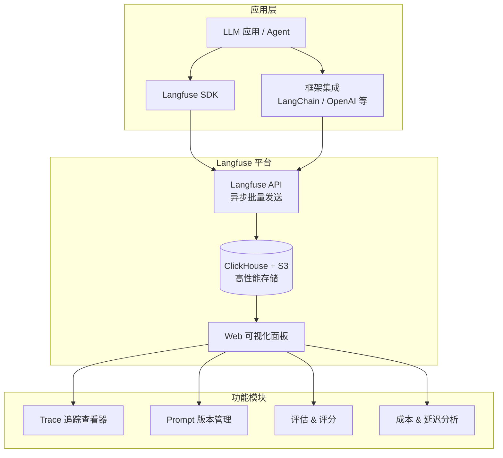

# Langfuse（开源 LLM 可观测性平台）

## 基础概念

Langfuse 是一个**开源的 LLM 工程平台（LLM Engineering Platform）**，核心解决一个问题：你的 LLM 应用在生产环境里到底发生了什么？每次调了哪个模型、输入输出是什么、花了多少钱、跑了多久、质量怎么样——这些问题在没有可观测性工具的时候，基本是黑盒。

Langfuse 的价值就是把这个黑盒变成白盒。它基于 OpenTelemetry 标准构建，通过 SDK 或框架回调自动采集追踪数据，数据发送完全异步，对应用主流程的延迟影响在毫秒级。支持云服务和自托管两种部署方式，自托管时数据完全在自己手里。

### 核心要素

| 要素 | 作用 |
|------|------|
| **Trace（追踪）** | 一次完整的用户请求从进入到返回的全链路记录 |
| **Observation（观测）** | Trace 中的具体步骤，分为 Span（通用操作）、Generation（LLM 调用）、Event（事件）三种类型 |
| **Score（评分）** | 对 Trace 或 Observation 的质量评分，来源可以是自动评估、用户反馈或人工标注 |
| **Prompt 管理** | 集中托管提示词模板，支持版本控制、标签发布、A/B 测试 |

### Trace（追踪）

Trace 是最顶层的概念，对应一次完整的用户请求。一个 Trace 内部包含若干 Observation，它们之间形成父子嵌套关系，就像一棵调用树。举个例子：用户问了一个问题，系统先做文档检索（Span），再调 LLM 生成回答（Generation），最后做格式化处理（Span）——这整个过程就是一个 Trace。

### Observation（观测）

Observation 是 Trace 内的具体步骤，有三种类型：

- **Span**：通用操作步骤，比如检索、数据处理、工具调用
- **Generation**：LLM 调用，会额外记录模型名称、Token 用量、生成延迟等 LLM 特有指标
- **Event**：无持续时间的时间点事件，比如日志记录

Observation 之间可以嵌套，形成树状结构。

### Score（评分）

Score 用于衡量输出质量，支持三种来源：

- **LLM-as-a-Judge**：用另一个 LLM 自动打分，每次评估本身也会生成 Trace 方便调试
- **用户反馈**：比如点赞/点踩、满意度评分
- **人工标注**：在 Langfuse 面板上手动审核打分

### Prompt 管理

Langfuse 内置 Prompt 版本管理系统。团队可以在 Web 界面协作编辑提示词，通过标签（如 `production`、`staging`）管理不同版本，应用运行时通过 SDK 拉取指定版本。修改 Prompt 不需要重新部署代码。

### 核心要素关系图



应用层通过 SDK 或框架回调将追踪数据异步发送到 Langfuse 平台；平台使用 ClickHouse + S3 存储数据（高性能写入，支持大规模追踪）；Web 面板提供可视化分析。

## 基础用法

安装依赖：

```bash
pip install langfuse
```

需要配置 Langfuse 的 API 密钥（免费注册：https://cloud.langfuse.com ）：

```bash
export LANGFUSE_PUBLIC_KEY="pk-lf-xxx"
export LANGFUSE_SECRET_KEY="sk-lf-xxx"
export LANGFUSE_BASE_URL="https://cloud.langfuse.com"
```

最小可运行示例（基于 langfuse==4.0.1 验证，截至 2026-03）：

```python
from langfuse import observe, get_client

# 用 @observe() 装饰器自动追踪函数的输入、输出和耗时
@observe()
def retrieve_docs(query: str) -> str:
    """模拟文档检索步骤"""
    return f"关于'{query}'的相关文档内容..."

# as_type="generation" 标记为 LLM 调用，会额外记录模型和 Token 信息
@observe(name="llm-answer", as_type="generation")
def generate_answer(context: str, question: str) -> str:
    """模拟 LLM 生成回答"""
    return f"基于上下文的回答：{context[:20]}..."

# 外层函数自动成为 Trace 的根节点，内部调用自动嵌套
@observe()
def rag_pipeline(question: str) -> str:
    context = retrieve_docs(question)
    answer = generate_answer(context, question)
    return answer

# 运行
result = rag_pipeline("什么是向量数据库？")
print(f"回答：{result}")

# 确保追踪数据发送完毕（短生命周期脚本必须调用）
get_client().flush()
print("[DONE] 追踪数据已发送到 Langfuse")
```

预期输出：

```text
回答：基于上下文的回答：关于'什么是向量数据库？'的相关文档...
[DONE] 追踪数据已发送到 Langfuse
```

`@observe()` 装饰器是 Langfuse v3+ 推荐的追踪方式。被装饰的函数自动记录输入、输出和耗时；函数之间的嵌套调用关系自动映射为 Trace 的父子层级，无需手动管理。

## 同类工具对比

| 维度 | Langfuse | LangSmith | Arize Phoenix |
|------|----------|-----------|---------------|
| 核心定位 | 开源 LLM 可观测性平台 | LangChain 官方闭源平台 | 开源 LLM 可观测性工具 |
| 开源 | 完全开源（MIT），可自托管 | 闭源 SaaS | 开源（Phoenix 项目） |
| 技术标准 | 基于 OpenTelemetry | 私有协议 | 基于 OpenTelemetry |
| 框架集成 | 50+ 集成（OpenAI / LangChain / LlamaIndex 等） | LangChain 生态最优 | 广泛支持 |
| 部署方式 | 云服务 + Docker 自托管 | 仅云服务 | 本地 + 云服务 |
| Prompt 管理 | 内置版本管理 + 标签发布 | Hub + 版本管理 | 基础支持 |
| 数据掌控 | 自托管时数据完全可控 | 数据在 LangChain 服务器 | 自托管时可控 |

核心区别：

- **Langfuse**：开源自托管 + OpenTelemetry 标准 + 完整的 Prompt 管理和评估体系，适合对数据主权有要求的团队
- **LangSmith**：与 LangChain 深度绑定，如果全栈使用 LangChain 生态体验最好，但数据不在自己手里
- **Arize Phoenix**：轻量级开源方案，侧重追踪和调试，Prompt 管理能力相对薄弱

## 常见误区

| 误区 | 准确理解 |
|------|----------|
| Langfuse 只是一个日志工具 | Langfuse 是完整的 LLM 工程平台，除了追踪还包括 Prompt 管理、数据集评估、成本分析、LLM-as-a-Judge 等功能 |
| 集成 Langfuse 会拖慢应用性能 | SDK 基于 OpenTelemetry，数据完全异步批量发送，对主流程延迟影响在毫秒级 |
| 自托管部署很复杂 | Langfuse 提供 Docker Compose 一键部署方案，核心依赖是 Postgres + ClickHouse + Redis + S3 |
| 只有大型项目才需要可观测性 | 越早引入越容易排查问题。一行 `@observe()` 装饰器的成本很低，但能省下大量调试时间 |

## 优劣势分析

| 优势 | 劣势 |
|------|------|
| 完全开源（MIT），自托管时数据在自己手里，满足企业合规要求 | 自托管需要维护 ClickHouse + Postgres + Redis + S3 等组件，运维成本不低 |
| 基于 OpenTelemetry 标准，不绑定特定框架，追踪数据可同时发到多个后端 | Python SDK 要求 Python >= 3.10，低版本项目需要升级 |
| `@observe()` 装饰器侵入性极低，几行代码完成集成 | Web 面板的可视化能力和交互体验不如 LangSmith 精细 |
| 50+ 框架集成，覆盖 OpenAI / LangChain / LlamaIndex / LiteLLM 等主流框架 | 社区规模和生态成熟度相比 LangSmith 仍有差距 |

## 思考题

<details>
<summary>初级：Langfuse 中 Trace、Span、Generation 三者是什么关系？</summary>

**参考答案：**

Trace 是最顶层概念，代表一次完整的用户请求。Span 和 Generation 都是 Observation（观测）的子类型：Span 表示通用操作步骤（如检索、数据处理），Generation 专门记录 LLM 调用（额外捕获模型名称、Token 用量、生成延迟）。三者形成树状嵌套：一个 Trace 包含多个 Span 和 Generation，Span 之间也可以嵌套。

</details>

<details>
<summary>中级：生产环境中 Langfuse 追踪高并发 LLM 应用时，如何控制成本？</summary>

**参考答案：**

三个方向：(1) 采样策略——不追踪每一条请求，比如只采样 10% 或只追踪出错的请求；(2) 数据保留策略——设置自动清理周期，比如只保留最近 30 天的追踪数据；(3) 粒度控制——对低价值请求减少追踪详细程度，可以通过 `@observe(capture_input=False, capture_output=False)` 跳过大体积的输入输出记录。

</details>

<details>
<summary>中级：Langfuse 基于 OpenTelemetry 构建有什么实际好处？</summary>

**参考答案：**

两个核心好处：(1) 不锁定——追踪数据基于开放标准，可以同时发送到 Langfuse 做 LLM 可观测性和 Datadog/Jaeger 做基础设施监控，不被单一平台绑定；(2) 生态复用——任何兼容 OpenTelemetry 的第三方 Instrumentation 库（如数据库驱动、HTTP 客户端）产生的 Span 会自动出现在 Langfuse 的 Trace 中，无需额外集成。

</details>

## 参考资料

1. Langfuse 官方文档：https://langfuse.com/docs
2. Langfuse GitHub 仓库：https://github.com/langfuse/langfuse（23.7k stars，MIT 许可证）
3. Langfuse Python SDK：https://github.com/langfuse/langfuse-python
4. PyPI 包页面：https://pypi.org/project/langfuse/
5. Langfuse 追踪数据模型：https://langfuse.com/docs/observability/data-model
6. Langfuse 自托管指南：https://langfuse.com/self-hosting
