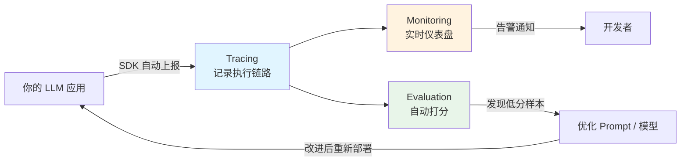

# LangSmith（LLM 开发平台）

## 基础概念

LangSmith 是 LangChain 公司推出的**LLM 应用可观测性与评估平台（Observability & Evaluation Platform）**，可以理解为「专为 AI 应用设计的监控仪表盘」。你的 Agent 或 LLM 应用每跑一次，内部经历了哪些步骤、调了哪个模型、花了多少 Token、结果好不好——LangSmith 帮你全部记录下来，还能自动打分。

打个比方：传统 Web 应用有 Datadog 做监控，LLM 应用就需要 LangSmith 做监控。但 LangSmith 比通用监控工具多了一层能力——**评估**。它不仅告诉你"调用花了多少钱"，还能告诉你"回答得好不好"。

### 核心要素

| 要素 | 作用 |
|------|------|
| **Tracing（追踪）** | 记录每次调用的完整执行链路：谁调了谁、输入输出是什么、花了多长时间 |
| **Evaluation（评估）** | 对 LLM 的输出自动打分，支持 LLM-as-Judge、规则校验、人工标注等多种方式 |
| **Monitoring（监控）** | 生产环境仪表盘，跟踪成本、延迟、错误率等关键指标，支持告警 |

### Tracing（追踪）

Tracing 是 LangSmith 的基础能力。每次应用执行会生成一棵**追踪树（Trace Tree）**——根节点是用户请求，子节点是内部的每个步骤（LLM 调用、工具调用、检索操作等）。每个节点称为一个 **Run**，记录了输入、输出、耗时、Token 消耗等信息。

对 LangChain / LangGraph 用户来说，只需设一个环境变量就能自动追踪，零代码改动。对其他框架，通过 Python/TypeScript SDK 或 OpenTelemetry 协议手动接入。

```python
# 追踪数据的结构（概念示意）
# Trace（根节点）
#   ├── Chain Run（链执行）
#   │     ├── Prompt Formatting（模板渲染）
#   │     └── LLM Run（模型调用，记录 Token 数、耗时、费用）
#   └── Tool Run（工具调用）
```

### Evaluation（评估）

评估解决的是「LLM 输出好不好」这个核心问题。LangSmith 支持四种评估方式：

- **LLM-as-Judge**：用另一个 LLM 对输出打分（最常用）
- **规则校验**：正则匹配、关键词检查、长度限制等
- **人工标注**：通过 Annotation Queue（标注队列）分配给专家审核
- **自定义评估器**：用 Python/TypeScript 编写任意评估逻辑

评估可以在 CI/CD 流水线中自动运行——每次提交代码后自动跑评估，分数下降就阻断部署。

### Monitoring（监控）

监控面向生产环境，提供实时仪表盘和告警。你可以跟踪：

- **成本**：每天/每周的 Token 消耗和费用
- **延迟**：P50/P95/P99 响应时间
- **错误率**：失败请求占比和错误类型分布
- **质量**：通过在线评估（Online Evaluation）持续检测输出质量

LangSmith 还内置了一个叫 **Polly** 的 AI 助手，能自动分析大量追踪数据，帮你快速定位问题。

### 核心要素关系图



三者的关系：Tracing 采集数据，Monitoring 展示数据，Evaluation 分析数据。形成「采集 → 分析 → 优化」的闭环。

## 基础用法

安装依赖：

```bash
pip install -U langsmith langchain-core langchain-openai
```

需要两个外部服务的 API Key：
- **LangSmith API Key**：访问 [https://smith.langchain.com](https://smith.langchain.com)，注册后在 Settings → API Keys 生成
- **OpenAI API Key**：访问 [https://platform.openai.com/api-keys](https://platform.openai.com/api-keys) 生成

环境变量配置：

```bash
export LANGSMITH_TRACING=true
export LANGSMITH_API_KEY="ls_xxx"           # 你的 LangSmith API Key
export LANGCHAIN_PROJECT="getting-started"  # 项目名称（自动创建）
export OPENAI_API_KEY="sk-xxx"              # OpenAI API Key
```

最小可运行示例（基于 langsmith==0.4.37, langchain-openai==0.3.x 验证，截至 2026-03）：

```python
import os
from langchain_openai import ChatOpenAI
from langchain_core.prompts import ChatPromptTemplate

# 确认环境变量已设置（SDK 自动读取，无需额外代码）
# LANGSMITH_TRACING=true 开启后，所有调用自动上报到 LangSmith

# 初始化模型
llm = ChatOpenAI(model="gpt-4o-mini", temperature=0.7)

# 创建 Prompt 模板
prompt = ChatPromptTemplate.from_messages([
    ("system", "你是一个技术名词解释助手，用一句大白话解释技术概念。"),
    ("human", "解释一下：{concept}")
])

# 组装链（LCEL 管道语法）
chain = prompt | llm

# 执行——所有操作自动追踪到 LangSmith
result = chain.invoke({"concept": "向量数据库"})
print(result.content)

# 执行完毕后，打开 https://smith.langchain.com 即可看到完整追踪
```

预期输出：

```text
向量数据库就是一种专门存"数字特征"的仓库——把文字、图片等数据转成一串数字（向量），
然后用数学方法快速找到最相似的那些数据，常用在 AI 搜索和推荐场景中。
```

同时在 LangSmith 控制台会看到一条完整的追踪记录，包含 Prompt 渲染、模型调用、Token 消耗等详情。

不使用 LangChain 框架时，可以用 `@traceable` 装饰器手动追踪任意函数：

```python
from langsmith import traceable
import openai

client = openai.OpenAI()

@traceable  # 加这个装饰器，函数的输入输出会自动上报到 LangSmith
def answer_question(question: str) -> str:
    response = client.chat.completions.create(
        model="gpt-4o-mini",
        messages=[{"role": "user", "content": question}]
    )
    return response.choices[0].message.content

result = answer_question("什么是 RAG？")
print(result)
```

## 同类工具对比

| 维度 | LangSmith | Langfuse | Arize Phoenix |
|------|-----------|----------|---------------|
| 核心定位 | LangChain 官方一站式可观测性 + 评估平台 | 开源 LLM 可观测性平台，框架无关 | 开源 AI 可观测性平台，侧重评估与实验 |
| LangChain 集成 | 一个环境变量即可，零代码接入 | 支持但需额外配置 | 支持但需额外配置 |
| 评估能力 | 全面：LLM-as-Judge + 规则 + 人工标注 + CI/CD 集成 | 基础评估 + 人工标注 | 强大的评估框架，支持多种评估模式 |
| 是否开源 | 否（SDK 开源，平台闭源） | 是（MIT 许可证，可自托管） | 是（Apache 2.0，可自托管） |
| 部署方式 | 云端 / BYOC / 自托管（企业版） | 云端 / 自托管 | 本地运行 / 云端 |
| 价格 | 免费 5k traces/月，Plus $39/人/月 | 免费额度更多，付费更便宜 | 开源免费，云端版付费 |

核心区别：

- **LangSmith**：LangChain 生态的「亲儿子」，集成最深、功能最全，适合已在用 LangChain/LangGraph 的团队
- **Langfuse**：开源优先，框架无关，适合需要自托管或混合多框架的团队
- **Arize Phoenix**：开源且本地可运行，评估能力强，适合注重数据隐私和实验分析的团队

## 常见误区

| 误区 | 准确理解 |
|------|----------|
| LangSmith 只能配合 LangChain 使用 | LangSmith 支持任何框架——通过 `@traceable` 装饰器、REST API 或 OpenTelemetry 均可接入，只是 LangChain 集成最省事 |
| 所有请求都必须追踪，不追踪就发现不了问题 | 高流量场景应使用采样策略（如只追踪 10%），代表性数据就够定位问题，全量追踪反而成本过高 |
| 接了 LangSmith 应用质量就会变好 | LangSmith 只是给你「透视镜」，真正的质量提升来自对追踪数据的分析和基于评估结果的 Prompt/模型迭代 |

## 优劣势分析

| 优势 | 劣势 |
|------|------|
| LangChain 生态零配置接入，上手极快 | 平台本身闭源，深度定制受限 |
| 追踪 + 评估 + 监控一站式覆盖，不用拼凑多个工具 | 免费额度有限（5k traces/月），商用成本需提前规划 |
| 评估框架成熟，支持 CI/CD 集成自动化 | 非 LangChain 用户的集成体验明显弱于原生用户 |
| 支持 BYOC 和自托管部署，满足数据合规需求 | 高流量场景下追踪数据量大，存储和传输开销需关注 |

## 思考题

<details>
<summary>初级：Trace 和 Run 是什么关系？为什么 LangSmith 要用树结构来组织追踪数据？</summary>

**参考答案：**

一个 Trace 对应一次完整的用户请求，包含多个 Run。Run 是最小执行单元（一次 LLM 调用、一次工具调用等），多个 Run 通过父子关系组成一棵树。

用树结构的原因：LLM 应用的执行流程天然是嵌套的——一个链调用内部可能包含 Prompt 渲染、模型调用、结果解析等多个子步骤。树结构能清晰展示这种嵌套关系，方便定位「到底是哪个环节出了问题」。

简单记忆：**1 个 Trace = 1 次用户请求 = 1 棵 Run 树**。

</details>

<details>
<summary>中级：如何设计一套评估方案，在 CI/CD 中自动阻断质量下降的部署？</summary>

**参考答案：**

1. **准备数据集**：在 LangSmith 中创建 Dataset，包含典型输入和预期输出（至少覆盖核心场景）
2. **定义评估器**：编写 Evaluator（如 LLM-as-Judge 打分 + 关键词规则校验），产出数值化分数
3. **设置基线**：首次运行评估后记录各项指标的基线分数
4. **CI 集成**：在 GitHub Actions / GitLab CI 中加一步，跑评估并与基线对比
5. **阻断规则**：某项指标下降超过阈值（如相关性分数下降 >5%）时，CI 自动失败，阻止合并

关键点是评估数据集要稳定、评估器要可复现，否则分数波动会导致误阻断。

</details>

<details>
<summary>中级：在日均 1 万次请求的生产环境中，如何平衡追踪成本和可观测性？</summary>

**参考答案：**

三个策略配合使用：

1. **采样追踪**：生产环境只追踪 5%-10% 的请求，获得代表性数据的同时大幅降低成本
2. **分层保留**：重要追踪（含用户反馈、错误请求）用长期保留（400 天），普通追踪用短期保留，通过 LangSmith 的 Extended Traces 功能差异化管理
3. **离线评估**：不在每个请求上跑评估，而是定期从追踪中抽样，离线用便宜模型（如 gpt-4o-mini）批量打分

额外优化：对高频重复请求做 Prompt 缓存减少调用次数；监控仪表盘只关注聚合指标（P95 延迟、日均成本），不逐条查看。

</details>

## 参考资料

1. 官方文档：[LangSmith Documentation](https://docs.smith.langchain.com)
2. GitHub 仓库：[langsmith-sdk](https://github.com/langchain-ai/langsmith-sdk)
3. PyPI 包页面：[langsmith](https://pypi.org/project/langsmith/)
4. 官方产品页：[LangSmith Platform](https://www.langchain.com/langsmith-platform)
5. 定价详情：[LangSmith Pricing](https://www.langchain.com/pricing)
