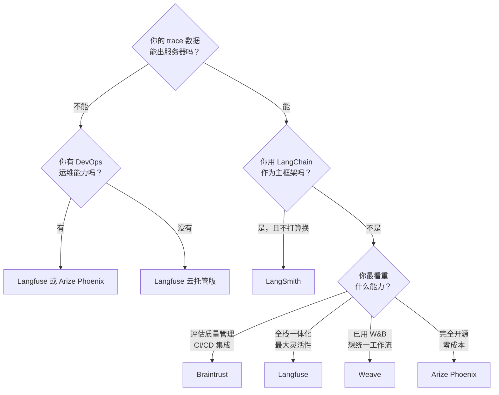

# 可观测性工具对比

## 对比背景

LLM 应用和传统软件有一个本质区别：**输出不确定**。同一个 Prompt 跑两次，结果可能完全不同。再加上 Agent 应用的多步骤链路（LLM 调用 -> 工具执行 -> 再次 LLM 调用），一旦出错很难定位是哪个环节的问题。可观测性（Observability）工具就是用来解决这个问题的——把 AI 应用的每一步执行过程记录下来，让你能看清楚「发生了什么」「花了多少钱」「质量好不好」。

目前市面上的可观测性工具走了不同的路线：有的和特定框架深度绑定（如 LangSmith 绑定 LangChain），有的强调开源自部署（如 Langfuse、Arize Phoenix），有的专注评估质量管理（如 Braintrust），有的依托已有 ML 平台做延伸（如 Weave 依托 W&B）。路线不同，适合的团队和场景也不同，所以需要做对比。

本对比覆盖 5 款工具：**Langfuse、LangSmith、Weave、Braintrust、Arize Phoenix**，选取标准为 GitHub Stars 超过 1k、活跃维护、在 LLM 开发社区有较高认知度。

> 本对比基于 2026-03 各工具最新稳定版本，信息可能随版本更新而变化。

### 对比对象

| 工具 | 当前版本 | 语言/平台 | 许可证 | 验证日期 |
|------|---------|-----------|--------|---------|
| Langfuse | v3.x | Python / TypeScript / Go | MIT（开源） | 2026-03 |
| LangSmith | v0.2+ | Python / TypeScript / Go | 专有（商业） | 2026-03 |
| Weave | v0.50+ | Python / TypeScript | 开源 + 云服务 | 2026-03 |
| Braintrust | v1.x | Python / TypeScript | 专有（商业） | 2026-03 |
| Arize Phoenix | v4.x | Python / TypeScript | Apache 2.0（开源） | 2026-03 |

## 核心差异总览

| 对比维度 | Langfuse | LangSmith | Weave | Braintrust | Arize Phoenix |
|---------|----------|-----------|-------|------------|---------------|
| 核心定位 | 开源全栈可观测平台 | LangChain 官方追踪工具 | W&B 生态的 LLM 延伸 | 评估驱动的质量管理平台 | 开源追踪+评估平台 |
| 设计路线 | 框架无关，插件式集成 | 框架深度绑定，零配置 | 生态融合，统一工作流 | 评估为一等公民 | OTEL 标准，无厂商锁定 |
| 学习曲线 | 中 | 低（LangChain 用户） | 低（W&B 用户） | 中 | 中 |
| 自部署能力 | 完全支持（Docker） | 不支持（仅云服务） | 企业级 VPC 部署 | 企业版可自部署 | 完全支持（开源） |
| 生态集成 | 15+ 框架 | LangChain/LangGraph 原生 | W&B 生态 | 10+ 框架 | 15+ 框架（OTEL 标准） |
| 成本模式 | 自部署免费 / 云端按量 | 按 trace 计费 | 集成 W&B 计费 | 月度固定套餐 | 完全免费（自部署） |
| 适合团队 | 初创企业 / 独立开发者 | LangChain 重度用户 | ML 工程团队 | 企业 AI 产品线 | 数据敏感型组织 |

## 关键差异

这 5 款工具最值得关注的差异集中在 3 个方面：**部署自由度**、**框架绑定程度**、**评估能力深度**。

| 差异点 | Langfuse | LangSmith | Weave | Braintrust | Arize Phoenix | 为什么重要 |
|--------|----------|-----------|-------|------------|---------------|------------|
| 部署自由度 | 自部署 + 云托管 | 仅云服务 | 云 + VPC | 云 + 企业自部署 | 完全自部署 | 决定数据是否出你的服务器 |
| 框架绑定 | 无绑定 | 强绑定 LangChain | 绑定 W&B | 无绑定 | 无绑定 | 决定换框架时迁移成本多大 |
| 评估能力 | 完整（内置评估） | 基础 | 完整 | 企业级（统计显著性） | 完整 | 决定能否自动化衡量 AI 质量 |

### 差异点 1：部署自由度

这是选型时最先要回答的问题：**你的 trace 数据能不能出你的服务器？**

- **可以出服务器**：5 款工具都能用，按功能和价格选即可
- **不能出服务器**（金融、医疗、政府等场景）：只能选 Langfuse（MIT 开源，Docker 一键部署）或 Arize Phoenix（Apache 2.0，完全开源）。LangSmith 不支持自部署，Weave 和 Braintrust 的自部署方案门槛较高

自部署的代价是需要自己维护 PostgreSQL 等基础设施。小团队如果没有 DevOps 能力，云服务反而更省心。

### 差异点 2：框架绑定程度

LangSmith 的"零配置追踪"只在 LangChain/LangGraph 生态内有效——配一个环境变量，所有 LLM 调用自动被记录，不用改一行代码。这体验确实好，但代价是：一旦你换了框架（比如改用 LlamaIndex 或自研方案），这个优势就没了，还得手动集成。

其他 4 款工具都是框架无关的：不管你用什么框架，都需要手动接入 SDK，但也意味着换框架时不用换观测工具。

### 差异点 3：评估能力深度

"追踪"解决的是"看到发生了什么"，"评估"解决的是"判断好不好"。5 款工具的评估能力差别很大：

- **Braintrust**：评估是核心功能。内置统计显著性分析（能告诉你"这次改进是真的好了，还是只是随机波动"），支持 CI/CD 自动阻断（评估不过就不让代码合并）
- **Langfuse / Arize Phoenix / Weave**：评估功能完整，支持自定义评分器和 LLM-as-judge，但没有统计显著性分析
- **LangSmith**：评估功能相对基础，适合简单场景

## 决策图

决策逻辑说明：

- 第一个分支点是**数据隐私**，这是硬约束，直接排除不支持自部署的工具
- 第二个分支点是**框架绑定**，如果你是 LangChain 重度用户，LangSmith 的零配置体验确实无可替代
- 第三个分支点是**核心需求**，不同工具的强项不同，按需选择

## 逐项分析

### Langfuse

**一句话定位：** 开源的 LLM 全栈可观测平台，追踪 + 评估 + 提示管理一体化，自部署和云托管都支持。

**核心优势：**

1. **真正的开源自由**：MIT 许可证，可以不花一分钱在自己服务器上跑。对数据隐私要求高或者预算有限的团队来说，这是最大卖点
2. **功能最全面**：追踪（Trace）、评估（Eval）、提示词版本管理、成本分析集成在一个平台里。不用在多个工具之间来回切换
3. **框架无关**：不管你用 LangChain、LlamaIndex、OpenAI SDK 还是自研框架，都能通过 SDK 或 OpenTelemetry 接入

**主要局限：**

1. **需要手动集成**：不像 LangSmith 那样"配个环境变量就自动追踪"，你需要在代码里显式调用 Langfuse SDK
2. **自部署有运维成本**：需要维护 PostgreSQL 数据库、定期备份，小团队可能觉得麻烦

**最适合：** 初创 AI 企业（成本敏感 + 需要灵活性）、非 LangChain 技术栈团队、对数据隐私有要求的组织。

### LangSmith

**一句话定位：** LangChain 官方可观测性工具，对 LangChain 用户提供零配置的自动链路追踪。

**核心优势：**

1. **零配置自动追踪**：在 LangChain/LangGraph 应用中，只需设置环境变量 `LANGCHAIN_TRACING_V2=true`，所有 LLM 调用、工具执行、链式操作自动被记录。不用改一行代码
2. **LangGraph 原生支持**：LangGraph 的每个节点输入输出、条件分支路径、人工介入点都清晰可见。如果你用 LangGraph 构建复杂 Agent，这种原生支持价值很大

**主要局限：**

1. **框架绑定**：离开 LangChain 生态，体验直线下降。对非 LangChain 应用只提供基础 SDK，需要手动集成
2. **不支持自部署**：所有数据托管在 LangChain 的云服务上。对数据隐私要求高的企业来说，这是硬伤

**最适合：** LangChain/LangGraph 重度用户、追求"开箱即用"体验的小团队。

### Weave

**一句话定位：** Weights & Biases 向 LLM 领域的延伸，追踪 + 评估 + Playground 一体化，与 W&B 生态无缝融合。

**核心优势：**

1. **生态融合**：如果团队已经在用 W&B 做模型训练和实验管理，Weave 能直接复用同一套登录、权限、计费系统。不用学新工具
2. **交互式 Playground**：可以在部署前直接测试不同 LLM、提示词和参数配置，对着生产 trace 做实验

**主要局限：**

1. **绑定 W&B 生态**：选了 Weave 基本就锁定在 W&B 平台。未来想迁移到开源方案，成本不低
2. **社区较小**：相比 Langfuse（~19k stars），Weave 的社区资源、第三方教程都少一个量级

**最适合：** 已使用 W&B 的 ML 工程团队、需要把模型训练和 LLM 应用管理统一起来的企业。

### Braintrust

**一句话定位：** 以"评估"为核心的 LLM 质量管理平台，支持统计显著性分析和 CI/CD 自动阻断。

**核心优势：**

1. **评估为一等公民**：内置丰富的预构建评分器（BLEU、ROUGE、LLM-as-judge 等），同时支持自定义 Python 评估函数。区别于其他工具把评估当附加功能，Braintrust 把评估作为核心设计
2. **统计显著性分析**：能自动告诉你"这次提示词修改真的提升了质量吗？"——通过对照实验和置信度计算，防止"看起来好了但其实是随机波动"的假改进上线
3. **CI/CD 集成**：可以在 GitHub Actions 等 CI 管道中运行评估，评估不过就自动阻止代码合并

**主要局限：**

1. **学习曲线较陡**：需要理解评分器设计、实验对照、统计显著性等概念。对于只想做简单追踪的团队来说，功能过重
2. **无免费版**：采用月度付费套餐制，小团队或个人开发者可能觉得贵

**最适合：** 对 AI 产品质量要求极高的企业、需要 CI/CD 集成质量卡点的团队、进行大规模 A/B 测试的组织。

### Arize Phoenix

**一句话定位：** 完全开源的 LLM 追踪和评估平台，基于 OpenTelemetry 标准，强调数据所有权和零厂商锁定。

**核心优势：**

1. **完全开源零成本**：Apache 2.0 许可证，无论什么规模都能免费用。日百万级 trace 的高流量应用，自部署比按量付费的云服务能省不少钱
2. **OpenTelemetry 标准**：遵循行业标准的 OTEL 协议。今天数据发给 Phoenix，明天可以无缝切换到 Datadog、New Relic 等其他 OTEL 消费者，迁移成本极低
3. **广泛框架支持**：开箱支持 LangChain、LlamaIndex、CrewAI、OpenAI Agents SDK、Claude Agent SDK 等 15+ 框架

**主要局限：**

1. **只有自部署**：没有官方托管的云服务。想"注册个账号就用"是不行的，必须自己部署和维护
2. **运维门槛**：需要 PostgreSQL、容器编排等基础设施知识，对没有 DevOps 能力的团队是负担

**最适合：** 数据隐私要求极高的组织（金融、医疗、政府）、高 trace 量追求成本最优的应用、拥有 DevOps 能力的技术团队。

## 适用场景与选型建议

| 使用场景 | 更适合的工具 | 原因 |
|---------|-------------|------|
| 初创 AI 公司，预算有限 | Langfuse | 自部署完全免费，云服务也有免费额度，成本可控 |
| 企业 AI 产品线，质量优先 | Braintrust | 统计显著性分析 + CI/CD 阻断，确保每次上线都不退步 |
| LangChain 重度用户 | LangSmith | 零配置自动追踪，集成成本最低 |
| 数据不能出服务器 | Langfuse 或 Arize Phoenix | 唯二支持完全自部署的开源方案 |
| 已用 W&B 的 ML 团队 | Weave | 无缝融合已有工作流，不用学新工具 |
| 多框架混合技术栈 | Langfuse 或 Arize Phoenix | 框架无关设计，不管换什么框架都能继续用 |
| 快速 PoC，最短上手时间 | LangSmith（LangChain 用户）或 Langfuse（其他用户） | 集成最简单，上手最快 |

## 常见误区

| 常见误区 | 准确理解 |
|----------|----------|
| "自部署一定比云服务便宜" | 不一定。自部署需要服务器、数据库、运维人力等隐性成本。trace 量小的团队用云服务可能更划算，选择前要算总拥有成本（TCO） |
| "LangSmith 只能用于 LangChain" | 不完全对。LangSmith 提供通用 SDK，非 LangChain 应用也能用，但需要手动集成且体验远不如在 LangChain 生态内 |
| "开源工具功能一定不如商业工具" | 错误。Langfuse 和 Arize Phoenix 的功能完整度不亚于商业工具。开源代表源码开放，不代表功能弱 |
| "选了一个工具就被永久锁定" | 大多数工具都支持数据导出。特别是使用 OTEL 标准的 Arize Phoenix，迁移到其他 OTEL 兼容工具几乎零成本 |

## 思考题

初级：Langfuse 和 LangSmith 在"追踪集成方式"上的核心区别是什么？

**参考答案：**

LangSmith 对 LangChain 应用提供**自动追踪**——只需设置环境变量，不用改代码。Langfuse 需要**手动集成**——在代码中显式调用 SDK 的 `trace()` 和 `span()` 方法。

LangSmith 的方式更省事但绑定框架，Langfuse 的方式更灵活但要写更多代码。

中级：一个 10 人创业团队，日均 50 万条 trace，用 LangChain + Claude API，关注成本控制。应该选 LangSmith 还是 Langfuse？

**参考答案：**

推荐 **Langfuse**。理由：

1. 日均 50 万条 trace 按量计费可能很贵，Langfuse 自部署完全免费，成本更可控
2. 虽然用了 LangChain，但 Langfuse 也提供 LangChain 官方集成插件，接入成本不高
3. 团队规模不大但 trace 量大，自部署的固定成本摊薄后远低于按量付费

如果团队没有运维能力，也可以先用 Langfuse 云服务起步，后续 trace 量涨上来再迁移到自部署。

中级：一个金融机构要部署投资顾问 Agent，要求所有数据不出自有数据中心、要支持合规审计。在 Langfuse、Arize Phoenix、Braintrust 中应该选哪个？

**参考答案：**

推荐 **Langfuse** 或 **Arize Phoenix**，两者都完全开源且支持私有部署。

- 如果团队希望追踪 + 评估 + 提示管理一站式解决，选 **Langfuse**（功能更全面）
- 如果团队强调零厂商锁定和未来迁移自由度，选 **Arize Phoenix**（OTEL 标准，迁移成本最低）
- **Braintrust** 虽然有企业自部署选项，但配置复杂且核心是商业产品，对"数据必须在自有数据中心"这类硬约束不如前两者友好

## 参考资料

1. [Langfuse 官方文档](https://langfuse.com/docs)
2. [Langfuse GitHub 仓库](https://github.com/langfuse/langfuse)
3. [LangSmith 官方文档](https://docs.smith.langchain.com/)
4. [W&B Weave 官方文档](https://docs.wandb.ai/weave)
5. [Braintrust 官方网站](https://www.braintrust.dev/)
6. [Arize Phoenix 官方文档](https://docs.arize.com/phoenix)
7. [Arize Phoenix GitHub 仓库](https://github.com/Arize-ai/phoenix)
