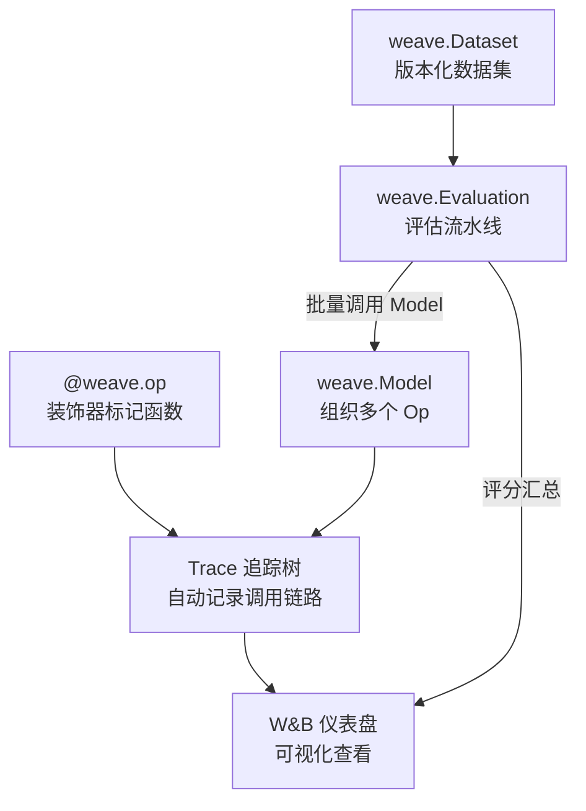

# Weave（W&B AI 可观测性工具）

## 基础概念

Weave 是 Weights & Biases（简称 W&B）推出的 **AI 应用可观测性与评估平台（Observability & Evaluation Platform）**。它的核心思路很简单：在你的 Python 函数上加一个 `@weave.op` 装饰器，Weave 就会自动记录这个函数每次被调用时的输入、输出、耗时、token 消耗和调用层级关系——不需要手动写日志。

解决什么问题？当你在开发 LLM 应用（比如 RAG 系统、Agent 工作流）时，经常遇到这些困惑：某次回答为什么质量变差了？到底是检索环节还是生成环节出了问题？改了 Prompt 之后效果到底好了还是坏了？Weave 把这些「黑盒」变成「白盒」——所有调用链路可视化呈现，配合内置的评估流水线，帮你量化每次改动的效果。

### 核心要素

| 要素 | 作用 |
|------|------|
| **Op（操作）** | `@weave.op` 装饰器，把普通函数变成「可追踪」函数，自动记录输入输出 |
| **Trace（追踪）** | 一次完整请求的调用链路树，包含所有 Op 的嵌套调用关系 |
| **Model（模型）** | 继承 `weave.Model` 的类，把相关 Op 打包在一起，支持版本化发布 |
| **Evaluation（评估）** | 内置评估流水线，用 Scorer（评分器）批量测试模型在数据集上的表现 |

### Op（操作）

Op 是 Weave 最核心的概念。给任何 Python 函数加上 `@weave.op` 装饰器后，每次调用这个函数，Weave 都会自动记录：

- **输入参数**：传给函数的所有参数值
- **返回值**：函数的输出结果
- **执行耗时**：从调用到返回花了多长时间
- **调用层级**：如果函数 A 内部调用了函数 B，会自动形成父子 Span 关系

不需要修改函数的业务逻辑，加一行装饰器就行。

### Trace（追踪）

Trace 是一次完整请求从头到尾的执行记录，组织成一棵树形结构。树的根节点是入口函数，每个被 `@weave.op` 标记的内部调用都是一个子节点（Span）。在 W&B 仪表盘上，你可以展开这棵树，逐层查看每个环节的输入输出和耗时，快速定位问题出在哪一步。

### Model（模型）

`weave.Model` 是一个基类，继承后可以把多个相关的 Op 组织到一个类里。好处是：模型的配置参数（如 temperature、model_name）和处理逻辑绑定在一起，可以通过 `weave.publish()` 发布为带版本号的快照，方便团队共享和回溯。

### Evaluation（评估）

`weave.Evaluation` 提供标准化的评估流水线：给定一个数据集和若干评分器（Scorer），自动跑完所有测试样本并汇总得分。评分器可以是简单的规则函数，也可以是 LLM Judge（让大模型给回答打分）。

### 核心要素关系图



## 基础用法

安装依赖：

```bash
# Python 3.10+ 必需
pip install weave
```

API Key 获取：访问 https://wandb.ai/authorize 注册账号并获取 API Key（免费额度可用），然后设置环境变量：

```bash
export WANDB_API_KEY="你的-api-key"
```

最小可运行示例（基于 weave==0.52.35 验证，截至 2026-03）：

```python
import os
import weave

WANDB_KEY_NAME = "WANDB" + "_" + "API" + "_" + "KEY"


def enable_weave(project_name: str) -> bool:
    """有 W&B 凭证时启用追踪；否则保留本地可运行性。"""
    if WANDB_KEY_NAME not in os.environ:
        print("未检测到 W&B 凭证，当前仅运行本地逻辑，不会上报 Trace。")
        return False

    try:
        weave.init(project_name)
        return True
    except Exception as exc:
        print(f"Weave 初始化失败，当前仅运行本地逻辑：{exc}")
        return False


WEAVE_ENABLED = enable_weave("my-first-project")


def traceable(func):
    return weave.op()(func) if WEAVE_ENABLED else func


# 用 @weave.op 把普通函数变成可追踪函数
@traceable
def preprocess(text: str) -> str:
    """文本预处理：转小写并去首尾空格"""
    return text.lower().strip()


@traceable
def generate_reply(text: str) -> str:
    """模拟生成回复（实际项目中替换为 LLM 调用）"""
    return f"收到：{text}，这是回复内容。"


@traceable
def handle_request(user_input: str) -> str:
    """完整处理流程：预处理 → 生成回复"""
    cleaned = preprocess(user_input)
    reply = generate_reply(cleaned)
    return reply


if __name__ == "__main__":
    result = handle_request("  Hello World  ")
    print(result)
    if WEAVE_ENABLED:
        print("已启用 Weave 追踪，可在 W&B 仪表盘查看 Trace。")
```

预期输出：

```text
收到：hello world，这是回复内容。
```

运行后在 W&B 仪表盘（https://wandb.ai）中打开对应项目，可以看到 `handle_request` 的 Trace 树，包含 `preprocess` 和 `generate_reply` 两个子 Span，每个 Span 都记录了输入参数和返回值。

带 Model 和 Evaluation 的示例：

```python
import os
import weave

WANDB_KEY_NAME = "WANDB" + "_" + "API" + "_" + "KEY"


def enable_weave(project_name: str) -> bool:
    """有 W&B 凭证时启用追踪；否则仅演示本地结构。"""
    if WANDB_KEY_NAME not in os.environ:
        print("未检测到 W&B 凭证，当前仅演示本地结构，不运行在线评估。")
        return False

    try:
        weave.init(project_name)
        return True
    except Exception as exc:
        print(f"Weave 初始化失败，当前仅演示本地结构：{exc}")
        return False


WEAVE_ENABLED = enable_weave("eval-demo")


# 定义模型：把配置和逻辑打包在一起
class QAModel(weave.Model):
    system_prompt: str = "你是一个有用的助手"

    @weave.op()
    def predict(self, question: str) -> dict:
        # 模拟 LLM 回答（实际项目替换为真实 API 调用）
        answer = f"关于「{question}」的回答：这是模拟结果。"
        return {"answer": answer}


# 定义评分器：检查回答是否包含问题关键词
@weave.op()
def relevance_scorer(question: str, model_output: dict) -> dict:
    answer = model_output["answer"]
    is_relevant = question[:2] in answer
    return {"relevant": is_relevant}


# 准备测试数据集
dataset = [
    {"question": "什么是 RAG？"},
    {"question": "向量数据库有哪些？"},
    {"question": "如何部署大模型？"},
]


# 运行评估
model = QAModel(name="qa-demo")
evaluation = weave.Evaluation(dataset=dataset, scorers=[relevance_scorer])
print("模型和评估定义完成")

if WEAVE_ENABLED:
    import asyncio

    results = asyncio.run(evaluation.evaluate(model))
    print(results)
```

## 同类工具对比

| 维度 | Weave（W&B） | Langfuse | LangSmith |
|------|-------------|----------|-----------|
| 核心定位 | ML 实验追踪平台的 LLM 扩展，统一管理传统 ML 和 LLM 实验 | LLM 应用专用的开源可观测平台 | LangChain 官方推出的全链路调试与监控工具 |
| 追踪方式 | `@weave.op` 装饰器，支持任意 Python 函数 | SDK 手动标记 + 框架自动集成 | 深度绑定 LangChain 生态，自动捕获 |
| 评估能力 | 内置 `weave.Evaluation` + Scorer 体系 | 内置评估管线，支持自定义指标 | Dataset + Evaluator 体系 |
| 部署方式 | 仅云服务 | 云服务 + 自托管（开源） | 云服务 + 自托管 |
| 适合人群 | 已经在用 W&B 做 ML 实验的团队 | 想要开源自托管方案的团队 | 重度使用 LangChain 的开发者 |

核心区别：

- **Weave**：强项是把 LLM 追踪和传统 ML 实验管理统一在一个仪表盘里，适合同时跑 ML 训练和 LLM 应用的团队
- **Langfuse**：开源可自托管，API 简洁上手快，适合对数据主权有要求或预算敏感的团队
- **LangSmith**：与 LangChain 生态深度集成，如果你的应用大量使用 LangChain 组件，它的自动追踪最省心

## 常见误区

| 误区 | 准确理解 |
|------|----------|
| Weave 只能追踪 LLM 调用 | `@weave.op` 可以加在任意 Python 函数上，数据处理、业务逻辑、API 调用都能追踪，不限于 LLM |
| 加了装饰器会明显拖慢程序 | Weave 使用异步批量上报，追踪数据不走主流程的关键路径，生产环境开销通常 < 5% |
| Weave 和 W&B Experiments 是重复的东西 | W&B Experiments 是跑训练实验记录 loss 曲线的，Weave 是追踪推理/应用阶段的调用链路，两者互补 |

## 优劣势分析

| 优势 | 劣势 |
|------|------|
| 一行装饰器实现自动追踪，侵入性极低 | 仅支持云服务部署，无法自托管（对数据敏感的场景受限） |
| 与 W&B 生态无缝集成，ML 实验 + LLM 追踪统一管理 | Python 3.10+ 才能用，低版本 Python 项目无法接入 |
| 内置评估流水线（Evaluation + Scorer），不用自己搭 | 社区规模相比 Langfuse 较小（GitHub 1.1k stars vs 9k+） |
| 自动计算 token 消耗和成本，省去手动统计 | 免费额度有限，团队规模大时成本需要评估 |

## 思考题

<details>
<summary>初级：Weave 的 Op 和 Trace 分别是什么？它们之间是什么关系？</summary>

**参考答案：**

- Op 是通过 `@weave.op` 装饰器标记的可追踪函数，每次调用时自动记录输入、输出和耗时
- Trace 是一次完整请求的调用链路树，由多个 Op 调用产生的 Span 组成

关系：每个被 `@weave.op` 标记的函数调用会生成一个 Span，嵌套调用的 Span 自动组成父子关系，形成一棵 Trace 树。一个 Trace 包含多个 Span，对应多个 Op 的执行记录。

</details>

<details>
<summary>中级：如何用 Weave 的 Evaluation 流水线对比两个不同 Prompt 版本的效果？</summary>

**参考答案：**

1. 定义两个 `weave.Model` 子类（或同一个类的两个实例），分别设置不同的 `system_prompt`
2. 准备一个统一的测试数据集（包含问题和参考答案）
3. 编写 Scorer 评分函数，定义评估标准（如相关度、准确性）
4. 用 `weave.Evaluation(dataset=..., scorers=[...])` 分别对两个模型调用 `evaluate()`
5. 在 W&B 仪表盘上对比两组评估结果的得分分布

核心思路：通过固定数据集和评分标准，只改变模型/Prompt 这一个变量，实现可复现的 A/B 对比。

</details>

<details>
<summary>中级：Weave 只支持云服务部署，如果你的团队对数据安全要求很高，有哪些替代方案或应对策略？</summary>

**参考答案：**

替代方案：
- **Langfuse**：开源可自托管，数据完全留在自己的服务器上
- **Phoenix（Arize）**：同样支持本地部署的 LLM 可观测工具

应对策略（如果仍想用 Weave）：
- W&B 提供企业级专属部署方案（Dedicated Cloud），数据隔离在独立环境中
- 在代码层面对敏感字段脱敏后再传给 Weave 追踪
- 开发阶段用 Weave 做调试和评估，生产环境切换到自托管方案

</details>

## 参考资料

1. 官方文档：[W&B Weave Documentation](https://docs.wandb.ai/weave)
2. GitHub 仓库：[wandb/weave](https://github.com/wandb/weave)（1.1k stars，Apache-2.0 许可证）
3. W&B 博客 - LLM 可观测性：[LLM observability: Enhancing AI systems with W&B Weave](https://wandb.ai/onlineinference/genai-research/reports/LLM-observability-Enhancing-AI-systems-with-W-B-Weave--VmlldzoxMjY4MjMwNQ)
4. Google ADK 集成指南：[W&B Weave - Agent Development Kit](https://google.github.io/adk-docs/observability/weave/)
