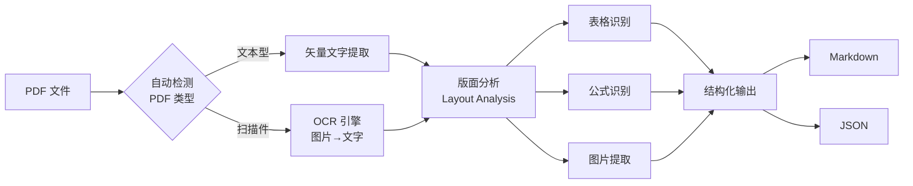

# MinerU（文档智能解析工具）

## 基础概念

MinerU 是 OpenDataLab 团队开源的**PDF 文档智能解析工具**，核心能力是把 PDF（包括扫描件）转成高质量的 Markdown 或 JSON。它不只是"提取文字"，而是先分析页面布局，识别标题、段落、表格、图片、公式等元素的位置和类型，再按正确的阅读顺序组织输出。

典型使用场景：构建 RAG 系统前的文档预处理、企业知识库搭建、学术论文批量提取、隐私敏感场景下的本地化文档处理。

MinerU 2.0 版本（2025 年发布）进行了重大升级：Python 包名从 `magic-pdf` 改为 `mineru`，命令行工具也从 `magic-pdf` 改为 `mineru`，引入了基于 VLM（Vision Language Model，视觉语言模型）的解析后端，解析精度大幅提升。

### 核心要素

| 要素 | 作用 |
|------|------|
| **版面分析（Layout Analysis）** | 用深度学习模型识别页面中每个区域的类型和位置，是整个解析流程的第一步 |
| **OCR 引擎** | 对扫描件或图片型 PDF 进行文字识别，支持 84+ 种语言 |
| **解析后端（Backend）** | 决定用哪种模型组合来处理文档，MinerU 2.0 提供 pipeline、vlm、hybrid 三种后端 |
| **结构化输出** | 将解析结果转为 Markdown（人可读）和 JSON（程序可处理）两种格式 |

### 版面分析（Layout Analysis）

版面分析是 MinerU 区别于普通 PDF 文本提取工具的核心能力。它通过深度学习模型扫描每一页 PDF，自动标记出文本块、表格、图片、公式、页眉页脚等区域，并确定它们之间的阅读顺序。

打个比方：普通工具像是"闭着眼睛把文字全倒出来"，MinerU 则是"先看懂整页的排版结构，再按照人类的阅读习惯把内容提取出来"。这就是为什么 MinerU 的输出能保留标题层级、段落分隔和列表结构。

### OCR 引擎

对于扫描件（拍照或扫描生成的 PDF），里面的"文字"其实是图片像素。MinerU 内置 OCR（Optical Character Recognition，光学字符识别）引擎，能自动检测 PDF 类型：如果是文本型 PDF 就直接提取矢量文字，如果是扫描件就启用 OCR 识别图片中的文字。

MinerU 2.0 的 VLM 后端原生支持 109 种语言的文字识别，pipeline 后端则通过 PaddleOCR 支持 84 种语言。

### 解析后端（Backend）

MinerU 2.0 提供三种解析后端，适应不同场景：

| 后端 | 原理 | 适合场景 |
|------|------|---------|
| `pipeline` | 传统多模型串联（版面分析 + OCR + 公式识别 + 表格识别） | 纯 CPU 环境、对速度要求不高的场景 |
| `vlm` | 用一个视觉语言大模型（< 1B 参数）统一处理所有任务 | GPU 环境、追求高精度 |
| `hybrid`（默认） | 结合 pipeline 和 vlm 的优点，先用 pipeline 提取文本 PDF 的矢量文字，再用 vlm 处理复杂区域 | 推荐的默认选择，兼顾精度和速度 |

### 核心要素关系图



## 基础用法

安装依赖（MinerU 2.0+ 使用新包名 `mineru`）：

```bash
# 安装 uv 包管理器（推荐，比 pip 更快）
pip install --upgrade pip
pip install uv

# 安装 MinerU 全量版（包含所有后端，推荐）
uv pip install -U "mineru[all]"

# 或只安装核心功能
uv pip install -U "mineru[core]"
```

系统要求：Python 3.10-3.13，内存 16GB+（推荐 32GB），磁盘 20GB+。GPU 可选但推荐（NVIDIA Volta 架构及以上，显存 6GB+）。

命令行最小示例：

```bash
# GPU 加速（默认 hybrid 后端）
mineru -p document.pdf -o ./output

# 纯 CPU 模式（使用 pipeline 后端）
mineru -p document.pdf -o ./output -b pipeline
```

Python API 最小可运行示例（基于 mineru>=2.0 验证，截至 2026-03）：

```python
import os
from pathlib import Path
from mineru.cli.common import do_parse
from mineru.utils.enum_class import MakeMode

def parse_pdf(pdf_path: str, output_dir: str = "./output"):
    """使用 MinerU 解析 PDF 文件，输出 Markdown 和 JSON"""
    os.makedirs(output_dir, exist_ok=True)

    # 读取 PDF 文件
    pdf_path = Path(pdf_path)
    with open(pdf_path, "rb") as f:
        pdf_bytes = f.read()

    # 调用 do_parse 执行解析
    # backend 可选：pipeline / vlm-auto-engine / hybrid-auto-engine
    do_parse(
        output_dir=output_dir,
        pdf_file_names=[pdf_path.stem],
        pdf_bytes_list=[pdf_bytes],
        p_lang_list=["ch"],              # 文档语言，ch=中文，en=英文
        backend="pipeline",              # 纯 CPU 用 pipeline，有 GPU 用 hybrid-auto-engine
        parse_method="auto",             # auto 自动检测文本型/扫描型
        f_dump_md=True,                  # 输出 Markdown 文件
        f_dump_content_list=True,        # 输出内容列表 JSON
        f_dump_middle_json=True,         # 输出中间 JSON（供二次开发）
        f_make_md_mode=MakeMode.MM_MD,   # Markdown 输出模式
    )

    print(f"解析完成！输出目录: {output_dir}/{pdf_path.stem}")

# 使用示例
if __name__ == "__main__":
    pdf_file = "sample.pdf"
    if os.path.exists(pdf_file):
        parse_pdf(pdf_file)
    else:
        print(f"请准备 PDF 文件: {pdf_file}")
        print("用法: python script.py")
```

预期输出：

```text
解析完成！输出目录: ./output/sample
```

输出目录中会生成：
- `sample.md`：结构化 Markdown 文件
- `sample_content_list.json`：内容块列表（便于程序化处理）
- `sample_middle.json`：中间结果（供二次开发）
- `images/` 目录：提取的图片文件

高级 API 使用（指定更多参数）：

```python
from pathlib import Path
from mineru.cli.common import do_parse

# 只解析指定页码范围
do_parse(
    output_dir="./output",
    pdf_file_names=["report"],
    pdf_bytes_list=[pdf_bytes],
    p_lang_list=["ch"],
    backend="hybrid-auto-engine",     # 使用 hybrid 后端（需要 GPU）
    parse_method="auto",
    formula_enable=True,              # 启用公式识别
    table_enable=True,                # 启用表格识别
    start_page_id=0,                  # 从第 0 页开始
    end_page_id=10,                   # 到第 10 页结束
    f_dump_md=True,
    f_draw_layout_bbox=True,          # 输出带版面标注的可视化图片（调试用）
)
```

环境变量配置：

```bash
# 模型下载源切换（默认 HuggingFace，国内用户可切换为 ModelScope）
export MINERU_MODEL_SOURCE=modelscope
```

## 同类工具对比

| 维度 | MinerU | pdfplumber | PyPDF2 | Adobe PDF Extract |
|------|--------|------------|--------|-------------------|
| 核心定位 | 深度学习驱动的结构化解析 | 精准表格提取 | 轻量 PDF 操作 | 企业级云端服务 |
| 版面分析 | 深度学习模型自动识别 | 无 | 无 | 有 |
| OCR 能力 | 内置，支持 84-109 种语言 | 不支持 | 不支持 | 强大 |
| 最擅长 | 复杂排版 PDF 转 Markdown | 表格数据提取 | PDF 合并/分割 | 高精度全场景 |
| 本地运行 | 完全本地 | 完全本地 | 完全本地 | 需联网调用云端 API |
| 开源免费 | 开源（AGPL-3.0） | 开源（MIT） | 开源 | 商业收费 |
| 适合人群 | RAG 开发者、知识库构建者 | 数据分析师 | 简单 PDF 处理需求 | 企业用户 |

核心区别：

- **MinerU**：用深度学习"看懂"页面布局后再提取，输出保留完整文档结构，是 RAG 场景的首选
- **pdfplumber**：专注精准提取表格数据，适合"只需要表格"的场景
- **PyPDF2**：只做基础 PDF 操作（合并、分割、提取文字），不做智能解析
- **Adobe PDF Extract**：精度高但需要联网和付费，适合预算充足的企业

## 常见误区

| 误区 | 准确理解 |
|------|----------|
| MinerU 和 PyPDF2 差不多，都是提取 PDF 文字 | MinerU 的核心能力是版面分析——先识别页面结构（标题、段落、表格、图片），再按正确顺序提取。PyPDF2 只能提取原始文字流，不理解页面布局 |
| MinerU 解析出的 Markdown 可以直接喂给 LLM | Markdown 质量虽高，但用于 RAG 仍需分块（chunking）和向量化处理。直接把整个 Markdown 丢给 LLM 会超出上下文窗口限制 |
| MinerU 2.0 的代码和 1.x 完全兼容 | 2.0 进行了破坏性重构：包名从 `magic-pdf` 改为 `mineru`，命令行工具、API 接口都有变化，升级时需要修改代码 |
| 有了 GPU 就一定比 CPU 快 | 取决于后端选择和文档类型。pipeline 后端在处理纯文本 PDF 时 CPU 也很快；GPU 优势主要体现在 VLM/hybrid 后端处理扫描件和复杂排版时 |

## 优劣势分析

| 优势 | 劣势 |
|------|------|
| 版面分析精度高，能正确保留文档层级结构 | 首次运行需下载模型权重文件（约数 GB），环境搭建门槛较高 |
| 完全本地运行，适合隐私敏感场景 | 对复杂表格（合并单元格等）的识别仍有改进空间 |
| 支持文本型和扫描型 PDF，自动检测切换 | 内存占用较高，推荐 16GB+，处理大文件时需 32GB+ |
| 输出 Markdown 格式，与 RAG 生态无缝衔接 | AGPL-3.0 许可证对商业闭源项目有传染性限制 |
| MinerU 2.0 引入 VLM 后端，精度大幅提升 | 不支持加密 PDF，不擅长漫画、艺术画册等非标准文档 |

## 思考题

<details>
<summary>初级：MinerU 的版面分析和普通 PDF 文字提取有什么本质区别？</summary>

**参考答案：**

普通 PDF 文字提取（如 PyPDF2）是从 PDF 底层数据流中按顺序读取字符，不理解页面的视觉布局。如果 PDF 是双栏排版，提取结果可能左右两栏文字混在一起。

MinerU 的版面分析用深度学习模型"看"整页图像，识别出标题、正文、表格、图片等区域的位置和类型，然后按人类的阅读顺序组织输出。本质区别是：前者处理的是"字节流"，后者处理的是"视觉结构"。

</details>

<details>
<summary>中级：MinerU 2.0 的三种后端（pipeline / vlm / hybrid）分别适合什么场景？如何选择？</summary>

**参考答案：**

- **pipeline**：传统多模型串联方案，每个任务（版面分析、OCR、公式、表格）由独立模型处理。优点是支持纯 CPU 运行，缺点是模型间存在误差累积。适合没有 GPU 的环境，或对速度要求不高的小批量处理。
- **vlm**：用一个视觉语言大模型统一处理所有任务。优点是精度最高（模型内部端到端优化），缺点是必须有 GPU 且显存要求较高。适合追求最高解析质量的场景。
- **hybrid**（默认推荐）：结合两者优点——对文本型 PDF 用 pipeline 的矢量文字提取（快且准），对复杂区域用 vlm 处理（精度高）。兼顾速度和精度，是大多数场景的最佳选择。

选择建议：有 GPU 就用 hybrid（默认），没有 GPU 就用 pipeline。

</details>

<details>
<summary>中级：在 RAG 系统中使用 MinerU 时，解析完 PDF 后还需要哪些处理步骤？为什么不能直接用？</summary>

**参考答案：**

MinerU 输出的 Markdown 虽然结构良好，但不能直接用于 RAG 检索，还需要：

1. **分块（Chunking）**：将长文档拆分为语义完整的小段。推荐用 RecursiveCharacterTextSplitter 等工具按标题和段落边界分割，而不是暴力按字符数切割。
2. **向量化（Embedding）**：将每个文本块转为向量表示，存入向量数据库（如 Chroma、Milvus）。
3. **元数据标注**：为每个块附加来源文件名、页码、块类型（正文/表格/代码）等信息，方便检索时过滤和溯源。

不能直接用的原因：LLM 的上下文窗口有限，整个文档塞不进去；即使塞得进去，检索效率也远不如向量检索。

</details>

## 参考资料

1. GitHub 仓库：[opendatalab/MinerU](https://github.com/opendatalab/MinerU)（32k+ stars，AGPL-3.0 许可证）
2. 官方文档：[MinerU Documentation](https://opendatalab.github.io/MinerU/)
3. PyPI 包页面：[mineru](https://pypi.org/project/mineru/)（2.0+ 新包名）
4. 在线体验：[HuggingFace Space](https://huggingface.co/spaces/opendatalab/MinerU)（无需登录）
5. 关联项目：[PDF-Extract-Kit](https://github.com/opendatalab/PDF-Extract-Kit)（MinerU 底层使用的 PDF 提取工具包）
