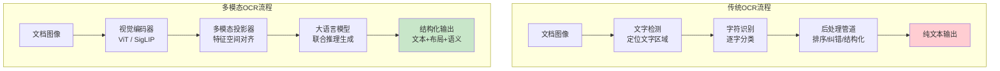

# 多模态 OCR（Vision Language Model OCR）

## 概念解释

多模态 OCR 是用视觉语言模型（Vision Language Model，VLM）直接处理文档图像，在识别文字的同时理解文档的排版结构和语义含义的技术。它把传统 OCR 从"逐字符提取"升级为"端到端的文档理解"——一个模型同时完成识别、结构解析和语义推理三件事。

为什么需要它？传统 OCR（如 Tesseract、PaddleOCR）虽然在标准印刷体上表现不错，但面对三类场景束手无策：一是复杂排版（多栏、嵌套表格、图文混排），传统 OCR 只能逐行提取文字，丢失了布局信息；二是手写体、模糊扫描件、拍照歪斜等低质量输入，字符级识别错误率飙升；三是需要"理解"文档内容的场景（比如从发票中提取金额、从合同中识别风险条款），传统 OCR 提取完文字后还需要一整套后处理管道（正则匹配、规则引擎、NER 模型），工程复杂度高。

多模态 OCR 的思路很直接：既然大语言模型已经具备强大的文本理解能力，那就给它接上一双"眼睛"——视觉编码器。模型看到文档图像后，能同时完成文字识别、布局理解和信息提取，不需要拆成多个步骤。这就像一个懂行的人看文件，不是一个字一个字地念，而是扫一眼就知道这是发票、哪里是金额、哪里是日期。在 Agent 系统中，多模态 OCR 是处理非结构化文档输入的关键基础设施，直接决定了 Agent 能不能"读懂"现实世界的纸质文档和图片。

## 关键结构

多模态 OCR 系统由三个核心模块串联而成：

| 模块 | 作用 | 典型实现 |
|------|------|---------|
| 视觉编码器（Vision Encoder） | 将文档图像转换为视觉特征向量 | ViT、SigLIP、InternViT |
| 多模态投影器（Projector） | 将视觉特征对齐到语言模型的 embedding 空间 | MLP 层、Q-Former、交叉注意力 |
| 大语言模型（LLM） | 基于视觉特征进行文字识别、结构理解和语义推理 | Qwen、LLaMA、GPT-4 |

### 模块 1：视觉编码器

视觉编码器是系统的"眼睛"。它将输入图像切分为若干 patch（小块），用 Vision Transformer（ViT）对每个 patch 进行编码，生成一组视觉特征向量。编码器的分辨率直接决定了模型能看清多小的字：低分辨率编码器可能漏掉 8pt 以下的小字，而高分辨率编码器（如 InternViT 支持 4K 输入）能处理精细扫描件。部分模型（如 Qwen2.5-VL）采用动态分辨率策略，根据输入图像的实际尺寸自适应调整 patch 数量，避免了固定分辨率带来的信息损失。

### 模块 2：多模态投影器

投影器是"翻译官"，解决视觉特征和语言模型之间的"语言不通"问题。视觉编码器输出的特征向量维度和 LLM 的 embedding 维度通常不同，投影器用几层 MLP 或 Transformer 将视觉特征映射到 LLM 能理解的空间。投影器的设计要平衡两个目标：一是保留视觉细节（不能压缩太狠导致丢字），二是控制 token 数量（否则 LLM 的上下文窗口会被视觉 token 塞满）。最新的 DeepSeek-OCR 通过"上下文光学压缩"技术，能将视觉 token 压缩 20 倍，同时保持 97% 的识别精度。

### 模块 3：大语言模型

LLM 是系统的"大脑"。它接收投影后的视觉 token 和用户的文字指令，以自回归方式逐 token 生成输出。LLM 的作用不只是"念出"图中的字，更关键的是利用预训练积累的语言知识进行推理：看到"合计"两个字就知道下面跟的是金额汇总行，看到表格的列头就能推断每一行的字段含义。通过指令调优（Instruction Tuning），用户可以用自然语言控制输出格式——比如说"以 JSON 格式提取所有发票字段"，模型就能直接输出结构化数据。

## 核心原理

### 原理说明

多模态 OCR 的核心是把"字符识别"问题转化为"视觉条件下的文本生成"问题。整个流程可以用一个公式概括：

```
输出文本 = LLM( Projector( VisionEncoder( 图像 ) ) + 用户指令 )
```

具体工作过程：

1. **图像编码**：输入图像经视觉编码器处理，被切分为 patch 并编码为一组视觉特征向量。以 ViT-Large 为例，一张 1024x1024 的图像会被切成 16x16=256 个 patch，每个 patch 编码为 1024 维向量。
2. **特征投影**：投影器将视觉特征从视觉空间映射到语言空间。投影后的视觉 token 和普通文字 token 在同一个 embedding 空间中，LLM 可以无差别地处理它们。
3. **联合推理**：LLM 将视觉 token 和用户指令拼接在一起，用自回归方式逐步生成识别结果。LLM 在生成每个字时，不仅参考视觉特征，还会利用已生成的上下文进行推理——如果前面识别出了"发票号码："，后面大概率是一串数字，即使图像模糊也能推断出正确内容。

与传统 OCR 的关键区别在于：传统 OCR 把每个字符当作独立的分类问题（这个 patch 是"A"还是"B"？），多模态 OCR 则把整个文档当作一个序列生成问题，每个字的识别都受全局上下文约束。这解释了为什么多模态 OCR 在模糊、遮挡、手写等困难场景下表现更好——它能"猜"出看不清的字。

### Mermaid 图解



上方是传统 OCR 的多阶段管道：文字检测、字符识别、后处理三步独立执行，错误会在管道中逐步累积。下方是多模态 OCR 的端到端流程：视觉编码 -> 特征投影 -> LLM 推理一气呵成，LLM 在生成过程中同时完成识别和结构化，不需要独立的后处理管道。两者最本质的区别在输出端：传统 OCR 只能输出纯文本，多模态 OCR 直接输出带结构和语义的结果。

### 运行示例

以下代码展示多模态 OCR 的核心调用逻辑。基于 OpenAI API（openai>=1.3.0）验证（截至 2026-03）。

```python
import base64
import tempfile
from openai import OpenAI

# 初始化客户端（需设置 OPENAI_API_KEY 环境变量）
client = OpenAI()

# 1x1 PNG 占位图，确保示例在没有本地图片素材时也能直接运行
DEMO_IMAGE_BASE64 = (
    "iVBORw0KGgoAAAANSUhEUgAAAAEAAAABCAQAAAC1HAwCAAAAC0lEQVR42mP8/"
    "x8AAwMCAO+/a4QAAAAASUVORK5CYII="
)


def create_demo_invoice_png() -> str:
    """创建示例发票图片，返回临时文件路径。"""
    temp_file = tempfile.NamedTemporaryFile(suffix=".png", delete=False)
    temp_file.write(base64.b64decode(DEMO_IMAGE_BASE64))
    temp_file.close()
    return temp_file.name


def multimodal_ocr(image_path: str, instruction: str) -> str:
    """
    多模态 OCR 核心调用：将图像和指令一起发给 VLM，
    模型同时完成识别 + 结构化 + 语义理解。

    参数：
    - image_path: 图像文件路径
    - instruction: 告诉模型需要做什么（控制输出格式和提取内容）
    """
    # 将图像编码为 base64（对应“视觉编码器的输入”）
    with open(image_path, "rb") as f:
        image_b64 = base64.standard_b64encode(f.read()).decode("utf-8")

    # 调用多模态模型（视觉编码 + 投影 + LLM 推理在云端一体完成）
    response = client.chat.completions.create(
        model="gpt-4o",  # 支持视觉输入的多模态模型
        messages=[{
            "role": "user",
            "content": [
                {"type": "image_url", "image_url": {"url": f"data:image/png;base64,{image_b64}"}},
                {"type": "text", "text": instruction},
            ],
        }],
        max_tokens=2000,
    )
    return response.choices[0].message.content


# --- 示例：同一张发票图像，不同指令产生不同输出 ---

invoice_path = create_demo_invoice_png()

# 指令 1：纯文字识别（替代传统 OCR）
text = multimodal_ocr(invoice_path, "请识别图中所有文字，保留原始排版格式。")

# 指令 2：结构化提取（替代 OCR + 后处理管道）
json_data = multimodal_ocr(
    invoice_path,
    "请从发票中提取以下字段，以 JSON 格式返回："
    "invoice_no, date, seller, buyer, items(name, qty, price), total"
)

# 指令 3：语义理解（传统 OCR 做不到）
summary = multimodal_ocr(invoice_path, "这张发票的总金额是否超过 1 万元？买方是哪家公司？")
```

上述代码的核心在于 `instruction` 参数：同一张图像，通过改变指令就能得到纯文本、结构化 JSON 或语义分析结果。传统 OCR 只能完成第一种，后两种需要额外的 NLP 管道。多模态 OCR 把这三步合并为一次 API 调用。

## 易混概念辨析

| 概念 | 与多模态 OCR 的区别 | 更适合关注的重点 |
|------|---------------------|------------------|
| 传统 OCR（Tesseract / PaddleOCR） | 基于字符级检测+分类，不理解语义，输出纯文本，需要后处理 | 高速批量处理、CPU 环境、标准印刷体 |
| 文档 AI（Document AI） | 泛指所有文档智能处理技术，多模态 OCR 是其中的识别环节 | 端到端文档工作流（分类、提取、审核） |
| VLM（视觉语言模型） | VLM 是通用的多模态模型，OCR 只是其应用场景之一 | 通用视觉问答、图像描述、视觉推理 |
| 文档解析（Document Parsing） | 侧重版面分析和结构提取，不一定需要 LLM | 版面检测、阅读顺序、区域分割 |

核心区别：

- **多模态 OCR**：重点在"用 LLM 的语义理解能力提升 OCR 质量"，输出带结构和语义的识别结果
- **传统 OCR**：重点在"快速准确地提取字符"，不做语义推理，适合对延迟和成本敏感的批量场景
- **文档 AI**：是更大的概念，覆盖分类、提取、审核全流程，多模态 OCR 只是其中识别层
- **VLM**：是底层模型能力，多模态 OCR 是 VLM 在文档场景的具体应用

## 适用边界与局限

### 适用场景

1. **复杂版面文档识别**：多栏排版、嵌套表格、图文混排等传统 OCR 难以处理的文档，多模态 OCR 能同时理解布局和内容。典型如财务报表、学术论文、法律合同。
2. **低质量图像输入**：手写体、拍照歪斜、模糊扫描件等场景，LLM 的语义推理能力可以"脑补"看不清的字，准确率远超字符级识别。
3. **需要结构化提取的场景**：从发票中提取字段、从简历中提取信息、从化验单中提取检查项——一步完成识别 + 结构化，省去后处理管道。
4. **多语言混合文档**：中英日混排的文档，多模态模型在预训练中覆盖了 100+ 种语言（如 PaddleOCR-VL 支持 109 种语言），无需为每种语言单独配置。

### 不适合的场景

1. **高速批量处理（>1000 页/分钟）**：多模态 OCR 单张推理耗时 1-5 秒，远慢于传统 OCR 的毫秒级速度。大规模文档数字化仍首选传统 OCR。
2. **对确定性要求极高的场景**：金融交易凭证、法律原文存档等需要逐字精确的场景，LLM 的生成式输出存在幻觉风险，不如传统 OCR 的字符级置信度可控。

### 局限性

1. **幻觉问题**：LLM 可能"编造"图像中不存在的文字。虽然最新模型已大幅改善，但在关键业务场景仍需人工审核或与传统 OCR 交叉验证。
2. **成本与延迟**：API 调用成本虽在快速下降（Gemini Flash 2.0 已做到 6000 页/1 美元），但大规模场景下仍高于传统 OCR。本地部署开源模型可降低成本，但需要 GPU 资源。
3. **上下文窗口限制**：一次调用能处理的页数有限（通常 1-5 页），超长文档需要分页处理再聚合，可能导致跨页信息丢失。
4. **隐私与数据安全**：使用云端 API 意味着文档数据离开本地。对于机密文档（医疗病历、金融合同），必须本地部署开源模型或使用私有化部署方案。

## 常见误区

| 常见误区 | 正确理解 |
|----------|----------|
| 多模态 OCR 就是传统 OCR 的升级版，原理一样 | 完全不同的技术路线。传统 OCR 是字符级检测+分类，多模态 OCR 是视觉条件下的序列生成，核心区别在于 LLM 引入了语义推理能力 |
| 用了多模态 OCR 就不需要传统 OCR 了 | 两者互补而非替代。2025 年业界最佳实践是混合架构：传统 OCR 做高速批量提取，多模态模型做语义理解和纠错。PaddleOCR-VL 自身就采用"版面检测 + VLM 识别"的两阶段架构 |
| 多模态 OCR 识别准确率应该接近 100% | OCRBench v2（2025 年 9 月）评测显示，最强模型的平均分仅勉强达到 60 分及格线。复杂场景（手写数学公式、古籍文档、艺术字体）仍是公认难题 |
| 开源模型性能远不如 GPT-4V 等闭源模型 | PaddleOCR-VL 在 OmniDocBench V1.5 上以 92.6 分超越 GPT-4o 和 Gemini-2.5 Pro。轻量级的 MonkeyOCR-3B（30 亿参数）已能超越 72B 的大模型，架构创新和专项优化比参数量更重要 |

## 思考题

<details>
<summary>初级：多模态 OCR 和传统 OCR 的核心区别是什么？为什么说多模态 OCR 能"理解"文档？</summary>

**参考答案：**

核心区别在于技术路线：传统 OCR 是字符级的检测 + 分类问题，每个字符独立识别，不考虑上下文；多模态 OCR 是序列生成问题，LLM 在生成每个字时都参考全局上下文和语义先验。所以传统 OCR 只能输出纯文本，而多模态 OCR 能输出带结构（表格行列、标题层级）和语义（字段含义、逻辑关系）的结果。"理解"体现在两个层面：一是布局理解（知道哪些文字属于表头、哪些属于正文），二是语义理解（知道"合计"后面跟的是金额汇总）。

</details>

<details>
<summary>中级：如果你要为一家医院构建"化验单自动解析系统"，你会选择纯多模态 OCR 方案还是混合方案？需要考虑哪些约束？</summary>

**参考答案：**

应选择混合方案，原因：一是医疗场景对准确性要求极高，纯 LLM 生成存在幻觉风险，关键数值（如血糖 5.6 mmol/L）必须精确；二是病历属于敏感数据，不能上传到云端 API，必须本地部署；三是医院化验单量大（日均数百到数千份），纯多模态模型的推理成本和速度可能不满足需求。推荐架构：传统 OCR（如 PaddleOCR）做文字提取 + 本地部署的轻量 VLM（如 Qwen2.5-VL-7B）做结构化理解和异常值判断 + 人工审核兜底。需要考虑的约束包括：数据隐私合规（HIPAA / 等保）、GPU 资源配置、结果置信度阈值设计、与医院 HIS 系统的对接。

</details>

<details>
<summary>中级/进阶：OCRBench v2 评测显示最强模型也只有约 60 分，这说明了什么？你认为哪些方向最有可能突破当前瓶颈？</summary>

**参考答案：**

这说明多模态 OCR 在"标准场景"上已接近实用，但在复杂场景（手写数学公式、弯曲文本、密集小字、古籍文档、多语言混排）上仍有很大差距。当前瓶颈主要在三个方面：一是分辨率——高密度文档中的小字号文本需要更高分辨率的视觉编码，但这会大幅增加计算量；二是长文档——单次调用的上下文窗口限制了多页文档的联合理解；三是幻觉控制——LLM 在不确定时倾向于"编造"而非报告不确定性。突破方向包括：视觉 token 压缩技术（如 DeepSeek-OCR 的 20 倍压缩方案）、混合架构（传统 OCR 的确定性 + LLM 的语义理解）、以及专门针对文档场景的预训练数据和训练策略（如 dots.ocr 用 1.7B 参数实现 SOTA 性能，证明架构创新比堆参数更有效）。

</details>

## 参考资料

1. Vellum. "Document Data Extraction in 2026: LLMs vs OCRs." https://www.vellum.ai/blog/document-data-extraction-llms-vs-ocrs
2. Modal. "8 Top Open-Source OCR Models Compared: A Complete Guide." https://modal.com/blog/8-top-open-source-ocr-models-compared
3. Hugging Face Blog. "Hall of Multimodal OCR VLMs and Demonstrations." https://huggingface.co/blog/prithivMLmods/multimodal-ocr-vlms
4. dots.ocr GitHub. "Multilingual Document Layout Parsing in a Single Vision-Language Model." https://github.com/rednote-hilab/dots.ocr
5. Pixno Blog. "OCR Technology in 2026: How AI and LLMs Changed Everything." https://photes.io/blog/posts/ocr-research-trend
6. SCUT-DLVCLab. "Evaluation of the OCR Capabilities of GPT-4V(ision)." https://github.com/SCUT-DLVCLab/GPT-4V_OCR
7. 知乎. "开源 OCR 模型对比分析报告（基于多模态大模型）." https://zhuanlan.zhihu.com/p/1969342407054197277
