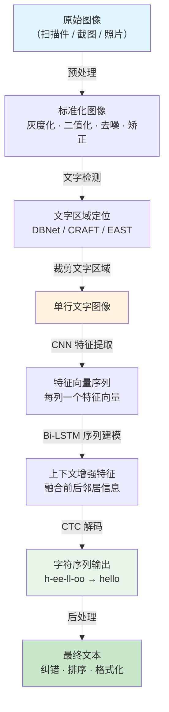
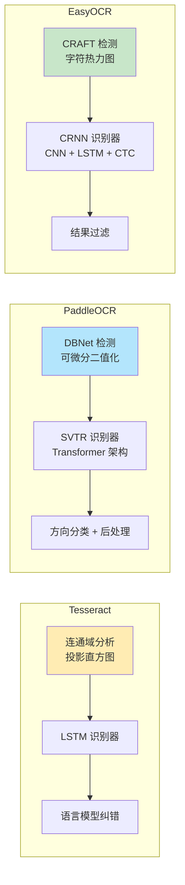

# 传统 OCR（光学字符识别）

## 概念解释

OCR（Optical Character Recognition，光学字符识别）是一种将图像中的文字自动转换为可编辑、可搜索的数字文本的技术。简单理解：它给机器装了一双"读字的眼睛"，让程序能从截图、扫描件、照片里把文字"读"出来。

OCR 出现的根本原因是：现实世界中大量信息以图像形式存在（纸质文档扫描件、手机拍照、屏幕截图），这些信息对计算机来说就是一堆像素点，无法直接搜索、编辑或被下游 AI 系统使用。OCR 就是打通"视觉像素"到"结构化文本"这条通路的关键技术。

这里所说的"传统 OCR"是相对于多模态大模型 OCR（如 GPT-4V、Qwen-VL）而言的。传统 OCR 采用"流水线"架构——把任务拆成检测、识别、后处理等独立阶段，每个阶段用专门的模型处理。这种模块化设计的优点是每个环节可独立优化和替换，缺点是上游错误会逐级传导到下游。

## 关键结构

传统 OCR 的工作流程是一条典型的流水线（Pipeline），由以下阶段串联而成：

| 阶段 | 核心任务 | 输入 / 输出 | 关键技术 |
|------|---------|------------|---------|
| 预处理 | 提升图像质量，为后续阶段做准备 | 原始图像 → 标准化图像 | 灰度化、二值化、去噪、倾斜矫正 |
| 文字检测 | 找到图中所有文字的位置 | 标准化图像 → 文字区域坐标 | DBNet、CRAFT、EAST |
| 文字识别 | 把每个文字区域里的像素转成字符 | 文字区域图像 → 文本字符串 | CRNN + CTC、SVTR |
| 后处理 | 纠错、排版还原 | 原始识别结果 → 最终输出 | 语言模型纠错、排序重组 |

### 阶段 1：预处理

原始图像质量参差不齐——可能是手机拍的歪斜照片、模糊的扫描件、带水印的截图。预处理的目标是把这些"脏数据"清理干净，让后续模型更容易识别。主要操作包括：

- **灰度化**：彩色图像转灰度图，去掉颜色信息，只保留亮度，降低计算量
- **二值化**：灰度图进一步转为纯黑白，让文字和背景形成最大对比度
- **去噪**：消除扫描纹路、污点、水印等干扰
- **倾斜矫正**：自动检测文本行的倾斜角度并旋转回正

预处理看似简单，但对最终精度的影响可达 10%-20%。很多识别不准的问题，根源不在识别模型，而在预处理没做好。

### 阶段 2：文字检测

检测阶段的任务是回答"文字在哪里"——在图像中定位所有包含文字的区域，输出每个区域的边界框坐标。

早期方法（如 Tesseract 的传统模式）使用连通域分析和投影直方图来切分文字行和单词。现代方法则使用深度学习模型：

- **DBNet（Differentiable Binarization）**：PaddleOCR 的默认检测器，通过可微分二值化机制精准定位文字边界，对弯曲文本和不规则排布也能处理
- **CRAFT（Character Region Awareness For Text Detection）**：EasyOCR 使用的检测器，通过预测字符级别的热力图来定位文字区域

检测精度是整条流水线的瓶颈——如果漏检或框错了区域，后面的识别模型再好也无济于事。

### 阶段 3：文字识别

识别阶段回答"写的是什么"——把检测到的每个文字区域图像转换为字符序列。这是整个 OCR 流水线技术含量最高的环节。

主流识别架构是 CRNN + CTC：

- **CNN 部分**：卷积层提取图像的视觉特征（笔画形状、连接方式、空间位置）
- **RNN 部分**：双向 LSTM 建模字符之间的序列依赖（比如看到"qu"后面大概率跟"ick"）
- **CTC 解码**：CTC（Connectionist Temporal Classification）层负责将 RNN 输出的帧级预测对齐到最终的字符序列，解决了"不需要预先知道每个字符在图像中的精确位置"这个核心难题

更新的架构如 SVTR（Spatial Visual Transformer）用 Transformer 替代 LSTM，能捕获更长距离的上下文关系，PaddleOCR v3+ 已将其作为默认识别器。

### 阶段 4：后处理

识别模型的原始输出往往不够完美——可能有重复字符、错误拼写、排列顺序混乱。后处理阶段负责"收尾"：

- **去重与合并**：将重叠检测框的结果合并
- **阅读顺序排列**：按从左到右、从上到下还原人类阅读顺序
- **语言模型纠错**：利用语言统计规律修正识别错误（如把"qwick"纠正为"quick"）
- **格式还原**：恢复段落、表格等文档结构

## 核心原理

### 原理说明

传统 OCR 的核心技术难点集中在识别阶段。以目前最主流的 CRNN + CTC 架构为例，其工作过程如下：

**第一步：特征提取（CNN）**

输入是一张裁剪好的文字区域图像（例如 32 x 200 像素的一行文字）。卷积网络将其编码为一组特征向量序列。具体来说，CNN 在水平方向上把图像切成若干列，每一列生成一个特征向量，描述该位置的视觉信息。假设图像宽度对应 T 个时间步，则输出为 T 个特征向量。

**第二步：序列建模（Bi-LSTM）**

双向 LSTM 在 T 个特征向量上前后各扫一遍，融合每个位置的左侧和右侧上下文信息。这一步的目的是让模型在识别某个位置时，能同时参考前后邻居的特征——比如识别一个模糊的字母时，结合前后字符可以大幅提高准确率。

**第三步：CTC 解码**

CTC 层将 Bi-LSTM 的输出映射到最终的字符序列。CTC 的核心思想是引入一个"空白符号（blank）"，允许模型在不确定字符边界的情况下输出重复字符和空白符号，然后通过去重和去空白操作得到最终文本。例如：

原始输出序列：`h-ee-ll-ll-oo`（其中 `-` 表示 blank）
→ 去 blank：`heelllloo`
→ 去重复：`hello`

这种设计的精妙之处在于：模型不需要预先知道每个字符在图像中占几个像素、从哪里开始到哪里结束，CTC 自动学习字符与图像位置的对齐关系。

### Mermaid 图解



图中从顶部到底部展示了完整的 OCR 流水线。虚线框标注的"CNN → Bi-LSTM → CTC"三段组成了 CRNN 识别模型的内部结构，是整条流水线的技术核心。预处理和后处理虽然看起来简单，但对最终效果的影响不可忽视。

### 三大工具的架构差异

三大主流 OCR 工具在流水线各阶段的技术选型不同：



| 对比维度 | Tesseract | PaddleOCR | EasyOCR |
|---------|-----------|-----------|---------|
| 检测方法 | 传统连通域分析 + 投影 | DBNet（深度学习） | CRAFT（深度学习） |
| 识别方法 | LSTM（v4+ 升级） | SVTR / CRNN（可切换） | CRNN（CNN + LSTM + CTC） |
| 硬件偏好 | CPU 优先 | GPU 推荐（有轻量 CPU 模型） | GPU 推荐 |
| 语言支持 | 116+ 种 | 100+ 种 | 80+ 种 |
| 模型体积 | 中等 | 极轻量（< 10MB 可选） | 较大 |
| 适用场景 | 清晰印刷体文档 | 复杂版面、多语言、生产级部署 | 快速原型、简单集成 |
| 维护方 | Google 赞助 | 百度 PaddlePaddle | 社区驱动 |

### 运行示例

以下伪代码展示 CRNN + CTC 的核心机制，帮助理解识别阶段的数据流向：

```python
# 伪代码：CRNN + CTC 识别流程
# 基于 PyTorch 风格，仅用于说明原理，不可直接运行

import torch
import torch.nn as nn

class CRNN(nn.Module):
    """CRNN 识别模型的核心结构"""

    def __init__(self, num_classes):
        super().__init__()
        # 第一部分：CNN 特征提取
        # 将图像（H=32, W=变长）编码为特征序列
        self.cnn = nn.Sequential(
            nn.Conv2d(1, 64, 3, padding=1),  # 灰度图输入
            nn.ReLU(),
            nn.MaxPool2d(2, 2),               # 尺寸减半
            nn.Conv2d(64, 128, 3, padding=1),
            nn.ReLU(),
            nn.MaxPool2d(2, 2),               # 再减半
            # ...更多卷积层
        )

        # 第二部分：Bi-LSTM 序列建模
        # 在水平方向上建模字符间的依赖关系
        self.rnn = nn.LSTM(
            input_size=128 * 8,   # CNN 输出展平后的维度
            hidden_size=256,
            num_layers=2,
            bidirectional=True,   # 双向 LSTM：同时看左和看右
        )

        # 第三部分：全连接层 → CTC 解码
        # 输出每个时间步的字符概率分布
        self.fc = nn.Linear(256 * 2, num_classes)  # 双向所以 x2

    def forward(self, image):
        # CNN 提取特征：(B, 1, 32, W) → (B, 128, 8, W/4)
        features = self.cnn(image)

        # 将特征图按列切分为序列：(W/4, B, 128*8)
        b, c, h, w = features.size()
        features = features.view(b, c * h, w).permute(2, 0, 1)

        # Bi-LSTM 序列建模：(W/4, B, 512)
        output, _ = self.rnn(features)

        # 全连接层输出字符概率：(W/4, B, num_classes)
        logits = self.fc(output)
        return logits  # 送入 CTC Loss 训练，或 CTC Decoder 推理
```

上述代码对应三个核心组件：`self.cnn` 对应特征提取，`self.rnn` 对应序列建模，`self.fc` + CTC 对应解码输出。训练时使用 `torch.nn.CTCLoss`，推理时使用贪心解码或 beam search 解码。

## 易混概念辨析

| 概念 | 与传统 OCR 的区别 | 更适合关注的重点 |
|------|------------------|-----------------|
| 多模态大模型 OCR | 使用 VLM（如 GPT-4V、Qwen-VL）端到端理解图像，不拆检测/识别阶段 | 语义理解、复杂版面、零样本泛化 |
| 文档智能（Document AI） | OCR 是文档智能的第一步，文档智能还包括版面分析、表格提取、信息抽取等 | 结构化提取、端到端文档处理 |
| 计算机视觉（CV） | OCR 是 CV 的一个子领域，CV 还包括目标检测、图像分类、语义分割等 | 广义图像理解 |
| STR（场景文字识别） | OCR 偏向文档扫描件，STR 专注自然场景中的文字（路牌、店招等），难度更高 | 不规则文字、复杂背景、透视变形 |

核心区别：

- **传统 OCR**：流水线架构，模块化设计，适合规范化文档，可离线运行
- **多模态大模型 OCR**：端到端架构，理解语义而非只识别字符，适合复杂场景但资源消耗大
- **文档智能**：传统 OCR 只负责"读字"，文档智能负责"理解文档"，OCR 是其中的一个环节
- **STR**：传统 OCR 假设文字排列规整，STR 要处理弯曲、变形、遮挡等极端情况

## 适用边界与局限

### 适用场景

1. **大批量文档数字化**：合同扫描、发票识别、病历电子化、档案数字化。文档格式规范、文字清晰，传统 OCR 能达到 95%+ 的准确率，成本远低于人工录入
2. **离线 / 私有化部署**：金融、医疗、政务等对数据安全要求高的场景。三大工具都支持完全离线运行，数据不出本地
3. **边缘设备和移动端**：PaddleOCR 的轻量模型（< 10MB）可以部署在手机、IoT 设备上，适合翻译 App、证件识别等需要端侧推理的应用
4. **多语言文本识别**：PaddleOCR 支持 100+ 种语言，适合跨国企业的全球化文档处理需求

### 不适合的场景

1. **需要语义理解的任务**：比如"从合同中提取甲方名称和签约日期"——传统 OCR 只能把字读出来，不能理解字的含义。这类任务需要 OCR + NLP/LLM 的组合，或直接使用多模态大模型
2. **极端场景文字**：严重透视变形、大面积遮挡、艺术字、复杂手写体——传统 OCR 的流水线架构在这些场景下容易出现检测失败或识别错误的连锁问题

### 局限性

1. **流水线错误传导**：检测阶段的漏检或误检会传导到识别阶段，且无法回溯修正。一个环节出错，后续环节无法补救
2. **复杂版面处理能力有限**：多栏排版、嵌套表格、图文混排等复杂版面仍是难题。虽然 PaddleOCR 的 PP-Structure 系列在改善，但与多模态大模型的版面理解能力仍有差距
3. **首次加载开销大**：深度学习 OCR（PaddleOCR、EasyOCR）首次运行需加载数十到数百 MB 的模型文件，启动时间可达 10-30 秒，不适合冷启动敏感的 Serverless 场景
4. **输出格式不统一**：三大工具的 API 返回格式各不相同（Tesseract 返回纯文本，PaddleOCR 返回坐标 + 文本 + 置信度列表，EasyOCR 返回四角坐标 + 文本），集成多个工具时需要额外的适配层

## 常见误区

| 常见误区 | 正确理解 |
|----------|----------|
| OCR 识别精度能达到 100% | OCR 是概率性的，即使最好的模型在干净文档上也只有 95-99% 的准确率。图像质量、字体、背景都会影响结果，生产环境必须配合置信度过滤和人工审核 |
| Tesseract 已经过时不能用 | Tesseract 5.x 引入了 LSTM 神经网络，在清晰印刷体上依然表现稳定。它的优势是纯 CPU 运行、无需 GPU、部署简单，在预算有限或硬件受限的场景下仍是首选 |
| 选一个 OCR 工具就够了 | 不同工具有不同的优势场景。生产系统中常见的做法是：先用 PaddleOCR 做主力识别，对置信度低的结果用 Tesseract 交叉验证，最后用 EasyOCR 处理特殊语言——多工具组合互补 |
| OCR 输出可以直接作为最终数据 | OCR 结果必须经过验证和清洗，特别是在金融、法律等领域。常见问题包括：数字 0 和字母 O 混淆、中文同形字误识别、标点符号丢失等 |

## 思考题

<details>
<summary>初级：CRNN 模型中 CNN、RNN、CTC 三个组件分别解决什么问题？为什么缺一不可？</summary>

**参考答案：**

CNN 负责从图像中提取视觉特征（笔画形状、空间位置），解决"看到了什么"的问题。RNN（Bi-LSTM）负责建模字符间的序列依赖关系，解决"前后字符如何关联"的问题——比如看到"qu"后推断下一个字符大概率是元音。CTC 负责将连续的帧级预测对齐到离散的字符序列，解决"不知道每个字符在图像中具体占多宽"的对齐难题。去掉 CNN，模型看不到图像内容；去掉 RNN，模型无法利用上下文；去掉 CTC，模型无法处理变长序列的对齐。

</details>

<details>
<summary>中级：一个图像中同时包含中文、英文和数字，三大 OCR 工具分别需要怎样配置才能正确识别？</summary>

**参考答案：**

Tesseract 通过 `lang` 参数指定语言包组合，如 `lang='chi_sim+eng'`（简体中文 + 英文），数字包含在英文语言包中。PaddleOCR 设置 `lang='ch'`（中文模式默认同时支持英文和数字），也可用 `['ch', 'en']` 多语言组合。EasyOCR 在初始化 Reader 时传入语言列表 `['ch_sim', 'en']`。三个工具中，PaddleOCR 的中文识别精度最高（因为百度在中文语料上的训练投入最大），Tesseract 的中文支持相对较弱（需要额外下载中文语言包），EasyOCR 介于两者之间。

</details>

<details>
<summary>中级/进阶：如果你要为一家律师事务所搭建合同数字化系统（要求准确率 98%+），你会如何设计 OCR 流水线？选择哪些工具？在哪些环节做容错？</summary>

**参考答案：**

推荐流水线设计：(1) 预处理阶段用 OpenCV 做灰度化、自适应二值化、倾斜矫正，确保扫描件质量统一；(2) 主识别用 PaddleOCR（PP-OCRv5），因为其在复杂中文文档上的准确率最高；(3) 对置信度低于 0.9 的文字区域，用 Tesseract 5.x 做交叉验证，两者结果一致则采用，不一致则标记为"需人工审核"；(4) 后处理阶段用语言模型（如规则引擎或 LLM）做合同专业术语纠错；(5) 关键字段（当事人名称、金额、日期）通过正则表达式提取后，再做一轮格式校验。容错重点在两个环节：识别阶段的双引擎交叉验证，以及关键字段的规则校验。这种设计在清晰扫描件上通常能达到 98%+ 的准确率。

</details>

## 参考资料

1. Tesseract OCR 官方仓库：https://github.com/tesseract-ocr/tesseract
2. PaddleOCR 官方仓库：https://github.com/PaddlePaddle/PaddleOCR
3. EasyOCR 官方仓库：https://github.com/JaidedAI/EasyOCR
4. Shi B, Bai X, Yao C. "An End-to-End Trainable Neural Network for Image-based Sequence Recognition and Its Application to Scene Text Recognition."（CRNN 原始论文）：https://arxiv.org/abs/1507.05717
5. Liao M, et al. "Real-time Scene Text Detection with Differentiable Binarization."（DBNet 论文）：https://arxiv.org/abs/1911.08947
6. IntuitionLabs. "Technical Analysis of Modern Non-LLM OCR Engines"：https://intuitionlabs.ai/articles/non-llm-ocr-technologies

---

<!--
=============================================================================
  内容准确性自查清单（发布前逐项检查）
=============================================================================

## 事实准确性
- [x] 概念定义准确，没有复制官方原文
- [x] 核心原理描述正确，没有把相关概念混为一谈
- [x] 核心概念提取合理，没有遗漏关键组成部分
- [x] 适用边界与局限的描述客观准确

## 图表准确性
- [x] Mermaid 图与文字描述一致
- [x] 图中的节点、关系、方向没有逻辑错误
- [x] 图真正帮助理解，而不是装饰性图表

## 代码准确性（如有代码）
- [x] 最小示例确实有助于解释概念
- [x] 代码片段包含必要 import
- [x] 代码逻辑与讲解一致
- [x] 如依赖外部库，版本号和写法与当前文档一致

## 辨析与误区
- [x] 易混概念的边界讲清楚了
- [x] 常见误区确实是高频误解，不是凑数
- [x] "正确理解"部分表达准确、不绝对化

## 引用准确性
- [x] 所有参考资料真实存在且可访问
- [x] 未编造论文、作者、年份或链接
- [x] 参考资料与正文内容真实相关

## 内容完整性
- [x] YAML 头部所有必填字段已填写
- [x] 各章节内容完整，无占位符残留
- [x] 已包含 Mermaid 图
- [x] 卡片整体风格仍然是知识卡片，而不是工具教程
=============================================================================
-->
