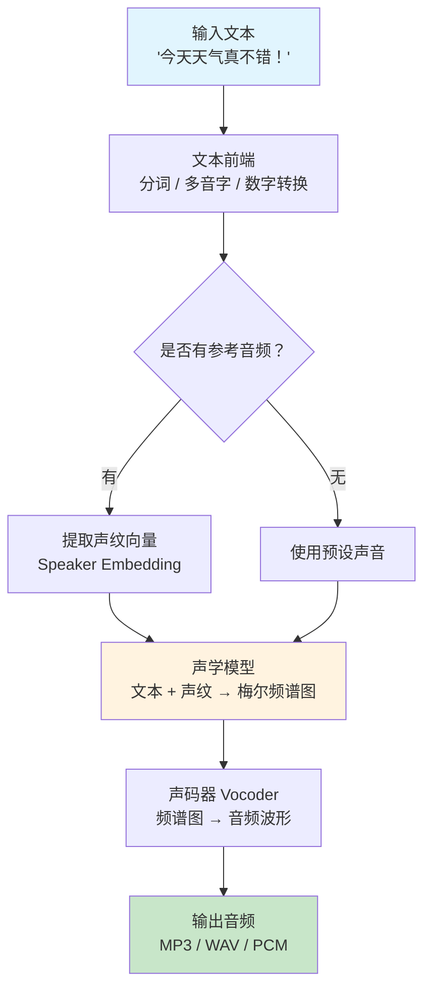

# 文本转语音（Text-to-Speech, TTS）

## 概念解释

文本转语音（Text-to-Speech，TTS）是一种将文字自动转换成人类语音的技术。可以把它理解为"给 AI 装嘴巴"——你喂进去一段文字，它吐出来一段听起来像真人在说话的音频。

TTS 之所以重要，是因为人类获取信息最自然的方式之一就是"听"。智能客服需要开口说话、导航软件需要语音播报、视障用户需要屏幕朗读——这些场景都离不开 TTS。传统的做法是请真人录音，但成本高、速度慢、改不了。TTS 把这件事变成了"给一段文字，秒出音频"。

早期的 TTS 听起来像机器人念课文，而现在最新的神经网络 TTS（如 OpenAI TTS、ElevenLabs、Fish Audio S2）已经能生成接近真人的自然语音。更厉害的是，只需要几秒钟的参考音频，就能克隆出一个人的声音来念任何文字。

## 关键结构

TTS 系统的核心是一条从文字到声音的处理链路，分为三个关键阶段。

| 阶段 | 作用 | 关键点 |
|------|------|--------|
| 文本前端 | 把文字变成模型能理解的表示 | 处理数字、缩写、多音字等 |
| 声学模型 | 把文本表示变成频谱（声音的"蓝图"） | 决定语音的韵律、语调、情感 |
| 声码器（Vocoder） | 把频谱变成真正的音频波形 | 决定最终音质 |

### 阶段 1：文本前端

文本前端做的事情就是"把文字清理干净"。比如看到 "2026" 要知道该念成"二零二六"还是"two thousand twenty-six"，看到 "Dr." 要知道该念成"doctor"，看到 "!" 要知道语气应该加强。中文还有个特殊问题——多音字，比如"行"在"银行"和"行走"里发音不同，前端要根据上下文判断正确读音。

### 阶段 2：声学模型

声学模型是整个 TTS 的大脑。它接收文本前端处理后的结果，输出一张叫做"梅尔频谱图"（Mel-spectrogram）的二维图像——可以理解为声音的"设计图纸"。这张图纸记录了"在什么时间点、什么频率上、发出多大的声音"。现代声学模型（如 Transformer 架构）能让生成的语音带有自然的停顿、重音和情感变化。

### 阶段 3：声码器（Vocoder）

声码器把声学模型产出的频谱图"渲染"成真正能播放的音频波形。这一步直接决定音质。目前业界标准是 HiFi-GAN，它用生成对抗网络（GAN）来合成波形，速度快、音质高。如果声码器不好，即使前面的频谱图画得再准确，出来的声音也会有杂音或失真。

## 核心原理

### 原理说明

现代 TTS 的核心思路是"文字 → 频谱图 → 音频波形"的两阶段生成。

**为什么不直接从文字生成音频波形？** 因为音频波形的数据量太大了——1 秒的音频在采样率 16kHz 下就有 16000 个数据点。直接从文字映射到这么长的序列，模型学起来非常困难。频谱图相当于一个"压缩表示"，把音频的核心特征浓缩到了更小的空间里，模型更容易学好。

在语音克隆场景下，系统会从一段参考音频中提取说话者的"声纹向量"（Speaker Embedding），然后在声学模型生成频谱图时把这个向量注入进去，让输出带上目标说话者的音色特征。目前主流方案只需 3-10 秒的参考音频就能完成克隆。

最新的趋势是用大语言模型（LLM）来做 TTS。比如 Fish Audio S2 采用双自回归（Dual-AR）架构，参数量达到 4B，能理解上下文语义并自动调整韵律和情感，而不再需要人工标注情感标签。

### Mermaid 图解



图中的关键分支在于"是否有参考音频"：如果有，就走语音克隆路线（提取声纹后注入声学模型）；如果没有，就使用系统预设的声音。声学模型是整个流程的核心，它决定了语音的韵律、语调和情感表达。

### 运行示例

```python
# 基于 openai==1.50.0 验证（截至 2026-03）
# 展示 TTS 的最小调用流程：文本输入 → 音频文件输出

from openai import OpenAI
import os

client = OpenAI(api_key=os.getenv("OPENAI_API_KEY"))

# 核心就这一步：指定模型、声音、文本，得到音频
response = client.audio.speech.create(
    model="tts-1",        # tts-1 低延迟，tts-1-hd 高音质
    voice="nova",         # 可选：alloy, echo, fable, onyx, nova, shimmer
    input="你好，我是一个语音合成系统。"
)

response.stream_to_file("output.mp3")
# 生成的 output.mp3 即为合成语音
```

上面 3 行核心代码对应了 TTS 的完整链路：`model` 参数选择声学模型，`voice` 参数选择预设声纹，`input` 是文本前端的输入。声码器的工作由 API 内部完成，对调用者透明。

## 易混概念辨析

| 概念 | 与 TTS 的区别 | 更适合关注的重点 |
|------|--------------|-----------------|
| STT / ASR（语音识别） | 方向相反：STT 是"听"，把语音转成文字；TTS 是"说"，把文字转成语音 | 语音识别的准确率、噪声鲁棒性 |
| 语音克隆（Voice Cloning） | 语音克隆是 TTS 的一个子能力，不是独立技术。它解决的是"用谁的声音说"，TTS 解决的是"怎么说" | 克隆所需的参考音频时长、音色还原度 |
| 语音转换（Voice Conversion） | 语音转换是把一段已有语音的音色换成另一个人的，输入是语音；TTS 的输入是文字 | 实时变声、跨语言语音转换 |

核心区别：

- **TTS**：输入是文字，输出是语音，核心关注点是"自然度"和"可控性"
- **STT/ASR**：TTS 的逆过程，输入语音输出文字，两者经常成对出现在语音对话系统中
- **语音克隆**：TTS 的一个功能模块，单独讨论时关注的是"音色还原"而非"文本理解"

## 适用边界与局限

### 适用场景

1. **智能客服与语音助手**：用户拨打电话或与聊天机器人对话时，TTS 把系统回复实时转成语音。流式 TTS 延迟可低至 100ms，用户感知不到等待
2. **内容创作与媒体生产**：播客、有声书、视频配音、新闻播报——修改文本就能重新生成音频，成本比请真人配音低一个数量级
3. **无障碍辅助**：屏幕阅读器、文档朗读、导航播报，让视障用户和特定场景（如驾驶中）的用户能"听"到文字内容
4. **游戏与互动娱乐**：为游戏 NPC 动态生成台词，每个角色可以有独特的嗓音和说话风格，支持多语言实时本地化
5. **语言学习**：提供标准发音示范，支持多种口音和方言对比

### 不适合的场景

1. **需要极致情感表达的专业配音**：电影级别的情感演绎（如哭泣、大笑中的台词）仍然超出当前 TTS 的能力范围，这类场景仍需真人演员
2. **需要精确音乐旋律的场景**：TTS 生成的是语音而非歌声，虽然部分模型支持简单哼唱，但专业歌曲合成需要专用的歌声合成（SVS）技术

### 局限性

1. **长文本韵律衰退**：生成超过几百字的长段落时，韵律和停顿的自然度会下降，容易出现"念经感"。实际应用中通常需要分段合成再拼接
2. **多音字和专有名词处理不完美**：中文的多音字（如"重量"vs"重新"）、罕见人名地名有时会念错，需要额外的发音词典来兜底
3. **语音克隆的伦理风险**：3 秒音频就能克隆声音的技术也可能被用于电信诈骗、虚假信息传播，使用时需要严格的身份验证和合规措施

## 常见误区

| 常见误区 | 正确理解 |
|----------|----------|
| TTS 生成的语音都听起来像机器人 | 2025-2026 年的神经 TTS 在盲测中已经很难与真人区分。ElevenLabs 的发音准确率达到 82%，幻觉率仅 5%。"机器感"已经是上一代技术的问题 |
| 语音克隆需要目标说话者的大量录音数据 | 零样本（Zero-shot）克隆技术只需 3-10 秒的参考音频。Fish Audio S2 用 10-30 秒参考音频就能捕捉音色、说话风格和情感倾向 |
| 高质量 TTS 只能在云端运行 | 开源轻量模型 Kokoro-82M 仅 82M 参数，支持多语言，每百万字符成本约 $0.70，完全可以在消费级 GPU 甚至 CPU 上本地运行 |
| 多语言 TTS 需要为每种语言单独部署一个模型 | Fish Audio S2 单模型支持 80+ 语言，Qwen3-TTS 支持 32 语言。多语言已经是单模型的内置能力，不需要分开部署 |

## 主流 TTS 方案速览（截至 2026-03）

为帮助读者快速了解当前 TTS 生态，以下整理主流方案的关键指标。

| 方案 | 类型 | 音质排名 | 延迟 | 价格（每百万字符） | 亮点 |
|------|------|---------|------|-------------------|------|
| ElevenLabs | 商业 API | 顶级 | TTFA 150ms | ~$200+ | 发音准确率 82%，情感表达最佳 |
| OpenAI TTS | 商业 API | 优秀 | TTFA 200ms | $15 | 支持 prompt 控制语气风格，生态集成方便 |
| Fish Audio S2 | 开源 + API | 顶级 | TTFA ~100ms | $9.99/200min | 80+ 语言，4B 参数，Dual-AR 架构，TTS-Arena 曾排名第一 |
| Inworld TTS-1 Max | 商业 API | 排行榜第一 | P90 < 200ms | $10 | Artificial Analysis 排行榜 ELO 1161 |
| Kokoro-82M | 开源 | 良好 | 极低 | ~$0.70 | 仅 82M 参数，可在 CPU 上运行 |
| Google Cloud TTS | 商业 API | 优秀 | 中等 | $4-$30 | 50+ 语言，300+ 声音 |
| Cartesia Sonic | 商业 API | 良好 | 最快 | ~$50 | 专为实时语音 Agent 优化 |
| Chatterbox（Resemble AI） | 开源 | 优秀 | 中等 | 免费 | MIT 许可，盲测中 63.8% 听众优于 ElevenLabs |

**选型建议**：追求最佳音质选 ElevenLabs；已在 OpenAI 生态中选 OpenAI TTS；需要开源自部署选 Fish Audio S2 或 Chatterbox；预算极低选 Kokoro-82M；做实时语音 Agent 选 Cartesia Sonic。

## 思考题

<details>
<summary>初级：TTS 系统为什么要先生成梅尔频谱图，再转成音频波形，而不是直接从文字生成波形？</summary>

**参考答案：**

因为音频波形的数据密度太高（16kHz 采样率下，1 秒就有 16000 个采样点），直接从文字映射到如此长的序列，模型的学习难度极大。梅尔频谱图是一种"压缩表示"，把音频信息浓缩到更低维度的空间（通常是 80 个频带 x 每秒约 86 帧），让声学模型更容易学习文字和声音之间的对应关系。然后再由专门的声码器把频谱图"展开"成完整波形——这种分工让两个阶段各自专注一件事，整体效果优于端到端直出。

</details>

<details>
<summary>中级：一个在线教育平台需要为课程内容生成多语言配音，应该选云端 TTS API 还是本地部署开源模型？需要考虑哪些因素？</summary>

**参考答案：**

需要综合考虑五个因素：(1) 成本——如果内容量大且更新频繁，云端 API 按量计费会持续累积，本地部署有一次性 GPU 成本但边际成本低；(2) 音质——云端商业 API（ElevenLabs、OpenAI TTS）音质略占优势，但开源方案（Fish Audio S2、Chatterbox）差距已很小；(3) 延迟——教育配音是离线生成，对延迟不敏感，本地部署即可满足；(4) 多语言——需确认所选方案覆盖目标语言，Fish Audio S2 支持 80+ 语言是优势；(5) 运维复杂度——云端 API 零运维，本地部署需要 GPU 服务器和模型更新维护。对于课程配音这种离线、大批量、多语言的场景，推荐本地部署开源模型（如 Fish Audio S2），辅以少量 API 调用处理特殊需求。

</details>

<details>
<summary>中级/进阶：某公司要构建一个实时语音 Agent（用户说话 → Agent 理解 → Agent 回话），TTS 环节的延迟预算只有 200ms，应该如何选型和优化？</summary>

**参考答案：**

200ms 延迟预算非常紧。选型方面：(1) 优先考虑流式 TTS 方案——不等整句生成完就开始播放首帧音频，Cartesia Sonic 和 ElevenLabs Flash 的 TTFB（Time-to-First-Byte）都能控制在 100ms 以内；(2) 部署层面，TTS 服务应与 LLM 部署在同一区域甚至同一机器上，减少网络往返延迟；(3) 架构层面，LLM 生成第一个完整语句后就可以开始 TTS，不必等 LLM 生成完所有内容（"边想边说"策略）；(4) 模型选择上，如果自部署，Kokoro-82M 参数量小、推理快，适合对延迟极敏感的场景，但音质不如大模型；如果用 API，Inworld TTS-1 Max 在 P90 延迟低于 200ms 的同时音质排名第一。关键是要做端到端的延迟测试（STT + LLM + TTS 全链路），而不是只看 TTS 单环节。

</details>

## 参考资料

1. OpenAI. "Text-to-Speech API." https://developers.openai.com/docs/guides/text-to-speech
2. Fish Audio. "Fish Speech - GitHub Repository." https://github.com/fishaudio/fish-speech
3. Speechmatics. "Best TTS APIs in 2026: ElevenLabs, Google, AWS & 9 More Compared." https://www.speechmatics.com/company/articles-and-news/best-tts-apis-in-2025-top-12-text-to-speech-services-for-developers
4. Artificial Analysis. "Best Text to Speech (TTS) Models - Independent Comparison." https://artificialanalysis.ai/text-to-speech/models
5. BentoML. "The Best Open-Source Text-to-Speech Models in 2026." https://www.bentoml.com/blog/exploring-the-world-of-open-source-text-to-speech-models
