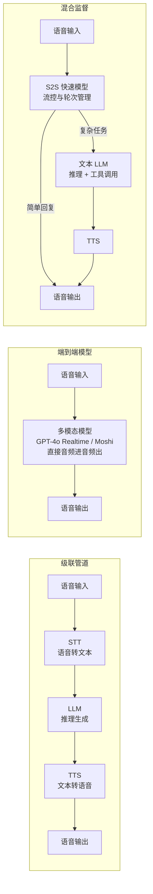
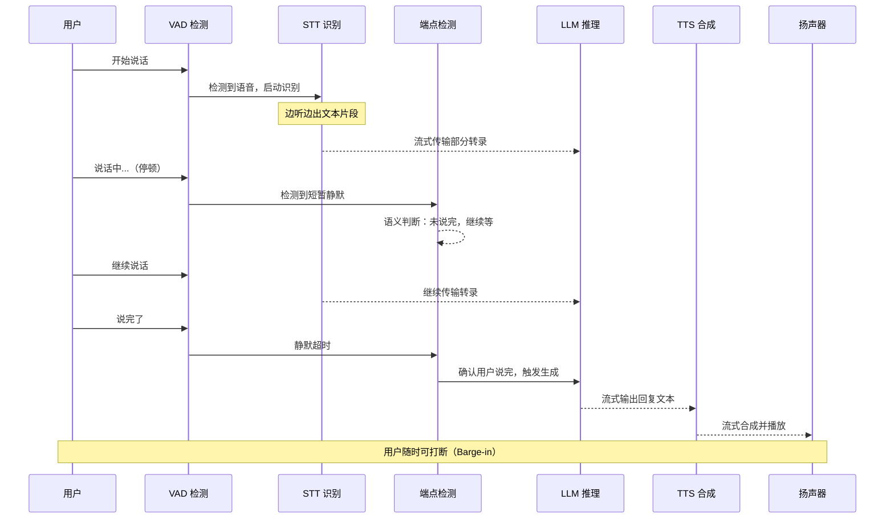

# 语音对话 Agent（Voice Conversation Agent）

## 概念解释

语音对话 Agent 是一类能通过语音通道与人进行实时自然对话的 AI 智能体。它接收用户的语音输入，理解说话内容和意图，调用工具或知识库完成任务，最终用语音回复用户。整个过程模拟人与人的电话对话——可以随时打断、追问、澄清，而不是传统语音助手那种"说完等三秒再回你"的割裂体验。

语音对话 Agent 出现的核心动机是延迟和自然度。传统语音交互系统（早期 Siri、Google Assistant）采用严格的"用户说完 -> 系统处理 -> 播放回复"三段式流程，中间有明显的等待间隔，而且无法处理打断、犹豫、语气变化等真实对话中的常见现象。语音对话 Agent 通过流式处理管道（Streaming Pipeline）和端点检测（Endpointing）等技术，将响应延迟压缩到 500ms-1s 区间，逼近人类对话的自然节奏（300-500ms）。

在 Agent 系统中，语音对话 Agent 的定位是"语音前端 + Agent 大脑"的融合体。它不只是一个语音识别工具，而是一个完整的智能体——具备对话记忆、工具调用、上下文推理等 Agent 核心能力，只是交互通道从文本换成了语音。2025 年以来，随着 OpenAI Realtime API、Google Gemini Live、Moshi 等原生音频模型（Native Audio Model）的成熟，语音对话 Agent 正从"管道拼接"走向"端到端原生"的新架构阶段。

## 关键结构

语音对话 Agent 的技术栈由四层核心组件构成，业内称之为"语音 AI 四柱"：

| 组件 | 角色比喻 | 作用 | 代表技术 |
|------|---------|------|---------|
| STT（Speech-to-Text） | 耳朵 | 将语音流实时转为文本 | Deepgram Nova-3、Whisper、AssemblyAI |
| LLM（大语言模型） | 大脑 | 理解意图、推理、生成回复 | GPT-4o、Claude、Gemini 2.5 |
| TTS（Text-to-Speech） | 嘴巴 | 将文本回复转为自然语音 | ElevenLabs、Cartesia Sonic、OpenAI TTS |
| Orchestrator（编排层） | 指挥 | 管理各组件间的实时数据流、中断处理、轮次检测 | LiveKit Agents、Pipecat、Vapi |

除四柱之外，还有两个关键辅助机制：

### VAD（Voice Activity Detection，语音活动检测）

VAD 是整个系统的"触发器"。它持续监听音频流，判断当前是否有人在说话。没有 VAD，系统不知道什么时候该开始识别、什么时候用户说完了。

现代 VAD 主要使用轻量深度学习模型（如 Silero VAD，仅 2.2MB），可在各种噪声环境下工作。VAD 的核心设计权衡是：检测太灵敏（误报高）会把背景噪音当成说话，检测太迟钝（漏检高）会吃掉用户开头几个字。

### Turn-Taking（轮次检测 / 端点检测）

Turn-Taking 解决"用户到底说完没有"这个问题——是所有语音 Agent 中被低估但影响最大的模块。一个典型场景："我想订从北京到......嗯......上海的机票"，用户中间停顿了但并没说完。如果系统在"嗯"后面就抢答，用户体验会很糟糕。

当前三种主流方案：

| 方案 | 原理 | 延迟 | 准确度 |
|------|------|------|--------|
| VAD 静默超时 | 连续 N ms 无语音则判定说完 | 高（通常 >= 600ms） | 低，容易误判停顿 |
| STT Endpointing | 基于转录流的标点和语义信号判断 | 中 | 中，多数生产系统的默认选择 |
| 语义端点检测 | 用分类模型判断当前文本是否语义完整 | 低（可在静默前触发） | 高，但需额外模型推理 |

行业共识：**改进端点检测带来的用户体验提升，远大于单纯压缩各组件几十毫秒的延迟。**

## 核心原理

### 原理说明

语音对话 Agent 当前存在三种主流架构，从传统到前沿依次为：

**架构一：级联管道（Cascading Pipeline）——STT -> LLM -> TTS**

最经典的架构，也是 2025 年大多数生产系统采用的方案。语音先经 STT 转为文本，文本交给 LLM 处理并生成回复，回复再经 TTS 转为语音。优势是每个环节可独立调试、有完整文本记录，劣势是延迟累积（典型值 2-4 秒）。

**架构二：端到端语音模型（Speech-to-Speech / Native Audio）**

一个多模态模型同时接收原始音频并直接输出音频，省去了 STT 和 TTS 的中间环节。代表产品是 OpenAI Realtime API（gpt-realtime）、Google Gemini 2.5 Flash Live、开源的 Moshi（Kyutai）。延迟可低至 200-500ms，且能保留语气、情绪等非语言信息。劣势是调试困难（没有中间文本可查）、模型选择受限。

**架构三：混合监督架构（Hybrid Supervisor）**

用快速的 Speech-to-Speech 模型处理对话流控（轮次管理、打断响应），将复杂的推理和工具调用任务委托给强大的文本 LLM。OpenAI 在其示例应用中展示了这种"Chat-Supervisor"模式。该架构兼顾了低延迟和高推理质量。

三种架构的关键差异：

| 维度 | 级联管道 | 端到端语音模型 | 混合监督架构 |
|------|---------|--------------|-------------|
| 典型延迟 | 2-4 秒 | 200-500ms | 500ms-1s |
| 可调试性 | 高（有文本中间态） | 低 | 中 |
| 情感保留 | 差（文本丢失语气） | 好（原生音频） | 中 |
| 工具调用 | 成熟 | 逐步成熟 | 好 |
| 部署成本 | 低 | 高 | 中 |

无论哪种架构，流式处理（Streaming）都是必需的。流式管道中各组件并行执行——STT 边听边出文本片段，LLM 收到前几个词就开始生成，TTS 在 LLM 还没说完时就开始合成。这种流水线并行是将延迟压到亚秒级的核心手段。

### Mermaid 图解

#### 图一：三种架构对比



级联管道是"接力赛"，每一棒跑完下一棒才开始；端到端模型是"一人全能赛"，一个模型直接从听到说；混合监督是"快手+智囊"搭配，日常对话由快速模型处理，遇到难题转给强模型。

#### 图二：流式处理管道的时间线



关键流转在于端点检测（EP）节点：它是整个管道的"发令枪"。端点检测越早越准确地判断用户说完了，后续所有环节就越早启动，总延迟就越低。

### 运行示例

以下用伪代码展示级联管道架构中流式处理的核心机制，重点体现 VAD -> STT -> LLM -> TTS 的流式协作：

```python
# 语音对话 Agent 流式管道核心逻辑（伪代码）
# 展示各组件如何通过流式传输实现并行处理

import asyncio
from dataclasses import dataclass

@dataclass
class AudioFrame:
    """一帧音频数据，通常 20-30ms"""
    data: bytes
    sample_rate: int = 16000

async def voice_agent_loop(mic_stream, speaker):
    """
    语音对话 Agent 主循环
    核心机制：各组件通过异步流式传输并行工作，而非串行等待
    """
    vad = SileroVAD(threshold=0.5)
    stt = StreamingSTT(model="deepgram-nova-3")
    llm = LLM(model="gpt-4o")
    tts = StreamingTTS(model="elevenlabs-flash")

    while True:
        # 阶段 1：VAD 持续监听，等待用户开始说话
        speech_frames = []
        async for frame in mic_stream:
            if vad.is_speech(frame):
                speech_frames.append(frame)
                # 语音开始，立即启动 STT 流式识别
                stt.start_stream()
                break

        # 阶段 2：边听边识别，同时运行端点检测
        async for frame in mic_stream:
            if vad.is_speech(frame):
                speech_frames.append(frame)
                # 实时喂入 STT，不等说完
                partial_text = stt.feed(frame)
            else:
                # 静默帧，检查是否说完
                if endpointing.is_turn_complete(partial_text, silence_ms=vad.silence_duration):
                    break  # 确认说完，触发后续流程

        final_text = stt.finalize()

        # 阶段 3：LLM 流式生成 + TTS 流式合成（并行）
        # LLM 每产出一个文本片段，TTS 立即开始合成该片段的音频
        async for text_chunk in llm.stream_generate(final_text):
            audio_chunk = await tts.synthesize_chunk(text_chunk)
            speaker.play(audio_chunk)

            # 关键：播放过程中检测用户是否打断（Barge-in）
            if vad.is_speech(mic_stream.latest_frame):
                speaker.stop()       # 立即停止播放
                tts.cancel()         # 取消剩余合成
                llm.cancel()         # 取消剩余生成
                break                # 回到监听状态
```

上述伪代码对应三个核心机制：（1）VAD 触发 STT 启动，不等用户说完就开始识别；（2）端点检测决定何时从"听"切换到"想+说"；（3）LLM 和 TTS 通过流式管道并行工作，且支持 Barge-in（用户打断时立即停止输出）。实际生产中，LiveKit Agents 和 Pipecat 等框架已封装了这些流式协调逻辑。

## 易混概念辨析

| 概念 | 与语音对话 Agent 的区别 | 更适合关注的重点 |
|------|----------------------|----------------|
| 语音助手（Voice Assistant） | 传统语音助手（Siri、Alexa）以命令式交互为主，识别固定指令并执行，不具备多轮推理和工具调用能力 | 唤醒词识别、指令槽位填充 |
| 语音识别 / ASR | ASR 只是语音对话 Agent 的一个子组件，负责"听"，不负责"想"和"说" | 识别准确率、方言支持、流式解码 |
| 对话式 AI（Conversational AI） | 更宽泛的概念，涵盖文本和语音两种通道；语音对话 Agent 特指语音通道且具备 Agent 能力 | 对话管理、多轮状态维护 |
| 语音合成 / TTS | TTS 只负责"说"，是语音对话 Agent 的输出环节 | 音色克隆、情感韵律、延迟优化 |

核心区别：

- **语音对话 Agent**：强调"端到端的实时交互闭环"——听、想、做、说一体化，且具备 Agent 的推理和工具调用能力
- **语音助手**：偏向指令式交互，缺乏多轮推理深度
- **ASR / TTS**：是语音对话 Agent 的子组件，单独不构成完整系统

## 适用边界与局限

### 适用场景

1. **呼叫中心与电话客服**：7x24 不间断处理大量来电，识别意图、查询系统、路由工单。每通电话成本比人工低 80-90%，高峰期可同时处理上万通电话
2. **远程医疗与健康咨询**：实时转录医患对话、提取症状关键词、查询病历，辅助医生诊断。语音比文字更适合老年患者和视觉障碍人群
3. **语言学习与教育**：实时评估学生发音、纠正语法、模拟真实对话场景。语音通道是口语练习的天然载体
4. **销售与营销外呼**：自动拨打电话确认订单、推荐产品、处理异议，支持情感感知和动态调整话术

### 不适合的场景

1. **高噪音工业环境**：工厂车间、建筑工地等场景下，ASR 准确率大幅下降，VAD 误报率高。目前的音频增强技术难以完全补偿极端噪声
2. **需要精确数字输入的场景**：如输入银行卡号、验证码等，语音识别的错误率远高于键盘输入，且纠错成本高

### 局限性

1. **延迟仍是硬约束**：级联管道典型延迟 2-4 秒，端到端模型 200-500ms，但网络抖动、模型推理波动都可能突破预期。人类对话的自然响应窗口是 300-500ms，目前仅端到端模型能接近
2. **隐私与合规门槛高**：语音数据通常需上传云端处理，涉及个人信息的场景（医疗、金融）需满足 HIPAA、GDPR 等合规要求，增加架构复杂度
3. **错误恢复机制不成熟**：ASR 把"北京"识别成"被京"时，文字聊天中用户可以直接看到并修正，语音场景下系统需要主动复述确认，打断对话流
4. **上下文管理难度高于文本**：语音"一瞬而过"，用户常用指代词（"那个""刚才说的"），上下文维护的容错要求远高于文本聊天

## 常见误区

| 常见误区 | 正确理解 |
|----------|----------|
| 只要各组件（STT、LLM、TTS）够快，整体就够快 | 端点检测（判断用户说完没有）的等待时间往往占总延迟的最大比例。行业经验表明，优化端点检测的收益远大于压缩单个组件的延迟 |
| 端到端语音模型（Speech-to-Speech）可以完全替代级联管道 | 端到端模型延迟更低、情感保留更好，但缺乏中间文本记录（无法调试和审计）、工具调用能力仍在追赶中。2025 年大多数生产系统仍使用级联管道 |
| VAD 用了深度学习模型就能完美检测 | VAD 本质是概率判断。在高噪声、多人说话、远场拾音等场景下，任何模型都有漏检和误报。关键在于根据业务场景调优阈值，并搭配端点检测做二次确认 |
| 语音 Agent 就是给文本 Agent 加上 ASR 和 TTS | 语音通道引入了全新的挑战：实时性要求（300-500ms 响应窗口）、打断处理（Barge-in）、轮次管理（Turn-Taking）、音频质量处理（降噪、回声消除）。这些是文本 Agent 完全不涉及的工程问题 |

## 思考题

<details>
<summary>初级：语音对话 Agent 的三种架构分别是什么？各自的核心优劣势是什么？</summary>

**参考答案：**

三种架构为级联管道（STT->LLM->TTS）、端到端语音模型（Speech-to-Speech）、混合监督架构。

- 级联管道：可调试性强、技术选型灵活，但延迟高（2-4 秒）、丢失语气信息
- 端到端模型：延迟低（200-500ms）、保留情感，但调试困难、模型选择少
- 混合监督：平衡低延迟和推理质量，用快速模型做流控、强模型做推理，但架构复杂度最高

</details>

<details>
<summary>中级：为什么行业认为"优化端点检测比优化各组件延迟更重要"？请结合实际场景分析。</summary>

**参考答案：**

端点检测是整个管道的"发令枪"——它决定了系统何时从"听"切换到"想+说"。如果端点检测延迟 600ms（等待用户是否继续说），这 600ms 直接加到最终响应时间上，且无法被其他组件的优化抵消。

实际场景：用户说"我想订从北京到...嗯...上海的机票"。VAD 静默超时方案会在"到..."后面的停顿触发响应，导致系统错误抢答。语义端点检测能识别"到"后面缺少目的地，继续等待。这种判断的准确度直接影响用户对"这个 Agent 是否聪明"的感知，比 STT 快 50ms 或 TTS 快 30ms 的影响大得多。

</details>

<details>
<summary>中级/进阶：假设你要为一个三甲医院的远程问诊系统设计语音对话 Agent，你会选择哪种架构？需要特别解决哪些问题？</summary>

**参考答案：**

推荐选择级联管道架构，核心原因：

1. **合规需求**：医疗场景要求完整的对话文本记录，级联管道有天然的中间文本产物（STT 转录），可直接归档为电子病历
2. **准确性优先于速度**：医疗场景不像客服那样追求极致低延迟，1-2 秒的响应延迟可接受，但"把阿莫西林听成阿莫西宁"不可接受。级联管道中可以对 STT 结果做医学术语修正
3. **工具调用刚需**：需要查询病历系统、检查结果、药物相互作用数据库等，级联管道的 LLM 工具调用链最成熟

特别需要解决的问题：语音数据隐私保护（HIPAA 合规，本地化部署 STT）、医学术语识别准确率（领域微调 ASR）、关键信息复述确认（"您说的是阿莫西林 500mg，每日三次，对吗？"）。

</details>

## 参考资料

1. AssemblyAI (2026). "The Voice AI Stack for Building Agents." https://www.assemblyai.com/blog/the-voice-ai-stack-for-building-agents
2. LiveKit (2025). "Voice Agent Architecture: STT, LLM, and TTS Pipelines Explained." https://livekit.com/blog/voice-agent-architecture-stt-llm-tts-pipelines-explained
3. LiveKit (2025). "Turn Detection for Voice Agents: VAD, Endpointing, and Model-Based Detection." https://livekit.com/blog/turn-detection-voice-agents-vad-endpointing-model-based-detection
4. Softcery (2025). "Real-Time (Speech-to-Speech) vs Turn-Based (Cascading STT/TTS) Voice Agent Architecture." https://softcery.com/lab/ai-voice-agents-real-time-vs-turn-based-tts-stt-architecture
5. Kyutai Labs. "Moshi: a speech-text foundation model for real-time dialogue." https://arxiv.org/abs/2410.00037
6. OpenAI Developers (2025). "Updates for Developers Building with Voice." https://developers.openai.com/blog/updates-audio-models
7. AssemblyAI (2025). "How Intelligent Turn Detection (Endpointing) Solves the Biggest Challenge in Voice Agent Development." https://www.assemblyai.com/blog/turn-detection-endpointing-voice-agent
