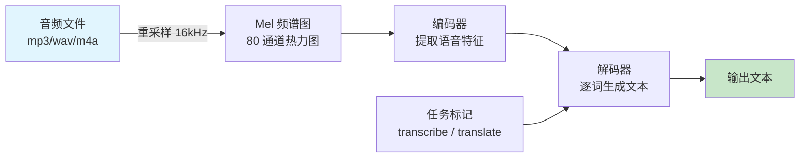

# Whisper（OpenAI 语音识别模型）

## 基础概念

Whisper 是 OpenAI 于 2022 年开源的**自动语音识别（ASR, Automatic Speech Recognition）**模型。用一句话概括：给它一段音频，它还你一段文字。支持 99 种语言，能自动判断你说的是什么语言，还能把任意语言的语音翻译成英文文本。

与调用云端 API 不同，Whisper 可以完全在本地运行——音频不出你的电脑，隐私有保障。它基于 68 万小时的多语言音频数据训练，开箱即用，不需要针对特定场景做微调就能达到不错的准确率。

### 核心要素

| 要素 | 作用 |
|------|------|
| **模型规模（Model Size）** | 提供 tiny 到 large 共 5 档，小模型快但准确率低，大模型慢但准确率高 |
| **Mel 频谱图（Mel Spectrogram）** | 把原始音频转换成模型能理解的"图片"格式，是编码器的输入 |
| **任务标记（Task Token）** | 通过特殊标记切换"转录"和"翻译"两种模式，一个模型干两件事 |

### 模型规模（Model Size）

Whisper 提供 5 种预训练模型，参数量从 3900 万到 15.5 亿不等。选哪个取决于你的硬件条件和对速度/准确率的要求：

| 模型 | 参数量 | 英文 WER | 显存需求 | 适用场景 |
|------|--------|----------|----------|----------|
| tiny | 39M | ~12% | ~1 GB | 快速测试、实时场景 |
| base | 74M | ~8% | ~1 GB | 日常使用、入门推荐 |
| small | 244M | ~6% | ~2 GB | 准确率和速度的平衡点 |
| medium | 769M | ~5% | ~5 GB | 对准确率有要求的生产环境 |
| large-v3 | 1550M | ~3% | ~10 GB | 最高准确率，多语言表现最佳 |

> WER（Word Error Rate，词错误率）：数值越低越好。large-v3 是 2023 年底发布的最新版本，相比 large-v2 错误率降低了 10%~20%。2024 年 10 月还推出了 large-v3-turbo 变体，把解码器从 32 层压缩到 4 层，速度提升 5.4 倍，准确率接近 large-v2。

### Mel 频谱图（Mel Spectrogram）

人耳对声音频率的感知是非线性的——对低频敏感，对高频不敏感。Mel 频谱图就是按照人耳的这种特性，把音频从"声波"转换成一张"热力图"。Whisper 的编码器读取的就是这张图，而不是原始音频数据。

转换过程：原始音频 → 重采样到 16kHz 单声道 → 切成 30 秒片段 → 计算 Mel 频谱图（80 个频率通道）→ 送入编码器。

### 任务标记（Task Token）

Whisper 用一个模型同时支持"转录"和"翻译"两个任务，靠的是在解码器输入前插入特殊标记：

- `<|transcribe|>`：把语音转成原语言文字（比如中文语音 → 中文文字）
- `<|translate|>`：把语音翻译成英文文字（比如中文语音 → 英文文字）

这种设计避免了为每个任务训练单独的模型。

### 核心要素关系图



音频先变成 Mel 频谱图，编码器从中提取语音特征，解码器根据任务标记（转录/翻译）逐词生成最终文本。

## 基础用法

安装：

```bash
# 安装 Whisper（Python 包名是 openai-whisper）
pip install openai-whisper

# 必须安装 FFmpeg（音频解码依赖）
# macOS
brew install ffmpeg
# Ubuntu/Debian
sudo apt update && sudo apt install ffmpeg
# Windows（用 Chocolatey）
choco install ffmpeg
```

最小可运行示例（基于 openai-whisper==20240930 验证，截至 2026-03）：

```python
import whisper

# 1. 加载模型（首次运行会自动下载，base 约 140MB）
model = whisper.load_model("base")

# 2. 转录音频文件（支持 mp3、wav、m4a、flac 等格式）
result = model.transcribe("your_audio.mp3")

# 3. 获取结果
print(f"识别语言: {result['language']}")
print(f"识别文本: {result['text']}")

# 4. 查看带时间戳的片段
for seg in result["segments"][:3]:
    print(f"[{seg['start']:.1f}s - {seg['end']:.1f}s] {seg['text']}")
```

预期输出：

```text
识别语言: zh
识别文本: 大家好，今天我们来聊一聊人工智能的基础知识。
[0.0s - 2.8s] 大家好，
[2.8s - 5.2s] 今天我们来聊一聊
[5.2s - 8.0s] 人工智能的基础知识。
```

指定语言和任务模式：

```python
import whisper

model = whisper.load_model("base")

# 转录模式：中文语音 → 中文文字
result = model.transcribe("chinese_audio.mp3", language="zh", task="transcribe")
print(result["text"])  # 输出中文

# 翻译模式：中文语音 → 英文文字
result = model.transcribe("chinese_audio.mp3", task="translate")
print(result["text"])  # 输出英文
```

命令行方式（不写代码也能用）：

```bash
# 基本转录
whisper your_audio.mp3 --model base

# 指定语言 + 输出 SRT 字幕文件
whisper your_audio.mp3 --model base --language zh --output_format srt
```

## 同类工具对比

| 维度 | Whisper | Google Speech-to-Text | faster-whisper | Vosk |
|------|---------|----------------------|----------------|------|
| 核心定位 | 开源本地 ASR 模型 | 云端商业 ASR 服务 | Whisper 的 CTranslate2 加速版 | 轻量级离线 ASR |
| 部署方式 | 本地运行 | 云端 API | 本地运行 | 本地运行 |
| 语言支持 | 99 种 | 125+ 种 | 与 Whisper 相同 | 20+ 种 |
| 速度 | 一般 | 快（云端算力） | 比 Whisper 快 4 倍 | 快（模型小） |
| 准确率 | 高（large-v3 WER ~3%） | 很高（WER ~1%） | 与 Whisper 相同 | 中等 |
| 隐私保护 | 音频不出本地 | 需上传云端 | 音频不出本地 | 音频不出本地 |
| 费用 | 免费（自备硬件） | $0.006/分钟起 | 免费 | 免费 |

核心区别：

- **Whisper**：开源标杆，准确率高、语言覆盖广，适合对隐私有要求或需要本地部署的场景
- **Google Speech-to-Text**：准确率最高、实时性最好，适合预算充足的商业项目
- **faster-whisper**：用 CTranslate2 重新实现 Whisper 推理，速度快 4 倍、显存占用减半，生产环境首选
- **Vosk**：模型只有 50MB 左右，适合嵌入式设备和离线场景，但准确率明显低于 Whisper

> 补充：OpenAI 于 2025 年 3 月推出了基于 GPT-4o 的 gpt-4o-transcribe 和 gpt-4o-mini-transcribe 转录模型，准确率超过 Whisper，但属于付费云端 API 服务，不开源。

## 常见误区

| 误区 | 准确理解 |
|------|----------|
| Whisper 能做实时语音识别 | Whisper 的设计是接收完整音频后一次性处理，不支持原生流式输入。社区方案（如 faster-whisper 的分块处理）可以实现低延迟转录，但不是真正的流式 ASR |
| 模型越大越好，直接上 large | base 或 small 模型已能满足大多数场景。large-v3 需要 10GB 显存且速度慢很多，性价比不一定高 |
| Whisper 转录结果完全可信 | 研究发现 Whisper 存在"幻觉"问题——在静音或噪声段可能生成不存在的文字内容。关键场景（法律、医疗）需人工复核 |

## 优劣势分析

| 优势 | 劣势 |
|------|------|
| 完全开源免费，本地运行保护隐私 | 不支持原生流式识别，实时场景需要额外工程 |
| 99 种语言开箱即用，无需微调 | 大模型（large）对硬件要求高，需要 GPU |
| 一个模型同时支持转录和翻译 | 存在幻觉问题，静音段可能生成虚假文本 |
| 社区生态丰富（faster-whisper、whisper.cpp 等） | 长音频处理需要分片，否则内存压力大 |

## 思考题

<details>
<summary>初级：Whisper 的 5 种模型规格该怎么选？</summary>

**参考答案：**

根据场景选择：
- 快速测试或实时场景 → tiny 或 base（速度优先）
- 日常使用、准确率和速度兼顾 → small（推荐起点）
- 准确率要求高的生产环境 → medium
- 多语言、低资源语言、最高准确率 → large-v3

核心原则：先用 base 跑通流程，再根据实际准确率需求决定是否升级。大模型不等于最优选择，还要考虑推理速度和硬件成本。

</details>

<details>
<summary>中级：如果要在生产环境中处理大量音频文件，应该选 Whisper 还是 faster-whisper？为什么？</summary>

**参考答案：**

生产环境推荐 faster-whisper。原因：
1. faster-whisper 用 CTranslate2 引擎重新实现了 Whisper 的推理，速度快约 4 倍
2. 显存占用减少约一半，同样的 GPU 能处理更多并发任务
3. 支持 INT8 量化，进一步降低硬件门槛
4. 模型权重与 Whisper 完全兼容，准确率无损失

原版 Whisper 适合研究、实验和快速原型验证；faster-whisper 适合对吞吐量和成本有要求的生产部署。

</details>

<details>
<summary>中级：Whisper 的"幻觉"问题是什么？如何缓解？</summary>

**参考答案：**

幻觉（Hallucination）指 Whisper 在静音、噪声或非语音片段中生成不存在的文字内容。研究表明，约 80% 的转录结果中存在不同程度的幻觉。

缓解方法：
1. **预处理**：用 VAD（语音活动检测）工具先剔除静音段，只把有语音的片段送给 Whisper
2. **参数调整**：设置 `no_speech_threshold`（默认 0.6）和 `logprob_threshold`（默认 -1.0），过滤低置信度片段
3. **后处理**：对重复文本、异常短/长片段做规则过滤
4. **人工复核**：关键场景（法律、医疗记录）必须有人工审核环节

</details>

## 参考资料

1. Whisper GitHub 仓库：https://github.com/openai/whisper
2. 技术论文：Robust Speech Recognition via Large-Scale Weak Supervision（https://arxiv.org/abs/2212.17119）
3. Whisper large-v3 模型页面：https://huggingface.co/openai/whisper-large-v3
4. faster-whisper 项目：https://github.com/SYSTRAN/faster-whisper
5. OpenAI 下一代音频模型公告：https://openai.com/index/introducing-our-next-generation-audio-models/
