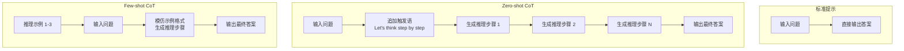

# 思维链（Chain-of-Thought, CoT）

## 概念解释

思维链（Chain-of-Thought，简称 CoT）是一种提示工程技巧，核心做法是引导大语言模型在给出最终答案之前，先把中间的推理步骤一步一步写出来。

最直白的类比：考试时老师要求"写出解题过程"。学生如果只写答案，容易粗心算错；但如果把每一步计算都写下来，出错的概率就低得多。CoT 对 LLM 的作用与此类似——让模型把"思考过程"显式地生成出来，而不是直接跳到答案。

CoT 由 Google 研究团队在 2022 年提出。Wei 等人发表的论文《Chain-of-Thought Prompting Elicits Reasoning in Large Language Models》首次证明：只需在提示词中提供几个带推理步骤的示例，就能让大模型在数学、逻辑、常识推理等任务上获得大幅性能提升。随后 Kojima 等人进一步发现，甚至不需要示例，只要在问题后面加一句"Let's think step by step"，就能激活模型的推理能力（Zero-shot CoT）。

在 Agent 系统和复杂 AI 应用中，CoT 是很多高级提示技术（如 ReAct、Self-Consistency、Tree-of-Thought）的基础构建块。理解 CoT 是掌握后续进阶推理策略的前提。

## 关键结构

CoT 的工作机制可以拆解为三个核心组成部分：

| 结构 | 作用 | 说明 |
|------|------|------|
| 触发语（Trigger Phrase） | 激活模型的逐步推理行为 | Zero-shot CoT 的核心，如"Let's think step by step" |
| 推理步骤（Reasoning Steps） | 承载中间推理过程 | 每一步只处理一个小问题，步骤之间有逻辑递进关系 |
| 推理示例（Exemplars） | 为模型提供推理格式的示范 | Few-shot CoT 的核心，示例中包含完整的推理链条 |

### 结构 1：触发语

触发语是 Zero-shot CoT 的关键。Kojima 等人测试了多种触发语，最终发现 **"Let's think step by step"** 效果最好。它的本质是给模型一个指令：不要直接输出答案，先把推理过程写出来。

中文场景中的常用触发语：
- "让我们一步一步思考"
- "请逐步推理"
- "请详细说明你的推理过程"

### 结构 2：推理步骤

好的推理步骤满足三个条件：
- **单一职责**：每一步只做一件事（一次计算、一个判断）
- **逻辑连贯**：步骤之间有清晰的因果或递进关系
- **粒度适中**：太粗失去 CoT 的意义，太细浪费 Token 且容易偏题

### 结构 3：推理示例

Few-shot CoT 的效果直接取决于示例质量。有效示例的特征：
- 与目标问题类型一致
- 推理步骤清晰完整，没有跳跃
- 2-3 个示例通常就够，数量过多反而浪费上下文窗口
- 示例的多样性比数量更重要（Auto-CoT 的核心发现）

## 核心原理

### 原理说明

CoT 的核心机制是把模型从"问题 → 答案"的单步跳跃，改造为"问题 → 步骤 1 → 步骤 2 → ... → 答案"的多步生成链路。

工作原理可以分三层理解：

1. **分解复杂度**：一个需要 5 步推理的问题，直接跳到答案相当于让模型一次完成所有计算。而 CoT 把它拆成 5 个简单子问题，每步的难度大幅降低。

2. **中间状态显式化**：在标准提示中，中间推理只存在于模型的隐状态（hidden state）里，不可见也不可控。CoT 把中间状态以文本形式写出来，后续步骤可以直接"看到"前面的推理结果，减少信息丢失。

3. **自然语言程序执行**：CoT 的推理步骤本质上是用自然语言写的一段"程序"——每一步的输出是下一步的输入，整个链条构成一个顺序执行的计算过程。

CoT 存在三种主要变体：

- **Zero-shot CoT**：不提供任何示例，只在问题后追加触发语。简单直接，但推理质量不如 Few-shot 稳定。
- **Few-shot CoT**：在提示词中提供 2-3 个包含完整推理步骤的示例。推理质量更高，但需要手工编写示例，且消耗更多上下文窗口。
- **Auto-CoT**：由模型自动生成推理示例（而非人工编写），关键是保证示例的多样性。解决了 Few-shot CoT 的人工成本问题，但生成质量可能参差不齐。

### Mermaid 图解



图中展示了三种模式的对比：
- **标准提示**：问题直达答案，中间没有显式推理。
- **Zero-shot CoT**：通过触发语激发模型自行生成推理链条，再得出答案。
- **Few-shot CoT**：先给模型看几个"怎么推理"的示例，模型学到推理格式后，按相同模式处理新问题。

关键转折发生在触发语/示例引入的那一步——它改变了模型的生成策略，从"直接预测答案 Token"变为"先生成推理步骤 Token，再生成答案 Token"。

### 运行示例

以下用一个数学应用题演示 Zero-shot CoT 和 Few-shot CoT 的基本用法。

```python
# 基于 openai==1.58.1 验证（截至 2026-03）
from openai import OpenAI

client = OpenAI()

# --- Zero-shot CoT ---
question = "一个水果店进了一批苹果。第一天卖掉了总数的一半多2个，第二天卖掉了剩下的一半多1个，第三天发现还剩5个。请问这批苹果原来有多少个？"

response = client.chat.completions.create(
    model="gpt-4o-mini",
    messages=[{
        "role": "user",
        "content": f"{question}\n\n让我们一步一步思考："
    }],
    temperature=0,
)
print(response.choices[0].message.content)
# 模型会反向推导：第三天剩5个 → 第二天剩(5+1)*2=12个 → 第一天有(12+2)*2=28个

# --- Few-shot CoT ---
example_q = "小明有20块糖，给了小红5块，又给了小华原来糖数的四分之一，还剩多少？"
example_a = """步骤 1：初始有 20 块。
步骤 2：给小红 5 块后，剩余 20 - 5 = 15 块。
步骤 3：给小华"原来糖数的四分之一" = 20 / 4 = 5 块。
步骤 4：最终剩余 15 - 5 = 10 块。
答案：10 块。"""

response = client.chat.completions.create(
    model="gpt-4o-mini",
    messages=[
        {"role": "system", "content": "你是一个善于逐步推理的助手。请按照示例格式一步一步推理。"},
        {"role": "user", "content": example_q},
        {"role": "assistant", "content": example_a},
        {"role": "user", "content": question},
    ],
    temperature=0,
)
print(response.choices[0].message.content)
```

代码展示了两种 CoT 模式的实现差异：Zero-shot 只追加触发语，Few-shot 在对话历史中插入带推理步骤的示例。两种方式的 API 调用形式完全相同，区别仅在于 messages 的构造。

## 易混概念辨析

| 概念 | 与思维链（CoT）的区别 | 更适合关注的重点 |
|------|---------------------|------------------|
| 思维树（Tree-of-Thought, ToT） | CoT 是单条线性推理链；ToT 在每一步探索多个分支，通过评估剪枝选择最优路径 | 需要搜索和回溯的问题（如博弈、谜题） |
| 自我一致性（Self-Consistency） | CoT 生成一条推理路径；Self-Consistency 生成多条独立路径，对最终答案投票取多数 | 提升 CoT 的可靠性，用"多数一致"过滤偶发错误 |
| ReAct | CoT 只做推理（Reasoning）；ReAct 交替进行推理和行动（Action），可以调用外部工具 | Agent 场景中需要与外部环境交互的任务 |
| 标准 Few-shot 提示 | Few-shot 提示只提供"问题-答案"对；Few-shot CoT 的示例中额外包含推理步骤 | 简单任务用标准 Few-shot 即可，复杂推理用 CoT |

核心区别：

- **CoT**：关注"如何让模型展示推理过程"，是一种提示策略
- **ToT**：关注"如何在多条推理路径中搜索最优解"，是推理结构的升级
- **Self-Consistency**：关注"如何通过多次采样提升推理可靠性"，是统计层面的增强
- **ReAct**：关注"如何将推理与外部工具调用结合"，是 CoT 在 Agent 中的扩展

## 适用边界与局限

### 适用场景

1. **多步数学推理**：需要分步计算的应用题、公式推导。CoT 在 GSM8K 数学基准上将 PaLM 540B 的准确率从 17.9% 提升到 58.1%，效果最为显著。
2. **逻辑推理与常识推理**：需要多步推演的关系判断、因果分析。例如"A 比 B 高，B 比 C 高，D 比 A 矮但比 C 高，按身高排序"。
3. **代码分析与调试**：引导模型逐行分析代码执行流程、追踪变量值变化，而不是直接给出修复方案。
4. **复杂决策分析**：需要逐一权衡多个因素的场景，如技术选型、风险评估。

### 不适合的场景

1. **简单事实检索**：如"法国首都是哪里？"——不需要推理，加 CoT 只是浪费 Token。
2. **创意写作与翻译**：这类任务不依赖逐步逻辑推导，CoT 反而可能让输出变得生硬。
3. **小模型（参数量 < 100B）**：CoT 是一种涌现能力（Emergent Ability），在小模型上不仅无效，甚至可能生成错误的推理链条导致性能下降。

### 局限性

1. **Token 消耗显著增加**：推理步骤需要额外的生成量。一个标准回答可能只需 50 Token，加 CoT 后可能需要 200-500 Token，在大规模调用场景下成本翻倍。
2. **推理步骤不保证正确**：CoT 让模型"写出推理过程"，但这个过程本身可能包含逻辑错误。错误的中间步骤会导致看似合理但实际错误的最终答案，比直接给出错误答案更具迷惑性。
3. **模型规模依赖**：Wei 等人的实验表明，CoT 的效果在约 100B 参数规模处出现涌现式跳跃。小于此规模的模型使用 CoT 往往产生不连贯的推理链。
4. **对推理模型的边际收益递减**：2025 年的研究表明，对于内置推理能力的模型（如 o1/o3 系列），显式的 CoT 提示带来的额外收益很小，可能不值得增加的处理时间和成本。

## 常见误区

| 常见误区 | 正确理解 |
|----------|----------|
| CoT 对任何任务都有效 | CoT 主要对需要多步推理的任务有效。对简单事实问答、创意写作等任务，CoT 增加的是成本而非准确率。研究表明简单任务加 CoT 有时反而降低表现 |
| 只要加"step by step"就万事大吉 | Zero-shot CoT 简单但不稳定。对于关键业务场景，Few-shot CoT（提供 2-3 个高质量推理示例）的可靠性显著更高 |
| CoT 写出的推理步骤一定是对的 | CoT 只是让模型"展示"推理过程，但模型可能在中间步骤犯逻辑错误，然后基于错误前提推出似是而非的结论。必须对关键步骤做验证 |
| 模型越小越该用 CoT 来补能力 | 恰好相反。CoT 是大模型的涌现能力，小模型（< 100B 参数）使用 CoT 往往生成混乱的推理链，效果比不用还差 |

## 思考题

<details>
<summary>初级：Zero-shot CoT 和 Few-shot CoT 的核心区别是什么？各自的优劣势是什么？</summary>

**参考答案：**

Zero-shot CoT 只需在问题后追加触发语（如"让我们一步一步思考"），无需编写示例，使用成本极低，但推理质量不够稳定。Few-shot CoT 在提示词中提供 2-3 个包含完整推理步骤的示例，推理质量更高更稳定，但需要人工编写高质量示例，且消耗更多上下文窗口。选择依据：快速原型验证或非关键场景用 Zero-shot，生产环境或高准确率要求用 Few-shot。

</details>

<details>
<summary>中级：一个客服 AI 需要处理两类问题——(1) 退款金额计算（涉及优惠券、折扣、运费等多步计算），(2) 查询订单物流状态。这两类问题应该分别用什么提示策略？为什么？</summary>

**参考答案：**

退款金额计算适合使用 CoT（最好是 Few-shot CoT，提供包含计算步骤的退款示例），因为涉及多步数值计算，需要逐步分解才能保证准确。查询物流状态不需要 CoT，因为这是一个简单的信息检索任务——直接调用物流 API 查询即可，加 CoT 只会增加延迟和 Token 成本，不会提升准确率。核心判断标准：任务是否需要多步推理。

</details>

<details>
<summary>中级/进阶：如果你发现 CoT 在某个任务上经常"推理过程看着合理但答案是错的"，可以用什么方法提升可靠性？请至少给出两种策略并说明原理。</summary>

**参考答案：**

策略一：**Self-Consistency（自我一致性）**。对同一问题用较高 temperature（如 0.7）采样生成多条独立的 CoT 推理路径（如 5 条），提取每条路径的最终答案，投票取出现次数最多的答案。原理：单条推理路径可能出错，但多条独立路径同时犯同样错误的概率更低。策略二：**提升 Few-shot 示例质量**。替换或增加与目标问题类型更匹配的推理示例，确保示例的推理步骤严谨无跳跃。原理：模型会模仿示例的推理模式，示例质量直接决定推理质量。策略三：**分步验证**。在 CoT 的每一步推理后，增加一个验证环节（让模型检查当前步骤是否正确），及时发现并纠正中间错误。

</details>

## 参考资料

1. Wei, J., et al. (2022). "Chain-of-Thought Prompting Elicits Reasoning in Large Language Models." NeurIPS 2022. https://arxiv.org/abs/2201.11903
2. Kojima, T., et al. (2022). "Large Language Models are Zero-Shot Reasoners." NeurIPS 2022. https://arxiv.org/abs/2205.11916
3. Wang, X., et al. (2023). "Self-Consistency Improves Chain of Thought Reasoning in Language Models." ICLR 2023. https://arxiv.org/abs/2203.11171
4. Prompt Engineering Guide - Chain-of-Thought Prompting. https://www.promptingguide.ai/techniques/cot
