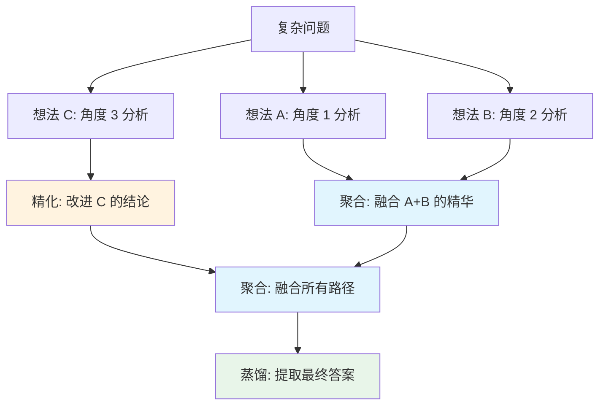

# 思维图（Graph-of-Thought, GoT）

## 概念解释

思维图（Graph-of-Thought, GoT）是一种将大语言模型的推理过程建模为**任意有向图**的提示框架。在这张图里，每个"想法"是一个节点，想法之间的依赖关系是有向边。不同的想法可以在任何位置交叉融合、被多条路径复用，甚至可以通过反馈循环被后续想法回过头来优化。

GoT 的出现是为了解决前两代推理范式的结构性限制。链式思维（Chain-of-Thought, CoT）是一条直线，一步出错后面全跟着错，而且无法同时探索多条路径。思维树（Tree-of-Thoughts, ToT）允许分叉探索，但树有一个根本限制：每个节点只能有一个父节点，不同分支之间完全隔离，无法相互借鉴和融合。而人类解决复杂问题时的思维方式往往不是线性的，也不是树状的——我们会同时从多个角度思考，把不同角度的发现拼在一起，甚至根据后面的新发现回过头来修正前面的判断。GoT 的图结构正是为了模拟这种灵活的思维方式。

GoT 由 Besta 等人在 2023 年提出（论文发表于 AAAI 2024），在排序任务上相比 ToT 质量提升 62%，成本降低超过 31%。它在 Prompt Engineering 体系中属于**进阶推理技术**，适用于需要多角度分析、跨步骤信息融合的复杂问题。

## 关键结构

| 结构 | 作用 | 说明 |
|------|------|------|
| 思考节点（Thought Vertex） | 图的基本单元 | 每个节点是一个 LLM 生成的中间想法或结论 |
| 有向边（Dependency Edge） | 表示想法间的因果依赖 | 节点 B 基于节点 A 生成，则有一条 A->B 的边 |
| 思考变换（Thought Transformation） | 在图上执行操作来推进推理 | 包括聚合、精化、生成三种核心变换 |
| 评分与排序（Evaluator & Ranker） | 给节点打分、排序 | 用于选择高质量想法进行后续操作 |

### 结构 1：思考节点——图的基本单元

思考节点是 GoT 的原子单位。每个节点对应 LLM 生成的一个中间想法，可能是对问题的一种分解角度、某方面的分析结果、一次部分计算，或对前面想法的评价和总结。

节点与 CoT 中"推理步骤"的关键区别：在 CoT 里，每个步骤只是链条上的一环，只能被前后两个步骤引用。在 GoT 里，**一个节点可以有多个父节点**（综合多条路径的信息生成），也**可以被多条路径同时引用**（信息复用）。正是这种"多进多出"的连接方式，让 GoT 能做到 CoT 和 ToT 做不到的事情。

### 结构 2：有向边——因果依赖关系

有向边定义了想法之间"谁基于谁生成"的因果关系。如果节点 C 是同时基于节点 A 和节点 B 的信息融合得到的，那么图中就有两条边：A->C 和 B->C。

这正是图结构相对于树结构的根本优势：在树中，每个节点最多只能有一个父节点，分支之间完全独立。在图中，一个节点可以有任意多个父节点——这意味着来自不同推理路径的有用信息可以在任何位置汇聚和融合。

### 结构 3：思考变换——推理的驱动力

GoT 定义了三类核心变换操作，它们是图不断扩展和优化的驱动力：

- **聚合（Aggregation）**：把多个独立节点的结果合并成一个更全面的结论。例如，从"技术分析"和"市场分析"两条路径各取精华，融合成一个综合判断。
- **精化（Refinement）**：基于反馈信息改进某个已有节点。例如，发现某个中间结论有逻辑漏洞后，直接修补这个节点，不用重新生成整条链。
- **生成（Generation）**：从已有节点派生出新的想法，这是图扩展的基本方式。

这三种操作的组合使用构成了 GoT 的全部推理能力。

### 结构 4：评分与排序——质量控制

GoT 的形式化定义是一个四元组 **(G, T, E, R)**：

- **G**：推理图，包含所有节点和边
- **T**：可用的变换操作集合
- **E**：评分函数，给每个节点打分
- **R**：排序函数，对节点排序以决定优先处理哪些

评分和排序机制确保系统不会盲目扩展图，而是优先在高质量节点上进行后续操作，控制计算开销。

## 核心原理

### 原理说明

GoT 的工作机制分为四个阶段：

1. **初始思考生成**：给定一个复杂问题，LLM 从多个角度生成初始想法，每个想法成为图中的一个根节点。这些根节点代表不同的分析切入点。

2. **图的扩展与变换**：系统在每一步选择最合适的操作——对高质量的独立想法进行聚合、对有缺陷的想法进行精化、或从已有想法派生新想法。每次操作都会在图中新增节点和边。

3. **评估与选择**：评分函数（Evaluator）持续评估图中各节点的质量，排序函数（Ranker）决定下一步应该优先处理哪些节点。这保证了计算资源集中在最有价值的推理路径上。

4. **收敛与输出**：当满足终止条件（答案质量达标、计算预算耗尽等）时，从图中提取最终答案。通常通过蒸馏操作，从整张图中提炼出最关键的信息形成结论。

核心区别在于：CoT 只能往前走（一条直线），ToT 可以分叉探索但分支之间不能交流（一棵树），而 GoT 的任意连接结构允许多条路径在任何位置汇合、互补、甚至循环优化（一张图）。

### Mermaid 图解



图中关键信息：

- 三个初始想法（T1/T2/T3）代表从不同角度出发的推理路径
- **浅蓝色节点**是聚合操作——多条路径的结果在这里融合，这是树结构做不到的
- **浅橙色节点**是精化操作——想法 C 被反馈信息改进后再参与融合
- **浅绿色节点**是最终蒸馏——从整张图中提炼精华作为输出
- 注意 AGG1 有两个父节点（T1 和 T2），这正是图结构"多父节点"的特征

### 运行示例

以下伪代码展示 GoT 的核心数据结构和操作逻辑：

```python
from dataclasses import dataclass, field
from typing import List, Dict

@dataclass
class ThoughtNode:
    """思维图中的一个思考节点"""
    id: str                                    # 节点标识
    content: str                               # 思考内容
    depends_on: List[str] = field(default_factory=list)  # 依赖的父节点 ID
    operation: str = "generation"              # 产生该节点的操作类型
    score: float = 0.0                         # 质量评分

class GraphOfThoughts:
    """思维图的最小结构示意"""
    def __init__(self, problem: str):
        self.problem = problem
        self.nodes: Dict[str, ThoughtNode] = {}

    def generate(self, content: str, parents: List[str] = None) -> str:
        """生成新节点（可依赖多个父节点）"""
        node_id = f"t{len(self.nodes)}"
        self.nodes[node_id] = ThoughtNode(
            id=node_id,
            content=content,
            depends_on=parents or [],
            operation="generation"
        )
        return node_id

    def aggregate(self, node_ids: List[str], merged_content: str) -> str:
        """聚合操作：将多个节点融合为一个新节点（图结构的核心能力）"""
        node_id = f"t{len(self.nodes)}"
        self.nodes[node_id] = ThoughtNode(
            id=node_id,
            content=merged_content,
            depends_on=node_ids,   # 多个父节点——这在树结构中不可能
            operation="aggregation"
        )
        return node_id

    def refine(self, node_id: str, improved_content: str) -> str:
        """精化操作：基于反馈改进已有节点"""
        new_id = f"t{len(self.nodes)}"
        self.nodes[new_id] = ThoughtNode(
            id=new_id,
            content=improved_content,
            depends_on=[node_id],
            operation="refinement"
        )
        return new_id

# --- 使用示例 ---
got = GraphOfThoughts("产品定价策略分析")

# 阶段 1：多角度初始分析
t0 = got.generate("成本分析：原材料 + 人工 + 运营成本约 80 元")
t1 = got.generate("竞品分析：同类产品定价 120-180 元")
t2 = got.generate("用户调研：目标用户可接受价格 100-150 元")

# 阶段 2：聚合——融合成本和竞品信息（图特有操作）
t3 = got.aggregate([t0, t1], "成本 80 元 + 竞品 120-180 元 → 合理区间 100-160 元")

# 阶段 3：精化——根据用户调研结果修正定价区间
t4 = got.refine(t3, "结合用户调研（100-150 元），修正为 100-150 元")

# 阶段 4：最终聚合——综合所有信息形成定价建议
t5 = got.aggregate([t4, t2], "建议定价 129 元：成本有利润空间 + 竞品中偏低 + 用户可接受")
```

上面的代码对应了 GoT 的三种核心操作。`aggregate` 方法的 `depends_on` 接受多个父节点 ID，这是 CoT（单链）和 ToT（单父节点树）都无法表达的结构。实际工程中，每个操作内部会调用 LLM 来生成融合或改进后的内容，这里用字符串直接赋值简化了 LLM 调用部分。

## 易混概念辨析

| 概念 | 与 GoT 的区别 | 更适合关注的重点 |
|------|--------------|------------------|
| 链式思维（Chain-of-Thought, CoT） | CoT 是单条线性推理链，每步只依赖前一步。GoT 是任意图结构，支持多路径并行和融合 | CoT 适合简单逻辑推理任务，重点在"逐步引导" |
| 思维树（Tree-of-Thoughts, ToT） | ToT 允许分叉但分支不能融合（每个节点只有一个父节点）。GoT 的节点可以有多个父节点，分支可以在任意位置汇合 | ToT 适合需要回溯但不需要跨分支融合的决策任务 |
| 自一致性（Self-Consistency, CoT-SC） | CoT-SC 是独立跑多条链然后投票选最优。GoT 的多条路径不是独立的，而是可以互相交流信息和融合 | CoT-SC 适合有明确答案的问题，靠"多数决"提升准确率 |

核心区别：

- **GoT**：核心能力是**多路径融合**——不同推理路径可以在任何位置交换信息、合并结论
- **CoT**：线性结构，一步接一步，不能分叉也不能合流
- **ToT**：树状结构，可以分叉探索和回溯，但分支之间完全隔离
- **CoT-SC**：多条独立链 + 投票，路径之间没有信息交换

一个直观的类比：CoT 是走一条路，ToT 是在岔路口选方向（可以退回来换路），CoT-SC 是派多个人分别走不同路然后投票，GoT 是多个人走不同路的同时还能互相打电话分享线索。

## 适用边界与局限

### 适用场景

1. **需要多角度分析再综合的问题**：例如"评估一个创业项目是否值得做"需要同时分析技术、市场、财务等维度，然后融合各维度的结论。GoT 的聚合操作天然匹配这种需求。
2. **涉及跨步骤信息交叉验证的推理**：例如多跳问答（HotpotQA 类型），不同检索路径可能返回互补的中间结果，GoT 可以把它们融合成更完整的答案。
3. **需要迭代优化的生成任务**：例如代码生成后发现某段有 bug，GoT 的精化操作可以直接修补问题节点，不用重新生成整个输出。

### 不适合的场景

1. **简单单步问题**：翻译、情感分类、简短问答——直接回答比构建图结构高效得多，GoT 的额外操作全是浪费。
2. **答案明确、不需要多角度分析的问题**：例如"Python 的 list.append() 有什么作用"，不存在需要融合多条路径的必要。

### 局限性

1. **实现复杂度高**：GoT 需要管理图结构、实现多种变换操作、设计评分和选择策略，工程量远大于 CoT 和 ToT。对资源有限的团队来说，维护成本是一个实际问题。
2. **操作选择是难题**：系统在每一步需要决定"聚合还是精化还是继续生成"，这个决策本身就需要额外的判断逻辑或 LLM 调用。决策不当反而会导致性能下降。
3. **可解释性较差**：相比线性的 CoT，图结构的推理过程更难让人理解和调试。当结果出错时，从纠缠的图中追踪"哪个节点出了问题"比从链中追踪困难得多。
4. **成本不确定**：虽然论文显示成本可以降低，但那是在理想操作选择下的结果。实际使用中，如果聚合和精化操作带来大量额外 LLM 调用，总成本可能反而上升。

## 常见误区

| 常见误区 | 正确理解 |
|----------|----------|
| GoT 就是生成更多的思考分支 | GoT 的核心不是增加分支数量，而是让分支之间能**互相融合和反馈**。只生成孤立的多条链而不融合，那只是"多次 CoT"，不是图。关键在于聚合和精化操作 |
| GoT 适用于所有问题 | GoT 对需要多角度综合分析的复杂问题有优势，对简单的单步问题反而因为额外开销（聚合、评分等）而降低效率。应该根据问题复杂度选择 CoT/ToT/GoT |
| GoT 必须手工设计图的拓扑结构 | GoT 框架中包含操作图（Graph of Operations, GoO）来定义执行计划，但具体的推理图是在运行时动态生成的。最新研究在探索自动化的操作选择策略 |
| 反馈循环会导致无限运行 | GoT 有明确的终止条件：答案质量达到阈值、计算预算用完、达到最大迭代轮次。精化后的节点通常质量更高，这保证了收敛 |

## 思考题

<details>
<summary>初级：GoT 相比 CoT 和 ToT，在结构上的核心差异是什么？这个差异带来了哪些新能力？</summary>

**参考答案：**

核心差异在于 GoT 中一个节点可以有**多个父节点**。CoT 每个节点只有一个前驱（线性链），ToT 每个节点只有一个父节点（树状分叉但不合流）。GoT 的多父节点能力带来了三个新能力：(1) 多路径融合——不同推理分支的结果可以合并成更强的结论；(2) 信息复用——同一个高质量想法可以被多条路径引用；(3) 反馈循环——后续发现可以回过头来改进前面的想法。

</details>

<details>
<summary>中级：在什么情况下使用 GoT 是"杀鸡用牛刀"？如何判断一个问题是否需要 GoT？</summary>

**参考答案：**

当问题不需要多角度分析或跨路径融合时，GoT 就是过度设计。判断标准：(1) 问题是否有多个独立维度需要分析后综合？——如果是，GoT 合适；(2) 不同分析路径的结果是否需要互相参考和融合？——如果各路径完全独立，CoT-SC（多次采样+投票）就够了，不需要 GoT 的聚合能力；(3) 是否需要根据后续发现修正前面的结论？——如果推理过程是单向的，不需要 GoT 的精化循环。简单规则：能用 CoT 解决的不上 ToT，能用 ToT 解决的不上 GoT。

</details>

<details>
<summary>中级/进阶：假设你要用 GoT 解决"帮客户选择最合适的云服务商"这个问题，请设计初始思考分支和聚合策略</summary>

**参考答案：**

初始分支设计（至少 4 个独立角度）：(1) 成本分析——对比各家的定价模型和预估费用；(2) 技术匹配——各家在客户所需技术栈（如 GPU 推理、K8s 支持）上的能力差异；(3) 合规与安全——数据合规、安全认证（SOC 2、等保等）的满足程度；(4) 生态与迁移——各家的生态成熟度和迁移成本。

聚合策略：先做两轮局部聚合——成本+技术匹配聚合为"性价比评估"，合规+生态聚合为"风险与长期价值评估"。然后做全局聚合，将性价比评估和风险评估融合为最终推荐。如果全局聚合后发现某个候选的技术指标需要更细致的核实，触发精化操作修正对应节点后重新聚合。

</details>

## 参考资料

1. Besta, M. et al. (2023). "Graph of Thoughts: Solving Elaborate Problems with Large Language Models." arXiv:2308.09687, AAAI 2024. https://arxiv.org/abs/2308.09687
2. GoT 官方开源实现（spcl/graph-of-thoughts）: https://github.com/spcl/graph-of-thoughts
3. Cameron R. Wolfe. "Graph-Based Prompting and Reasoning with Language Models." https://cameronrwolfe.substack.com/p/graph-based-prompting-and-reasoning
4. Besta, M. et al. "Demystifying Chains, Trees, and Graphs of Thoughts." https://htor.inf.ethz.ch/publications/img/besta-topologies.pdf

---
