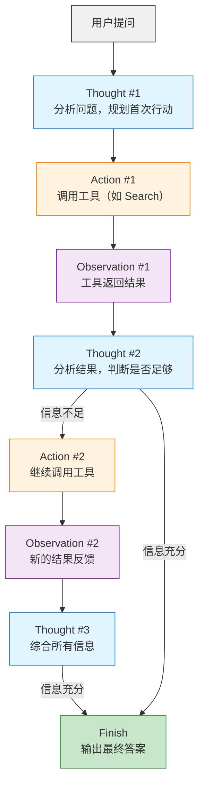

# ReAct 提示技巧（Reasoning + Acting）

## 概念解释

ReAct 是一种让大语言模型在推理过程中主动采取行动的提示技巧。名字由 **Re**asoning（推理）和 **Act**ing（行动）拼接而来，核心思路是：模型每走一步都先想清楚"我接下来该干什么"，然后动手去做（调用工具、查数据库、搜网页），拿到结果后再决定下一步。

在 ReAct 出现之前，提示词工程分两条路：一条是"纯思考"路线，以 Chain-of-Thought（思维链）为代表，模型只靠内部知识一步步推理，遇到需要实时信息的问题就容易编造答案；另一条是"纯行动"路线，模型直接输出工具调用指令，但缺少规划和纠错能力，一旦方向走偏就没有回头路。ReAct 把两条路线合并成一条：推理指导行动的选择，行动的结果反馈给推理，形成一个动态闭环。

这种闭环在 Agent 系统中是基础范式。几乎所有主流 Agent 框架（LangChain、LlamaIndex、OpenAI Function Calling 背后的 Agent 循环）都内置了 ReAct 或其变体作为默认的推理-执行模式。

## 关键结构

ReAct 的结构是一个三阶段循环，每轮循环产出一组 Thought-Action-Observation：

| 阶段 | 角色 | 说明 |
|------|------|------|
| Thought（思考） | 推理引擎 | 分析当前状态，决定下一步做什么 |
| Action（行动） | 执行接口 | 调用外部工具，与真实世界交互 |
| Observation（观察） | 反馈通道 | 接收工具返回结果，注入下一轮推理 |

### 阶段 1：Thought（思考）

Thought 是模型的"内心独白"，需要完成三件事：总结当前已知信息、识别还缺什么、制定下一个行动的具体计划。Thought 的质量直接决定后续行动是否精准。如果跳过 Thought 让模型直接输出 Action，模型容易盲目调用工具。

典型 Thought 输出示例：
> "用户问的是 2024 年诺贝尔物理学奖得主，这超出了我的训练数据范围。我应该用搜索工具查询最新信息。"

### 阶段 2：Action（行动）

Action 是模型选择的一个具体可执行操作，必须以工具系统能解析的格式输出。常见格式包括：
- `Search[查询关键词]`——调用搜索引擎
- `Lookup[段落关键词]`——在已获取的文档中定位特定段落
- `Calculate[数学表达式]`——调用计算器
- `Finish[最终答案]`——结束循环，输出答案

每轮只执行一个 Action，确保推理链路清晰可追踪。

### 阶段 3：Observation（观察）

Observation 是工具执行后返回的结果，由外部环境（而非模型自身）生成。模型拿到 Observation 后，进入下一轮 Thought，决定是否已有足够信息给出最终答案，或者需要继续行动。

Observation 的质量取决于工具本身的返回结果。如果搜索引擎返回的是无关内容，模型需要在下一轮 Thought 中识别出来并调整策略。

## 核心原理

### 原理说明

ReAct 的运行机制可以分为四步理解：

**第一步：接收任务，启动第一轮 Thought。** 模型读取用户的问题，分析需要什么信息、手头有哪些工具可用，规划第一个行动。

**第二步：输出 Action，交由工具执行。** 模型按照预定义格式输出一个 Action 指令，系统解析指令并调用对应工具。这一步模型不参与——它只负责发出指令，工具负责执行。

**第三步：工具返回 Observation，注入上下文。** 工具执行结果以 Observation 的形式追加到对话历史中。模型在下一次被调用时，能看到完整的历史轨迹：所有之前的 Thought、Action、Observation。

**第四步：循环判断。** 模型基于更新后的上下文重新推理。如果信息足够，输出 `Finish[答案]` 结束循环；如果还不够，继续输出新的 Thought 和 Action，回到第二步。

这套机制之所以有效，关键在于每一步都有"刹车"——模型不会一口气跑到底，而是在每个 Observation 后都重新评估局面。这让它能纠错、能调整方向、能处理意外情况。

### Mermaid 图解



图中蓝色节点是 Thought（推理），橙色节点是 Action（行动），紫色节点是 Observation（环境反馈），绿色节点是最终输出。关键流转在 Observation 到下一个 Thought 之间——这是模型重新评估局面的时刻，也是 ReAct 能够纠错的核心机制。

### 运行示例

以下伪代码展示 ReAct 循环的核心逻辑，省略了真实 LLM 调用和工具实现细节：

```python
# ReAct 循环的核心逻辑（伪代码风格）

def react_loop(question: str, tools: dict, llm, max_steps: int = 10) -> str:
    """
    ReAct 推理-行动循环。
    question: 用户问题
    tools: 可用工具字典，格式 {"工具名": 执行函数}
    llm: 大语言模型调用接口
    max_steps: 最大循环次数，防止无限循环
    """
    # 构造系统提示词，告诉模型可用工具和输出格式
    system_prompt = f"""请按以下格式交替输出：
Thought: 你的推理过程
Action: 工具名[参数]
当你有足够信息时，输出：
Action: Finish[最终答案]

可用工具：{', '.join(tools.keys())}"""

    history = [{"role": "user", "content": question}]

    for step in range(max_steps):
        # 模型生成 Thought + Action
        response = llm(system_prompt, history)

        # 解析 Action
        tool_name, param = parse_action(response)

        if tool_name == "Finish":
            return param  # 返回最终答案

        # 执行工具，获取 Observation
        observation = tools[tool_name](param)

        # 将模型输出和工具结果追加到历史
        history.append({"role": "assistant", "content": response})
        history.append({"role": "user", "content": f"Observation: {observation}"})

    return "达到最大步数，未能得出答案"
```

`parse_action` 负责从模型输出中提取工具名和参数。Observation 以 user 消息的形式注入对话历史，是因为 Observation 来自外部环境而非模型自身。`max_steps` 是必要的安全阀，防止模型陷入无限循环。

下面是一个完整的 ReAct 轨迹示例，展示实际对话中 Thought-Action-Observation 如何交替进行：

```text
问题：苹果公司的现任 CEO 是谁？他是哪一年加入苹果的？

Thought 1: 我需要查询苹果公司现任 CEO 的信息。这个问题涉及当前事实，
           我应该使用搜索工具获取最新数据。
Action 1:  Search[苹果公司 现任CEO]
Observation 1: Tim Cook（蒂姆·库克）自 2011 年 8 月起担任苹果公司 CEO。

Thought 2: 搜索结果告诉我现任 CEO 是 Tim Cook，从 2011 年开始担任。
           但用户还问了他是哪一年加入苹果的，这和担任 CEO 的时间不同。
           我需要进一步查询他的入职时间。
Action 2:  Search[Tim Cook 加入苹果 时间]
Observation 2: Tim Cook 于 1998 年加入苹果公司，最初担任全球运营高级副总裁。

Thought 3: 现在我有了完整信息。现任 CEO 是 Tim Cook，他 1998 年加入苹果，
           2011 年成为 CEO。可以给出最终答案。
Action 3:  Finish[苹果公司现任 CEO 是 Tim Cook（蒂姆·库克）。
           他于 1998 年加入苹果，2011 年 8 月正式出任 CEO。]
```

这个轨迹中，Thought 2 展示了 ReAct 的纠错能力：模型注意到第一次搜索只回答了"担任 CEO 的时间"而非"加入苹果的时间"，于是主动发起了第二次搜索。

## 易混概念辨析

| 概念 | 与 ReAct 的区别 | 更适合关注的重点 |
|------|----------------|------------------|
| Chain-of-Thought（思维链） | 只有推理没有行动，模型完全靠内部知识一步步思考，无法调用外部工具 | 纯逻辑推理任务（数学证明、逻辑题） |
| Plan-and-Solve（计划-求解） | 先制定完整计划再逐步执行，不含工具交互，也不在执行中动态调整 | 需要减少步骤遗漏的零样本推理任务 |
| ReAct 设计模式 | 是 Agent 系统的架构模式，关注系统设计层面；ReAct 提示技巧是提示词层面的实现方式 | 两者是同一思想在不同抽象层级的体现 |
| Function Calling（函数调用） | 是 LLM API 层面的工具调用机制，ReAct 是提示词层面的推理-行动框架，Function Calling 可作为 ReAct 中 Action 的执行方式 | API 集成和工具调用的工程实现 |

核心区别：

- **ReAct**：推理和行动交替进行，每次行动后都重新评估，可以动态纠错
- **Chain-of-Thought**：纯内部推理，不与外部交互，适合不需要实时数据的推理任务
- **Plan-and-Solve**：先规划后执行，计划制定后不会根据执行结果动态调整
- **Function Calling**：是工具调用的技术实现层，ReAct 是更上层的推理框架

## 适用边界与局限

### 适用场景

1. **需要实时信息的问答任务**：问题涉及最新数据（股价、新闻、天气）时，ReAct 能在推理中主动搜索验证，而不是凭训练数据猜测
2. **多步骤复杂推理**：答案需要多次工具调用、中间结果互相依赖时，ReAct 的循环机制能逐步推进并在每步检查结果
3. **需要可解释性的场景**：每一步 Thought-Action-Observation 都显式可见，便于审计和调试模型的决策过程
4. **Agent 工具编排**：作为 Agent 的核心推理循环，协调搜索、计算、API 调用等多种工具的使用顺序

### 不适合的场景

1. **纯逻辑推理任务**：如果问题只需要内部推理（数学证明、逻辑谜题），不涉及外部数据，ReAct 的工具调用开销反而是浪费，普通 CoT 更直接
2. **对延迟敏感的实时对话**：每轮 Action 都需要等待外部工具返回，多轮循环的总延迟可能让用户体验变差
3. **工具不可靠的环境**：如果可用工具返回结果质量差或不稳定，ReAct 的推理会被错误的 Observation 带偏

### 局限性

1. **Token 消耗高**：完整的 Thought-Action-Observation 轨迹会快速消耗上下文窗口，长任务容易超出模型的上下文长度限制
2. **工具质量依赖**：ReAct 的效果上限取决于工具返回结果的质量。搜索引擎返回无关内容、数据库查询超时，都会拖垮整个推理链
3. **循环终止风险**：模型可能陷入无意义的循环（反复搜索同样的关键词），需要设置最大步数和重复检测机制
4. **模型能力门槛**：小参数模型往往难以稳定遵循 Thought-Action-Observation 格式，容易输出格式混乱或跳过 Thought 直接输出答案

## 常见误区

| 常见误区 | 正确理解 |
|----------|----------|
| ReAct 就是调用一堆工具 | ReAct 的核心是"推理指导行动"，Thought 步骤决定了调用哪个工具、传什么参数。去掉 Thought 只剩 Action 的系统不是 ReAct，只是普通的工具链 |
| ReAct 能彻底解决幻觉问题 | ReAct 能通过外部查询减少幻觉，但如果工具本身返回错误信息，或者模型在 Thought 中推理失误，幻觉仍然会发生 |
| 工具越多效果越好 | 工具过多会增加模型的选择负担，导致工具描述占据大量上下文、模型选错工具的概率上升。关键是提供少而精的工具，并写清楚每个工具的使用场景 |
| ReAct 和 CoT 是替代关系 | 原论文的实验结论是：ReAct + CoT 组合使用效果最好。CoT 提供内部推理能力，ReAct 提供外部交互能力，两者互补而非替代 |

## 思考题

<details>
<summary>初级：ReAct 的三个阶段分别对应什么角色？如果去掉 Thought 只保留 Action 和 Observation，会产生什么问题？</summary>

**参考答案：**

三个阶段分别是 Thought（推理引擎）、Action（执行接口）、Observation（反馈通道）。如果去掉 Thought，模型就失去了规划和纠错能力——它不会分析当前缺什么信息就直接调用工具，可能选错工具、传错参数，也无法在获得错误结果后调整策略。这就退化成了"纯行动"模式，效果类似于没有推理的暴力工具调用。

</details>

<details>
<summary>中级：一个客服 Agent 需要处理退货流程（查订单 -> 验资格 -> 生成退货单），应该用 ReAct 还是固定流程编排？为什么？</summary>

**参考答案：**

如果退货流程是完全标准化的（步骤固定、没有例外情况），固定流程编排更合适——确定性高、延迟低、不存在模型推理失误的风险。但如果流程中有判断分支（比如不同商品类别走不同退货政策、需要查询库存决定是换货还是退款），ReAct 更合适，因为模型可以在每步 Observation 后动态决定下一个 Action。实际工程中常见的做法是混合使用：主流程用固定编排，遇到需要判断的分支点用 ReAct 来决策。

</details>

<details>
<summary>中级/进阶：ReAct 论文中提到"ReAct + CoT 组合效果最好"，请分析在什么情况下应该让模型先用 CoT 内部推理，什么时候应该触发 ReAct 的外部行动？</summary>

**参考答案：**

判断标准是"模型内部知识是否足够回答问题"。如果问题涉及的知识在模型训练数据中有高置信度的覆盖（如通用常识、数学推理、逻辑分析），应优先用 CoT 内部推理，避免不必要的工具调用开销。当模型在 Thought 中识别出"这个信息我不确定"或"这个问题需要实时数据"时，才触发 Action 调用外部工具。实现层面，可以在系统提示词中明确告知模型："如果你对答案有高置信度，直接用内部推理回答；如果你不确定或问题涉及实时信息，使用工具查询。"这种策略既减少了不必要的工具调用延迟，又保证了需要外部验证时的准确性。

</details>

## 参考资料

1. Yao, S., Zhao, J., Yu, D., Du, N., Shafran, I., Narasimhan, K., & Cao, Y. (2022). "ReAct: Synergizing Reasoning and Acting in Language Models." *ICLR 2023*. https://arxiv.org/abs/2210.03629
2. Prompt Engineering Guide - ReAct Prompting. https://www.promptingguide.ai/techniques/react
3. Google Research - ReAct: Synergizing Reasoning and Acting in Language Models. https://research.google/blog/react-synergizing-reasoning-and-acting-in-language-models/
4. GitHub - ReAct Official Implementation. https://github.com/ysymyth/ReAct
5. Width.ai - ReAct Prompting: How We Prompt for High-Quality Results from LLMs. https://www.width.ai/post/react-prompting
