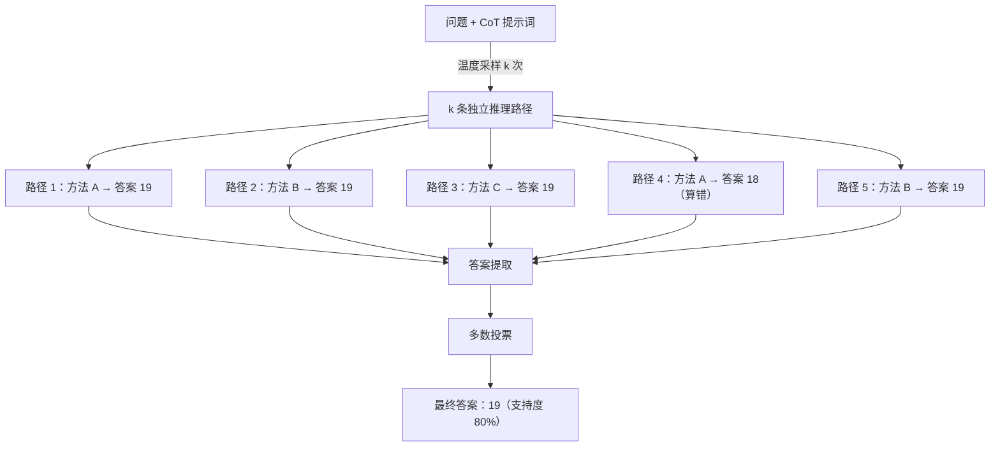

# 自一致性（Self-Consistency）

## 概念解释

Self-Consistency（自一致性）是一种用于提升大语言模型推理准确性的解码策略。做法是：对同一个问题，让模型沿不同的思路独立推理多次，从每条推理路径中提取最终答案，再通过多数投票（Majority Voting）选出出现次数最多的那个答案作为最终结果。

为什么需要它：标准的 Chain-of-Thought（CoT，思维链）提示让模型"一步步推理"，但默认只走一条路径（贪心解码，Greedy Decoding）。贪心解码每一步都选概率最高的词，一旦某步出错，后续推理就全部偏了。然而，复杂推理问题往往存在多条不同的正确思路，都能指向同一个正确答案。Self-Consistency 正是利用了这一点 -- 如果多条路径都收敛到同一个答案，这个答案大概率是对的。

与传统 CoT 的差异：CoT 是"问一次、答一次"，Self-Consistency 是"问一次、独立答多次、投票定结果"。可以理解为：CoT 是派一个人去解题，Self-Consistency 是派一组人分别独立解题，最后看大多数人的答案是什么。

该方法由 Wang et al. 在 2022 年提出，发表于 ICLR 2023（论文：*Self-Consistency Improves Chain of Thought Reasoning in Language Models*）。在 GSM8K（小学数学）上带来 +17.9% 的准确率提升，在 StrategyQA（常识推理）上带来 +6.4% 的提升，是目前 LLM 推理领域最广泛采用的基线方法之一。

## 关键结构

| 结构 | 作用 | 说明 |
|------|------|------|
| 多样化采样 | 生成多条不同的推理路径 | 通过调高温度参数，让模型每次走不同的推理思路 |
| 答案提取 | 从每条推理路径中提取最终答案 | 用正则匹配或格式约束，把自然语言输出变成结构化答案 |
| 多数投票 | 聚合所有答案，选出最一致的结果 | 统计每个答案的出现次数，票数最多的胜出 |

### 结构 1：多样化采样

模型对同一个问题和 CoT 提示词进行 k 次独立生成（通常 k = 5~20），每次使用随机采样（而非贪心解码）。关键参数是温度（Temperature）：温度越高，输出越多样；温度为 0 时每次生成完全相同，失去多样性意义。推荐范围 0.5~0.8。

多样性是 Self-Consistency 能起作用的前提。Wang et al. 的实验表明，beam search（束搜索）因输出多样性不足，效果远不如温度采样。

### 结构 2：答案提取

每条推理路径是一段自然语言文本，需要从中提取出结构化的最终答案。常见做法：

- 在提示词中要求模型以固定格式输出答案（如"最终答案是：X"），再用正则表达式提取
- 对数学题，提取最后出现的数值
- 对选择题，提取选项字母

答案提取的可靠性直接影响投票质量。如果提取失败或提取到错误内容，等于往投票箱里塞了废票。

### 结构 3：多数投票

统计 k 条路径中每个候选答案出现的次数，选出频率最高的答案。数学表示：

设 k 条路径提取的答案为 a1, a2, ..., ak，答案 a 的支持度为 S(a) = |{i : ai = a}| / k，最终答案为支持度最高的那个。

投票结果的支持度本身也可以作为置信度指标 -- 如果一个答案获得 90% 的票，比获得 40% 的票更值得信赖。

## 核心原理

### 原理说明

Self-Consistency 的完整工作流程分四步：

**第一步：构造输入。** 将问题和 CoT 提示词组合成完整的 prompt。CoT 提示词引导模型逐步推理（而非直接给答案），通常包含几个推理示例（few-shot）。

**第二步：多样化采样。** 将同一个 prompt 发给模型 k 次，每次使用温度采样（temperature > 0）。由于随机采样的存在，模型每次会选择不同的推理路径 -- 有的路径用方法 A 解题，有的用方法 B，有的甚至会在某步犯计算错误。这 k 条路径彼此独立。

**第三步：答案提取。** 从每条推理路径中解析出最终答案。例如，一条路径的推理过程是"先算笔的费用 2x5=10，再算本子费用 3x3=9，总计 10+9=19"，提取出的答案就是"19"。

**第四步：多数投票。** 统计所有提取答案的频次分布，选出出现最多的答案。如果 k=10 条路径中有 8 条都得到"19"，1 条得到"18"，1 条得到"20"，则最终答案是"19"，支持度 80%。

这套机制之所以有效，是因为：正确的推理路径虽然方法各异，但都会收敛到同一个正确答案；而错误路径犯的错各不相同，会分散到不同的错误答案上。所以正确答案在投票中自然占多数。

### Mermaid 图解



图中展示了 5 条推理路径的情况：其中 4 条路径通过不同方法都得到了答案 19，只有 1 条路径因为计算错误得到了 18。多数投票自动过滤掉了那条错误路径，最终以 80% 的支持度输出正确答案。

关键流转：多样性发生在采样阶段（不同路径走不同思路），收敛发生在投票阶段（正确答案自然聚集）。

### 运行示例

```python
# 基于 openai>=1.0.0 验证（截至 2026-03）
# 演示 Self-Consistency 的核心机制：多次采样 + 多数投票

from collections import Counter
from openai import OpenAI

client = OpenAI()  # 从环境变量读取 OPENAI_API_KEY

def self_consistency(question: str, num_samples: int = 5, temperature: float = 0.7) -> dict:
    """对同一问题采样多次，通过多数投票选出最终答案"""

    prompt = f"""请逐步推理并解答以下问题。最后一行必须写"最终答案是：X"。

问题：{question}"""

    answers = []
    for _ in range(num_samples):
        resp = client.chat.completions.create(
            model="gpt-4o-mini",
            messages=[{"role": "user", "content": prompt}],
            temperature=temperature,
            max_tokens=300,
        )
        text = resp.choices[0].message.content
        # 提取"最终答案是：X"中的 X
        import re
        match = re.search(r"最终答案是[：:]\s*(.+)", text)
        if match:
            answers.append(match.group(1).strip())

    # 多数投票
    counts = Counter(answers)
    best_answer, best_count = counts.most_common(1)[0]

    return {
        "answer": best_answer,
        "confidence": best_count / len(answers),  # 支持度
        "distribution": dict(counts),
    }

# 用法：result = self_consistency("小明买了5支笔每支2元，3个本子每个3元，一共花了多少钱？")
# 返回示例：{"answer": "19元", "confidence": 1.0, "distribution": {"19元": 5}}
```

上述代码包含 Self-Consistency 的三个核心步骤：多次调用模型（采样）、正则提取答案、Counter 统计投票。`confidence` 字段就是投票支持度，可作为结果可信程度的参考指标。

## 易混概念辨析

| 概念 | 与自一致性的区别 | 更适合关注的重点 |
|------|-----------------|-----------------|
| Chain-of-Thought (CoT) | CoT 是让模型逐步推理的提示策略，Self-Consistency 是在 CoT 基础上加的采样 + 投票层 | CoT 关注"怎么让模型一步步想"，Self-Consistency 关注"怎么从多条推理中选出最靠谱的" |
| Ensemble（模型集成） | 传统 Ensemble 用多个不同模型的输出做聚合，Self-Consistency 用同一个模型的多次采样做聚合 | Ensemble 的多样性来自不同模型，Self-Consistency 的多样性来自随机采样 |
| Best-of-N Sampling | Best-of-N 通常用一个打分模型（reward model）从 N 个输出中选最好的，Self-Consistency 用多数投票选最一致的 | Best-of-N 需要额外的打分模型，Self-Consistency 不需要 |
| Universal Self-Consistency (USC) | USC 用 LLM 自身来判断哪个答案最一致，而非简单的频次统计，适用于开放式文本生成 | USC 适合答案无法精确匹配的场景（如文本摘要），标准 SC 适合有确定答案的场景 |

核心区别：

- **Self-Consistency**：同一模型、同一问题、多次采样、多数投票，不需要额外模型或标注
- **CoT**：Self-Consistency 的前置条件，提供逐步推理的能力，但单独使用时只走一条路径
- **Ensemble**：需要多个不同模型，成本和复杂度更高，Self-Consistency 只需一个模型
- **Best-of-N**：需要额外的打分器来评估输出质量，Self-Consistency 只看答案一致性

## 适用边界与局限

### 适用场景

1. **有确定答案的推理题**：数学计算、逻辑推理、选择题等。这类问题的正确答案是唯一的，多条路径容易收敛，投票效果最好。GSM8K（小学数学）上 +17.9% 的提升就是典型代表。

2. **对准确率要求高、对延迟不敏感的场景**：如离线数据标注、批量评估、考试辅助等。这些场景允许花更多时间和 API 调用来换取更高的准确率。

3. **需要置信度估计的决策场景**：投票支持度本身就是一个置信度信号。如果支持度低于阈值（如 < 60%），可以触发人工审核或换用其他策略，而非盲目接受结果。

### 不适合的场景

1. **开放式文本生成**：写作、翻译、摘要等任务没有唯一正确答案，无法用简单的字符串匹配做投票。（可考虑 Universal Self-Consistency 作为替代。）

2. **实时交互场景**：聊天、实时推荐等对延迟敏感的场景。采样 k 次意味着 k 倍的延迟（串行）或 k 倍的并发压力（并行），对实时性要求高的应用不可接受。

3. **简单事实性问题**：如"法国首都是哪里？"这类问题，模型一次就能答对，多次采样纯属浪费。Self-Consistency 只在模型"有可能答错"的推理密集型问题上才有价值。

### 局限性

1. **成本线性增长**：采样 k 次 = k 倍的 API 调用费用和 token 消耗。k=10 意味着 10 倍成本。对于大规模应用，这笔开销需要认真评估。

2. **无法修复系统性偏差**：如果模型本身学到了错误的知识（如一个错误的历史事实），所有路径都会犯同样的错，投票结果仍然是错的。Self-Consistency 只能消除随机波动，不能修复模型的内在缺陷。

3. **答案提取是薄弱环节**：如果模型没按预期格式输出答案，正则提取可能失败或提取到错误内容，直接污染投票结果。多语言、非结构化输出场景尤其脆弱。

4. **收益递减**：采样次数从 5 增加到 10 通常有明显提升，但从 20 增加到 40 的边际收益会显著下降。实践中 5~10 次采样通常已经足够。

## 常见误区

| 常见误区 | 正确理解 |
|----------|----------|
| "让模型重复生成同一个回答就是 Self-Consistency" | 必须使用温度采样（temperature > 0）生成不同的推理路径。温度为 0 时每次输出相同，完全失去多样性，不是 Self-Consistency |
| "采样次数越多结果越好" | 存在收益递减效应。5~10 次采样通常已足够，超过 20~25 次的边际提升很小，但成本持续线性增长 |
| "多数投票的答案一定是正确的" | 多数投票只能消除随机错误，不能修复系统性偏差。如果模型的基础知识就是错的，投票结果依然会是错的 |
| "Self-Consistency 适用于所有类型的任务" | 它对有确定答案的推理任务效果最好（数学、逻辑、选择题）。对开放式生成任务（写作、翻译），因无法做精确答案匹配，标准 SC 不适用 |

## 思考题

<details>
<summary>初级：Self-Consistency 和普通 CoT 的关键差异是什么？为什么温度参数不能设为 0？</summary>

**参考答案：**

普通 CoT 使用贪心解码，只生成一条推理路径；Self-Consistency 在 CoT 基础上进行多次采样并投票。温度为 0 时，模型每次都选概率最高的词，多次采样的结果完全相同，无法产生多样化的推理路径，投票也就失去了意义。Self-Consistency 的核心前提是路径多样性，温度参数是实现多样性的关键手段。

</details>

<details>
<summary>中级：假设你用 Self-Consistency 解一道数学题，10 次采样中 4 次得到答案 A、3 次得到答案 B、3 次得到答案 C。你会直接采纳答案 A 吗？为什么？</summary>

**参考答案：**

不应盲目采纳。虽然答案 A 票数最多，但支持度只有 40%，远低于"强一致性"的阈值（通常 60% 以上）。这种高度分散的投票分布说明模型对这道题的把握不足。合理做法是：增加采样次数看是否能形成更明确的共识；检查是否存在答案提取错误（A、B、C 可能本质是同一个答案的不同表述）；或标记为"低置信度"交给人工判断。

</details>

<details>
<summary>中级/进阶：你正在设计一个客服系统，需要根据用户描述自动归类工单类型（退款/换货/咨询/投诉，共 4 类）。Self-Consistency 能否用于提升分类准确率？如果能，你会如何设计？如果有局限，怎么补救？</summary>

**参考答案：**

可以使用。工单分类是有固定答案集的任务（4 个类别），天然适合 Self-Consistency。设计方案：用 CoT 提示词让模型先分析用户意图再给出分类，采样 5~7 次，通过多数投票选出最终类别。投票支持度可作为置信度：高支持度的直接自动处理，低支持度的转人工复核。

局限与补救：成本方面，每个工单需要多次 API 调用，可以用自适应采样（Adaptive Consistency）-- 如果前 3 次都是同一答案就提前停止；延迟方面，可以并行发送多个请求；对于描述模糊导致本身就可以归入多个类别的工单，低支持度恰好可以识别这种模糊性，触发"多类别标记"或人工介入。

</details>

## 参考资料

1. Wang, X., Wei, J., Schuurmans, D., Le, Q., Chi, E., Narang, S., Chowdhery, A., & Zhou, D. (2023). "Self-Consistency Improves Chain of Thought Reasoning in Language Models." ICLR 2023. https://arxiv.org/abs/2203.11171

2. Chen, X. et al. (2023). "Universal Self-Consistency for Large Language Models." arXiv:2311.17311. https://arxiv.org/abs/2311.17311

3. Aggarwal, P. et al. (2023). "Let's Sample Step by Step: Adaptive-Consistency for Efficient Reasoning and Coding with LLMs." arXiv:2305.11860. https://arxiv.org/abs/2305.11860

4. Prompt Engineering Guide - Self-Consistency. https://www.promptingguide.ai/techniques/consistency

5. Learn Prompting - Self-Consistency Prompting. https://learnprompting.org/docs/intermediate/self_consistency
