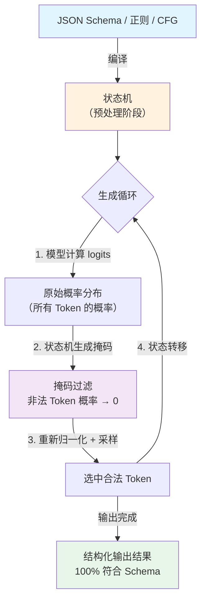

# 结构化输出（Structured Output）

## 概念解释

结构化输出（Structured Output）是一种让 LLM 的生成结果严格遵循预定义数据格式（JSON Schema、正则表达式、上下文无关文法等）的技术。它不是靠"在提示词里说清楚格式"来实现的，而是在模型生成 Token 的过程中，直接把不合规的 Token 屏蔽掉，从根源上杜绝格式错误。

为什么需要它？LLM 本质上是一个"下一个 Token 预测器"，它并不理解什么是合法的 JSON。你在提示词里写"请返回 JSON"，模型大多数时候能给出正确格式，但总有概率漏掉引号、多加一段注释、或者把枚举值写成 Schema 里不存在的字符串。在实验环境里这些小问题可以人工修复，但在生产环境中——每天处理上百万条请求、下游系统直接解析 JSON——任何一次格式错误都会导致流水线中断。

结构化输出的出现，把格式正确性从"概率性保证"提升到了"确定性保证"。它在 Agent 系统中尤其关键：Agent 的工具调用（Tool Use）、状态流转、多 Agent 之间的消息传递，全都依赖格式严格一致的结构化数据。一旦某个 Agent 吐出一段格式不对的 JSON，整条决策链就会断掉。

## 关键结构

结构化输出的实现由三层机制组成，从外到内分别是：

| 结构 | 作用 | 说明 |
|------|------|------|
| Schema 定义层 | 声明"输出长什么样" | 用 JSON Schema、Pydantic、Zod 等定义字段名、类型、枚举值、嵌套关系 |
| 约束解码层 | 强制"输出必须合规" | 在模型逐 Token 生成时，用有限状态机或 Earley 解析器实时屏蔽非法 Token |
| 提示工程层 | 引导"输出内容有意义" | 约束解码只管格式，内容的准确性和合理性仍然需要提示词来引导 |

### 结构 1：Schema 定义层

Schema 是结构化输出的"合同"。它精确描述了输出的每一个字段——名称、类型、是否必填、值域范围、嵌套关系。常见的 Schema 定义方式包括：

- **JSON Schema**：语言无关的标准格式，所有主流 API 都支持，适合跨语言场景
- **Pydantic（Python）**：用 Python 类定义 Schema，自动生成 JSON Schema，同时提供运行时数据验证
- **Zod（TypeScript）**：TypeScript 生态的等价方案，提供端到端的类型安全

Schema 的精确程度直接决定输出质量。一个只写了 `{"type": "object"}` 的 Schema 和一个详细定义了每个字段类型、枚举值、描述文本的 Schema，模型给出的结果天差地别。

### 结构 2：约束解码层

约束解码（Constrained Decoding）是结构化输出的核心技术。它在模型生成每个 Token 之前，检查"哪些 Token 会导致最终输出违反 Schema"，然后把这些 Token 的概率设为 0，只从合法 Token 中采样。

主流的约束解码引擎包括：

- **XGrammar**（MLSys 2025）：将词表 Token 分为"上下文无关"和"上下文相关"两类，99% 的 Token 可以预计算，实现了 CFG 级别的表达力和 FSM 级别的性能
- **llguidance**（Microsoft）：基于 Rust 的约束解码引擎，使用 Earley 解析器处理上下文无关文法，每个 Token 的 CPU 开销约 50 微秒
- **Outlines**：基于有限状态机（FSM）的开源方案，适合正则表达式和简单 JSON Schema 约束

### 结构 3：提示工程层

约束解码保证的是格式正确，但不保证内容正确。同一个 Schema 下，模型可以生成无数种格式都合法但内容质量千差万别的结果。提示工程的作用是引导模型在合法空间内选择最优解：解释每个字段的语义、给出边界条件的处理方式、提供 1-2 个示例。

## 核心原理

### 原理说明

结构化输出的核心机制是**在 Token 采样阶段插入一个约束过滤器**。整个过程分为三步：

**第一步：Schema 预处理。** 在首次请求时，约束解码引擎将 JSON Schema（或正则、CFG）编译成一个状态机。这个状态机记录了"在当前已生成的 Token 序列下，下一个 Token 可以是什么"。例如，当 Schema 规定 `status` 字段只能取 `"success"` / `"pending"` / `"error"` 三个值时，状态机会在生成到 `"status": "` 这个位置时，只允许 `s`、`p`、`e` 三个首字母对应的 Token 通过。

**第二步：逐 Token 约束采样。** 模型照常计算每个 Token 的概率分布（logits）。在采样之前，约束解码引擎根据当前状态机的状态，生成一个掩码向量（mask）：合法 Token 对应的位置为 1，非法 Token 为 0。将 logits 与掩码相乘并重新归一化，得到一个只包含合法 Token 的新概率分布，从中采样。

**第三步：状态转移。** 采样完成后，状态机根据实际选中的 Token 进行状态转移，进入下一轮约束采样。如此循环，直到生成完整的输出。

这种机制的关键优势在于：它将全局的 Schema 约束分解为逐 Token 的局部决策，不需要模型"理解" Schema，而是从物理层面让违规输出不可能出现。

### Mermaid 图解



图中的核心环节是步骤 2（掩码过滤）：它发生在模型计算完概率之后、实际采样之前，是一个纯计算过程，不涉及额外的模型推理，因此开销很小。整个循环每生成一个 Token 执行一次，直到输出完成。

### 运行示例

```python
# 基于 pydantic==2.7+ 和 openai==1.59+ 验证（截至 2026-03）
from pydantic import BaseModel, Field
from enum import Enum
from openai import OpenAI

# 1. 用 Pydantic 定义 Schema
class Sentiment(str, Enum):
    POSITIVE = "positive"
    NEUTRAL = "neutral"
    NEGATIVE = "negative"

class TextAnalysis(BaseModel):
    """文本分析结果"""
    sentiment: Sentiment = Field(description="情感分类")
    confidence: float = Field(ge=0, le=1, description="置信度")
    keywords: list[str] = Field(description="关键词列表")

# 2. 调用 API，通过 response_format 传入 Schema
client = OpenAI()
completion = client.beta.chat.completions.parse(
    model="gpt-4o",
    messages=[{"role": "user", "content": "分析：这家餐厅的牛排非常好吃，服务态度也很棒"}],
    response_format=TextAnalysis,  # SDK 自动转换为 JSON Schema + strict: true
)

# 3. 输出已保证符合 Schema，直接使用
result = completion.choices[0].message.parsed
print(result.sentiment)   # Sentiment.POSITIVE
print(result.confidence)  # 0.92
print(result.keywords)    # ['牛排', '好吃', '服务态度', '棒']
```

上述代码展示了结构化输出的三步核心流程：定义 Schema、通过 API 参数传入约束、直接使用类型安全的解析结果。`response_format=TextAnalysis` 这一行让 SDK 自动将 Pydantic 模型转为 JSON Schema 并启用严格模式（`strict: true`），约束解码在服务端完成。

## 易混概念辨析

| 概念 | 与结构化输出的区别 | 更适合关注的重点 |
|------|---------------------|------------------|
| JSON Mode | 只保证输出是合法 JSON，但不保证符合任何 Schema | 输出是否为合法 JSON |
| Function Calling | 本质上是结构化输出的一个特例，专用于工具调用场景 | 模型是否应该调用某个工具、传什么参数 |
| Prompt 格式约束 | 纯靠提示词引导格式，没有 Token 级别的强制约束 | 模型理解力足够时的轻量级方案 |
| Output Parser | 后处理阶段的格式解析和验证，不干预生成过程 | 对接不支持原生约束解码的模型时的兜底方案 |

核心区别：

- **结构化输出**：在 Token 生成阶段强制约束，格式正确是物理保证，不存在"格式错了再修"的问题
- **JSON Mode**：只保证大括号、引号这些 JSON 语法正确，但字段名、字段类型、枚举值全不管
- **Function Calling**：Schema 约束的是函数参数而非自由响应，模型还可以选择"不调用任何函数"
- **Output Parser**：在生成完成后才介入，如果模型已经吐出不合规的内容，Parser 只能尝试修复或报错

## 适用边界与局限

### 适用场景

1. **数据抽取流水线**：从非结构化文本（简历、商品页面、医学报告）中提取信息并灌入数据库。Schema 约束保证每条记录的字段完整、类型正确，省去大量后处理逻辑。
2. **Agent 工具调用与状态管理**：多 Agent 系统中，每个 Agent 的输出必须是格式严格一致的 JSON，下游 Agent 才能正确解析。一次格式错误就会导致整条决策链中断。
3. **分类与标签系统**：情感分析、内容审核、意图识别等任务中，输出必须是预定义的枚举值加置信度分数，不允许出现"有点正面"这类模糊值。
4. **API 集成与自动化**：LLM 生成的结果直接作为 API 请求体发送给下游服务，格式错误意味着 API 调用失败。

### 不适合的场景

1. **开放式创意写作**：写诗、写故事、写营销文案——这些任务需要模型自由发挥，用 Schema 约束反而限制了表达力。
2. **探索性对话**：用户和 AI 自由聊天的场景，输出格式不固定，强加 Schema 没有意义。

### 局限性

1. **复杂 Schema 的质量权衡**：当 Schema 超过 30-50 个字段、嵌套层级很深时，模型会把更多"注意力"分配给格式遵循，内容质量可能下降。解决方案是将复杂 Schema 拆分为多次调用。
2. **递归结构的引擎限制**：如果 Schema 包含递归定义（如评论的回复还是评论），基于 FSM 的引擎（Outlines）无法处理，必须使用 CFG 级别的引擎（XGrammar、llguidance）。
3. **推理成本微增**：约束解码通常增加 5-10% 的推理时间。在每天百万级请求的场景中，这个成本需要纳入预算。不过 XGrammar 等新引擎已经将开销压到接近零。
4. **Schema 无法约束语义正确性**：Schema 能保证 `age` 字段是整数且在 0-150 之间，但不能保证模型填入的年龄是事实正确的。语义层面的正确性仍然依赖提示工程和 RAG 等技术。

## 常见误区

| 常见误区 | 正确理解 |
|----------|----------|
| "结构化输出就是让模型输出 JSON" | JSON Mode 只保证语法合法，结构化输出进一步保证内容符合指定 Schema（字段名、类型、枚举值、嵌套关系全部强制约束）。两者差了一个层级。 |
| "提示词写清楚格式就够了，不需要约束解码" | 提示词约束是"建议"，模型可以不听；约束解码是"物理限制"，模型不可能违反。在生产环境中，99% 的成功率和 100% 的成功率有本质区别。 |
| "约束解码会严重拖慢推理速度" | 2025 年后的引擎（XGrammar、llguidance）已将开销压到每 Token 50 微秒以内，对端到端延迟的影响可以忽略。某些情况下约束解码反而加快生成，因为模型不再需要"犹豫"格式问题。 |
| "结构化输出可以取代 Function Calling" | 两者定位不同。Function Calling 允许模型决定"是否调用工具"，结构化输出强制模型返回固定格式。Agent 系统中通常两者配合使用：Function Calling 决定调用哪个工具，结构化输出约束工具参数的格式。 |

## 思考题

<details>
<summary>初级：约束解码和 JSON Mode 的区别是什么？为什么说 JSON Mode 不等于结构化输出？</summary>

**参考答案：**

JSON Mode 只保证输出是语法合法的 JSON（大括号匹配、引号正确等），但不关心 JSON 的内容是否符合任何 Schema。模型可能遗漏必填字段、生成错误的字段类型、或使用 Schema 中不存在的枚举值。结构化输出通过约束解码，在 Token 生成阶段强制输出符合指定的 JSON Schema，字段名、类型、枚举值、嵌套关系全部受到约束。两者的关系是：结构化输出包含了 JSON Mode 的能力，但反过来不成立。

</details>

<details>
<summary>中级：一个电商数据抽取系统每天处理 50 万条商品描述，Schema 有 15 个字段。如果不用结构化输出，你需要哪些额外机制来保证数据质量？用了之后可以省掉哪些？</summary>

**参考答案：**

不用结构化输出时，需要：(1) 后处理 JSON 解析器，处理模型输出的非法 JSON（缺引号、多余注释等）；(2) Schema 验证层，检查字段是否齐全、类型是否正确；(3) 重试机制，验证失败时重新调用模型；(4) 兜底逻辑，多次重试仍失败时的降级处理。使用结构化输出后，(1)(2)(3) 可以完全省掉，因为输出在物理上保证符合 Schema。(4) 仍然需要保留，用于处理模型拒绝回答（refusal）或请求超时等异常情况。此外，业务层面的语义验证（如价格不为负、评分在 1-5 之间）如果 Schema 已经用 `minimum` / `maximum` 定义了范围，也可以省掉。

</details>

<details>
<summary>中级/进阶：你正在设计一个多 Agent 系统，Agent A 的输出是 Agent B 的输入。Schema 包含一个递归结构（任务可以有子任务，子任务还可以有子任务）。你会选择什么约束解码引擎？如果选错了会怎样？</summary>

**参考答案：**

递归结构（`$ref` 自引用）超出了正则表达式和有限状态机（FSM）的表达能力，因此 Outlines 等基于 FSM 的引擎要么直接拒绝该 Schema，要么将递归展平到固定深度（比如最多 3 层），无法处理任意深度的嵌套。正确选择是使用基于上下文无关文法（CFG）的引擎，如 XGrammar（使用预计算位掩码 + 运行时栈检查）或 llguidance（使用 Earley 解析器）。如果选错了引擎但没有发现，系统可能在浅层嵌套时正常工作，但在实际数据中遇到深层嵌套时静默截断或生成不符合 Schema 的输出，导致 Agent B 解析失败、整条决策链中断。

</details>

## 参考资料

1. OpenAI. "Structured model outputs". https://developers.openai.com/api/docs/guides/structured-outputs
2. OpenAI. "Introducing Structured Outputs in the API". https://openai.com/index/introducing-structured-outputs-in-the-api/
3. Aidan Cooper. "A Guide to Structured Outputs Using Constrained Decoding". https://www.aidancooper.co.uk/constrained-decoding/
4. Michael Brenndoerfer. "Constrained Decoding: Grammar-Guided Generation for Structured LLM Output". https://mbrenndoerfer.com/writing/constrained-decoding-structured-llm-output
5. Dataiku. "Taming LLM Outputs: Your Guide to Structured Text Generation". https://www.dataiku.com/stories/blog/your-guide-to-structured-text-generation
6. Let's Data Science. "How Structured Outputs and Constrained Decoding Work". https://www.letsdatascience.com/blog/structured-outputs-making-llms-return-reliable-json
7. DEV Community. "LLM Structured Output in 2026: Stop Parsing JSON with Regex and Do It Right". https://dev.to/pockit_tools/llm-structured-output-in-2026-stop-parsing-json-with-regex-and-do-it-right-34pk

---
