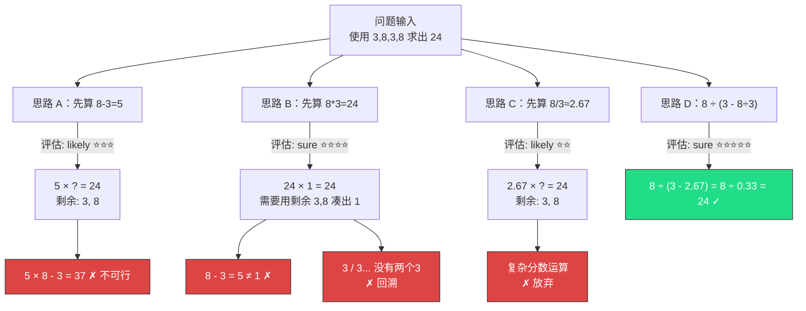

# 思维树（Tree-of-Thought, ToT）

## 概念解释

思维树（Tree-of-Thought，简称 ToT）是一种提示工程框架，核心思想是让大语言模型在推理过程中，不再只走一条线性路径，而是像一棵树一样同时展开多条推理分支，对每条分支进行评估打分，保留有希望的方向、放弃死胡同，最终找到最优解。

最直白的类比：下棋。新手一步一步往下走，走错了只能硬着头皮继续（这就是 CoT）。而高手会在脑子里同时推演好几种走法，哪条路看起来最有利就重点推进，哪条路明显要输就及时放弃换一条（这就是 ToT）。

ToT 由 Princeton 和 Google DeepMind 的研究团队在 2023 年提出（Yao 等人，NeurIPS 2023）。论文的核心实验结果非常有说服力：在经典的 "24 点游戏"上，GPT-4 配合 CoT 的成功率仅 4%，而配合 ToT 的成功率达到了 74%——这说明对于需要"试错 + 回溯"的问题，线性推理远远不够，必须引入树形搜索。

在 Agent 系统和复杂 AI 应用中，ToT 常被用于规划决策、复杂推理、创意生成等场景。它是 CoT 的直接升级版，也是后续 GoT（图思维）等更复杂推理框架的基础。

## 关键结构

ToT 框架由四个核心组件配合工作：

| 结构 | 作用 | 说明 |
|------|------|------|
| 思路分解器（Thought Decomposer） | 定义"一步思考"的粒度 | 决定树中每个节点代表什么——一步计算、一段情节、一个决策 |
| 思路生成器（Thought Generator） | 在当前节点产生多个候选分支 | 每个节点通常生成 2-5 个不同方向的候选思路 |
| 状态评估器（State Evaluator） | 给每个候选分支打分 | 判断"这条路走得通吗"，标记为 sure / likely / impossible |
| 搜索算法（Search Algorithm） | 决定先探索哪条路、何时回溯 | 常用 BFS（广度优先）或 DFS（深度优先） |

### 结构 1：思路分解器

思路分解器定义了"一个思路节点"到底包含多大的内容。粒度的选择直接影响搜索效率：

- **数学问题**：一个节点 = 一步算式（如 "8 / (3 - 8/3)"）
- **创意写作**：一个节点 = 一段情节描述（如 "主角决定离开家乡"）
- **规划任务**：一个节点 = 一个子目标（如 "先确认退货原因"）

粒度太粗，树分支太少，搜索不到好结果；粒度太细，节点太多，搜索爆炸。通常需要根据具体问题调整。

### 结构 2：思路生成器

思路生成器负责在当前状态下生成多个不同方向的候选思路。Yao 等人的论文中使用了两种生成策略：

- **采样式（Sample）**：对同一提示词多次采样（temperature > 0），利用随机性获得多样化结果。适合思路空间丰富的问题。
- **提议式（Propose）**：用一条提示词让模型一次性列出多个候选方案。适合思路空间相对有限的问题。

生成器的多样性至关重要——如果所有候选思路都大同小异，搜索就退化成了线性推理。

### 结构 3：状态评估器

状态评估器是 ToT 的"裁判"，决定了哪些分支值得继续、哪些应该剪掉。评估方式有两种：

- **数值评估（Value）**：给每个状态打 1-10 分或 0-1 的概率值，按分数排序选择
- **投票评估（Vote）**：把所有候选方案展示给模型，让它投票选"最有希望的那个"

评估不需要完全精确——只要能把"明显走不通的路"和"值得继续的路"区分开就够了。

### 结构 4：搜索算法

两种主要策略各有适用场景：

| 算法 | 工作方式 | 适合场景 | 特点 |
|------|---------|---------|------|
| BFS（广度优先） | 逐层展开，每层保留最优的 b 个节点 | 问题层数浅、需要全面比较 | 找到的解质量高，但内存开销大 |
| DFS（深度优先） | 沿最优分支一路深入，死胡同时回溯 | 问题层数深、搜索空间大 | 内存开销小，但可能错过全局最优 |

原论文中，24 点游戏用 BFS（需要比较不同运算组合），填字游戏用 DFS（需要深入验证每个词的可行性）。

## 核心原理

### 原理说明

ToT 的核心机制可以用一句话概括：**把 LLM 的推理过程从"一条线"升级为"一棵树"，在树上用搜索算法寻找最优推理路径。**

具体工作流程：

1. **输入问题**，思路分解器确定每步推理的粒度
2. **生成候选**：在当前节点，思路生成器产生 k 个不同方向的候选思路
3. **评估打分**：状态评估器对每个候选思路打分，标记可行性
4. **搜索决策**：搜索算法根据评分决定——继续深入（分数高）还是回溯换路（分数低/走不通）
5. **重复 2-4**，直到达到最大深度或找到满意的解
6. **返回最优路径**：从所有探索过的完整路径中，选择评分最高的作为最终答案

与 CoT 的根本区别在于两点：
- **多路并行**：每步不只生成一个想法，而是同时考虑多种可能
- **评估回溯**：走不通的路可以放弃退回来，而不是硬着头皮走到底

### Mermaid 图解



图中展示了 ToT 解决 24 点问题的过程：
- 根节点是原始问题，第一层展开了 4 条不同的运算思路
- 每条思路都经过状态评估器打分（星级表示可行性）
- 思路 A/B/C 在深入后遇到死胡同（红色节点），搜索回溯
- 思路 D 成功算出 24（绿色节点），被选为最终答案
- 关键点：如果用 CoT 线性推理，模型走了思路 A 就只能硬撑到底；而 ToT 能在发现走不通时切换到思路 D

### 运行示例

以下是一个简化的 ToT 推理核心逻辑，展示"生成-评估-搜索"的协作机制。

```python
# 基于 openai>=1.0.0 验证（截至 2026-03）
from openai import OpenAI

client = OpenAI()

def tot_solve(problem: str, depth: int = 2, breadth: int = 3) -> str:
    """简化版 ToT 求解器：生成 → 评估 → 选择最优路径"""

    current_state = problem

    for step in range(depth):
        # 第一步：生成多个候选思路
        gen_resp = client.chat.completions.create(
            model="gpt-4",
            messages=[{"role": "user", "content": (
                f"问题：{problem}\n当前状态：{current_state}\n"
                f"请提出 {breadth} 个不同的下一步解题思路，用编号列出。"
            )}],
            temperature=0.7  # 提高温度增加多样性
        )
        candidates = gen_resp.choices[0].message.content

        # 第二步：评估每个候选思路
        eval_resp = client.chat.completions.create(
            model="gpt-4",
            messages=[{"role": "user", "content": (
                f"问题：{problem}\n以下是几个候选思路：\n{candidates}\n"
                f"请评估每个思路的可行性（sure/likely/impossible），"
                f"并选出最有希望的一个。只输出被选中的思路内容。"
            )}],
            temperature=0.3  # 降低温度使评估更稳定
        )
        current_state = eval_resp.choices[0].message.content

    return current_state

# 调用示例
answer = tot_solve("使用数字 3, 8, 3, 8 和 +, -, *, / 求出 24")
print(answer)
```

上述代码实现了 ToT 的最小闭环：每一步生成多个候选 → 评估选最优 → 作为下一步输入。完整实现还需加入回溯机制、搜索队列管理和剪枝策略，此处省略以突出核心流程。

## 易混概念辨析

| 概念 | 与 ToT 的区别 | 更适合关注的重点 |
|------|--------------|------------------|
| CoT（思维链） | 线性推理，一条路走到底，无法回溯 | 适合推理步骤明确、不需要试错的问题 |
| CoT-SC（自一致性） | 多次独立采样后投票选最多数答案，各次采样之间没有交互 | 适合答案离散、可以用投票机制的问题 |
| GoT（图思维） | 允许多个思路节点互相合并（多对多关系），而 ToT 只有父子关系（一对多） | 适合思路之间有复杂依赖和聚合需求的问题 |
| Self-Consistency | 同样基于多次采样，但不做中间评估，只在最终答案层面投票 | 实现简单、计算开销比 ToT 低 |

核心区别：

- **ToT**：关注的是"在推理过程中系统性地搜索和回溯"，每一步都有评估和选择
- **CoT**：关注的是"把推理过程写出来"，但只走一条路，没有分支和回溯
- **CoT-SC**：关注的是"用多次独立采样对冲随机性"，各路推理互不影响
- **GoT**：关注的是"思路之间的任意连接和聚合"，结构比树更灵活，是 ToT 的进一步泛化

## 适用边界与局限

### 适用场景

1. **需要试错和回溯的问题**：如数学谜题（24 点）、填字游戏、逻辑推理题。这类问题的特点是中间某一步走错了，后面就全盘皆输，必须回溯重来。ToT 原论文在 24 点上成功率从 CoT 的 4% 提升到 74%，正是因为这类问题天然需要搜索。

2. **创意生成与规划任务**：如故事写作、方案设计、项目规划。这类问题没有唯一正确答案，但需要在多种可能方向中选出最好的一个。ToT 的"生成多选项 → 评估 → 深入最优"的流程天然适合。

3. **决策空间有限但深度较大的问题**：搜索树的规模 = 分支数^深度。当每步只有 3-5 个合理选择、但需要推理 3-5 步时，ToT 的搜索开销可控，收益显著。

### 不适合的场景

1. **简单直接的问答**：如知识检索、翻译、摘要生成。这些任务不需要探索多条路径，用 CoT 甚至直接提问就够了，上 ToT 是杀鸡用牛刀。

2. **实时交互场景**：ToT 每一步要调用多次 LLM（生成 + 评估），总调用次数是 CoT 的 5-100 倍。在要求毫秒级响应的聊天机器人或实时推荐系统中，这个延迟不可接受。

### 局限性

1. **计算成本高**：一棵深度 3、分支数 3 的树，最多需要调用 LLM 数十次（生成 + 评估）。每次调用都消耗 Token 和时间，成本是 CoT 的一个数量级以上。

2. **评估器质量决定上限**：如果状态评估器不准确（把好思路判为差、差思路判为好），整个搜索就会被误导。对于开放式问题（如创意写作），设计准确的评估器非常困难。

3. **结果稳定性差**：多次运行同一问题可能得到不同答案，因为每次生成和评估都有随机性。需要稳定输出的场景（如医疗诊断辅助）要谨慎使用。

4. **提示词设计门槛高**：思路生成器和评估器的提示词质量直接影响效果。措辞不当可能导致生成的思路缺乏多样性，或评估打分偏差严重。

## 常见误区

| 常见误区 | 正确理解 |
|----------|----------|
| ToT 就是让模型生成多个答案然后投票 | 投票是 Self-Consistency 的做法。ToT 的核心是树形搜索——每一步都评估、每一步都可以回溯，不是在最终答案层面投票 |
| 用了 ToT 一定比 CoT 效果好 | ToT 的优势体现在需要探索和回溯的复杂问题上。对于线性推理就能解决的问题，CoT 更高效，ToT 反而增加成本和复杂度 |
| ToT 必须写代码实现复杂的搜索算法 | 简化版 ToT 可以纯用提示词实现——让模型"列出 3 个思路 → 评估各思路 → 选最优继续"，不需要任何代码 |
| 评估器必须给出精确分数 | 评估器只需要能区分"明显不可行"和"值得继续"就够了。过度追求精确评分反而增加计算成本，且 LLM 本身也给不出真正精确的数值评估 |

## 思考题

<details>
<summary>初级：ToT 和 CoT 的根本区别是什么？为什么说 CoT 是 ToT 的特例？</summary>

**参考答案：**

CoT 是线性推理，每一步只生成一个想法，串联成一条链。ToT 是树形推理，每一步生成多个候选想法，通过评估和搜索选择最优路径，并支持回溯。如果把 ToT 的分支数设为 1、去掉评估和回溯，它就退化成了 CoT。所以 CoT 是 ToT 的一个特例——只有一条分支的"退化树"。

</details>

<details>
<summary>中级：在什么条件下应该选 BFS 而不是 DFS？反过来呢？</summary>

**参考答案：**

选 BFS 的条件：问题的推理深度较浅（2-3 层），但每层需要仔细比较不同方案的优劣。BFS 逐层展开，能保证在有限深度内找到最优解。典型场景如 24 点游戏。

选 DFS 的条件：问题的搜索空间很大、推理深度较深，但可以通过局部评估快速判断某条路是否可行。DFS 沿最优分支深入，遇到死胡同快速回溯，内存开销小。典型场景如填字游戏——需要验证每个词放上去后后续是否可行。

核心判断依据：搜索空间大 + 深度深用 DFS，搜索空间小 + 需要全面比较用 BFS。

</details>

<details>
<summary>中级/进阶：假设你需要用 ToT 帮用户做旅行规划（3 天行程，每天 3 个景点），请设计思路分解粒度、搜索策略和评估标准。</summary>

**参考答案：**

思路分解粒度：一个节点 = 一天的景点安排（包含 3 个景点及顺序）。树共 3 层，每层代表一天。

搜索策略：选 BFS。因为树深度只有 3 层，且每天的安排会影响后续几天（比如第一天去了东区，第二天就不该再安排东区），需要逐层比较不同组合。

评估标准：
- 景点多样性（是否覆盖了不同类型：自然、文化、美食）
- 地理连贯性（同一天的景点是否在附近，不用来回奔波）
- 时间合理性（每天的安排是否留了吃饭和休息时间）
- 与用户偏好的匹配度（预算、体力、兴趣方向）

每天生成 3-5 个候选安排，用上述维度评估打分，保留前 2 个进入下一层。

</details>

## 参考资料

1. Yao, S., Yu, D., Zhao, J., Shafran, I., Griffiths, T. L., Cao, Y., & Narasimhan, K. (2023). "Tree of Thoughts: Deliberate Problem Solving with Large Language Models." *NeurIPS 2023*. [arxiv.org/abs/2305.10601](https://arxiv.org/abs/2305.10601)

2. Tree of Thoughts (ToT) | Prompt Engineering Guide. [promptingguide.ai/techniques/tot](https://www.promptingguide.ai/techniques/tot)

3. Princeton NLP Group. GitHub 官方实现仓库. [github.com/princeton-nlp/tree-of-thought-llm](https://github.com/princeton-nlp/tree-of-thought-llm)

4. Besta, M., et al. (2024). "Demystifying Chains, Trees, and Graphs of Thoughts." [arxiv.org/abs/2401.14295](https://arxiv.org/abs/2401.14295)

5. Helicone Blog. "Tree-of-Thought Prompting: Key Techniques and Use Cases." [helicone.ai/blog/tree-of-thought-prompting](https://www.helicone.ai/blog/tree-of-thought-prompting)
