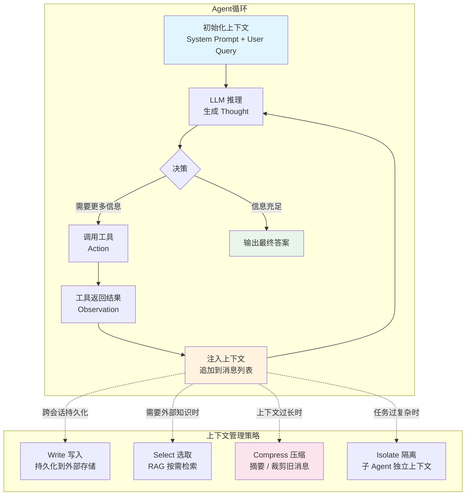

# 上下文与 Agent（Context & Agent）

## 概念解释

上下文工程（Context Engineering）是一套在 Agent 运行过程中，动态管理"模型能看到什么信息"的系统工程方法。它不是写一句好的提示词就完事，而是要回答一个更大的问题：在每一步推理时，哪些信息应该送进模型的上下文窗口，哪些应该丢掉或压缩？

为什么需要它？因为 Agent 不是"问一句答一句"的聊天机器人。Agent 会循环执行多个步骤——思考、调用工具、拿到结果、再思考。每走一步，上下文就会膨胀一点。如果不管理，上下文会越来越长，最终撞上 Token 上限，或者关键信息被淹没在噪声里，模型注意力分散，推理质量直线下降。

打个比方：LLM 就像 CPU，上下文窗口就像 RAM。RAM 容量有限，不可能把硬盘上的所有数据一股脑塞进去。上下文工程扮演的角色类似操作系统的内存管理器——决定什么数据该加载到 RAM、什么该换出去、什么该压缩存储。这个比喻来自 Andrej Karpathy，非常准确地抓住了上下文工程的本质。

## 关键结构

Agent 运行时的上下文由六个层次的信息组成，每层承担不同职责：

| 层次 | 内容 | 作用 |
|------|------|------|
| 系统规则层 | System Prompt，包括角色定义、行为约束、输出格式 | 整个上下文的"宪法"，优先级最高 |
| 记忆层 | 长期记忆、跨会话记忆 | 让 Agent 记住历史交互中的关键信息 |
| 检索层 | RAG 召回的外部文档片段 | 补充模型训练数据中没有的知识 |
| 工具层 | 工具描述（Tool Schema）+ 工具调用结果 | 告诉模型有什么工具可用，以及工具返回了什么 |
| 对话层 | 近期对话历史 | 维持多轮对话的连贯性 |
| 任务层 | 当前用户请求 + 中间推理状态 | 本次任务的核心输入 |

### 层次 1：系统规则层

System Prompt 不只是给模型贴一个"你是 XX 助手"的标签。在 Agent 架构中，它需要明确定义：Agent 的身份与目标、可用工具清单及用途说明、Thought / Action / Observation 的格式约定、循环终止条件。它是上下文的"基础层"，后续所有信息都在它的框架下被解读。

### 层次 2：工具层——最容易出错的环节

Agent 调用工具后，工具返回的结果必须被追加到上下文中，成为后续推理的输入。这个步骤叫"工具结果注入"（Tool Result Injection）。常见错误是只打印了工具返回值，但没有把它追加到消息列表里——下一轮推理时，模型根本看不到这个结果，等于白调用。

### 层次 3：记忆层与检索层

记忆层存储 Agent 跨会话积累的信息（比如用户偏好、历史决策）。检索层通过 RAG 等技术在推理时动态拉取外部知识。两者的共同点是：它们的内容不是一直驻留在上下文里的，而是按需加载。

## 核心原理

### 原理说明

Agent 的上下文管理本质上是一个"信息生命周期管理"问题。一条信息从产生到被模型消费，经历四个阶段：

1. **写入（Write）**：将信息持久化到外部存储。Agent 在执行过程中把关键中间结果、用户偏好等写入文件系统或数据库，不占用上下文窗口。Anthropic 的 Memory 工具就是这个思路——用文件系统做 Agent 的"硬盘"。

2. **选取（Select）**：按需从外部检索相关信息。不是把整个知识库塞进上下文，而是用 RAG 只检索当前任务相关的片段。关键在于检索的精度——召回太多不相关内容会污染上下文。

3. **压缩（Compress）**：对上下文中的冗长内容做摘要。典型做法是保留最近 5-7 轮完整对话，将更早的对话压缩成摘要。Claude Code 在上下文使用率超过 95% 时会自动触发压缩（auto-compact），把整个交互轨迹浓缩成摘要。

4. **隔离（Isolate）**：用子 Agent 架构隔离上下文。不让一个 Agent 扛所有任务，而是拆分成多个专门化的子 Agent，每个子 Agent 用干净的上下文窗口处理自己负责的子任务，最后汇总结果。

这四种策略不是互斥的，实际系统中通常组合使用。

### Mermaid 图解



图中左侧是 Agent 的核心循环：初始化 → 推理 → 决策 → 工具调用 → 结果注入 → 再推理。右侧是四种上下文管理策略，在循环运行过程中按需介入。关键的信息流转发生在"注入上下文"这个节点——工具结果必须被追加到消息列表，否则模型在下一步推理时看不到这个结果。

### 运行示例

```python
# 最小示例：Agent 循环中的上下文管理
# 基于 anthropic SDK（截至 2026-03）
# 仅展示核心机制，工具调用使用模拟数据

from typing import List, Dict


class AgentContext:
    """Agent 上下文管理器"""

    def __init__(self, system_prompt: str):
        self.system_prompt = system_prompt
        self.messages: List[Dict] = []  # 消息列表就是上下文的核心载体
        self.step_count = 0

    def add_user_message(self, text: str):
        """用户输入 → 追加到上下文"""
        self.messages.append({"role": "user", "content": text})

    def add_assistant_message(self, text: str):
        """模型回复 → 追加到上下文"""
        self.messages.append({"role": "assistant", "content": text})

    def inject_tool_result(self, tool_name: str, result: str):
        """工具结果注入 —— 上下文工程最关键的一步
        工具返回的结果必须被追加到消息列表，
        否则下一轮推理时模型看不到这个结果"""
        self.messages.append({
            "role": "user",
            "content": f"[Observation] {tool_name} 返回: {result}"
        })
        self.step_count += 1

    def compress_if_needed(self, max_messages: int = 20):
        """简易压缩策略：保留系统提示 + 最近 N 条消息，
        将更早的消息压缩成一条摘要"""
        if len(self.messages) <= max_messages:
            return
        # 保留最近的消息
        old_msgs = self.messages[:-max_messages]
        recent_msgs = self.messages[-max_messages:]
        # 将旧消息压缩为摘要（实际系统会用 LLM 做摘要）
        summary = f"[历史摘要] 前 {len(old_msgs)} 条消息的要点：..."
        self.messages = [{"role": "user", "content": summary}] + recent_msgs


# 使用示例
ctx = AgentContext(system_prompt="你是一个研究助手，可以使用 search 工具。")
ctx.add_user_message("Python 的 Agent 框架有哪些？")
# 模型决定调用 search 工具
ctx.add_assistant_message("Thought: 需要搜索最新的 Agent 框架\nAction: search('Python Agent frameworks')")
# 工具结果注入上下文 —— 这一步不能省
ctx.inject_tool_result("search", "LangGraph, CrewAI, AutoGen, OpenAI Agents SDK ...")
# 此时 ctx.messages 包含 3 条消息，模型下一轮推理能看到搜索结果
```

上面的 `inject_tool_result` 方法是上下文工程的核心机制：把工具结果追加到 `messages` 列表。`compress_if_needed` 方法展示了最简单的压缩策略——保留近期消息，摘要旧消息。实际生产系统中，压缩逻辑会更复杂，通常会调用 LLM 来生成高质量摘要。

## 易混概念辨析

| 概念 | 与上下文工程的区别 | 更适合关注的重点 |
|------|---------------------|------------------|
| 提示词工程（Prompt Engineering） | 关注单条提示词的措辞优化，是静态的、一次性的；上下文工程关注整个信息环境的动态管理 | 怎么把一个问题问得更好 |
| RAG（检索增强生成） | RAG 是上下文工程的一个子策略（对应"Select"环节），只解决"从外部拉取知识"这一个问题 | 外部知识的检索与注入 |
| Memory（记忆机制） | Memory 解决的是信息的跨会话持久化，是上下文工程中"Write"策略的具体实现 | 怎么让 Agent 记住历史信息 |
| Token 管理 | Token 管理偏底层，关注的是 Token 用量和成本；上下文工程偏上层，关注的是信息质量和组织方式 | Token 计数、成本控制 |

核心区别：

- **上下文工程**：系统级的信息管理，回答"模型该看到什么信息"
- **提示词工程**：指令级的措辞优化，回答"这句话怎么写更好"
- **RAG / Memory**：都是上下文工程的子策略，分别解决"外部知识注入"和"历史信息持久化"

## 适用边界与局限

### 适用场景

1. **多步推理任务**：Agent 需要循环调用工具、逐步积累信息的场景（如研究助手、代码生成与调试），上下文工程保证每一步的工具结果都能被下一步利用
2. **多 Agent 协作系统**：多个 Agent 分工合作时，需要标准化的上下文传递机制（如 MCP 协议），避免信息孤岛
3. **长时间运行的 Agent**：任务执行时间长、工具调用次数多的场景，必须有压缩和写入策略防止上下文爆炸

### 不适合的场景

1. **单轮问答**：如果任务只需要一次 LLM 调用就能完成，传统的提示词工程就够了，上下文工程是过度设计
2. **上下文窗口完全够用的简单任务**：如果整个对话历史加起来远小于模型的 Token 上限，不需要额外的上下文管理策略

### 局限性

1. **Token 成本线性增长**：Agent 每多走一步，上下文就多一截，API 调用费用随之增加。Manus 团队的数据显示，其 Agent 的平均输入输出 Token 比例约为 100:1
2. **压缩带来信息损失**：摘要不可能百分之百保留原始信息，关键细节可能在压缩过程中丢失
3. **"迷失在中间"效应（Lost in the Middle）**：即使信息在上下文窗口内，模型对中间位置的信息关注度也会下降，注意力呈 U 形曲线分布

## 常见误区

| 常见误区 | 正确理解 |
|----------|----------|
| 工具调用后打印了结果就行 | 打印不等于注入。工具结果必须被追加到消息列表（messages），否则下一轮推理时模型看不到。这是最常见的 Agent 实现 bug |
| 上下文越长越好，信息越全面越好 | 上下文过长会导致推理变慢、注意力分散、成本飙升。正确做法是只保留当前任务相关的高质量信息，用压缩和选取策略控制上下文长度 |
| 上下文管理只是 Agent 内部的事 | 在多 Agent 系统中，上下文管理是系统级问题，涉及 Agent 间的信息传递、状态同步、通信协议设计。只关注单个 Agent 内部是不够的 |
| 上下文工程 = 高级版提示词工程 | 提示词工程关注"一句话怎么写"，上下文工程关注"整个信息环境怎么建"。两者的工程粒度完全不同，上下文工程是系统架构层面的工作 |

## 思考题

<details>
<summary>初级：为什么 Agent 循环中"工具结果注入上下文"这一步不能省略？如果省略会发生什么？</summary>

**参考答案：**

如果工具结果没有被追加到消息列表（messages），那么在下一轮调用 LLM 时，模型的上下文窗口中不包含这个结果。模型会表现得好像工具从未被调用过一样——要么重复调用同一个工具，要么基于不完整的信息给出错误答案。这是 Agent 实现中最常见的 bug 之一。

</details>

<details>
<summary>中级：一个 Agent 执行了 30 步后上下文接近 Token 上限，应该怎么处理？请列出至少两种策略并说明各自的取舍。</summary>

**参考答案：**

策略一：压缩（Compress）——保留最近 5-7 轮完整对话，将更早的消息调用 LLM 生成摘要替代。优点是实现简单；缺点是摘要可能丢失关键细节。策略二：隔离（Isolate）——将任务拆分给多个子 Agent，每个子 Agent 用干净的上下文窗口处理子任务。优点是每个子 Agent 的上下文保持精简；缺点是需要设计子 Agent 间的信息汇总机制，架构复杂度增加。策略三：写入（Write）——将中间结果持久化到外部文件或数据库，从上下文中移除，需要时再检索加载。优点是上下文始终保持精简；缺点是需要额外的存储和检索基础设施。

</details>

<details>
<summary>中级/进阶：在一个多 Agent 系统中（如"收集 Agent + 分析 Agent + 报告 Agent"），如何设计上下文传递机制？需要考虑哪些问题？</summary>

**参考答案：**

核心问题是：上游 Agent 的输出如何成为下游 Agent 的输入。设计时需要考虑：(1) 传递什么——不能把上游 Agent 的完整上下文全部传递，应该只传递结论性信息（如结构化的分析结果），避免上下文污染；(2) 用什么格式——需要定义标准化的消息格式，让下游 Agent 能正确解析上游传来的信息；(3) 状态同步——如果分析 Agent 发现收集的信息不足，是否能回传请求让收集 Agent 补充数据；(4) 容错——某个 Agent 执行失败时，其已产出的上下文是否可以被其他 Agent 复用，还是需要重新执行。在工程实现上，可以使用 MCP 等标准化协议，也可以用共享上下文池（Shared Context Pool）的方式实现。

</details>

## 参考资料

1. Anthropic. "Effective context engineering for AI agents." https://www.anthropic.com/engineering/effective-context-engineering-for-ai-agents

2. Manus. "Context Engineering for AI Agents: Lessons from Building Manus." https://manus.im/blog/Context-Engineering-for-AI-Agents-Lessons-from-Building-Manus

3. Weaviate. "Context Engineering - LLM Memory and Retrieval for AI Agents." https://weaviate.io/blog/context-engineering

4. LangChain. "Context Engineering for Agents." https://blog.langchain.com/context-engineering-for-agents/

5. Getmaxim. "Context Window Management: Strategies for Long-Context AI Agents and Chatbots." https://www.getmaxim.ai/articles/context-window-management-strategies-for-long-context-ai-agents-and-chatbots/

6. Google Developers Blog. "Architecting efficient context-aware multi-agent framework for production." https://developers.googleblog.com/architecting-efficient-context-aware-multi-agent-framework-for-production/

---
