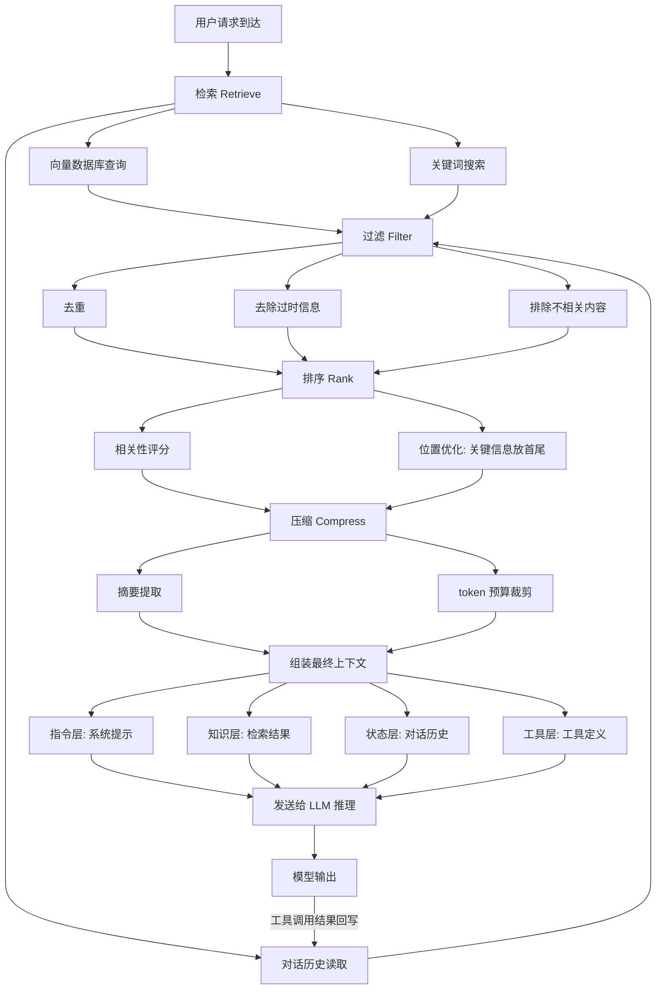

# 上下文构建策略（Context Building Strategy）

## 概念解释

上下文构建策略是指在运行时动态筛选、排序和组装提供给 LLM 的全部信息，使模型在每次推理时都能拿到与当前任务最相关的背景知识、工具定义和历史状态。它不是"写一条好提示词"，而是"搭建一整套信息供给系统"。

这个概念出现的背景是：早期开发者花大量精力调措辞、改提示词，但实际效果有限。大多数 LLM 应用的失败并非模型能力不足，而是模型拿到的信息不对——要么缺失关键背景，要么塞了太多无关内容，要么工具列表和任务不匹配。2025 年 Gartner 明确提出"上下文工程取代提示工程"，认为管理模型看到的信息比优化措辞更重要。

与传统的提示工程（Prompt Engineering）相比，提示工程关注的是"怎么对模型说话"，而上下文构建策略关注的是"让模型看到什么"。前者处理的是一段静态文本，后者处理的是一个动态组装系统——在运行时根据任务类型、用户状态、检索结果，程序化地决定哪些文件、文档、历史记录、工具定义应该进入上下文窗口，哪些应该被排除。

## 关键结构

上下文构建策略由四个层次组成，每个层次负责不同类型的信息供给：

| 层次 | 作用 | 更新频率 |
|------|------|----------|
| 指令层（Instruction Layer） | 系统提示、角色定义、行为约束、输出格式 | 应用启动时确定，整个会话基本不变 |
| 知识层（Knowledge Layer） | 通过 RAG 或搜索从外部数据源检索到的相关文档 | 每次请求时动态检索 |
| 状态层（State Layer） | 对话历史、用户偏好、任务执行进度 | 每轮对话后更新 |
| 工具层（Tool Layer） | 当前可调用的工具定义、参数说明、使用条件 | 根据权限和任务阶段动态调整 |

### 指令层（Instruction Layer）

指令层是上下文的骨架，在应用启动时确定，贯穿整个会话周期。它包含四个部分：角色定义（"你是一个 Python 代码审查专家"）、能力约束（可以做什么、不可以做什么）、输出格式（JSON、Markdown 或其他结构化格式）、全局规则（如"不确定时必须说明"）。这一层内容稳定，可以利用 LLM 的 KV Cache（键值缓存）机制加速推理，避免每次请求都重新计算。

### 知识层（Knowledge Layer）

知识层负责在每次请求时动态检索外部信息。典型实现是 RAG（Retrieval-Augmented Generation，检索增强生成）：将用户查询转为向量，从向量数据库中检索相关文档片段，注入到上下文中。关键挑战不是"能不能检索到"，而是"检索到的是不是真正相关的"——不相关的文档注入后反而会干扰模型输出。因此需要配合重排序（Reranking）和上下文压缩（Context Compression）策略。

### 状态层（State Layer）

状态层维护对话过程中的动态信息，包括多轮对话历史、用户的中间决策、任务执行的当前进度。状态层的核心难点是：历史信息会持续增长，但上下文窗口有限。常见的管理策略包括滑动窗口（只保留最近 N 轮）、摘要压缩（定期将历史压缩为摘要）、状态机跟踪（只保留结构化的关键状态，不存完整对话文本）。

### 工具层（Tool Layer）

工具层定义了模型当前可以调用的工具及其参数。工具层的一个常见问题是：工具太多会让模型选择困难，工具太少又限制能力。生产实践中，工具列表应该根据任务阶段和用户权限动态调整——例如在"信息收集"阶段只暴露搜索工具，在"执行操作"阶段才暴露写入工具。

## 核心原理

### 原理说明

上下文构建的核心逻辑可以概括为四个操作：**检索（Retrieve）、过滤（Filter）、排序（Rank）、压缩（Compress）**。

1. **检索**：根据当前任务从多个数据源获取候选信息。数据源包括向量数据库、关键词搜索引擎、知识图谱、对话历史存储等。
2. **过滤**：排除不相关、过时或重复的信息。一条错误的信息混入上下文比缺失信息更危险——这被称为 Context Poisoning（上下文污染），即幻觉内容混入上下文后被模型当作事实引用。
3. **排序**：将筛选后的信息按相关性和重要性排序。LLM 对上下文中不同位置的信息注意力不均匀——开头和结尾的内容权重更高，中间部分容易被忽略（"Lost in the Middle" 现象）。因此最关键的信息应放在上下文的开头或结尾。
4. **压缩**：在 token 预算内最大化信息密度。手段包括摘要提取、概念蒸馏（Concept Distillation，从长文本中提取核心概念）、渐进式加载（Progressive Context Loading，先加载摘要，需要细节时再展开）。

这四步的目标是：让每个进入上下文窗口的 token 都是高价值信息，而不是简单地把所有能找到的东西全塞进去。

### Mermaid 图解



图中的核心流转：用户请求触发多路检索，候选信息经过过滤、排序、压缩后按四层结构组装为最终上下文。模型输出如果包含工具调用结果，会回写到状态层，形成闭环。排序步骤中的"位置优化"是容易被忽视的细节——关键信息放在上下文的开头和结尾，能显著提升模型对这些信息的利用率。

### 运行示例

```python
"""
上下文构建策略的最小运行示例
演示四层上下文的组装逻辑（不依赖外部服务）
"""
from typing import List, Dict


class ContextAssembler:
    """上下文组装器：按层次结构组装最终上下文"""

    def __init__(self, max_tokens: int = 4000):
        self.max_tokens = max_tokens
        # 指令层（应用启动时确定）
        self.instruction = "你是一个技术问答助手。只回答技术相关问题。"
        # 工具层（根据任务阶段动态调整）
        self.tools = ["搜索工具: 检索技术文档", "代码执行工具: 运行 Python 代码"]

    def retrieve(self, query: str, knowledge_base: Dict[str, str]) -> List[str]:
        """知识层：从知识库检索相关内容（简化版关键词匹配）"""
        results = []
        for key, doc in knowledge_base.items():
            if key in query.lower():
                results.append(doc)
        return results

    def compress_history(self, history: List[str], keep_recent: int = 3) -> List[str]:
        """状态层：压缩对话历史，只保留最近 N 轮"""
        if len(history) <= keep_recent:
            return history
        summary = f"[前 {len(history) - keep_recent} 轮对话摘要: 用户询问了技术问题]"
        return [summary] + history[-keep_recent:]

    def assemble(self, query: str, history: List[str],
                 knowledge_base: Dict[str, str]) -> str:
        """按 指令→知识→状态→工具 的顺序组装上下文"""
        parts = []

        # 第一层：指令（固定，位于最前，利用注意力权重优势）
        parts.append(f"[系统指令] {self.instruction}")

        # 第二层：知识（动态检索）
        docs = self.retrieve(query, knowledge_base)
        if docs:
            parts.append("[检索结果] " + " | ".join(docs))

        # 第三层：状态（压缩后的对话历史）
        compressed = self.compress_history(history)
        if compressed:
            parts.append("[对话历史] " + " -> ".join(compressed))

        # 第四层：工具定义
        parts.append("[可用工具] " + "; ".join(self.tools))

        # 当前用户输入放在最后（利用结尾的注意力权重优势）
        parts.append(f"[当前问题] {query}")

        return "\n".join(parts)


# --- 演示 ---
assembler = ContextAssembler(max_tokens=4000)

knowledge_base = {
    "transformer": "Transformer 是基于自注意力机制的序列模型架构，2017 年提出。",
    "rag": "RAG 通过检索外部文档增强 LLM 的生成能力，减少幻觉。",
}

history = ["用户问了 Transformer 的原理", "助手做了解释", "用户追问了注意力机制",
           "助手解释了 Q/K/V", "用户问了位置编码"]

context = assembler.assemble("rag 是什么", history, knowledge_base)
print(context)
```

输出结果：

```
[系统指令] 你是一个技术问答助手。只回答技术相关问题。
[检索结果] RAG 通过检索外部文档增强 LLM 的生成能力，减少幻觉。
[对话历史] [前 2 轮对话摘要: 用户询问了技术问题] -> 用户追问了注意力机制 -> 助手解释了 Q/K/V -> 用户问了位置编码
[可用工具] 搜索工具: 检索技术文档; 代码执行工具: 运行 Python 代码
[当前问题] rag 是什么
```

`assemble` 方法展示了四层组装的顺序：系统指令在最前（利用开头的注意力权重优势），当前问题在最后（利用结尾的注意力权重优势），中间是检索结果和压缩后的历史。`compress_history` 方法演示了滑动窗口 + 摘要的基本思路。实际生产中，检索部分会替换为向量相似度搜索，压缩部分会调用 LLM 生成摘要。

## 易混概念辨析

| 概念 | 与上下文构建策略的区别 | 更适合关注的重点 |
|------|----------------------|------------------|
| Prompt Engineering（提示工程） | 提示工程关注"怎么写一条好的指令"，上下文构建策略关注"在运行时组装什么信息给模型" | 单条提示的措辞、格式、Few-shot 示例设计 |
| RAG（检索增强生成） | RAG 是上下文构建策略的一个子组件，只负责知识层的检索部分 | 检索算法、向量数据库、重排序模型 |
| Memory（记忆机制） | Memory 负责信息的持久化存储和读取，上下文构建策略负责决定从 Memory 中取什么、放到上下文的什么位置 | 短期记忆/长期记忆的存储结构、读写策略 |
| Context Window（上下文窗口） | 上下文窗口是模型的物理限制（能看多少 token），上下文构建策略是在这个限制内优化信息配置 | 模型的 token 上限、KV Cache 机制 |

核心区别：

- **上下文构建策略**：关注的是"在运行时如何组装最优信息集合"，是一个系统工程问题
- **提示工程**：关注的是"如何写好一条指令"，是一个文本编写问题
- **RAG**：关注的是"如何从外部数据源检索相关内容"，是上下文构建中知识层的实现手段
- **Memory**：关注的是"如何持久化存储和读取历史信息"，是上下文构建中状态层的底层支撑

## 适用边界与局限

### 适用场景

1. **需要实时外部知识的应用**：如客服系统、技术文档问答、新闻摘要。模型的训练数据有截止日期，通过知识层动态注入最新信息是唯一可靠的解决方案。
2. **多轮对话的有状态应用**：如个人助手、学习辅导系统、代码审查工具。需要在多轮交互中维护连贯的上下文状态，滑动窗口和摘要策略能有效管理历史。
3. **需要动态工具选择的 Agent 系统**：如自主研究助手、自动化办公机器人。工具层的动态调整能减少模型的选择困难，提升工具调用的准确率。
4. **对准确性要求高的领域**：如医疗、法律、金融。通过知识层注入权威来源文档，配合过滤和排序策略，显著降低幻觉风险。

### 不适合的场景

1. **单次简单问答**：如果任务只需模型基于自身知识回答一个简单问题（如"Python 的 list 怎么排序"），构建完整的上下文管理系统是过度工程化。
2. **对延迟极度敏感的场景**：多路检索、重排序、压缩等步骤会增加几百毫秒到数秒的延迟。对于需要毫秒级响应的场景（如实时翻译），可能需要简化上下文构建流程。

### 局限性

1. **检索质量的瓶颈**：上下文构建的效果高度依赖知识层的检索准确性。如果检索到的内容不相关或有错误（Context Poisoning），模型输出反而更差。
2. **token 成本线性增长**：完整的四层上下文组装意味着每次请求都消耗更多 token。系统提示 + 检索结果 + 对话历史 + 工具定义，一次调用可能消耗数千 token，直接增加 API 费用。
3. **"Lost in the Middle" 注意力衰减**：即使上下文窗口支持 200K token，LLM 对中间位置信息的关注度天然更低。信息放进上下文不等于模型一定会使用它。
4. **工程复杂度高**：从简单的"写一条提示词"升级到"管理一个四层动态信息系统"，开发和维护成本显著增加，需要向量数据库、检索服务、状态管理等多个基础设施组件。

## 常见误区

| 常见误区 | 正确理解 |
|----------|----------|
| 上下文越多越好，模型窗口大就尽量塞满 | 信息质量比数量重要。多余的噪音会导致 Context Distraction（上下文干扰），模型注意力被无关内容分散，关键信息反而被忽略 |
| RAG 就是上下文构建策略 | RAG 只是知识层的实现手段之一。完整的上下文构建还包括指令层设计、状态层管理、工具层配置，以及跨层的排序和压缩 |
| 系统提示写得越详细越好 | 过度详细的系统提示浪费 token 并稀释每个指令的权重。生产实践中，提炼关键规则、用清晰简洁的语言表达，效果优于面面俱到的长篇指令 |
| 对话历史应该全部保留 | 无限保留历史会导致窗口溢出和性能下降。应采用滑动窗口、摘要压缩或状态机策略，有选择性地保留关键决策点 |

## 思考题

<details>
<summary>初级：上下文构建策略的四个层次分别负责什么？为什么要分层而不是把所有信息混在一起？</summary>

**参考答案：**

四个层次分别是：指令层（系统提示、角色定义）、知识层（RAG 检索结果）、状态层（对话历史、执行进度）、工具层（可调用工具定义）。分层的原因有两个：第一，不同层的更新频率不同（指令层基本不变，知识层每次请求都变），分开管理可以利用 KV Cache 优化性能；第二，分层使每个层可以独立优化——检索算法的改进不影响对话历史的管理策略。

</details>

<details>
<summary>中级：你在构建一个客服系统，发现模型经常忽略用户 10 分钟前提到的订单号。可能的原因是什么？从上下文构建的角度如何解决？</summary>

**参考答案：**

最可能的原因是"Lost in the Middle"问题：随着对话推进，早期的关键信息被推到上下文中间位置，模型对中间内容的注意力较弱。解决方案：（1）在状态层中维护结构化的关键信息（如"用户订单号: XXX"），每轮对话时将这些关键状态放在上下文开头或结尾的显眼位置；（2）使用摘要策略压缩旧对话，但保留关键的结构化数据；（3）在系统提示中加入"始终引用用户提供的订单号"这类约束。

</details>

<details>
<summary>中级/进阶：一个 Agent 同时对接了 20 个工具，但调用准确率只有 40%。从上下文构建策略的角度，你会如何优化工具层？</summary>

**参考答案：**

工具过多导致 Context Distraction，模型在 20 个工具定义中难以精确选择。优化方案：（1）动态工具选择——根据用户意图分类（如信息查询、数据操作、文件管理），每次只暴露与当前任务相关的 5-8 个工具；（2）工具分组——按功能将工具分组，先让模型选组，再在组内选具体工具；（3）工具描述优化——每个工具的描述包含明确的"适用条件"和"不适用条件"，减少模型的选择歧义；（4）结合任务阶段动态调整——在"信息收集"阶段只暴露搜索类工具，在"执行操作"阶段再暴露写入类工具。

</details>

## 参考资料

1. Anthropic Applied AI Team. "Effective Context Engineering for AI Agents." Anthropic Engineering Blog. https://www.anthropic.com/engineering/effective-context-engineering-for-ai-agents

2. LangChain. "Context Engineering for Agents." LangChain Blog. https://blog.langchain.com/context-engineering-for-agents/

3. Prompt Engineering Guide. "Context Engineering Guide." https://www.promptingguide.ai/guides/context-engineering-guide

4. Prompt Engineering Guide. "Context Engineering Deep Dive: Building a Deep Research Agent." https://www.promptingguide.ai/agents/context-engineering-deep-dive

5. Weaviate. "Context Engineering - LLM Memory and Retrieval for AI Agents." https://weaviate.io/blog/context-engineering

6. IntuitionLabs. "What Is Context Engineering? A Guide for AI & LLMs." https://intuitionlabs.ai/articles/what-is-context-engineering
