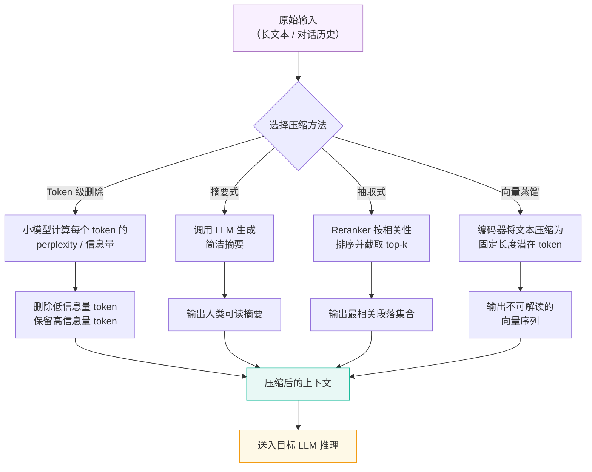
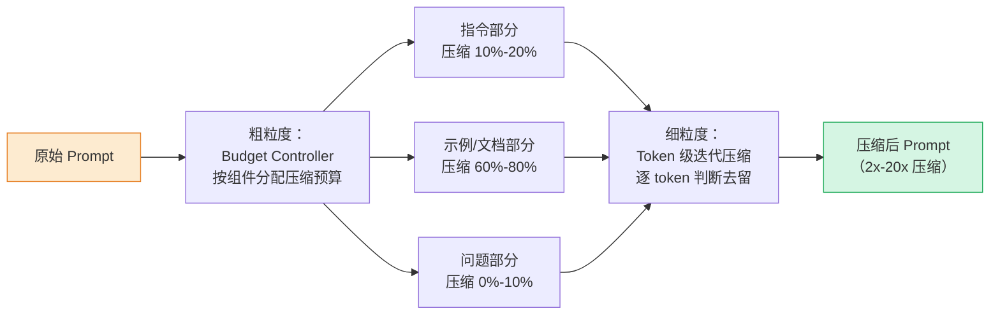

# 上下文压缩（Context Compression）

## 概念解释

上下文压缩（Context Compression）是指在将文本送入 LLM 之前，通过各种技术手段减少 token 数量，同时尽可能保留对当前任务有用的信息。它的核心目标是：用更少的 token 传递同等质量的信息。

这个概念出现的背景很直接：LLM 的推理成本和延迟都跟输入 token 数量正相关。一个与用户交互 8 小时的客服 Agent，如果每次都把完整对话历史送给模型，可能每次调用就要消耗数万 token。更关键的是，这些 token 里大量是重复确认、闲聊、格式文字等低价值内容，真正有用的信息可能只占 20%。

与简单截断（直接砍掉早期内容）不同，上下文压缩的思路是"选择性保留"——通过摘要、token 级别筛选、语义排序等方式，把有用信息以更紧凑的形式保留下来。一个精心构建的 500 token 压缩结果，往往比 5000 个原始 token 更能帮助模型做出准确判断，因为它去掉了噪声、保留了关键信号。

## 关键结构

上下文压缩的方法可以从两个大方向来理解：**硬压缩**（Hard Compression）直接操作原始文本，产出仍然是人类可读的文字；**软压缩**（Soft Compression）将文本编码为模型内部的向量表示，人类不可读但信息密度更高。

| 结构 | 作用 | 说明 |
|------|------|------|
| 硬压缩 - Token 级删除 | 逐个 token 判断去留 | LLMLingua 系列的核心思路，用小模型预测每个 token 的信息量，删除低信息量 token |
| 硬压缩 - 摘要式压缩 | 用 LLM 改写为更短的版本 | 调用模型生成摘要，信息保留率高但有额外推理成本 |
| 硬压缩 - 抽取式压缩 | 直接选出重要的句子或段落 | 类似搜索引擎的 reranker，按相关性排序后截取 top-k |
| 软压缩 - 向量蒸馏 | 将文本压缩为少量特殊 token 的嵌入 | 如 Context Cascade Compression（C3），端到端训练压缩编码器 |
| 滑动窗口 | 只保留最近 N 轮，丢弃更早的内容 | 最简单的策略，零计算成本，但会丢失长期关键信息 |

### 硬压缩 - Token 级删除

以 LLMLingua 为代表。核心思路：用一个小型语言模型（如 LLaMA-7B）逐个计算原始文本中每个 token 的条件概率（perplexity）。如果某个 token 对后续 token 的预测贡献很小（即模型很容易猜到它），说明它是冗余的，可以删除。最终保留下来的 token 序列虽然读起来不太通顺，但对 LLM 来说仍然包含了足够的语义信息。这种方法可以实现 2x-20x 的压缩率。

### 硬压缩 - 摘要式压缩

调用 LLM 或专用摘要模型，将一段长文本改写成更短的版本。优势是产出的摘要人类可读、语义完整；劣势是每次压缩本身就需要一次模型调用，存在额外的成本和延迟。适合对话历史管理等场景——把早期对话生成一段摘要，附在最近几轮对话前面。

### 硬压缩 - 抽取式压缩

不改写文本，而是从原始内容中选出最相关的片段。通常结合 embedding 相似度或 reranker 模型，根据当前 query 对候选段落打分排序，只保留得分最高的 top-k。LangChain 的 Contextual Compression Retriever 就是这种思路，在 RAG 管道中先检索再压缩。

### 软压缩 - 向量蒸馏

将文本编码为少量不可解读的"潜在 token"（latent tokens）。训练一个专门的编码器，让它把长文本压缩为固定长度的向量序列，下游的 LLM 直接读取这些向量作为输入。代表方案包括 Context Cascade Compression（C3）和 AutoCompressor。这种方法理论上信息保留率最高，但需要专门训练，且与特定模型绑定。

### 滑动窗口

最朴素的方案：只保留最近 K 轮对话或最后 N 个 token，之前的内容全部丢弃。实现零成本、行为可预测，但会丢失长期关键信息（如用户身份、早期决策）。实践中通常不单独使用，而是与摘要或抽取结合：近期内容保留原文，早期内容用摘要替代。

## 核心原理

### 原理说明

上下文压缩的核心逻辑可以归结为一个信息筛选过程：

1. **信息量评估**：对输入文本中的每个单元（token、句子或段落）评估其信息量。评估方式因方法而异——LLMLingua 用 perplexity，抽取式用相关性分数，摘要式则交给 LLM 整体判断。

2. **阈值决策**：根据目标压缩率，设定保留阈值。信息量高于阈值的内容保留，低于阈值的删除或合并。压缩率（Compression Ratio）= 原始 token 数 / 压缩后 token 数。

3. **结果重组**：将保留的内容重新组装为连贯的输入，送入目标 LLM。硬压缩的结果仍然是文本，软压缩的结果是向量。

关键指标是**压缩率**和**任务性能保留率**之间的平衡。LLMLingua 在 GSM8K 基准测试上实现了 20x 压缩率，任务性能仅下降 1.5%。但这个平衡点因任务而异——事实性问答对细节丢失更敏感，而摘要任务则更能容忍高压缩率。

另一个关键现象是 **Recency Bias（近因偏差）**：LLM 对最近出现的上下文依赖程度远高于早期内容。这意味着合理的压缩策略应该对近期内容保留更多细节，对早期内容则可以更激进地压缩。

### Mermaid 图解



图中展示了四条并行的压缩路径。实际应用中通常选择其中一种或组合使用。Token 级删除和抽取式压缩不需要额外的 LLM 调用，延迟最低；摘要式信息保留最完整但有额外成本；向量蒸馏信息密度最高但需要专门训练。

### LLMLingua 的 Coarse-to-Fine 压缩流程

LLMLingua 系列是目前最具代表性的硬压缩方案，其工作流程值得单独说明：



Budget Controller 先将 prompt 拆分为指令、示例/文档、问题三部分，分别分配不同的压缩预算——指令和问题几乎不压缩（保持意图清晰），示例和文档段落大幅压缩（冗余最多）。然后在每个部分内部，逐 token 计算 perplexity，删除信息量低的 token。

### 运行示例

```python
# 基于 llmlingua==0.2.2 验证（截至 2026-03）
# pip install llmlingua

from llmlingua import PromptCompressor

# 初始化压缩器，使用小型语言模型计算 token 信息量
compressor = PromptCompressor(
    model_name="microsoft/llmlingua-2-bert-base-multilingual-cased-meetingbank",
    use_llmlingua2=True  # 使用 LLMLingua-2（基于 BERT，速度更快）
)

original_prompt = """
你是一个电商客服助手。以下是用户的对话历史：

用户：你好，我是李明，账户ID是USER-001。
助手：你好李明！很高兴为你服务。请问有什么我可以帮助你的？
用户：我上周订购了一个蓝色的运动鞋，订单号是ORD-12345。
助手：我找到你的订单了。这是一双Nike运动鞋，已经发货了。
用户：问题是鞋子有点松，我想换个尺码。
助手：我们可以免费为你更换。你想要哪个尺码？
用户：我想要小一号，39码。
助手：没问题，我已经安排了退货和新尺码的发货。
用户：好的，非常感谢！对了，我还想问关于VIP会员的问题。
助手：当然可以！VIP会员每月享受20%折扣和优先客服支持，费用是99元/月。

现在用户说：我想开通VIP会员。

请根据对话历史回复用户。
"""

# 压缩 prompt，目标压缩率为 2x（保留约 50% 的 token）
compressed = compressor.compress_prompt(
    original_prompt,
    rate=0.5,  # 保留比例：0.5 = 保留 50%，即 2x 压缩
    force_tokens=['\n', '?', '。', '！']  # 强制保留的 token
)

print(f"原始 token 数: {compressed['origin_tokens']}")
print(f"压缩后 token 数: {compressed['compressed_tokens']}")
print(f"实际压缩率: {compressed['ratio']:.1f}x")
print(f"\n压缩后的 prompt:\n{compressed['compressed_prompt']}")
```

上面的代码展示了 LLMLingua-2 的基本用法。`rate=0.5` 表示保留 50% 的 token（2x 压缩），`force_tokens` 指定必须保留的 token（如标点符号），避免压缩后文本完全不可读。LLMLingua-2 使用 BERT 级别的小模型做 token 分类，速度比 LLMLingua 快 3x-6x。

## 易混概念辨析

| 概念 | 与上下文压缩的区别 | 更适合关注的重点 |
|------|---------------------|------------------|
| Context Window Management（上下文窗口管理） | 窗口管理是更大的工程问题，压缩只是其中一种手段 | 整体策略：何时压缩、何时截断、何时持久化到外部存储 |
| RAG 检索 | RAG 是"从外部找到相关内容"，压缩是"把已有内容变短" | 信息来源：RAG 解决"信息不在上下文里"，压缩解决"上下文太多装不下" |
| Summarization（摘要） | 摘要是压缩的一种实现方式，不是全部 | 摘要关注语义完整性，压缩还包括 token 级删除、向量蒸馏等非摘要方法 |
| KV-Cache 压缩 | KV-Cache 压缩发生在模型推理内部，上下文压缩发生在输入阶段 | KV-Cache 压缩是模型推理层面的优化，对用户透明；上下文压缩是应用层面的优化 |

核心区别：

- **上下文压缩**：关注"在送入模型之前，如何用更少的 token 传递同等信息"
- **上下文窗口管理**：关注"面对有限的窗口，整体上如何编排和管理所有输入内容"
- **RAG 检索**：关注"从外部知识库里找到与当前问题最相关的内容"
- **KV-Cache 压缩**：关注"模型推理过程中，如何减少注意力计算的内存占用"

## 适用边界与局限

### 适用场景

1. **长对话历史管理**：客服 Agent、医疗问诊等多轮对话场景，对话历史持续增长。用滑动窗口 + 摘要的混合策略，近期内容保留原文，早期内容压缩为摘要，可以在 token 预算内维持完整的上下文感知。
2. **RAG 管道的检索后压缩**：检索到的文档往往包含大量无关段落。在送入 LLM 前用 reranker + 压缩去掉噪声段落，可以减少 50%-80% 的 token 同时提升回答准确率（LongLLMLingua 在 RAG 场景下性能提升 21.4%）。
3. **批量推理降本**：日均百万次 API 调用的应用，每次调用节省 50% 的 token 直接意味着 50% 的成本缩减。LLMLingua 等方案不需要修改目标模型，可以作为前置模块无侵入地接入。
4. **多 Agent 协作的上下文传递**：多个 Agent 之间共享上下文时，对共享内容做压缩可以大幅减少通信成本，同时避免信息过载导致的推理质量下降。

### 不适合的场景

1. **需要逐字精确引用的任务**：合同审查、代码审计等场景需要精确到每个字词，任何 token 级删除都可能导致关键细节丢失。这类任务应该用分段处理而非压缩。
2. **输入本身已经很短的场景**：如果 prompt 只有几百 token，压缩的收益微乎其微，反而增加了系统复杂度和潜在的信息损失风险。

### 局限性

1. **信息丢失不可避免**：无论多精细的压缩策略，都存在丢失关键信息的风险。2025 年的研究表明，现有压缩方法在长上下文场景下对细节信息的保留仍然不足。
2. **压缩效果任务依赖**：同一个压缩策略在问答任务上表现良好，在推理任务上可能严重退化。没有一种方案能通用于所有任务。
3. **Context Drift（上下文漂移）**：长期运行的 Agent 反复压缩上下文，每次压缩都可能引入微小偏差，多次累积后可能严重偏离原始信息。2025 年行业数据显示，约 65% 的企业 AI 失败案例与上下文漂移或记忆丢失有关。
4. **摘要式压缩的额外成本**：用 LLM 生成摘要本身就需要一次推理调用。如果压缩频率过高，摘要成本可能抵消压缩带来的节省。

## 常见误区

| 常见误区 | 正确理解 |
|----------|----------|
| 压缩率越高越好 | 压缩率和任务性能之间存在权衡。LLMLingua 在 20x 压缩下仍保持 95% 性能，但这是特定任务（GSM8K）的结果，换成事实问答类任务性能下降可能显著增大。应该根据实际任务通过实验确定最优压缩率。 |
| 上下文窗口够大就不需要压缩 | 即使模型支持 128K 甚至 1M token 的上下文窗口，长输入仍然意味着更高的成本、更大的延迟，以及"大海捞针"式的注意力稀释问题。窗口够大解决的是"能不能装下"，压缩解决的是"装下之后能不能高效处理"。 |
| 保留最近 N 轮就够了 | 纯时间窗口策略会丢失长期关键信息。一小时前用户说的"我对花生过敏"比五分钟前的"好的，谢谢"重要得多。应该用混合策略：近期保留原文 + 早期关键信息摘要或抽取。 |
| 压缩是一次性操作 | 对于持续运行的 Agent，上下文在不断增长，压缩也应该是持续的、增量式的。需要设计触发机制（如 token 数超过阈值时自动压缩），而非手动一次性压缩。 |

## 思考题

<details>
<summary>初级：上下文压缩的四种主要方法（token 级删除、摘要式、抽取式、向量蒸馏）各自的核心思路是什么？分别适合什么场景？</summary>

**参考答案：**

- **Token 级删除**（如 LLMLingua）：用小模型评估每个 token 的信息量，删除低信息量 token。适合需要高压缩率且对可读性要求不高的场景，如 RAG 管道中的文档压缩。
- **摘要式**：调用 LLM 将长文本改写为短摘要。适合对话历史管理等需要人类可读压缩结果的场景，但有额外推理成本。
- **抽取式**：用 reranker 选出最相关的段落。适合多文档问答和 RAG 场景，计算成本低且不改变原始文本。
- **向量蒸馏**：将文本编码为不可解读的向量。信息密度最高，但需要专门训练且与特定模型绑定，适合对压缩率有极端要求的场景。

</details>

<details>
<summary>中级：一个医疗问诊 Agent 运行了 2 小时，对话历史已达 15000 token。请设计一个混合压缩策略，说明哪些信息必须保留、哪些可以压缩、以及压缩方法的选择。</summary>

**参考答案：**

必须保留（不压缩或极低压缩率）：
- 患者身份信息（姓名、年龄、过敏史）
- 主诉症状及发病时间
- 医生的关键诊断结论和用药建议
- 最近 5-10 轮对话原文

可以压缩的内容：
- 中间的确认性对话（"好的"、"明白了"）——直接删除
- 早期的症状问诊过程——用摘要保留关键发现
- 重复描述的症状——合并去重

推荐策略：滑动窗口（保留最近 10 轮） + 关键实体抽取（保留所有症状、药物、过敏信息的原文） + 摘要（将早期问诊过程压缩为结构化摘要）。最终目标是将 15000 token 压缩到 3000-4000 token，同时确保任何关键医疗信息不丢失。

</details>

<details>
<summary>中级/进阶：假设你负责一个日均 500 万次 API 调用的客服系统，平均每次调用输入 6000 token。现在要求在不显著降低回答质量的前提下降低 40% 的 token 成本。你会如何设计压缩方案？需要考虑哪些工程权衡？</summary>

**参考答案：**

方案设计：
1. **分层压缩**：将 prompt 拆分为系统指令（不压缩）、对话历史（主要压缩目标）、当前问题（不压缩）三部分。对话历史占比通常最大，是压缩收益最高的部分。
2. **工具选择**：优先考虑 LLMLingua-2，因为它基于 BERT 模型，推理速度快（比 LLMLingua 快 3x-6x），适合大规模在线服务。目标将对话历史部分压缩到原来的 40%-50%。
3. **增量压缩**：不要每次调用都重新压缩，而是对话过程中增量更新压缩结果。设定阈值（如对话历史超过 4000 token 时触发压缩）。

工程权衡：
- **压缩服务的延迟**：LLMLingua-2 使用 BERT，单次压缩延迟约 50-100ms，需要评估这个延迟是否可接受。
- **压缩服务的可用性**：压缩模块故障时需要 fallback 方案（如退回到简单的滑动窗口）。
- **质量监控**：需要建立 A/B 测试机制，持续对比压缩前后的用户满意度和问题解决率。
- **成本核算**：LLMLingua-2 的推理也有成本（GPU 算力），需要确保压缩节省的 API 费用大于压缩本身的成本。日均 500 万次调用 x 6000 token，降低 40% 约节省 120 亿 token/天的 API 费用。

</details>

## 参考资料

1. Jiang, Huiqiang, et al. "LLMLingua: Compressing Prompts for Accelerated Inference of Large Language Models." EMNLP 2023. https://arxiv.org/abs/2310.05736
2. Jiang, Huiqiang, et al. "LongLLMLingua: Accelerating and Enhancing LLMs in Long Context Scenarios via Prompt Compression." ACL 2024. https://arxiv.org/abs/2310.06839
3. LLMLingua 官方网站与文档. https://www.llmlingua.com/
4. Microsoft Research. "LLMLingua: Innovating LLM efficiency with prompt compression." https://www.microsoft.com/en-us/research/blog/llmlingua-innovating-llm-efficiency-with-prompt-compression/
5. Li, Zongqian, et al. "Prompt Compression for Large Language Models: A Survey." NAACL 2025. https://github.com/ZongqianLi/Prompt-Compression-Survey
6. LLMLingua GitHub 仓库. https://github.com/microsoft/LLMLingua
