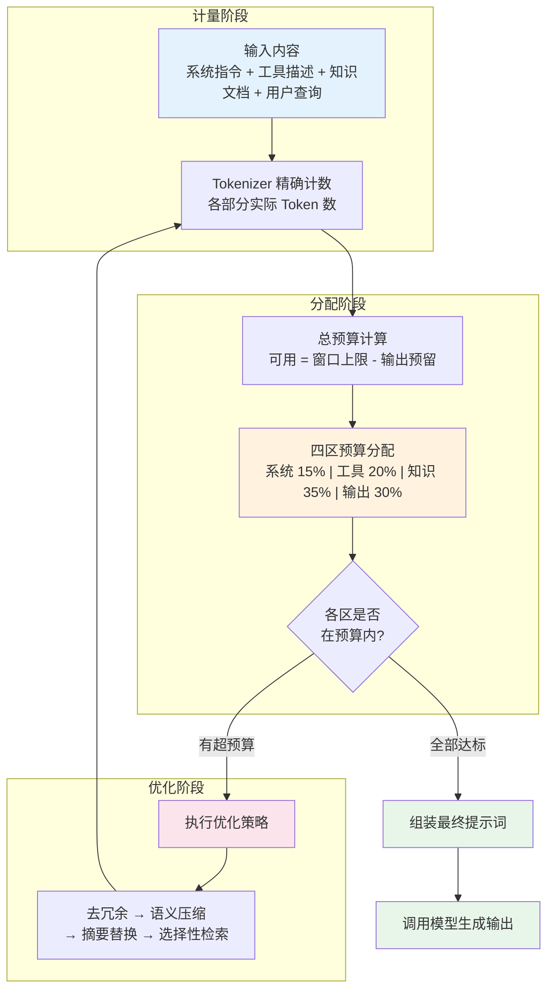

# 上下文窗口管理（Context Window Management）

## 概念解释

上下文窗口管理是一种将 LLM 的上下文窗口（Context Window）视为有限资源进行系统化分配和优化的工程方法。上下文窗口是模型在一次推理中能处理的全部 Token 数量，包含输入和输出，类似操作系统的内存空间——需要被预算、压缩和智能调度。

这个概念之所以重要，是因为"窗口大"不等于"可以乱塞"。研究表明，随着输入 Token 数量增加，模型对信息的召回准确率会持续下降，这种现象叫 Context Rot（上下文衰减）。2023 年的"Lost in the Middle"论文进一步揭示，模型对长上下文中间位置的信息理解能力最差。因此，即使 2025-2026 年的主流模型已支持 200K 甚至 1M Token 窗口，不加管理地填满窗口仍然会导致输出质量下降、成本飙升。

上下文窗口管理的核心思想是：**事先为每个组成部分分配 Token 预算，用压缩、检索、摘要等手段优化信息密度，确保有限的窗口空间被最高价值的信息占据**。这与 Andrej Karpathy 所说的"用恰好正确的信息填满上下文窗口"的 Context Engineering（上下文工程）理念一脉相承。

## 关键结构

上下文窗口管理由四个核心维度组成：

| 维度 | 作用 | 说明 |
|------|------|------|
| Token 精确计量 | 获取真实的资源消耗数据 | 必须使用模型对应的 Tokenizer，不可估算 |
| 预算分区分配 | 为不同内容类型划定额度 | 系统指令、工具描述、知识内容、输出空间各占固定比例 |
| 信息优先级排序 | 决定哪些信息留下、哪些压缩 | 关键信息前置，低优先级信息摘要化或丢弃 |
| 动态调度优化 | 根据任务类型实时调整分配 | 简单查询多给检索空间，复杂推理多留输出空间 |

### 维度 1：Token 精确计量

Token 是 LLM 的基本处理单位，但不同模型的 Tokenizer 分词方式不同，同一段文本在不同模型下的 Token 数会有差异。关键事实：

- 英文约 1 Token = 4 字符 = 0.75 个单词（粗略估计）
- 中文每个字通常消耗 1-2 个 Token，整体比英文"更贵"
- JSON、XML 等结构化格式由于大量符号，Token 消耗比纯文本高 30-50%
- 代码中的缩进、括号、注释都会额外占用 Token

精确计量要求使用官方 Tokenizer 库（如 OpenAI 的 `tiktoken`、Anthropic 的 Token 计数 API），而不能凭字符数或词数估算。

### 维度 2：预算分区分配

将可用 Token 总量按功能分区，是管理的核心操作。通用的四区分配模型：

- **系统指令区（10-15%）**：角色设定、输出格式要求、行为约束。Token 占比虽小，但对输出质量影响最大
- **工具/函数描述区（15-20%）**：Agent 场景下的工具名称、参数说明、使用示例。工具超过 30 个时需要启用动态工具加载（Tool Loadout）
- **知识内容区（30-40%）**：检索到的文档、对话历史、用户数据。这是最容易超预算的部分
- **输出预留区（25-35%）**：模型的推理过程和最终输出。必须预先预留，否则模型无空间生成完整回答

### 维度 3：信息优先级排序

模型对不同位置信息的关注度不均匀。实践证明的排列原则：

- 系统指令放在最前面，被关注度最高
- 用户当前问题紧随其后
- 关键参考资料排在中前段
- 低优先级的背景信息放在后段，必要时用特殊标记（如 `[KEY]`、`⚠️ 重要`）引导模型注意力

### 维度 4：动态调度优化

不同任务对各区的需求差异很大，静态分配无法覆盖所有场景。动态调度的基本策略：

- 简单事实查询：知识内容区扩大到 50%，输出预留区缩小到 15%
- 复杂推理任务：输出预留区扩大到 40%，知识内容区缩小到 25%
- 多工具协作任务：工具描述区扩大到 30%，知识内容区缩小到 20%

## 核心原理

### 原理说明

上下文窗口管理的核心机制可以拆解为三步循环：**计量 → 分配 → 优化**。

**第一步：计量**。在构建提示词之前，用模型对应的 Tokenizer 精确计算每个组成部分的 Token 数量。这一步生成一份"资源清单"，告诉你当前各部分实际消耗多少 Token。

**第二步：分配**。将模型的总上下文窗口减去输出预留空间，得到可用输入预算。然后按四区模型分配额度。如果某部分的实际消耗超过了分配额度，标记为"超预算"。

**第三步：优化**。对超预算的部分执行优化操作。优化策略按压缩力度从轻到重排列：
1. **去冗余**：去掉重复信息、无关格式、冗余空白（节省 10-20%）
2. **语义压缩**：用 LLMLingua 等工具移除填充词和非关键子句（节省 40-60%）
3. **摘要替换**：将长文档替换为 LLM 生成的摘要（节省 60-80%）
4. **选择性检索**：只保留与当前查询语义最相关的片段，丢弃其余（节省 70-90%）
5. **分层加载**：先加载全局摘要，用户追问时再按需加载详细内容

优化完成后回到计量步骤验证，直到所有部分都在预算内。

### Mermaid 图解



**图解说明**：

- 计量阶段（蓝色）负责获取真实数据，是后续一切决策的基础
- 分配阶段（橙色）是核心决策环节，四区比例可根据任务类型动态调整
- 优化阶段（红色）只在超预算时触发，形成闭环反馈直到满足约束
- 整个流程是一个"计量 → 判断 → 优化 → 再计量"的迭代循环

### 运行示例

以下伪代码展示上下文窗口管理的核心逻辑结构：

```python
# 上下文窗口管理 - 核心逻辑示意
# 基于 anthropic==0.39.0、tiktoken==0.8.0 验证（截至 2026-03）

import anthropic

client = anthropic.Anthropic()
MODEL = "claude-sonnet-4-20250514"
CONTEXT_WINDOW = 200_000  # 模型总窗口

def manage_context(system: str, docs: list[str], query: str,
                   output_reserve: int = 4096) -> dict:
    """计量 → 分配 → 优化的完整流程"""

    # --- 第一步：精确计量 ---
    def count(text: str) -> int:
        """使用官方 API 计算 Token 数（不可用字符数估算）"""
        resp = client.messages.count_tokens(
            model=MODEL,
            messages=[{"role": "user", "content": text}]
        )
        return resp.input_tokens

    # --- 第二步：预算分配 ---
    available = CONTEXT_WINDOW - output_reserve
    budget = {
        "system":  int(available * 0.15),  # 系统指令 15%
        "tools":   int(available * 0.20),  # 工具描述 20%（如有）
        "knowledge": int(available * 0.35),  # 知识内容 35%
        # 剩余 30% 已被 output_reserve 覆盖
    }

    actual = {
        "system": count(system),
        "knowledge": sum(count(d) for d in docs),
        "query": count(query),
    }

    # --- 第三步：超预算则优化 ---
    optimized_docs = docs
    if actual["knowledge"] > budget["knowledge"]:
        # 策略：对超预算文档生成摘要
        optimized_docs = [
            summarize(d, max_tokens=budget["knowledge"] // len(docs))
            for d in docs
        ]

    return {
        "budget": budget,
        "actual": actual,
        "optimized": actual["knowledge"] <= budget["knowledge"],
    }

def summarize(doc: str, max_tokens: int) -> str:
    """调用模型对文档进行压缩摘要"""
    resp = client.messages.create(
        model=MODEL,
        max_tokens=max_tokens,
        messages=[{"role": "user",
                   "content": f"用 {max_tokens} Token 以内总结关键信息：\n{doc}"}]
    )
    return resp.content[0].text
```

代码展示了三步流程的对应关系：`count()` 对应计量、`budget` 字典对应分配、超预算时的 `summarize()` 对应优化。实际生产系统中，优化策略会更加多样（语义压缩、选择性检索等），但核心的"计量-分配-优化"循环结构不变。

## 易混概念辨析

| 概念 | 与上下文窗口管理的区别 | 更适合关注的重点 |
|------|---------------------|------------------|
| Context Engineering（上下文工程） | 上下文工程是更广义的概念，涵盖"如何构造送给模型的全部信息"；窗口管理专注于"如何在有限的 Token 额度内做分配和优化" | 信息选择策略、上下文构建的全流程设计 |
| Prompt Engineering（提示词工程） | 提示词工程侧重于指令的措辞和结构设计；窗口管理侧重于各部分的 Token 资源分配 | 指令表达的精确性、Few-shot 示例的设计 |
| RAG（检索增强生成） | RAG 是"从外部获取信息送入上下文"的方法；窗口管理决定"检索回来的信息该怎么取舍和分配空间" | 检索精度、向量匹配、知识库构建 |
| Context Compression（上下文压缩） | 上下文压缩是窗口管理中的一种具体优化手段；窗口管理是包含计量、分配、优化在内的完整框架 | 压缩算法、信息保真度、Token 节省率 |

核心区别：

- **上下文窗口管理**：关注 Token 资源的全局分配和优化闭环，是一个系统性框架
- **上下文工程**：关注送入模型的信息的整体质量和构造方式，窗口管理是其中的资源约束层
- **提示词工程**：关注指令本身怎么写，窗口管理关注各部分怎么分空间
- **RAG / 压缩**：是窗口管理框架中的具体实现手段，不是同一层次的概念

## 适用边界与局限

### 适用场景

1. **多轮对话系统**：对话越长，历史消息累积的 Token 越多。窗口管理通过定期摘要和选择性保留，让系统在数百轮对话后仍保持响应质量，同时控制 API 成本
2. **RAG 系统**：检索可能返回大量文档，但不可能全部塞入上下文。通过预算分配决定保留几篇完整文档、几篇摘要，在"广度"和"深度"之间找到最优平衡
3. **多工具 Agent**：每个工具的描述和参数都占用 Token。当工具数量超过 30 个时，动态工具加载（Tool Loadout）成为必需，窗口管理决定当前任务激活哪些工具
4. **长文档分析**：论文、法律合同、代码库等超长内容无法一次放入窗口。通过分层摘要策略（全局概要 + 按需加载详细章节）实现完整分析

### 不适合的场景

1. **短文本单轮任务**：输入只有几百 Token 的简单问答，窗口管理的开销（计量、分配、优化）大于收益，直接发送即可
2. **对延迟极度敏感的实时系统**：压缩和摘要需要额外的 LLM 调用，会增加响应延迟。如果延迟是硬约束，可能需要用更简单的截断策略替代

### 局限性

1. **优化本身有成本**：摘要、压缩等操作需要额外的 LLM 调用，消耗 Token 和时间。在某些场景下，"优化的成本"可能抵消节省的收益
2. **信息损失不可逆**：任何压缩都会丢失信息。摘要可能遗漏对当前任务恰好关键的细节，而这种遗漏在压缩时难以预判
3. **模型版本依赖**：针对特定模型版本优化的预算比例和 Tokenizer 配置，在模型更新后可能需要重新调整
4. **最优分配比例难以确定**：四区的最优比例因任务、数据和模型而异，没有通用公式，需要通过实验和 benchmark 确定

## 常见误区

| 常见误区 | 正确理解 |
|----------|----------|
| "模型支持 200K Token，尽可能填满效果最好" | 填满窗口会触发 Context Rot，模型对后半部分信息的召回率显著下降。实践建议将实际使用量控制在模型有效上下文长度以内（通常为标称窗口的 60-75%） |
| "Token 数 ≈ 字数 / 4，手动估算就够了" | 不同 Tokenizer 对同一文本产出不同的 Token 数；中文、代码、JSON 等内容的 Token 密度差异很大。必须使用官方 Tokenizer 计算 |
| "超出窗口就截断末尾，简单有效" | 截断是最粗暴的策略，可能丢弃关键信息。应优先使用摘要、语义压缩、选择性检索等保留信息密度更高的方法 |
| "系统指令很短，不用单独分配预算" | 系统指令的 Token 占比虽小（10-15%），但对输出质量的影响远超其比例。压缩系统指令来给其他部分腾空间通常会导致输出质量明显下降 |

## 思考题

<details>
<summary>初级：为什么即使模型窗口已达 200K Token，仍需要上下文窗口管理？</summary>

**参考答案：**

三个原因：(1) Context Rot -- 输入 Token 越多，模型对信息的召回准确率越低，即使窗口够大也不代表理解能力够好；(2) 成本 -- API 按 Token 计费，不加管理地塞入大量内容会导致费用成倍增长；(3) 延迟 -- 输入越长，模型的推理时间和首 Token 延迟（TTFT）越高。窗口管理的目标不是"塞更多信息"，而是"用更少的 Token 传递更高价值的信息"。

</details>

<details>
<summary>中级：一个 RAG 系统检索到 8 篇相关文档，总计 80K Token，但知识内容区的预算只有 50K Token。请设计一个优化方案。</summary>

**参考答案：**

推荐分层处理：(1) 按语义相关性对 8 篇文档排序；(2) 排名前 3 的文档保留完整内容（约 30K Token）；(3) 排名 4-6 的文档生成摘要（每篇约 3K Token，共 9K Token）；(4) 排名 7-8 的文档只保留标题和一句话关键结论（约 1K Token）；(5) 总计约 40K Token，在 50K 预算内，剩余空间留作缓冲。这样既保证了最相关内容的完整性，又覆盖了较广的信息范围。

</details>

<details>
<summary>中级/进阶：一个客服 Agent 需要支持 100 轮以上的长对话，同时集成了 40 个工具。请设计窗口管理策略，说明如何处理对话历史膨胀和工具描述过载两个问题。</summary>

**参考答案：**

对话历史膨胀的处理：设置滑动窗口，保留最近 5-10 轮的完整对话；超出窗口的历史按每 10 轮生成一次摘要，将摘要链条作为压缩历史保留；关键信息（如用户姓名、订单号、已确认的需求）提取到结构化的"会话状态"对象中，始终保留。

工具描述过载的处理：实施 Tool Loadout（动态工具加载），根据用户当前查询的意图分类，只加载相关的 5-10 个工具描述；研究显示，工具超过 30 个时模型的工具选择准确率会显著下降，动态加载可提升约 44% 的准确率。

预算分配建议：系统指令 10% + 会话状态 5% + 压缩历史摘要 10% + 最近对话 20% + 动态工具描述 15% + 知识检索 15% + 输出预留 25%。

</details>

## 参考资料

1. Anthropic. "Context Windows." Claude API Docs. https://platform.claude.com/docs/en/build-with-claude/context-windows

2. Anthropic. "Effective Context Engineering for AI Agents." https://www.anthropic.com/engineering/effective-context-engineering-for-ai-agents

3. Liu, N. F., et al., 2023. "Lost in the Middle: How Language Models Use Long Contexts." arXiv:2307.03172. https://arxiv.org/abs/2307.03172

4. Chroma Research. "Context Rot: How Increasing Input Tokens Impacts LLM Performance." https://research.trychroma.com/context-rot

5. JetBrains Research, 2025. "Cutting Through the Noise: Smarter Context Management for LLM-Powered Agents." https://blog.jetbrains.com/research/2025/12/efficient-context-management/

6. LogRocket, 2026. "The LLM Context Problem in 2026: Strategies for Memory, Relevance, and Scale." https://blog.logrocket.com/llm-context-problem/
