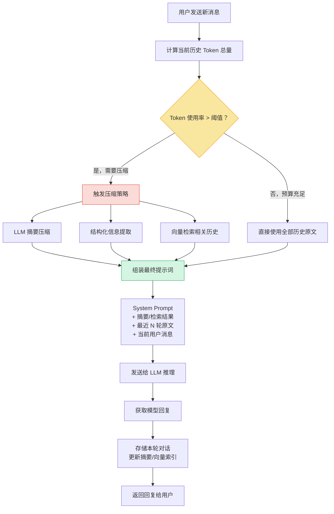
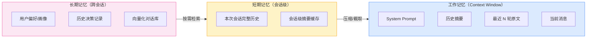

# 多轮对话上下文管理（Multi-turn Context Management）

## 概念解释

多轮对话上下文管理（Multi-turn Context Management）是指在 LLM 多轮交互中，对对话历史进行选择性保留、压缩和检索的一整套策略。它决定了"每次调用 LLM 时，提示词里放哪些历史信息、以什么形式放"。

LLM 的 Context Window（上下文窗口）是有限的——即使 Claude 3.5 有 200K Token、GPT-4o 有 128K Token，多轮对话的历史也会持续增长，最终超过窗口上限。更关键的是，2025 年的研究表明，即使上下文没有溢出，LLM 在多轮对话中的表现也会随轮次增加而显著下降——平均性能下降 39%，且一旦在早期轮次中做出错误假设，后续几乎无法自我纠正。

与单轮对话中"一次性把所有信息塞进去"不同，多轮上下文管理的核心思路是**分层存储 + 动态压缩 + 按需检索**：最近几轮保留原文、较早轮次压缩为摘要、关键信息持久化到外部存储，每次推理时根据当前需求动态组装上下文。这不是一个"锦上添花"的优化，而是任何超过 5 轮的对话系统都必须解决的工程问题。

## 关键结构

| 结构 | 作用 | 说明 |
|------|------|------|
| Token 预算管理 | 计算和分配可用 Token | 决定历史信息能占用多少空间 |
| 对话历史保留策略 | 决定保留哪些轮次的原始内容 | 滑动窗口、全量保留等不同策略 |
| 上下文压缩机制 | 将早期对话压缩为紧凑表示 | 摘要、结构化提取、向量化等 |
| 记忆分层架构 | 按时效和重要性分层存储 | 工作记忆、短期记忆、长期记忆 |
| 信息检索与组装 | 每次推理时动态组装上下文 | 从不同层级检索并拼装最终提示词 |

### 结构 1：Token 预算管理

每次调用 LLM 前，系统需要计算当前可用的 Token 额度：

$$\text{可用 Token} = \text{Context Window} - \text{System Prompt} - \text{预留输出} - \text{安全缓冲}$$

例如一个 128K 窗口的模型，System Prompt 占 1000 Token，预留输出 2000 Token，安全缓冲 5000 Token，则可用 Token 为 120,000。当历史对话占用量达到可用额度的 70%~80% 时，触发压缩。

这个计算看似简单，但它是整个上下文管理的"调度中枢"——所有后续策略（何时压缩、压缩多少、保留几轮原文）都依赖这个预算数字。

### 结构 2：对话历史保留策略

最常用的三种策略：

- **全量保留**：所有历史原封不动放入提示词。实现最简单，但 Token 消耗线性增长，只适合短对话（10 轮以内）。
- **滑动窗口（Sliding Window）**：只保留最近 N 轮对话，更早的直接丢弃。华盛顿大学 NLP 组的研究发现，12 条消息（6 轮）的窗口在任务导向对话中能取得成本与效果的最佳平衡。缺点是丢弃的早期信息可能包含关键约束。
- **摘要 + 窗口混合**：最近 N 轮保留原文，更早的部分压缩为摘要。这是生产环境的主流选择，兼顾近期精确度和远期信息保留。

### 结构 3：上下文压缩机制

当 Token 预算不足时，压缩机制负责把冗长的历史变紧凑：

- **LLM 递归摘要**：调用 LLM 本身对早期对话生成摘要。压缩率约 5:1（502 Token 的历史可以压缩到 60~100 Token），但每次压缩本身消耗 Token 且引入延迟。实测可减少 60%~70% 的 Token 量，同时保留 91% 的关键信息。
- **结构化信息提取**：将关键信息（用户偏好、已做决策、关键事实）提取为 JSON 等结构化格式。检索精确，不存在摘要引入的"幻觉"风险。
- **向量化存储 + 语义检索**：将历史轮次向量化后存入向量数据库，每次推理时按语义相关性检索。适合超长对话（100+ 轮），但引入检索延迟。

### 结构 4：记忆分层架构

借鉴操作系统的内存层级思想（由 MemGPT 提出并推广），将对话信息分为三层：

- **工作记忆（Working Memory）**：当前 Context Window 中的内容，容量有限但访问最快。
- **短期记忆（Short-term Memory）**：当前会话的完整历史，存储在应用层（内存或数据库），需要时加载到工作记忆。
- **长期记忆（Long-term Memory）**：跨会话持久化的信息（用户偏好、学习进度、历史决策），存储在外部数据库，按需检索。

### 结构 5：信息检索与组装

每次推理前，系统将不同来源的信息组装成最终提示词：

1. 固定部分：System Prompt
2. 摘要层：早期对话的压缩摘要（如有）
3. 检索层：从长期记忆中检索到的相关信息（如有）
4. 原文层：最近 N 轮的完整对话
5. 当前输入：用户最新消息

组装顺序有讲究——关键信息应放在提示词的开头或结尾，避免放在中间，因为 LLM 存在"中间遗忘（Lost in the Middle）"现象：对长序列中间部分的信息利用率明显低于首尾。

## 核心原理

### 原理说明

多轮上下文管理的核心机制是一个**监控-决策-执行**的循环：

1. **监控**：每当新消息到达，系统计算当前对话历史的 Token 总量，并与预算进行对比。
2. **决策**：如果 Token 使用率低于阈值（如 70%），直接将历史原文附加到提示词；如果接近或超过阈值，触发压缩策略。
3. **执行**：根据选定的压缩策略（摘要、检索、结构化提取等），对早期历史进行压缩处理，保留最近几轮原文不动。
4. **组装**：将压缩后的摘要、检索到的长期记忆、最近轮次原文按顺序拼装成最终提示词。
5. **推理**：将组装好的提示词发送给 LLM，获取回复。
6. **归档**：将本轮对话（用户输入 + 模型输出）存入历史，同时更新向量索引或摘要缓存，为下一轮做准备。

这个循环的关键设计点在于**阈值触发**而非每轮都压缩——频繁压缩会累积信息损失和延迟，只在必要时才执行压缩能在成本和精度之间取得更好平衡。常见的触发阈值是 Token 使用率达到 70%~80%。

### Mermaid 图解



图中黄色节点是**决策点**——Token 预算是否充足决定了走"直通路径"还是"压缩路径"。红色节点是**压缩策略选择**，三种方式可以组合使用。绿色节点是**组装环节**，最终提示词的结构决定了 LLM 能"看到"哪些历史信息。

下图展示记忆分层架构的层级关系：



工作记忆容量最小但访问最快（就是 Context Window 本身），短期记忆是本次会话的完整数据，长期记忆则跨越多次会话持久存在。信息从长期记忆经过短期记忆最终进入工作记忆，每一层都做了筛选和压缩。

### 运行示例

以下用伪代码展示"摘要 + 滑动窗口"混合策略的核心逻辑：

```python
import tiktoken
from typing import List, Dict, Optional

# 基于 tiktoken==0.5.1 验证（截至 2026-03）

class MultiTurnContextManager:
    """多轮对话上下文管理器：摘要 + 滑动窗口混合策略"""

    def __init__(self, max_context_tokens: int = 128000,
                 reserved_output: int = 2000,
                 buffer: int = 5000,
                 compress_threshold: float = 0.7,
                 keep_recent: int = 6):
        self.max_context = max_context_tokens
        self.reserved_output = reserved_output
        self.buffer = buffer
        self.threshold = compress_threshold
        self.keep_recent = keep_recent  # 保留最近几条消息不压缩
        self.encoder = tiktoken.encoding_for_model("gpt-4o")

        self.history: List[Dict] = []       # 完整对话历史
        self.summary: Optional[str] = None  # 早期对话的摘要

    def count_tokens(self, text: str) -> int:
        """计算文本的 Token 数"""
        return len(self.encoder.encode(text))

    def get_budget(self, system_prompt: str) -> int:
        """计算可用 Token 预算"""
        sys_tokens = self.count_tokens(system_prompt)
        return self.max_context - sys_tokens - self.reserved_output - self.buffer

    def need_compress(self, system_prompt: str) -> bool:
        """判断是否需要触发压缩"""
        budget = self.get_budget(system_prompt)
        history_tokens = sum(self.count_tokens(m["content"]) for m in self.history)
        return (history_tokens / budget) > self.threshold if budget > 0 else True

    def compress(self, llm_summarize_fn) -> None:
        """
        执行压缩：保留最近 N 条原文，早期部分生成摘要。
        llm_summarize_fn: 接受文本、返回摘要的函数（对接实际 LLM 调用）
        """
        if len(self.history) <= self.keep_recent:
            return

        # 分离早期消息和最近消息
        early = self.history[:-self.keep_recent]
        recent = self.history[-self.keep_recent:]

        # 将早期对话拼接为文本，调用 LLM 生成摘要
        early_text = "\n".join(
            f"{m['role']}: {m['content']}" for m in early
        )
        # 如果已有旧摘要，一起送去生成新摘要
        if self.summary:
            early_text = f"[之前的摘要]\n{self.summary}\n\n[新增对话]\n{early_text}"

        self.summary = llm_summarize_fn(early_text)
        self.history = recent  # 只保留最近 N 条

    def build_messages(self, system_prompt: str, user_input: str) -> List[Dict]:
        """组装发送给 LLM 的消息列表"""
        messages = [{"role": "system", "content": system_prompt}]

        # 摘要层：如果有压缩过的早期对话摘要，放在最前面
        if self.summary:
            messages.append({
                "role": "system",
                "content": f"[对话历史摘要]\n{self.summary}"
            })

        # 原文层：最近 N 轮的完整对话
        messages.extend(self.history)

        # 当前输入
        messages.append({"role": "user", "content": user_input})
        return messages
```

`compress` 方法对应前面流程图的"压缩路径"，`build_messages` 对应"组装环节"。`need_compress` 通过 Token 使用率判断是否触发压缩。实际生产中，`llm_summarize_fn` 对接真实的 LLM 摘要调用，摘要提示词应包含"保留用户目标、已做决策、关键约束"等指令。

## 易混概念辨析

| 概念 | 与多轮上下文管理的区别 | 更适合关注的重点 |
|------|----------------------|------------------|
| Memory（Agent 记忆系统） | Memory 是 Agent 架构中的持久化存储模块，多轮上下文管理是 Memory 的一种具体实现策略 | Memory 还包括跨会话记忆、用户画像等更广泛的范畴 |
| Context Engineering（上下文工程） | Context Engineering 是设计整个提示词结构的方法论，多轮上下文管理是其中专门处理对话历史的子问题 | Context Engineering 还涉及 System Prompt 设计、工具输出组织等 |
| RAG（检索增强生成） | RAG 从外部知识库检索信息来增强生成，多轮上下文管理从对话历史中选择和压缩信息 | RAG 关注外部知识的引入，多轮管理关注对话内部信息的保留 |
| KV Cache 优化 | KV Cache 是模型推理层面的计算优化（缓存 Attention 的键值对），多轮上下文管理是提示词层面的信息组织策略 | KV Cache 优化减少重复计算，多轮管理减少 Token 消耗 |

核心区别：

- **多轮上下文管理**：关注"对话历史太长时，怎么选择和压缩信息放进提示词"
- **Memory 系统**：关注"Agent 如何跨轮次、跨会话记住信息"，多轮上下文管理是其实现手段之一
- **Context Engineering**：关注"提示词整体怎么设计"，多轮管理只是其中处理历史信息的部分
- **RAG**：信息来源是外部知识库，而非对话历史本身

## 适用边界与局限

### 适用场景

1. **客服与技术支持对话**：用户逐步提供信息、系统逐步诊断，需要跨轮次记住用户描述的症状、已尝试的方案、设备信息等。典型对话 10~30 轮，摘要 + 窗口混合策略最为适用。
2. **编程助手多轮迭代**：用户从"生成一个服务器"到"加认证""加日志""优化性能"逐步迭代需求，系统需要记住架构决策和需求变更，但不必保留每次生成的完整中间代码。
3. **个性化推荐对话**：用户在对话中逐步暴露偏好（"不喜欢红色""预算 2000 元""喜欢北欧风格"），系统需要累积这些偏好约束，在后续推荐中全部应用。
4. **教育场景多轮辅导**：AI 导师需要跟踪学生的知识掌握情况、常见错误模式、学习偏好，在跨越数十轮甚至多次会话的教学中保持一致。

### 不适合的场景

1. **单轮问答**：问一答一的场景不存在历史管理问题，引入上下文管理反而增加不必要的复杂度。
2. **对精确性要求极高的场景（如法律、医疗诊断）**：任何压缩策略都存在信息损失风险。在需要逐字保留完整对话作为证据或依据的场景，压缩可能带来合规风险。此时应采用全量保存 + 模型上下文窗口足够大的方案。

### 局限性

1. **压缩必然伴随信息损失**：即使号称保留 91% 关键信息，剩下的 9% 可能恰好包含某个关键约束。生产环境中应在外部存储保留完整历史，压缩只用于 Context Window 内的表示。
2. **LLM 摘要的"幻觉"风险**：用 LLM 生成摘要时，可能引入原始对话中不存在的信息。关键业务场景应配合结构化提取或人工审核。
3. **压缩本身消耗资源**：每次摘要压缩需要一次额外的 LLM 调用，增加延迟和成本。需要在"压缩成本"和"后续推理节省"之间找平衡——如果对话很短，压缩的开销可能超过节省。
4. **"迷路不回头"问题**：2025 年的研究发现，LLM 在多轮对话中一旦在早期做出错误假设，后续几乎无法自我纠正。上下文管理只能控制信息的保留，无法解决模型推理路径上的"惯性"问题。

## 常见误区

| 常见误区 | 正确理解 |
|----------|----------|
| 上下文窗口越大，就不需要做上下文管理了 | 即使窗口足够大，长上下文也会导致"中间遗忘"效应——超过 32K Token 后模型注意力分布显著劣化。同时，每个 Token 都有 API 成本，不管理就是浪费钱 |
| 简单截掉最早的消息是最经济的方案 | 简单截断（Naive Truncation）经常丢弃仍然相关的信息，导致用户需要重复说过的话。华盛顿大学的研究表明，朴素截断在用户满意度上远不如摘要 + 窗口混合方案 |
| LLM 生成的摘要一定比原文更安全、更紧凑 | 摘要本身可能引入幻觉（原始对话中不存在的信息），也可能遗漏看似不重要但实际关键的细节。在关键业务中，应配合结构化提取来交叉验证 |
| 上下文管理只是一个工程细节 | JetBrains Research（NeurIPS 2025）指出，尽管上下文管理对 Agent 性能和成本影响巨大，但大多数研究仍将其视为工程细节而非核心研究问题。实际上它直接决定了系统的可用性和运营成本 |

## 思考题

<details>
<summary>初级：一个 128K 窗口的模型，System Prompt 占 1000 Token，预留输出 2000 Token，安全缓冲 5000 Token，当前历史占 84000 Token。使用率是多少？是否应该压缩（阈值 70%）？</summary>

**参考答案：**

可用 Token = 128000 - 1000 - 2000 - 5000 = 120000。使用率 = 84000 / 120000 = 70%，恰好等于阈值。实践中建议触发压缩，因为下一轮对话会进一步增长。如果采用 3 倍压缩率对早期历史压缩，可以将占用量降至约 28000 Token，使用率降至约 23%。

</details>

<details>
<summary>中级：某电商客服系统采用"只保留最近 6 轮"的滑动窗口策略，用户在第 2 轮说了"预算 2000 元以内"，到第 10 轮时系统推荐了一个 3500 元的商品。问题出在哪里？应该怎么改进？</summary>

**参考答案：**

问题在于滑动窗口把第 2 轮的预算约束丢弃了。到第 10 轮时，窗口内只有第 5~10 轮的内容，"预算 2000 元"这个关键约束已不在上下文中。改进方案有两种：一是采用"摘要 + 窗口"混合策略，在压缩早期对话时明确保留用户偏好和约束（如 "[用户约束] 预算 2000 元以内"）；二是用结构化信息提取，将用户偏好单独存储为 JSON 格式（如 `{"budget": "<=2000", "brand": "华为"}`），每次推理时注入到 System Prompt 中，不受窗口滑动影响。

</details>

<details>
<summary>中级/进阶：你正在为一个 AI 编程导师设计记忆系统，需要支持跨会话的学习跟踪。请设计一个三层记忆方案：分别说明每层存什么、用什么存储、何时读写。</summary>

**参考答案：**

- **工作记忆（Context Window）**：存放 System Prompt + 学生画像摘要 + 最近 3 轮对话原文 + 当前问题。每次推理时重新组装，推理后丢弃。
- **短期记忆（会话级，Redis/内存）**：存放本次辅导会话的完整对话历史和本次会话的摘要。每轮对话后追加新记录，Token 超预算时触发摘要压缩。会话结束时提取关键学习事件写入长期记忆。
- **长期记忆（跨会话，向量数据库 + 关系数据库）**：关系数据库存储结构化学生画像（已掌握概念列表、常见错误模式、学习偏好），向量数据库存储历史辅导片段的向量表示。新会话开始时，从关系数据库加载学生画像注入 System Prompt，从向量库按语义检索相关历史辅导片段。学生掌握新概念或展现新错误模式时更新关系数据库。

</details>

## 参考资料

1. [LLMs Get Lost In Multi-Turn Conversation (2025)](https://arxiv.org/abs/2505.06120) - 研究 LLM 在多轮对话中性能下降 39% 的现象及其成因
2. [Cutting Through the Noise: Smarter Context Management for LLM-Powered Agents - JetBrains Research (NeurIPS 2025)](https://blog.jetbrains.com/research/2025/12/efficient-context-management/) - 对比 Observation Masking 与 LLM Summarization 两种上下文管理策略
3. [Context Window Management: Strategies for Long-Context AI Agents and Chatbots - Maxim AI](https://www.getmaxim.ai/articles/context-window-management-strategies-for-long-context-ai-agents-and-chatbots/) - 滑动窗口、层级摘要、重要性评分等策略的综合指南
4. [LLM Chat History Summarization Guide - Mem0 (2025)](https://mem0.ai/blog/llm-chat-history-summarization-guide-2025) - 对话历史摘要的实现方案与压缩率数据
5. [Context Window Overflow in 2026: Fix LLM Errors Fast - Redis](https://redis.io/blog/context-window-overflow/) - 上下文窗口溢出的处理策略与 KV Cache 优化
6. [Managing Chat History for Large Language Models - Microsoft Semantic Kernel](https://devblogs.microsoft.com/semantic-kernel/managing-chat-history-for-large-language-models-llms/) - 微软 Agent 框架中的对话历史管理实践
7. [A Survey on Recent Advances in LLM-Based Multi-turn Dialogue Systems - ACM Computing Surveys (2025)](https://dl.acm.org/doi/full/10.1145/3771090) - LLM 多轮对话系统的综合综述
